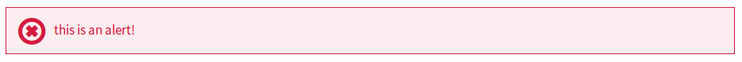
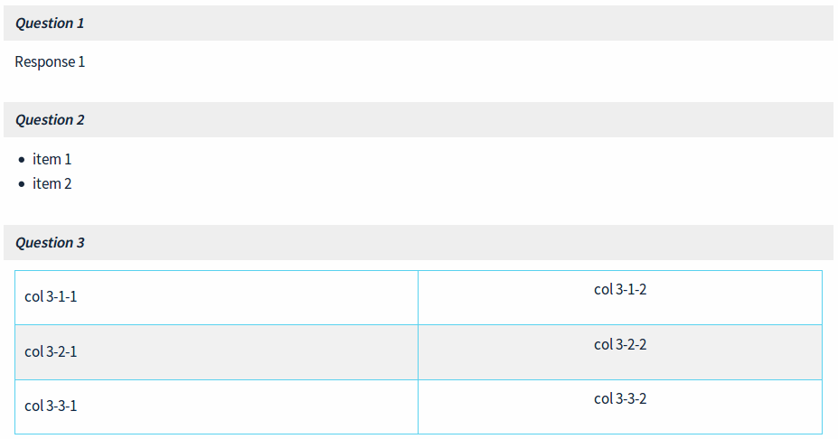
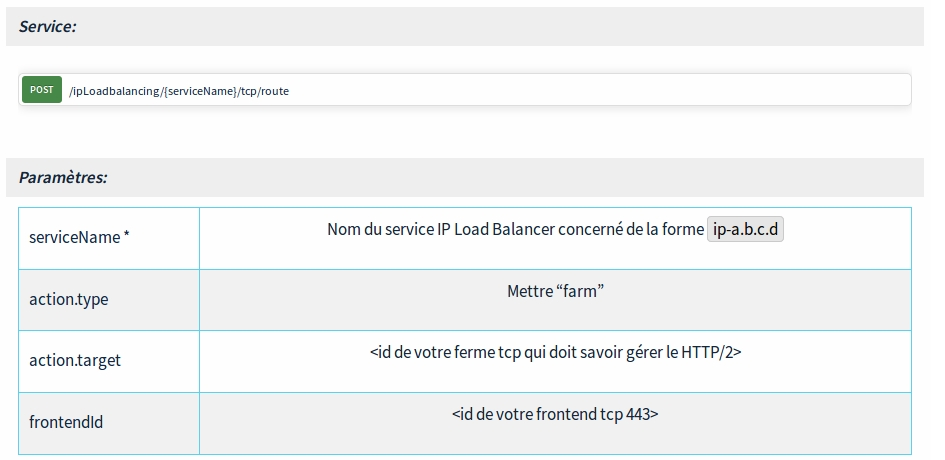

# OVH markdown custom content

## notices

### alert

```md
/* markdown */

> [!alert]
>
> this is an alert!
>
```

```html
<!-- generated html -->

<div class="callout alert">
  <p>this is an alert!</p>
</div>
```



### Other notices

#### primary

```md
/* markdown */

> [!primary]
>
> this is a primary notice!
>
```


#### warning

```md
/* markdown */

> [!warning]
>
> this is a warning!
>
```


#### info

```md
/* markdown */

> [!info]
>
> this is a simple notice!
>
```


## Carousel

```md
/* markdown */

> [!carousel]
>
> - 
> - 
> - 
>
```

```html
<!-- generated html -->

<div class="carousel">
    <div>
        
        <figcaption class="carousel-caption">caption of image 1</figcaption>
    </div>
    <div>
        
        <figcaption class="carousel-caption">caption of image 2</figcaption>
    </div>
    <div>
        
        <figcaption class="carousel-caption">caption of image 3</figcaption>
    </div>
</div>
```


## FAQ

```md
/* markdown */

> [!faq]
>
> Question 1
>> Response 1
> Question 2
>> - item 1
>> - item 2
> Question 3
>> col 3-1-1
>>> col 3-1-2
>> col 3-2-1
>>> col 3-2-2
>> col 3-3-1
>>> col 3-3-2
```

```html
<!-- generated html -->

<dl class="docutils">
    <dt><em>Question 1</em></dt>
    <dd>
        <p>Asnwer 1</p>
    </dd>
    <dt><em>Question 2</em></dt>
    <dd>
        <ul>
            <li>Asnwer 2-1</li>
            <li>Asnwer 2-2</li>
        </ul>
    </dd>
    <dt><em>Question 3</em></dt>
    <dd>
        <table class="first last docutils field-list">
            <tbody>
                <tr class="field">
                    <th class="field-name">answer col 3-1-1</th>
                    <td class="field-body">
                        <p>answer col 3-1-2</p>
                    </td>
                </tr>
                <tr class="field">
                    <th class="field-name">answer col 3-2-1</th>
                    <td class="field-body">
                        <p>answer col 3-2-2</p>
                    </td>
                </tr>
                <tr class="field">
                    <th class="field-name">answer col 3-3-1</th>
                    <td class="field-body">
                        <p>answer col 3-3-2</p>
                    </td>
                </tr>
            </tbody>
        </table>
    </dd>
</dl>
```



## Api

```md
/* markdown */

> [!api]
>
> @api {POST} /ipLoadbalancing/{serviceName}/tcp/route
>
```

```html
<!-- generated html -->

<div class="ovh-api-main">
  <a href="https://eu.api.ovh.com/console/#/ipLoadbalancing/{serviceName}/tcp/route#POST" target="_blank">
    <span class="ovh-api-verb ovh-api-verb-POST">POST</span>
    <span class="ovh-api-endpoint">/ipLoadbalancing/{serviceName}/tcp/route</span>
  </a>
</div>
```


## Advanced

You can mix different custom syntax

```md
/* markdown */

> [!faq]
>
> Service:
>
>> > [!api]
>> >
>> > @api {POST} /ipLoadbalancing/{serviceName}/tcp/route
>> >
>>
>
> Paramètres:
>
>> serviceName *
>>> Nom du service IP Load Balancer concerné de la forme `ip-a.b.c.d`
>> action.type
>>> Mettre "farm"
>> action.target
>>> &lt;id de votre ferme tcp qui doit savoir gérer le HTTP/2&gt;
>> frontendId
>>> &lt;id de votre frontend tcp 443&gt;
```

```html
<!-- generated html -->

<dl class="docutils">
  <dt><em>Service:</em></dt>
  <dd>
    <div class="ovh-api">
      <p>
        <div class="ovh-api-main">
          <a href="https://eu.api.ovh.com/console/#/ipLoadbalancing/{serviceName}/tcp/route#POST" target="_blank">
            <span class="ovh-api-verb ovh-api-verb-POST">POST</span>
            <span class="ovh-api-endpoint">/ipLoadbalancing/{serviceName}/tcp/route</span>
          </a>
        </div>
      </p>
    </div>
  </dd>
  <dt><em>Param&egrave;tres:</em></dt>
  <dd>
    <table class="first last docutils field-list">
      <tr class="field">
        <th class="field-name">serviceName *</th>
        <td class="field-body">
          <p>Nom du service IP Load Balancer concern&eacute; de la forme <code>ip-a.b.c.d</code></p>
        </td>
      </tr>
      <tr class="field">
        <th class="field-name">action.type</th>
        <td class="field-body">
          <p>Mettre "farm"</p>
        </td>
      </tr>
      <tr class="field">
        <th class="field-name">action.target</th>
        <td class="field-body">
          <p>&lt;id de votre ferme tcp qui doit savoir g&eacute;rer le HTTP/2&gt;</p>
        </td>
      </tr>
      <tr class="field">
        <th class="field-name">frontendId</th>
        <td class="field-body">
          <p>&lt;id de votre frontend tcp 443&gt;</p>
        </td>
      </tr>
    </table>
  </dd>
</dl>
```


