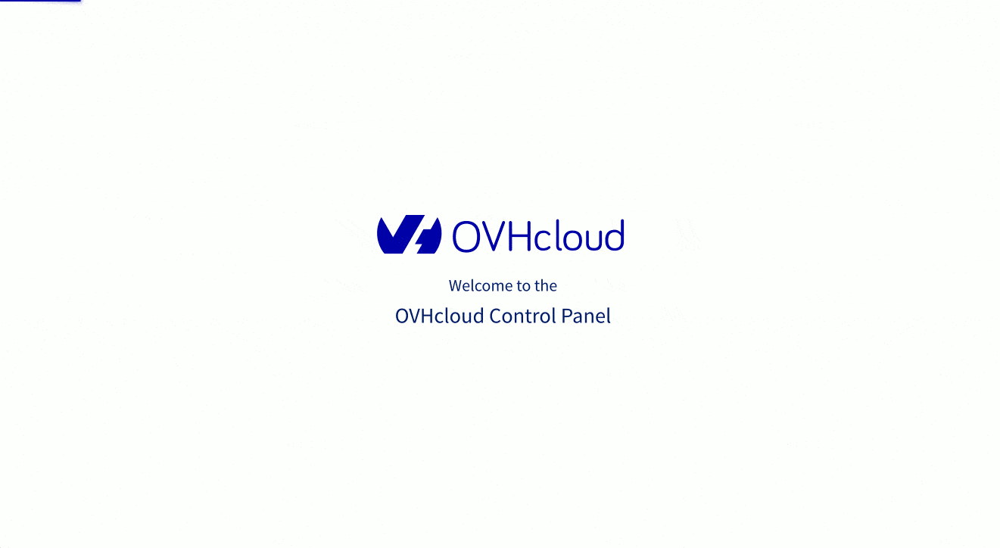

**Última actualización: 21/11/2022**

## Objetivo

Consulte las preguntas más frecuentes sobre la gestión de la cuenta de OVHcloud.

### ¿Cómo crear una cuenta en OVHcloud?

Crear una cuenta es gratis y le permite acceder a sus datos y gestionar sus servicios. Puede crear su cuenta desde la siguiente página: [www.ovh.com/manager/](https://www.ovh.com/auth/?action=gotomanager&from=https://www.ovh.es/&ovhSubsidiary=es).

Una vez creada, puede proteger el acceso a sus datos personales activando la doble autenticación en la sección «Mi cuenta», en la pestaña «Seguridad» (consulte también la respuesta a la pregunta [«¿Cómo proteger mi cuenta?»](#protect-account)).

#### Ideas y consejos

Si no encuentra su país, puede cambiar el idioma de la web haciendo clic en la bandera que desee en la esquina superior derecha.

Si desea más información sobre la cuenta de cliente de OVHcloud, consulte nuestra guía [«Todo sobre el ID de cliente de OVHcloud»](https://docs.ovh.com/es/customer/todo-sobre-el-id-de-cliente/).

### ¿Dónde encontrar mi identificador de cliente de OVHcloud?

Su identificador de cliente, también llamado ID de cliente o «NIC-handle», aparece en la esquina superior derecha de su última factura. Tiene el siguiente formato: «ab00001-ovh» (donde las primeras letras suelen corresponder a las iniciales de la persona que ha creado la cuenta). También puede consultar su identificador de cliente en todos los mensajes de correo electrónico enviados por OVHcloud (emails de confirmación de creación de su cuenta, emails de confirmación de un pedido o de renovación, etc.).

Si todavía no ha encontrado su identificador, haga clic en el enlace «¿No recuerda su ID de cliente o contraseña?» que aparece en la página de [conexión al área de cliente de OVHcloud](https://www.ovh.com/auth/?action=gotomanager&from=https://www.ovh.es/&ovhSubsidiary=es) e introduzca la dirección de correo electrónico asociada a su cuenta.

#### Ideas y consejos

Puede consultar su ID de cliente en cualquier momento desde el área de cliente, desplegando el menú «Mi cuenta» situado en la esquina superior derecha.

#### ¿Qué hago si no puedo conectarme a mi cuenta de cliente?

Existen diversos motivos por los que esto puede ocurrir: no recuerda su contraseña, no tiene acceso a su cuenta de correo electrónico o su teléfono móvil para identificarse por SMS, etc.

Si no puede identificarse o conectarse a su área de cliente, consulte [la siguiente guía](https://docs.ovh.com/es/customer/conectarse-area-de-cliente-ovhcloud/#login-failure).

### ¿Cómo modificar mis datos personales?

Para consultar o modificar sus datos, conéctese al área de cliente con su ID de cliente y contraseña. Podrá acceder a sus datos haciendo clic en las iniciales de su nombre y apellidos, en la esquina superior derecha del panel de control de su área de cliente. Será redirigido a la sección «Mi cuenta», donde podrá consultar y editar sus datos personales en el apartado «Mi perfil».

{.thumbnail}

#### Ideas y consejos

Al cambiar la dirección de correo electrónico asociada a su cuenta de OVHcloud, recibirá una solicitud de confirmación en la dirección que figura en el área de cliente. Si ya no tiene acceso a esa dirección, solo tiene que esperar 24 horas. Una vez transcurrido ese plazo, el cambio se hará efectivo de forma automática.

### ¿Cómo introducir el número de teléfono al crear una cuenta?

Es necesario introducir el número de teléfono en formato internacional. Por ejemplo, si su número es el «612 345 678», deberá introducir «+34 612345678».

#### Ideas y consejos

Al seleccionar España como país de residencia, el prefijo «+34» se selecciona automáticamente.

### ¿Cómo afecta el RGPD a mis datos personales?

Para saber cómo afecta el Reglamento general de protección de datos (RGPD) a su actividad profesional o sus datos personales, le recomendamos que consulte los siguientes recursos:

- [«OVHcloud y la protección de datos personales»](https://www.ovhcloud.com/es-es/personal-data-protection/)
- [«RGPD: la respuesta a sus preguntas»](https://www.ovhcloud.com/es-es/personal-data-protection/faq/)

### ¿Cómo cambiar la contraseña en OVHcloud?

En la página de conexión al área de cliente, haga clic en «¿No recuerda su ID de cliente o contraseña?». Introduzca su ID de cliente o la dirección de correo electrónico principal asociada a su cuenta de OVHcloud y haga clic en «Enviar». Recibirá un email a la dirección de contacto de la cuenta para confirmar su solicitud. Lea atentamente las indicaciones y haga clic en el enlace que contiene el email.

#### Ideas y consejos

Si ya no tiene acceso a la dirección de correo electrónico de contacto, siga este [procedimiento](https://www.ovh.es/soporte/procedimientos/).

Si ha olvidado su ID de cliente, puede consultarlo en la esquina superior derecha de su última factura. Tiene el siguiente formato: «ab00001-ovh» (donde las primeras letras suelen corresponder a las iniciales de la persona que ha creado la cuenta). También encontrará su ID de cliente en el email de confirmación de creación de la cuenta, así como en los emails de confirmación de pedido o de renovación.

### ¿Cómo cambiar los contactos?

OVHcloud le ofrece la posibilidad de delegar en otras cuentas de cliente de OVHcloud la gestión administrativa, técnica y de facturación de sus servicios desde el área de cliente. Para ello, acceda a la sección «Gestión de contactos» del menú que aparece a la derecha en el panel de control de su área de cliente.

La delegación del servicio deberá ser validada por correo electrónico tanto por el administrador del servicio como por el nuevo contacto.

Antes de realizar cualquier cambio, asegúrese de que todas las direcciones de correo electrónico de contacto son válidas, ya que, de lo contrario, la solicitud no podrá completarse.

Si desea recuperar un dominio del que usted es el propietario registrado en un registro (puede consultar esta información en [www.ovh.es/cgi-bin/tools/check_whois.pl](https://www.ovh.es/cgi-bin/tools/check_whois.pl)), pero no tiene acceso a la cuenta de cliente administrador, le recomendamos que siga los pasos que se indican en el siguiente procedimiento: [www.ovh.es/cgi-bin/es/procedure/procedureChangeContacts.cgi](https://www.ovh.es/cgi-bin/es/procedure/procedureChangeContacts.cgi)

#### Ideas y consejos

Para más información sobre la gestión de contactos, consulte la siguiente guía: [docs.ovh.com/es/customer/gestion-de-los-contactos/#acceder-a-la-gestion-de-los-contactos](https://docs.ovh.com/es/customer/gestion-de-los-contactos/#acceder-a-la-gestion-de-los-contactos)

### ¿Cómo cambiar el contacto de facturación?

Conéctese al área de cliente con su ID de cliente y contraseña. Para modificar el contacto de facturación, acceda a la sección «Gestión de contactos» disponible en la columna derecha del panel de control.

#### Ideas y consejos

Si desea más información sobre la gestión de los contactos, consulte nuestra guía [«Gestionar los contactos de los servicios»](https://docs.ovh.com/es/customer/gestion-de-los-contactos/).

### ¿Cómo proteger mi cuenta?

Existen diversas formas de proteger su cuenta:

- elegir una contraseña compleja
- la renovación regular de esta contraseña
- doble autenticación

Para la doble autenticación mediante el envío de un código por SMS o a través de la restricción por IP (autorización o denegación de acceso a determinadas direcciones), tiene la posibilidad de añadir reglas de seguridad desde su área de cliente. Estas opciones están disponibles en la sección «Seguridad» de su perfil. Para acceder a ella, haga clic en sus iniciales, en la esquina superior derecha del panel de control de su área de cliente de OVHcloud.

Y para más información, ver el [video](https://www.youtube.com/watch?v=odO58c4gJfc&list=PL0DynEzr_sE5MnOfJOpVJN-EhfMDWoqGS&index=24).

### ¿Cómo activar la doble autenticación/2FA de OVHcloud?

Una vez que haya creado su cuenta de cliente de OVHcloud, le recomendamos que proteja sus datos personales activando la doble autenticación. Para ello, acceda a la sección «Mi cuenta» > «Seguridad».

Al activar la doble autenticación o 2FA, podrá elegir el método con el que desea autenticarse:

- por SMS, a través de un código de seguridad;
- desde una aplicación móvil compatible con Android, iPhone y Windows móvil;
- con una llave de seguridad compatible con U2F.

[Más información](https://docs.ovh.com/es/customer/proteger-su-cuenta-con-una-2FA/)

### ¿Cómo desactivar la doble autenticación/2FA de OVHcloud?

Puede desactivar la doble autenticación directamente desde su área de cliente, en la sección «Mi cuenta» > «Seguridad».

Es posible desactivar uno por uno los diferentes dispositivos de seguridad. 

Si ha perdido su periférico de doble autenticación y no puede acceder al área de cliente, puede ponerse en contacto con el equipo de soporte de OVHcloud para que uno de nuestros asesores desactive manualmente el dispositivo. Tenga en cuenta que, en este caso, deberá identificarse proporcionando los justificantes de identidad pertinentes.

### ¿Qué hacer si me han pirateado la cuenta de OVHcloud?

Si detecta un uso fraudulento de su cuenta de OVHcloud (identidad, formas de pago...), le recomendamos que lo denuncie a la policía lo antes posible. A continuación, contacte telefónicamente con el soporte. Para garantizar su seguridad, le pediremos que justifique su identidad mediante el envío de la documentación correspondiente y que nos haga llegar una copia de la denuncia. De este modo, podremos iniciar los trámites internos.

Nuestros especialistas analizarán su caso y adoptarán las medidas pertinentes, que podrían incluir el bloqueo de su ID de cliente o la eliminación y reembolso de los servicios contratados de manera fraudulenta.

Finalmente, para recuperar su cuenta de cliente podremos solicitarle que cambie su dirección de correo electrónico y/o su contraseña cumplimentando este [procedimiento](https://www.ovh.es/cgi-bin/es/procedure/procedureChangeEmail.cgi).

### He recibido un mensaje de correo electrónico que parece ser un mensaje de phishing usurpando la identidad de OVHcloud, ¿cómo puedo notificarlo para que se compruebe su legitimidad?

Para identificar y denunciar un mensaje de correo electrónico o un SMS de phishing, consulte nuestra [guía dedicada](https://docs.ovh.com/es/customer/proteccion-ataque-phishing/).

### ¿Cómo puedo denunciar un comportamiento abusivo o un contenido ilícito procedente de servicios alojados en OVHcloud?

Puede denunciar cualquier comportamiento abusivo o contenido ilícito en la plataforma de OVHcloud específica para tal fin [www.ovh.com/abuse/](https://www.ovh.com/abuse/). Seleccione la categoría correspondiente e introduzca la información que se le solicita.

OVHcloud solo enviará los logs y los elementos técnicos al titular del servicio del que procede la infracción. Por favor, no incluya datos personales en esos campos.

### Después de denunciar una infracción, ¿qué sucede con esta notificación?

El servicio jurídico de OVHcloud estudiará su notificación de infracción o contenido ilícito lo antes posible. Nuestro equipo analizará su denuncia y posteriormente se pondrá en contacto con usted para ofrecerle información adicional. Si se demuestra el comportamiento abusivo de uno de nuestros clientes, le informaremos y haremos todo lo necesario para que los responsables pongan fin a este comportamiento lo antes posible.

### OVHcloud me ha enviado un mensaje de correo electrónico en el que se indica que yo podría estar cometiendo una infracción, ¿qué debo hacer?

Si nuestro equipo ha detectado o comprobado la existencia de un comportamiento abusivo, recibirá un mensaje de correo electrónico desde una dirección de correo electrónico con el siguiente formato: «tíquet+"número de tíquet"@abuse.ovh.net».

Teniendo en cuenta los elementos adicionales que se le indicarán en este mensaje de correo electrónico, nuestro equipo le solicitará que realice una serie de comprobaciones para identificar y corregir el comportamiento abusivo o, en su caso, eliminar el contenido ilícito.

Asimismo, deberá asegurarse de que sus servicios no están siendo controlados por un tercero (por ejemplo, debido a un ataque informático). Para ello, consulte nuestras guías:

- [Proteger mi cuenta de OVHcloud y gestionar mis datos personales](https://docs.ovh.com/es/customer/todo-sobre-el-id-de-cliente/)
- [Cambiar la contraseña de su cuenta](https://docs.ovh.com/es/customer/gestionar-su-contrase%C3%B1a/)
- [Proteger su cuenta de OVHcloud con la doble autenticación](https://docs.ovh.com/es/customer/proteger-su-cuenta-con-una-2FA/)
- [¿Cómo proteger su sitio web?](https://docs.ovh.com/es/hosting/secure-website/)
- [Proteger un VPS](https://docs.ovh.com/es/vps/consejos-proteccion-vps/)
- [Proteger un servidor dedicado](https://docs.ovh.com/es/dedicated/seguridad-de-un-servidor-dedicado/)

### En caso de identificar una posible infracción en uno de mis servicios de OVHcloud, ¿cómo puedo evitar la suspensión del servicio?

Una vez que haya realizado las acciones necesarias, deberá responder directamente al mensaje de correo electrónico que le hemos enviado desde nuestro servicio de Abuse indicándonos qué medidas ha adoptado.
Nuestro equipo le responderá lo antes posible.

### He respondido al mensaje que me envió el equipo de Abuse de OVHcloud, pero mi servicio sigue bloqueado. ¿Qué puedo hacer?

Puede crear un tíquet de asistencia desde su área de cliente de OVHcloud para solicitar información adicional sobre el tratamiento de su tíquet de Abuse. Por favor, incluya la referencia de su tíquet de Abuse para facilitar el tratamiento del tíquet de asistencia.

## Más información

Interactúe con nuestra comunidad de usuarios en <https://community.ovh.com/en/>.