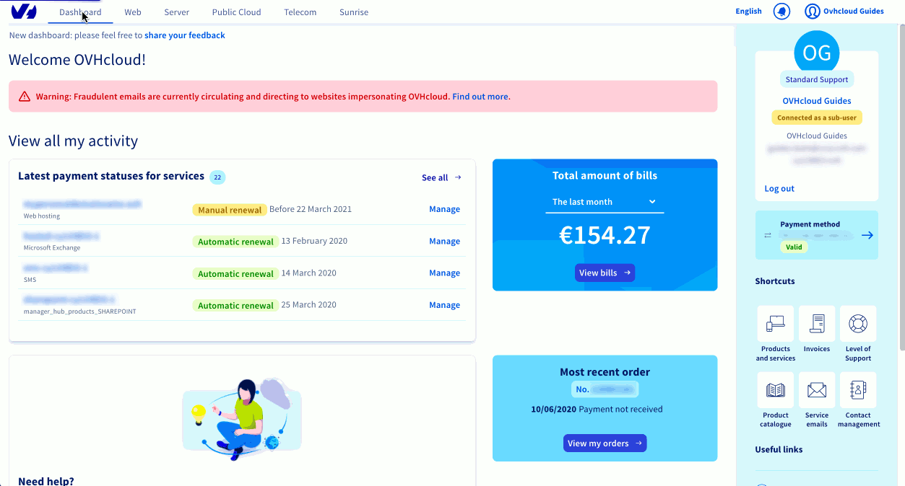

**Dernière mise à jour le 08/11/2022**

## Objectif

Retrouvez ici les questions les plus fréquemment posées sur la facturation et le paiement pour vos services OVHcloud.

### Quel est mon compte de facturation ?

La liste des contacts de vos services est disponible dans la rubrique `Mes contacts`{.action} accessible directement sur le tableau de bord de votre espace client OVHcloud.

#### Trucs et astuces

Si vous souhaitez en savoir plus sur la gestion des contacts, vous pouvez consulter ce guide détaillé : [Gérer les contacts de ses services](https://docs.ovh.com/ca/fr/customer/gestion-des-contacts/).

### Comment modifier mes coordonnées de facturation ?

Vos coordonnées de facturation sont celles de votre identifiant client. Pour vos prochaines factures, il vous suffit donc de mettre à jour ces informations, dans la rubrique `Mon Compte`{.action} de votre espace client OVHcloud.

Pour des raisons légales, il est impossible de modifier une facture déjà éditée. Toutefois, si votre demande est liée à une erreur de nos services, nous vous invitons à nous contacter en créant un ticket d'assistance.

### Quels sont les différents moyens de paiement disponibles pour régler mon service ?

Différents moyens de moyens de paiement sont proposés par OVHcloud. Retrouvez-les [ici](https://www.ovhcloud.com/fr-ca/terms-and-conditions/payment/) en vous référant directement à la rubrique « Les différents moyens de paiement proposés par OVHcloud ».

#### Trucs et astuces

La nouvelle réglementation Européenne (DSP2) en vigueur sur les paiements à distance auprès des partenaires de paiement garantit un haut niveau de sécurité sur les transactions bancaires. Pour ces raisons, il est possible que votre banque ne donne pas une autorisation spontanée en émettant des réserves sur votre paiement, même si votre solde est créditeur.
Dans ce cas, nous vous conseillons de contacter votre banque afin d’être informé des modalités d'acceptation de paiement par Internet qu’elle propose. En fonction de la réponse de votre banque, vous pourrez par la suite renouveler votre paiement.

### Comment se renouvellent mes services ?

Par défaut, vos services sont renouvelés automatiquement lorsqu'ils arrivent à échéance, et le montant de votre facture est prélevé en début de mois sur votre moyen de paiement par défaut. Veillez donc à bien enregistrer un moyen de paiement sur votre compte client, afin d'éviter toute suspension, et à résilier vos services AVANT la date d'échéance.
Sur certaines gammes (domaines, hébergements web, VPS et serveurs dédiés), vous avez la possibilité de choisir un mode de renouvellement `manuel`.
Si vos services sont paramétrés en renouvellement manuel, des notifications vous sont envoyées par e-mail à l'approche de la date d'expiration de votre service, avec un lien permettant de payer en ligne.
Si vous ne renouvelez pas votre service avant cette date, il sera simplement suspendu, puis supprimé au bout de quelques jours.

#### Trucs et astuces

Consultez l'état de vos services, et administrez leur renouvellement dans la rubrique `Mes Services`{.action} de votre espace client.
Identifiez-vous et renouvelez manuellement vos services sur la page <https://eu.ovh.com/fr/cgi-bin/order/renew.cgi>
Si vous souhaitez en savoir plus, nous vous invitons à consulter ce guide détaillé : [Gérer le renouvellement de mes services](https://docs.ovh.com/ca/fr/billing/renouvellement-automatique-ovh/).

### Comment activer le renouvellement automatique ?

Rendez-vous dans la rubrique `Produits et Services`{.action} accessible directement sur le tableau de bord de votre espace client OVHcloud. Identifiez alors le service concerné, cliquez sur les points de suspension, puis sélectionnez `Activer le paiement automatique`{.action}. Par défaut, le renouvellement automatique est activé sur chaque service lors de sa commande.

#### Trucs et astuces

Avant toute activation du renouvellement automatique, pensez à renseigner un moyen de paiement. En effet, en cas d'impayé, vos services seront suspendus après 7 jours.
Si vous souhaitez en savoir plus, nous vous invitons à consulter ce guide détaillé : [Gérer le renouvellement de mes services](https://docs.ovh.com/ca/fr/billing/renouvellement-automatique-ovh/).

### Comment désactiver le renouvellement automatique ?

Sur le tableau de bord de votre espace client OVHcloud, cliquez sur le raccourci `Produits et services`{.action}. Identifiez alors le service concerné, cliquez sur les points de suspension, puis sélectionnez « Configurer le renouvellement ». Vous pouvez ensuite choisir le mode manuel. Ce mode n'est disponible que pour certains services, tels que les noms de domaines, hébergements web, VPS, et serveurs dédiés.

Pour résilier un service, consultez [Comment résilier un service](#cancelservice)

#### Trucs et astuces

Le renouvellement automatique vous permet de ne pas subir de coupure de service. De plus, deux notifications par e-mail vous sont envoyées, 40 et 15 jours avant chaque renouvellement.
Si vous souhaitez en savoir plus, nous vous invitons à consulter ce guide détaillé : [Gérer le renouvellement de mes services](https://docs.ovh.com/ca/fr/billing/renouvellement-automatique-ovh/).

### Comment ajouter un moyen de paiement ?

Connectez-vous à votre espace client OVHcloud, puis directement sur le tableau de bord, cliquez sur la rubrique `Moyens de paiement`{.action}, puis sur `Ajouter un moyen de paiement`{.action}.

### Comment mettre à jour mon moyen de paiement ?

Connectez-vous à votre espace client OVHcloud, puis directement sur le tableau de bord, cliquez sur la rubrique `Moyens de paiement`{.action}. Vous pourrez y ajouter ou supprimer un moyen de paiement (Carte bancaire, Paypal ou prélèvement SEPA).

En cas de demande de prélèvement SEPA, vous recevrez dans les 24 à 48h sur l’adresse e-mail de votre compte OVHcloud, un e-mail comportant un lien de signature électronique de votre mandat de prélèvement. Attention, le propriétaire du compte bancaire doit être identique au propriétaire du compte OVHcloud.

Une fois réceptionné par nos services, si votre mandat est approuvé, vous pourrez alors utiliser ce nouveau moyen de paiement.

{.thumbnail}

#### Trucs et astuces

Au moins un moyen de paiement doit être enregistré dans votre espace client, afin que vos services soient correctement renouvelés. Si vous n'avez plus aucune solution active, nous vous invitons à nous contacter en créant un ticket d'assistance.

### Comment supprimer un moyen de paiement ?

Connectez-vous à votre espace client OVHcloud, puis directement sur le tableau de bord de votre espace client, cliquez sur la rubrique `Moyens de paiement`{.action}. Identifiez alors le moyen de paiement à supprimer, puis cliquez sur l'icône en forme de corbeille.

#### Trucs et astuces

Avant de supprimer un moyen de paiement, assurez-vous d'en avoir enregistré autre.

### Quel est mon moyen de paiement par défaut ?

Une fois connecté à votre espace client, votre moyen de paiement par défaut est directement indiqué sur votre tableau de bord.

#### Trucs et astuces

Si votre compte prépayé OVHcloud est créditeur, il sera toujours utilisé par défaut lors de vos renouvellements. Si le montant crédité est inférieur à celui de la facture, la différence sera alors prélevée sur votre moyen de paiement enregistré. Enfin, si aucun moyen de paiement n'est enregistré, une facture de régularisation vous sera adressée par e-mail.

### Quelle est la date de mon prochain paiement ?

Retrouvez toutes vos dates de renouvellement dans la rubrique « Produits et services » accessible directement sur le tableau de bord de votre espace client OVHcloud.

À noter que les solutions bénéficiant du renouvellement automatique sont renouvelées le premier jour du mois. La fréquence peut cependant être différente selon vos services.

#### Trucs et astuces

Vous pouvez modifier la fréquence de renouvellement de vos solutions depuis la rubrique `Mes services`{.action} de votre espace client.
Si vous souhaitez en savoir plus, nous vous invitons à consulter ce guide détaillé : [Gérer le renouvellement de mes services](https://docs.ovh.com/ca/fr/billing/renouvellement-automatique-ovh/).

### Lequel de mes moyens de paiement sera débité ?

Le solde de votre facture sera débité sur le moyen de paiement que vous avez paramétré par défaut. Celui-ci est affiché sur le tableau de bord de votre espace client OVHcloud.

#### Trucs et astuces

Si votre compte prépayé OVHcloud est créditeur, il sera toujours utilisé par défaut lors de vos renouvellements. Si le montant crédité est inférieur à celui de la facture, la différence sera alors prélevée sur votre moyen de paiement enregistré. Enfin, si aucun moyen de paiement n'est enregistré, une facture de régularisation vous sera adressée par e-mail.

### Comment retrouver mes factures ?

Rendez-vous dans la rubrique `Factures`{.action} accessible directement sur le tableau de bord de votre espace client OVHcloud.

#### Trucs et astuces

Si une facture n'apparaît pas dans votre espace client, il est possible que vous ne soyez pas le contact de facturation du service concerné. Pour le connaître et éventuellement le modifier, rendez-vous dans la rubrique `Mon compte`{.action} puis `Mes contacts`{.action}.

### Comment payer ma facture ?

Le tableau de bord de votre espace client OVHcloud affiche vos règlements en attente.

Si vous avez enregistré un moyen de paiement et que vos services bénéficient du renouvellement automatique, les règlements s'effectuent automatiquement. Aucune action de votre part n'est alors nécessaire.

Si vous n'avez pas enregistré de moyen de paiement, mais que vous possédez des services en renouvellement automatique, le jour du renouvellement, un lien pour le règlement vous est envoyé par e-mail. Vous pouvez aussi le régler directement dans votre espace client OVHcloud.

#### Trucs et astuces

Vous êtes en possession de votre identifiant et de votre mot de passe OVHcloud ? Vous pouvez régler votre facture.
Vous pouvez également consulter ce guide détaillé : [Gérer ses factures OVHcloud - Régler mon solde](https://docs.ovh.com/ca/fr/billing/gerer-factures-ovh/#regler-mon-solde).

### Comment vérifier l'état de mon paiement ?

Le tableau de bord de votre espace client OVHcloud affiche vos règlements en attente. Vous avez la possibilité de les régler directement en ligne, ou d'attendre votre prochain prélèvement automatique si vous avez enregistré un moyen de paiement.

#### Trucs et astuces

Vous pouvez enregistrer votre moyen de paiement dans la section `Moyens de paiement`{.action} . Vos factures seront ainsi automatiquement régularisées.

### À quoi correspondent mes paiements ?

Les paiements que vous réalisez sur notre site, ainsi que les prélèvements automatiques, sont historisés dans votre espace client. Depuis la rubrique `Suivi des paiements`{.action}, vous pouvez retrouver les factures, dates et montants correspondants.

### Que faire si mon paiement par carte bancaire est refusé ?

Même si le solde de votre compte bancaire est positif, il est possible que votre paiement puisse être refusé.

En effet, compte tenu de la réglementation Européenne (DSP2) en vigueur sur les paiements à distance auprès des partenaires de paiement qui garantit un haut niveau de sécurité sur les transactions bancaires, votre organisme bancaire peut émettre des réserves sur votre paiement.

Dans ce cas, nous vous conseillons de contacter votre banque afin d’être informé des modalités d'acceptation de paiement par Internet qu’elle propose. En fonction de la réponse de votre banque, vous pourrez par la suite renouveler votre paiement.

### Comment résilier un service ? 

Pour les solutions telles que les noms de domaine, hébergements web, serveurs dédiés et VPS, rendez-vous dans la rubrique « Produits et services » du tableau de bord de votre espace client OVHcloud. Identifiez alors le service concerné, cliquez sur les points de suspension, puis sélectionnez `Résilier à date d'échéance`{.action}. À noter que si une demande a déjà été effectuée, il vous sera proposé d'`Annuler la résiliation`{.action}.

La résiliation sera effective lorsque la période de validité ou d'engagement de votre service sera terminée. Vous pouvez effectuer cette demande ou l'annuler jusqu'à 24 heures avant la date d'échéance.

#### Trucs et astuces

En cas d'erreur de commande, vous avez la possibilité, sous conditions, d'exercer votre droit de rétractation. Pour plus d'infos, nous vous invitons à consulter la question suivante Comment annuler ma commande?
Une documentation complète sur la résiliation de l'ensemble de nos produits et services est disponible [ici](https://docs.ovh.com/ca/fr/billing/how-to-cancel-your-services/).

### Comment personnaliser la référence de mon produit/service sur ma facture?

Pour une lecture facilitée, les noms personnalisés que vous attribuez à vos produits/services sont inscrits, directement sur votre facture, en plus de la référence OVHcloud.
Aussi, pour personnaliser le nom de vos produits/services (à l'exception du produit « nom de domaine »), rendez-vous dans votre espace client, dans la page de configuration de chacun de ceux-ci.

### Comment fonctionne la facturation de Public Cloud ?

Celle-ci prend en compte, d’une part, les ressources payables à l’avance et, d’autre part, les ressources supplémentaires consommées au cours du mois précédent.

#### Trucs et astuces

Si vous souhaitez en savoir plus, nous vous invitons à consulter ce guide détaillé : [Information concernant le mode de facturation cloud](https://docs.ovh.com/ca/fr/public-cloud/information-concernant-le-mode-de-facturation-cloud/).

### Comment consulter le grand livre des comptes ?

Le grand livre des comptes est fourni uniquement par le service comptabilité du demandeur.

OVHcloud vous donne cependant accès à l'ensemble de vos factures, via un fichier Excel (.csv).

Pour le télécharger, rendez-vous dans la rubrique « Factures » accessible sur le tableau de bord de votre espace client OVHcloud. Cliquez ensuite sur le bouton `Actions`{.action}, puis sélectionnez « Exporter en CSV ».

## Aller plus loin

Échangez avec notre communauté d'utilisateurs sur <https://community.ovh.com>.