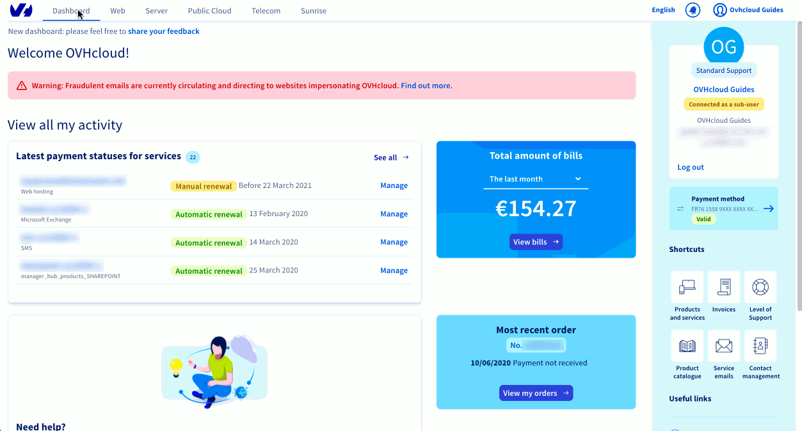

**Última actualización: 10/11/2022**

## Objetivo

Encuentre las preguntas más frecuentes sobre el seguimiento de pedidos de OVHcloud.

### ¿Cómo puedo abonar un nuevo pedido?

Para abonar un pedido deberá identificarse utilizando su cuenta de cliente. A continuación, solo tendrá que seleccionar una forma de pago ya registrada en su cuenta de cliente o añadir una nueva. Si desea pagar por tarjeta bancaria, es posible que su banco le envíe un código SMS de confirmación que deberá introducir al abonar el pedido. Una vez que OVHcloud haya recibido el pago, le enviaremos un mensaje de confirmación informándole del progreso de su pedido.

#### Ideas y consejos

¿Ha cerrado la página de la orden de pedido? Puede volver a abrirla para abonar el pedido desde el [área de cliente OVHcloud](https://ca.ovh.com/auth/?action=gotomanager&from=https://www.ovh.com/world/&ovhSubsidiary=ws), en `Mis pedidos`{.action}.

### ¿Cómo consultar el estado de un pago?

Acceda a la sección `Facturas`{.action} disponible en la columna derecha del panel de control de su [área de cliente de OVHcloud](https://ca.ovh.com/auth/?action=gotomanager&from=https://www.ovh.com/world/&ovhSubsidiary=ws). Si tiene alguna factura pendiente de pago, podrá gestionar el pago directamente desde el panel de control.

#### Ideas y consejos

Puede configurar su forma de pago en la sección `Formas de pago`{.action}. Así sus facturas se abonarán de forma automática.

### ¿Cómo realizar el seguimiento de un pedido?

Puede consultar el estado de sus últimos pedidos directamente desde el panel de control de su área de cliente de OVHcloud. Si quiere acceder a todos sus pedidos, haga clic en `Ver mis pedidos`{.action}.

{.thumbnail}

#### Ideas y consejos

Para ayudarle a gestionar sus pedidos, ponemos a su disposición una [guía detallada](https://docs.ovh.com/us/es/billing/gestionar-los-pedidos-en-ovh/).

### ¿Cómo modificar un pedido?

No es posible modificar los pedidos. No obstante, si no realiza el pago, el pedido expira automáticamente.

#### Ideas y consejos

Si ya ha abonado el pedido, puede contactar con nuestro [servicio de atención al cliente](https://www.ovhcloud.com/es/contact/).

### ¿Cómo cancelar un pedido?

Si no realiza el pago, el pedido se cancelará automáticamente al cabo de un período que puede oscilar entre 24 horas y una semana (en función del servicio) sin que usted tenga que hacer nada.

Si es un usuario particular y ya ha abonado el pedido, dispone de un plazo de 14 días para desistir del mismo siempre que este no se refiera a un servicio personalizado (como un nombre de dominio o un certificado SSL) o una licencia (como Exchange, Office 365 o SharePoint). En [esta guía](https://docs.ovh.com/us/es/billing/gestionar-los-pedidos-en-ovh/#ejercer-el-derecho-de-desistimiento) ofrecemos información detallada al respecto.

#### Ideas y consejos

Si es un usuario profesional, no está sujeto a la Ley de defensa de consumidores y usuarios en lo relativo al derecho de desistimiento de 14 días.

### ¿Por qué no se ha entregado el servicio?

La entrega de un servicio puede retrasarse por varias razones.

Con el fin de garantizar la protección de nuestros clientes, en OVHcloud prestamos especial atención a la seguridad de las transacciones financieras. Para ello, hemos puesto en marcha un procedimiento de validación aleatoria de los pagos, que podría retrasar algunos pedidos. Para saber si este es su caso, puede consultar el estado de sus pagos desde la sección `Facturación`{.action} del área de cliente, en el apartado «Mis pedidos».

Otra posible causa del retraso puede ser que la factura se encuentre pendiente de pago, en cuyo caso puede abonar el importe desde la sección `Facturación`{.action} del área de cliente.

{.thumbnail}

#### Ideas y consejos

En la sección «Formas de pago» puede guardar una forma de pago para que sus facturas se abonen de forma automática.

## Más información

Interactúe con nuestra comunidad de usuarios en <https://community.ovh.com/en/>.