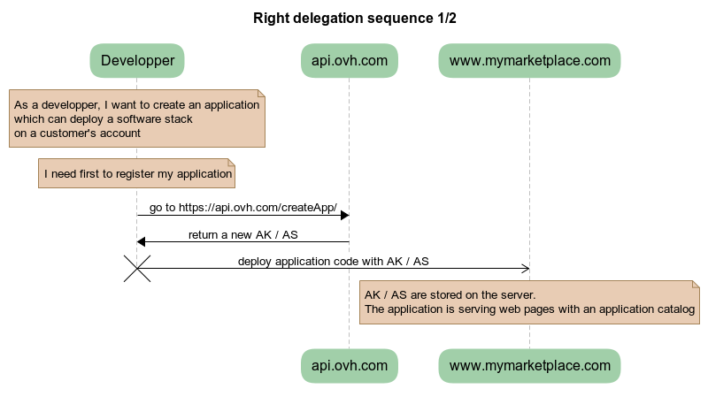
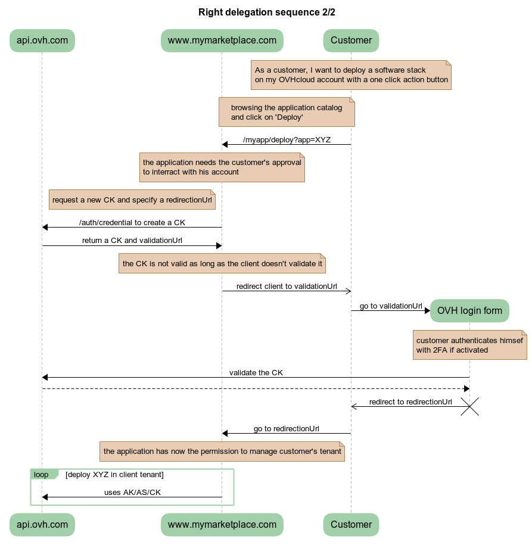

**Last updated 8th February 2020**

## Objective

In this guide, you will learn how to use the OVHcloud API to manage services and resources of someone else's account.

As an example, let's assume that you want to create a marketplace in which you, as a service provider, can install and configure resources of other OVHcloud customers.

## Requirements

- an OVHcloud account

## Instructions

### Application registration

The first part, as the application developer, is to register your application on OVHcloud.

To do so, go to https://api.ovh.com/createApp/

You will need to log in and set an application name and description.


Once logged in, you will get your `Application Key` and `Application Secret`, later refered as `AK` and `AS`.


The `AK` is identifying your application. It can be publicly shared.

The `AS` is a key used to sign the API requests which will be made later by your application. It **must** be kept secret.

#### Summary



### Deploy your application

To illustrate that part, let's assume that you have deployed your application code on a server.

Your application can access the value of `AK` and `AS` and displays a list of software stacks or services available for installation by customers.

### Rights delegation

Let's assume that a customer browsing your marketplace selects a service to deploy to their OVHcloud account. So far, you don't have any rights on the customer's API. You have to ask their permission to manage its ressources.


### Create a permission request

The first step is for your application to request permissions on the customer's API.

To do so, your application will request credentials by calling https://api.ovh.com/console/#/auth/credential#POST and passing as argument a list of endpoints the application needs access to.

<!--
Application Name: maketplace
Application Description: my little marketplace
Application Key: F7gzxgxN5eqwuAsK
Application Secret: UsNmaE8iqvAV6qT0VieCNVrSys9a5hkr
 -->

<!-- https://webhook.site/586c652e-061e-453f-bd71-51912e33419d -->

Example with curl with an access request to `GET /me`.

```bash
export AK=F7gzxgxN5eqwuAsK
export REDIRECT_URL=https://webhook.site/586c652e-061e-453f-bd71-51912e33419d # usefull for debug

curl -H "Content-type: application/json" -H "X-Ovh-Application: $AK" -d '{"redirection": "$REDIRECT_URL", "accessRules": [{"method": "GET", "path": "/me"}]}' https://eu.api.ovh.com/1.0/auth/credential
```

The result of that call will be a JSON dictionary

```json
{
  "state":"pendingValidation",
  "consumerKey":"5DU984kYxyoAe4lRaevZCGnmt9FVnKT2",
  "validationUrl":"https://eu.api.ovh.com/auth/?credentialToken=RAXoRq9FvUQFI1S6hE0HmkySyVp8aDWwIqBA3fYrOr0vVSMdpjqxFqp3IjyjGAfu"
}
```

As the developer, you have to store the `consumerKey`, later refered as `CK`. This key will be used to sign the OVHcloud API requests on behalf of your customer.

The request has been made and you need your customer to accept it by redirecting him to `validationUrl`

### Client login form

After redirecting the client to `validationUrl`, he will be asked to confirm the rights delegation.


If successful, the client will be redirected to the url previously specified by `REDIRECT_URL` in the curl command.

### Access customer's API

At that point, you should have three tokens:

- the application key `AK`
- the application secret `AS`
- the consumer key `CK`

From there, depending on the requested permissions, you can start managing your customers resources.

#### Summary



Happy development !

## Go further

- [API Console](https://api.ovh.com/){.external}


