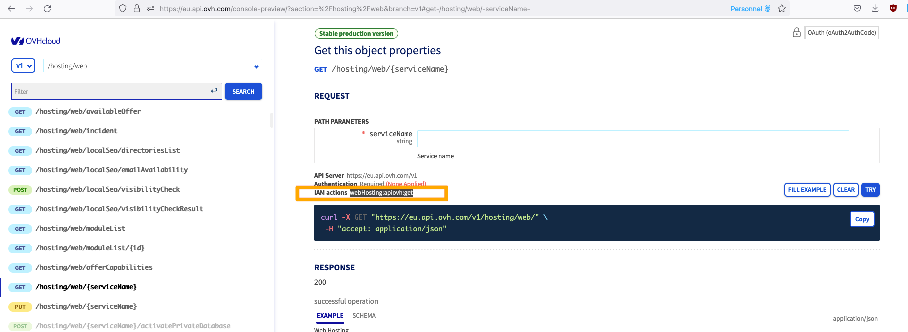

> [!warning]
>
> Cette fonctionnalité est actuellement en béta. Vous pouvez trouver plus d'informations sur <https://labs.ovhcloud.com/fr/>.
>

## Objectifs

Pour réaliser des automatisations sur vos infrastructure, vous devez fournir des identifiants au code qui s'en charge. Avec les comptes de service OVHcloud, il est possible d'avoir un seul identifiant par script pour l'utilisation des différentes API proposées par les produits de OVHcloud ([API de OVHcloud](/pages/account/customer/console-preview), [API de openstack](/pages/platform/public-cloud/starting_with_nova)... )

Ce guide va vous expliquer comment utiliser les comptes de service afin de se connecter aux APIs de OVHcloud.

Cela peut vous permettre : 
- De commander ou de résilier automatiquement certains produits
- De gérer votre facturation
- De gérer les infrastructures de vos produits
- De fournir à votre monitoring des informations issues de nos infrastructures
- ...

Les comptes de service fonctionnent avec le flow *client credentials* de Oauth2. Cela vous permet donc d'intégrer l'utilisation de l'API OVHcloud avec tous les outils respectant ce protocole. Les versions v1 et v2 de l'api OVHcloud sont compatibles avec les flow *client credentials* et *authorization code* de Oauth2.

Oauth2 permet aussi de développer des applications tierces se connectant aux API de OVHcloud sans collecter les identifiants. Si vous souhaitez créer vos propres applications exploitant les informations de comptes OVHcloud, vous pouvez utiliser le flow *authorization code* qui n'est pas décrit dans ce guide.

## Pré-requis

- Vous avez un commpte client [OVHcloud account](/pages/account/customer/ovhcloud-account-creation).
- Vous savez configurer des politiques d'accès via API [how to configure policies for IAM](/pages/account/customer/iam-policies-api).
- Vous savez utiliser les APIs de OVHcloud [Premiers pas avec les API OVHcloud](/pages/account/api/first-steps/)
- Avoir créé un compte de service via API [Créer et utiliser des comptes de service OVHcloud](/pages/account/policies/manage-service-account)

Pour l'exemple dans ce guide, nous utiliserons le compte de service **urn:v1:eu:identity:credential:xx11111-ovh/oauth2-0f0f0f0f0f0f0f0f** pour accéder à la configuration de l'hébergement web accéder au projet public cloud **urn:v1:eu:resource:webHosting:xxxxxxx.cluster001.hosting.ovh.net**. N'oubliez pas d'adapter les exemples à vos besoins.

## Associer des droits d'accès API à son compte de service

Avant toute chose, il faut que notre compte de service puisse accèder aux APIs utile. OVHcloud fournit des droits pour chaque appel d'API. Pour trouver quelles sont les autorisations nécessaires, vous pouvez vous rendre sur la console des API de OVHcloud:

- [Console de l'API EU](https://eu.api.ovh.com/console-preview/)
- [Console de l'API CA](https://ca.api.ovh.com/console-preview/)

Pour chaque appel d'api, vous trouverez le nom de l'action correspondante à la ligne **IAM actions**.
Par exemple, pour l'appel */v1/hosting/web*, le nom de l'action nécessaire est *webHosting:apiovh:get* comme vous pouvez l'observer dans l'exemple suivant

{.thumbnail}

Vous pouvez aussi utiliser l'opérateur **\*** pour désigner un sous ensemble de droits. Dans notre exemple, nous souhaitons fournir tous les droits sur les API liées au produit webhosting. Nous fournirons ainsi l'action **webHosting:**

Dans le cadre de notre exemple, nous avons créé la politique d'accès suivante : 

```json
{
  "name": "Demo-service-account",
  "description": "Demo for service account guide with webhosting",
  "identities": [
    "urn:v1:eu:identity:credential:xx11111-ovh/oauth2-0f0f0f0f0f0f0f0f"
  ],
  "resources": [
    {
      "urn": "urn:v1:eu:resource:webHosting:xxxxxxx.cluster001.hosting.ovh.net"
    }
  ],
  "permissions": {
    "allow": [
      {
        "action": "webHosting:*"
      }
    ]
  }
}
```

## Récupérer un token d'API à partir d'un compte de service

Afin de récupérer un token d'API, vous devez effectuer l'appel HTTP suivant : 

```bash
curl --request POST \
  --url 'https://www.ovh.com/auth/oauth2/token' \
  --header 'content-type: application/x-www-form-urlencoded' \
  --data grant_type=client_credentials \
  --data client_id=0f0f0f0f0f0f0f0f \
  --data client_secret=xxxxx \
  --data scope=all
```

En modifiant les données suivantes: 

 - **client_id**: Identifiant de votre compte de service
 - **client_secret**: Token de votre compte de service

En fonction de la localisation de votre API, vous devez utiliser l'url suivante : 

- **API EU**: https://www.ovh.com/auth/oauth2/token
- **API CA**: https://www.ovh.ca/auth/oauth2/token

Lors de cet appel d'API, vous recevrez une réponse respectant le format suivant:

```json
{
  "access_token":"your-api-token",
  "token_type":"Bearer",
  "expires_in":3599,
  "scope":"all"
}
```

Conservez le token contenu dans le champs **access_token**. Il sera nécessaire pour authentifier vos calls d'API.

Pour obtenir des informations sur votre hébergement web, vous pouvez désormais faire un appel sur 

> [!api]
>
> @api {GET} /hosting/web/xxxxxxx.cluster001.hosting.ovh.net
>

Pour ce faire, vous devez fournir le token récupéré précédemment en header de votre requête de la façon suivante:

```bash
curl -i -X GET "https://{eu|ca}.api.ovh.com/v1/hosting/web/xxxxxxx.cluster001.hosting.ovh.net" \
  -H "accept: application/json"\
  -H "authorization: your-api-token" 
```

Cependant, avec la même politique d'accès, vous n'avez accès que aux API de webhosting. Les autres API vous retournerons l'erreur HTTP 403 suivante:

```json
{
    "class":"Client::Forbidden",
    "message":"User not granted for this request"
}
```

Dans ce cas, vous devrez modifier votre politique d'accès pour obtenir le droit correspondant.
