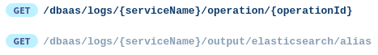
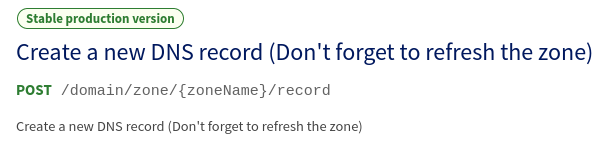
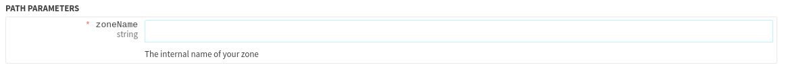
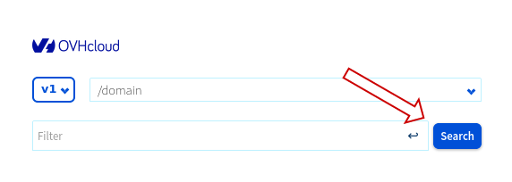
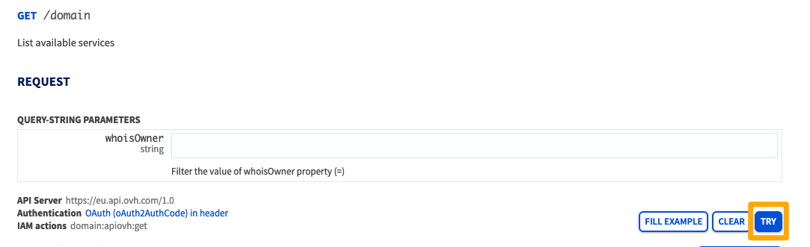

**Last updated March 27th 2023**

## Objective

The APIs available on [https://ca.api.ovh.com/](https://ca.api.ovh.com/){.external} allow you to purchase, manage, update and configure OVHcloud products without using a graphical interface such as the OVHcloud Control Panel.

**Discover how to explore the OVHcloud APIs on our brand new console**

## Requirements

- You have an active OVHcloud account and know its credentials.
- You are on the [OVHcloud API](https://ca.api.ovh.com/){.external} web page.

## Instructions

> [!warning]
> OVHcloud is providing you with services for which you are responsible, with regard to their configuration and management. You are therefore responsible for ensuring they function correctly.
>
> This guide is designed to assist you in common tasks as much as possible. Nevertheless, we recommend contacting a specialised provider and/or the software publisher for the service if you encounter any difficulties. We will not be able to assist you ourselves. You can find more information in the [“Go further”](#gofurther) section of this guide.
>

### Signing in to OVHcloud APIs

On the [OVHcloud API](https://ca.api.ovh.com/) page, click `Try the new OVHcloud API console`{.action} to view the list of APIs.

To use the APIs on your products, you must sign in to this site using your OVHcloud credentials.

- Click `Authentication`{.action} in the upper left.
- The authentication process uses OAuth2 protocol with scopes. To authenticate yourself, you have to choose at least one scope from the list. A scope will limit the access of the generated token to a subset of the API operations. For this tutorial, simply select the scope `all` that allows all API operations, then click on `GET TOKEN`{.action}.
- You will be redirected to the OVHcloud authentication page on which you need to enter your OVHcloud credentials.
- Once your credentials are validated, you will be redirected on the API console and will be able to try calls.

{.thumbnail}

> [!primary]
>
> If your OVHcloud account is protected by [two-factor authentication](https://docs.ovh.com/us/en/customer/secure-account-with-2FA/), you will also need to enter the code generated by SMS or OTP mobile application or U2F key.
>

### Exploring the available products on OVHcloud APIs

#### Selecting the API branch

Several branches of OVHcloud APIs are available:

- **V1**: the API available at [https://ca.api.ovh.com/v1](https://ca.api.ovh.com/v1)
- **V2**: the new OVHcloud API, available at [https://ca.api.ovh.com/v2](https://ca.api.ovh.com/v2)

The API branch can be selected using the drop-down menu in the upper left.

{.thumbnail}

#### Selecting the API section

Once you have chosen an API branch, you can browse the different sections of the selected branch. The sections are sorted in alphabetical order and by default the first section is displayed.

You can choose a section in the drop-down menu just next to the branch-selection one. It is possible to filter out the list of sections by typing the name of the desired section.

{.thumbnail}

Once you have selected an API section, the operations it contains are displayed in the left menu.

#### Exploring the operations

The list of operations of the selected API section is displayed in the lower part of the left menu.

{.thumbnail}

Each line contains the following pieces of information:

- HTTP verb of the operation (GET, PUT, POST, PATCH, DELETE)
- Path of the operation
- Operation's state: if the operation is in state *alpha* or *beta*, you will see a badge to the right of the operation's path.

{.thumbnail}

If the operation is deprecated, the path will be greyed out in the list of operations. In the following example, the second operation is deprecated.

{.thumbnail}

Once you select an operation, its detailed information will be displayed on the right side of the page.

This view is divided in four subsections described below.

##### **General information**

This subsection contains basic information about the operation:

- State of the operation (e.g. *Beta version*)
- Description of the operation
- Path of the operation and HTTP verb

{.thumbnail}

##### **Request**

This subsection describes the input parameters of the operation. Depending on the operation's parameters, the following information will be displayed:

- **Path parameters**

{.thumbnail}

The red star located on the left of the parameter's name indicates that this parameter is mandatory to be able to execute the request.

- **Header parameters**

{.thumbnail}

- **Query parameters**

{.thumbnail}

- **Request body**

This subsection describes the request body. The default view shows an example body that can be used in a request.
These values can be modified directly in place to try the call with values corresponding to your services.

{.thumbnail}

There is also a tab *SCHEMA* that exposes the details of type, description, and allowed values for each parameter.

{.thumbnail}

##### **Response**

This section is similar to the previous one and describes the operation's response.

{.thumbnail}

The *SCHEMA* tab is also available to get the details of the returned fields alongside with their description.

{.thumbnail}

#### Advanced search

An advanced search is available by clicking on the `Search`{.action} button in the upper left.

{.thumbnail}

When clicking this button, a popup windows is opened allowing to search through operation with the following criteria:

- Path of the operation
- Description of the API route
- Parameters of the operation
- Fields of the operations's request body
- Description of the operation's response
- State of the operation

{.thumbnail}

### Executing requests

From the console, it is possible to interact directly with the API using the `TRY`{.action} button.

{.thumbnail}

After having set all the required parameters (when necessary), this button allows you to make a real call to the OVHcloud API.
When executing the request, the API response is displayed below the operation parameters.

Three tabs are then available:

- **RESPONSE**: response body of the API
- **RESPONSE HEADERS**: headers returned by the API
- **CURL**: show the equivalent of the request using the tool `curl`

## Go further 

[Managing a Domain Name with the OVHcloud API](https://docs.ovh.com/us/en/domains/api/)

[How to manage a customer’s account via OVHcloud API](https://docs.ovh.com/us/en/api/api-rights-delegation/)

Join our community of users on <https://community.ovh.com/en/>.
