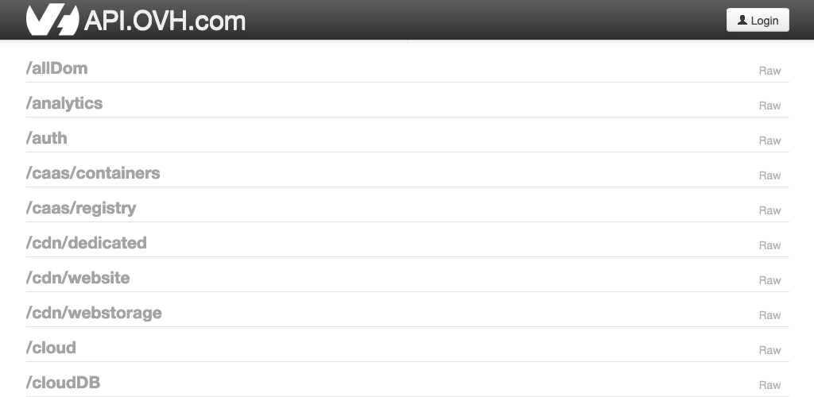

**Dernière mise à jour le 04/06/2020**

## Objectif

Les API disponibles sur [https://api.ovh.com/](https://api.ovh.com/){.external} vous permettent d'acheter, gérer, mettre à jour et configurer des produits OVHcloud sans utiliser une interface graphique comme l'espace client.

**Découvrez comment utiliser les API OVHcloud mais aussi comment les coupler avec vos applications**

## Prérequis

- Disposer d'un compte OVHcloud actif et connaître ses identifiants.
- Être sur la page web des [API OVHcloud](https://api.ovh.com/){.external}.

## En pratique

> [!warning]
>
> OVHcloud met à votre disposition des services dont la configuration, la gestion et la responsabilité vous incombent. Il vous revient de ce fait d'en assurer le bon fonctionnement.
> 
> Nous mettons à votre disposition ce guide afin de vous accompagner au mieux sur des tâches courantes. Néanmoins, nous vous recommandons de faire appel à un prestataire spécialisé et/ou de contacter l'éditeur du service si vous éprouvez des difficultés. En effet, nous ne serons pas en mesure de vous fournir une assistance. Plus d'informations dans la section « Aller plus loin » de ce guide.
> 


### Utilisation simple

#### Se connecter aux API OVHcloud

Sur la page des [API OVHcloud](https://api.ovh.com/), cliquez sur `Explore the OVH API`{.action} pour afficher la liste des API. 

Pour utiliser les API sur vos produits, vous devez vous connecter sur ce site grâce à vos identifiants OVHcloud.

- Cliquez sur `Login`{.action} en haut à droite. 
- Saisissez vos identifiants OVHcloud. 
- Définissez une temporalité, sous la mention **Validity**, pendant laquelle vous autorisez les actions via les API OVHcloud.

{.thumbnail} 

> [!primary]
>
> Si votre compte OVHcloud est protégé par une [double authentification](../../customer/securiser-son-compte-avec-une-2FA/),  vous devrez également saisir le code généré par SMS ou application OTP ou clé U2F.
>

#### Explorer les produits disponibles sur les API

Une fois connecté, vous retrouvez la liste des produits OVHcloud disposant des API. Cette liste est classée par ordre alphabétique.

{.thumbnail} 

Pour afficher, par exemple, les API liées aux noms de domaine, cliquez sur **/domain** dans la liste.

Après avoir cliqué sur le produit, la liste des API de ce dernier s'affiche en dessous. 

{.thumbnail} 

#### Exécuter une API

Il existe 4 types d'API disponibles qui emploient ce que l'on appelle des méthodes HTTP : 

**GET** 

La methode GET a pour but de récupérer les données d'une ressource.

Par exemple, pour récupérer la liste de vos noms de domaine, utilisez l'API suivante :
 
> [!api]
>
> @api {GET} /domain
>

**POST**

La méthode POST est utilisée pour envoyer des données supplémentaires vers la ressource. 

Par exemple, pour ajouter un enregistrement à votre zone DNS, utilisez l'API suivante :

> [!api]
>
> @api {POST} /domain/zone/{zoneName}/record
>

**PUT**

La méthode PUT sert à remplacer les données actuelles de la ressource par les données de la requête.

Par exemple, si vous vous êtes trompé dans un enregistrement de votre zone DNS, utilisez l'API suivante :

> [!api]
>
> @api {PUT} /domain/zone/{zoneName}/record/{id}
>

**DELETE**

La méthode DELETE est utilisée pour supprimer la ressource appelée.

Par exemple, si vous ne souhaitez finalement pas conserver l'enregistrement DNS que vous avez ajouté à votre zone DNS, utilisez l'API suivante :

> [!api]
>
> @api {DELETE}  /domain/zone/{zoneName}/record/{id}
>

##### Paramètres de l'API

Après avoir cliqué sur l'API de votre choix, la section **Parameters** permet d'attribuer les variables relatives à son application.
 
Par exemple, pour l'ajout d'un enregistrement TXT dans votre zone DNS, vous optiendrez les paramètres suivants :
 	
{.thumbnail} 
 
Une fois les paramètres définis, vous pouvez lancer l'API en cliquant sur `Execute`{.action}. 

L'onglet `Result` alors affiché vous donnera le rapport d'éxécution de l'API.

{.thumbnail} 

Les onglets `PHP` et `Python` contiennent les éléments à ajouter dans votre script en fonction du language utilisé.

### Utilisation avancée : coupler les API OVHcloud avec une application

#### Créer les clés de votre application

Toute application souhaitant communiquer avec l'API OVHcloud doit être déclarée à l'avance.

Pour ce faire, cliquez sur le lien suivant : [https://eu.api.ovh.com/createToken/](https://eu.api.ovh.com/createToken/){.external}.

Renseignez votre identifiant client, votre mot de passe et le nom de votre application. Le nom sera utile plus tard si vous voulez autoriser d'autres personnes à l'utiliser.

Vous pouvez également ajouter une description de l'application ainsi qu'une temporalité. 

Le champ `Rights` vous permet de restreindre l'usage de l'application à certaines API. 
<br> Afin d'autoriser toutes les API OVHcloud pour une méthode HTTP, renseignez une étoile `*` dans le champ, comme dans l'exemple ci-dessous où la méthode GET est autorisée pour toutes les API :

{.thumbnail} 

Après avoir cliqué sur `Create keys`{.action}, Vous obtiendrez trois clés :

- la clé d'application, appelée **AK**. Par exemple :

```sh
7kbG7Bk7S9Nt7ZSV
```

- votre clé d'application secrète, à ne pas divulguer, appelée **AS**. Par exemple :

```sh
EXEgWIz07P0HYwtQDs7cNIqCiQaWSuHF
```

- une « **consumer key** » secrète, à ne pas divulguer, appelée **CK**. Par exemple :

```sh
MtSwSrPpNjqfVSmJhLbPyr2i45lSwPU1
```

Dans le cas présent, la clé **CK** est attachée à votre compte.

Le token **CK** peut être utilisé pour de la délégation de droits. Consultez le guide suivant pour en savoir plus : [Comment gérer le compte d'un client OVHcloud via les API](https://docs.ovh.com/gb/en/api/api-rights-delegation/) (guide en anglais).


#### Première utilisation de l'API

Une fois vos trois clés obtenues (**AK**, **AS**, **CK**), vous pouvez signer les demandes d'API. La signature est calculée ainsi :

```sh
"$1$" + SHA1_HEX(AS+"+"+CK+"+"+METHOD+"+"+QUERY+"+"+BODY+"+"+TSTAMP)
```

Afin de simplifier le développement de vos applications, OVHcloud vous fournit des wrappers API dans plusieurs langages.
Les utiliser vous permettra de ne pas vous préoccuper du calcul de la signature et de vous concentrer sur le développement de votre application.

- *Perl* : <https://eu.api.ovh.com/wrappers/OvhApi-perl-1.1.zip>
- *Python* : <https://github.com/ovh/python-ovh>
- *PHP* : <https://github.com/ovh/php-ovh>
- *Node.js* : <https://github.com/ovh/node-ovh>
- *Swift* : <https://github.com/ovh/swift-ovh>
- *C#* : <https://github.com/ovh/csharp-ovh>

Voici un exemple d'utilisation de la section `/me` qui permet de gérer votre compte OVHcloud :

```python
import ovh

# Instantiate. Visit https://api.ovh.com/createToken/?GET=/me
# to get your credentials
client = ovh.Client(
    endpoint='ovh-eu',
    application_key='<application key>',
    application_secret='<application secret>',
    consumer_key='<consumer key>',
)

# Print nice welcome message
print("Welcome", client.get('/me')['firstname'])
```

## Aller plus loin

[Utilisation des API sur Private Cloud](../../private-cloud/connexion-a-l-api-ovh/)

[Comment gérer le compte d'un client OVHcloud via les API](https://docs.ovh.com/gb/en/api/api-rights-delegation/) (guide en anglais)

Échangez avec notre communauté d'utilisateurs sur [https://community.ovh.com](https://community.ovh.com).
