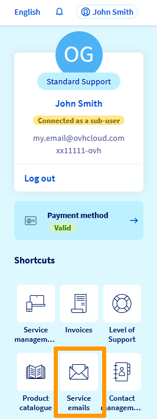
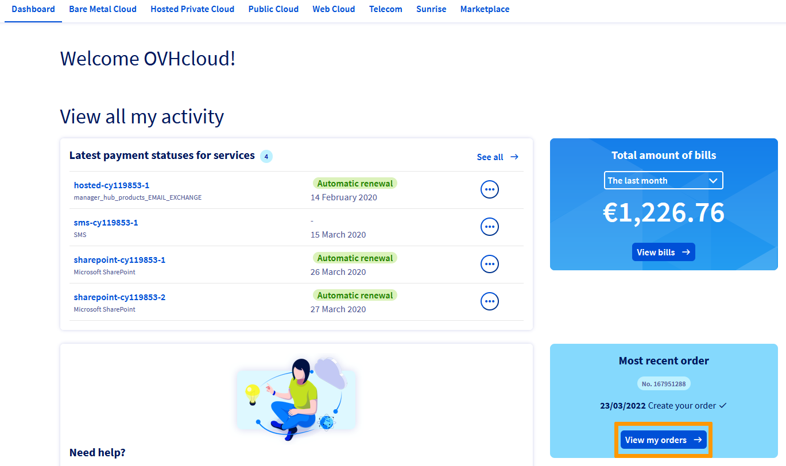

> [!primary]
> Esta traducción ha sido generada de forma automática por nuestro partner SYSTRAN. En algunos casos puede contener términos imprecisos, como en las etiquetas de los botones o los detalles técnicos. En caso de duda, le recomendamos que consulte la versión inglesa o francesa de la guía. Si quiere ayudarnos a mejorar esta traducción, por favor, utilice el botón "Contribuir" de esta página.
>

**Última actualización: 02/05/2022**

## Objetivo

Esta guía explica los requisitos necesarios para una buena gestión de su cuenta y la facturación de sus servicios de OVHcloud.

**Consulte las buenas prácticas para evitar interrupciones del servicio o irregularidades en su cuenta de OVHcloud.**

## Requisitos

- Tener uno o más servicios de OVHcloud activos.
- Haber iniciado sesión en el [área de cliente de OVHcloud](https://ca.ovh.com/auth/?action=gotomanager&from=https://www.ovh.com/world/&ovhSubsidiary=ws).

## Procedimiento

### Parámetros de cuenta

#### Proteja su cuenta

- [Cree una contraseña segura](https://docs.ovh.com/us/es/customer/gestionar-su-contrase%C3%B1a/#generar-una-contrasena-adecuada) para garantizar la confidencialidad de su cuenta.

- [Active la doble autenticación](https://docs.ovh.com/us/es/customer/proteger-su-cuenta-con-una-2FA/) para evitar todo acceso fraudulento al área de cliente.

Para que las medidas de seguridad sean eficaces, asegúrese de que sus direcciones de correo electrónico (principal y de seguridad) y su número de teléfono móvil estén **actualizadas y accesibles**.

#### Compruebe sus datos personales

Sus datos personales (dirección postal, correo electrónico, etc.) deben estar actualizados en su cuenta de cliente para garantizar la seguridad y el buen funcionamiento de sus servicios.

Compruebe sus datos personales haciendo clic en su nombre en la esquina superior derecha del área de cliente de OVHcloud y seleccionando sus iniciales (`Gestionar mi cuenta`{.action}). 
En la sección `Mi perfil`{.action} a la derecha de su pantalla (haga clic de nuevo en su nombre para borrar el menú de la izquierda), haga clic en `...`{.action} y luego en `Editar mi perfil`{.action}.

{.thumbnail}

Para más información, consulte la guía [Proteger mi cuenta de OVHcloud y gestionar mis datos personales](https://docs.ovh.com/us/es/customer/todo-sobre-el-id-de-cliente/#editar-mis-datos-personales).

Asegúrese de que su dirección de correo electrónico esté siempre **actualizada, segura y accesible.** Recibirá los mensajes de correo procedentes de nuestros servicios en esta dirección, incluyendo los **mensajes de restauración** en caso de perder su contraseña.

> [!warning]
>
> Añada también un **email de seguridad** a sus datos personales para evitar perder el acceso a su cuenta de cliente de OVHcloud.
>

También puede acceder a los mensajes de correo enviados por OVHcloud desde su [área de cliente de OVHcloud](https://ca.ovh.com/auth/?action=gotomanager&from=https://www.ovh.com/world/&ovhSubsidiary=ws). 
Haga clic en su nombre en la esquina superior derecha de su pantalla y, seguidamente, en el menú de la derecha, haga clic en `Emails de servicio`{.action}.

{.thumbnail}

### Active la renovación automática

> [!primary]
>
> Para evitar interrupciones del servicio y garantizar el buen funcionamiento de la renovación automática, [guarde una forma de pago](https://docs.ovh.com/es/billing/gestionar-formas-de-pago/) en su [área de cliente de OVHcloud](https://ca.ovh.com/auth/?action=gotomanager&from=https://www.ovh.com/world/&ovhSubsidiary=ws).
>
> Compruebe regularmente que su forma de pago es **válida**.
>

Para más información sobre la activación de la renovación automática, consulte las siguientes guías:

- [Gestionar la renovación de los servicioss](https://docs.ovh.com/us/es/billing/renovacion-automatica-ovh/);
- [Gestionar las formas de pago](https://docs.ovh.com/us/es/billing/gestionar-formas-de-pago/);

Si decide no activar la renovación automática, recibirá notificaciones por correo electrónico invitándole a realizar un **pago manual**. Le permitirá, o bien renovar su servicio con antelación, o bien abonar su factura pendiente.

### Seguimiento de sus pedidos

¿Sabía que podía [seguir sus pedidos](https://docs.ovh.com/us/es/billing/gestionar-los-pedidos-en-ovh/) en su [área de cliente de OVHcloud](https://ca.ovh.com/auth/?action=gotomanager&from=https://www.ovh.com/world/&ovhSubsidiary=ws)? 
En la pestaña `Panel de control`{.action} del menú superior de su pantalla, haga clic en `Ver mis pedidos`{.action}.

{.thumbnail}

Le informaremos de las etapas de la entrega y sabrá si es necesario realizar alguna acción.

### Baja de servicios

Si quiere dejar de utilizar uno de sus servicios, puede darlo de baja, pasar la renovación a modo manual o eliminarlo inmediatamente desde el [área de cliente de OVHcloud](https://ca.ovh.com/auth/?action=gotomanager&from=https://www.ovh.com/world/&ovhSubsidiary=ws).

Haga clic en su nombre en la esquina superior derecha de su pantalla y, seguidamente, en `Gestión de servicios`{.action}. En el lado derecho de su pantalla, haga clic en el botón `...`{.action} correspondiente al servicio en el que quiera realizar la acción y seleccione uno de los siguientes botones:

- `Configurar la renovación`{.action}: en la siguiente pantalla, podrá pasar el `Modo de renovación` del servicio a `Manual`. Haga clic en `Siguiente`{.action} y `Confirmar`{.action}. Antes de la fecha de expiración del servicio, recibirá varias notificaciones por correo electrónico. Si no renueva el servicio, se eliminará **definitivamente**.
- `Dar de baja`{.action}: en la siguiente pantalla, indique los motivos de la solicitud de baja y haga clic en `Aceptar`{.action}. La operación se eliminará **definitivamente** en la fecha de expiración del servicio.
- `Eliminar inmediatamente`{.action}: en la siguiente pantalla, haga clic en `Aceptar`{.action}. Recibirá un mensaje de correo electrónico de confirmación. Tras la validación, su servicio se eliminará **de forma inmediata y definitiva**.

Para más información sobre la baja de sus servicios, consulte la guía [Cómo dar de baja sus servicios de OVHcloud](https://docs.ovh.com/us/es/billing/how-to-cancel-your-services/).

### Cierre de cuenta

Si quiere cerrar definitivamente su cuenta personal de OVHcloud, compruebe que no contenga servicios activos, facturas pendientes de pago o pedidos en curso. 
A continuación, envíe una [solicitud](https://ca.ovh.com/manager/#/dedicated/support/tickets/new) a nuestro equipo de asistencia para pedir que se elimine su cuenta de forma permanente.

## Más información 

[Protéjase contra el fraude: cómo detectar los mensajes de correo fraudulento y el phishing](https://docs.ovh.com/us/es/customer/proteccion-ataque-phishing/)

[Gestionar las facturas de OVHcloud](https://docs.ovh.com/us/es/billing/gestionar-facturas-ovh/)

Interactúe con nuestra comunidad de usuarios en <https://community.ovh.com/en/>.
