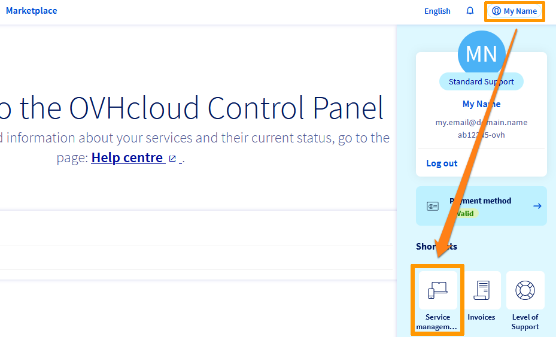
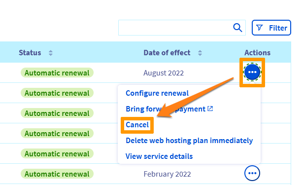

**Dernière mise à jour le 19/01/2022**

Vous souhaitez résilier un ou plusieurs services OVHcloud. Nous sommes sincèrement désolé qu'ils ne vous aient pas donnés satisfaction. Ce guide vous indiquera comment interrompre votre abonnement depuis [l'espace client OVHcloud](https://www.ovh.com/auth/?action=gotomanager&from=https://www.ovh.com/fr/&ovhSubsidiary=fr).

Pour l'utiliser, nous vous recommandons de prendre connaissance de la partie « [Que se passe-t-il lorsqu'un service OVHcloud est résilié ?](#consequences) » puis de cliquer dans le menu de gauche sur le type de produit que vous souhaitez résilier.

> [!warning]
>
> Seul le *contact administrateur* d'un service OVHcloud est en capacité de le résilier. Pour plus d'informations, consultez ce [guide](https://docs.ovh.com/fr/customer/gestion-des-contacts/#definition).
>

**Découvrez comment interrompre vos abonnements OVHcloud.**

## Que se passe-t-il lorsqu'un service OVHcloud est résilié ? 

La « *résiliation* » concernant l'un de vos services OVHcloud signifie qu'à la fin de l'abonnement en cours, il sera interrompu de façon définitive. 

Elle sera effective lorsque la période de validité de votre abonnement sera terminée. Vous pouvez résilier un service ou annuler une résiliation jusqu'à 24 heures avant cette date.

S'il s'agit d'une offre de messagerie, d'un serveur ou d'un hébergement Web, l'ensemble des données concernées seront supprimées **sans possibilité de récupération**.

S'il s'agit d'un nom de domaine ou d'un numéro de téléphone, ils seront remis en circulation et pourront être **commandés par d'autres clients**.

Ceci implique que vous devez être **certain** avant toute résiliation :

- que l'opération va concerner un service que vous ne souhaitez plus utiliser ;
- que vous possédez, si nécessaire, une solution *fonctionnelle* pour le remplacer ;
- que vous avez sauvegardé l'ensemble des données concernées.

## Comment résilier votre abonnement ?

### Serveurs dédiés

### VPS (Virtual Private Servers)

### Hosted Private Cloud

### Web Cloud (Offres mutualisées)

#### Domaines

#### Hébergement Web

Pour résilier votre [service d'hébergement Web mutualisé](https://www.ovhcloud.com/fr/web-hosting/) depuis votre [espace client OVHcloud](https://www.ovh.com/auth/?action=gotomanager&from=https://www.ovh.com/fr/&ovhSubsidiary=fr), cliquez sur votre nom en haut à droite de votre écran afin de faire apparaître le menu de droite puis sur le bouton `Gestion des services`{.action}.

{.thumbnail}

Cliquez ensuite sur le bouton `...`{.action} correspondant au service à résilier à droite de l'écran puis sur `Résilier`{.action}.

{.thumbnail}

> [!primary]
>
> Avoir votre retour est essentiel pour nous. Cela nous permet de faire évoluer nos services, afin qu'ils répondent au mieux à vos besoins et à vos attentes.
>
> N'hésitez donc pas à nous en dire plus sur votre expérience personnelle avec OVHcloud (via le formulaire en fin de page). Nous vous remercions par avance de votre contribution à l'amélioration de nos produits.
>

Indiquez la raison principale de votre volonté de résiliser votre abonnement, ainsi que ce que vous prévoyez de faire ensuite puis cliquez sur `Valider`{.action} :

{.thumbnail}

#### Certificat SSL

#### Service E-mail MX Plan
#### Service E-mail Pro
#### Service E-mail Exchange

### Public Cloud

### Telecom

## Comment annuler la résiliation de votre abonnement ? 

## Aller plus loin 

Pour des prestations spécialisées (référencement, développement, etc), contactez les [partenaires OVHcloud](https://partner.ovhcloud.com/fr/).

Si vous souhaitez bénéficier d'une assistance à l'usage et à la configuration de vos solutions OVHcloud, nous vous invitons à consulter nos différentes [offres de support](https://www.ovhcloud.com/fr/support-levels/).

Échangez avec notre communauté d'utilisateurs sur <https://community.ovh.com/>.