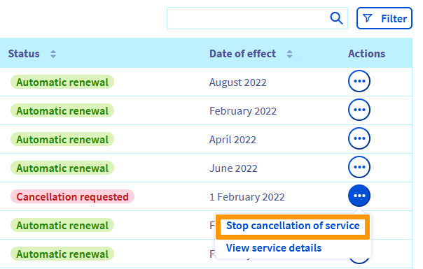

> [!primary]
> Questa traduzione è stata generata automaticamente dal nostro partner SYSTRAN. I contenuti potrebbero presentare imprecisioni, ad esempio la nomenclatura dei pulsanti o alcuni dettagli tecnici. In caso di dubbi consigliamo di fare riferimento alla versione inglese o francese della guida. Per aiutarci a migliorare questa traduzione, utilizza il pulsante "Modifica" di questa pagina.
>

**Ultimo aggiornamento: 22/03/2022**

## Obiettivo

Disattivare uno o più servizi OVHcloud Questa guida ti mostra come interrompere il tuo abbonamento dallo [Spazio Cliente OVHcloud](https://www.ovh.com/auth/?action=gotomanager&from=https://www.ovh.it/&ovhSubsidiary=it).

Per prima cosa, accedi alla sezione "Cosa succede quando un servizio OVHcloud viene disattivato?](#consequences)".  Scegli il prodotto nella sezione "Come disattivare il tuo abbonamento?](#terminate)".

> [!primary]
>
> Ottenere la vostra opinione è essenziale per noi. In questo modo possiamo far evolvere i nostri servizi in modo che rispondano al meglio alle tue esigenze e aspettative.
>
> Per maggiori informazioni sulla tua esperienza personale con OVHcloud, consulta il form proposto al momento della disattivazione. Ti ringraziamo fin d'ora per il tuo contributo al miglioramento dei nostri prodotti.
>

## Cosa succede quando un servizio OVHcloud viene disattivato? 

La "disattivazione" di un servizio OVHcloud comporta l'interruzione **definitiva** del servizio al termine dell'abbonamento in corso (con un'eccezione, tuttavia, per i [domini](#domain)). È possibile disattivare il servizio o [annullare una richiesta di disattivazione](#cancel) fino a 24 ore prima della data di scadenza dell'abbonamento.

Se si tratta di un servizio di posta elettronica, di un server o di un hosting Web, tutti i dati in questione verranno eliminati **senza possibilità di recupero**.

Se si tratta di un dominio o di un numero di telefono, saranno rimessi in circolazione e potranno essere **ordinati da altri clienti**.

Questo implica che, prima di disattivarsi, devi essere **certo**:

- che l'operazione riguarderà un servizio che non vuoi più utilizzare;
- se necessario, possiedi una soluzione *funzionale* per sostituirla;
- aver salvato, se necessario, tutti i dati pertinenti.

## Come disattivare il tuo abbonamento? 

> [!warning]
>
> La rescissione può essere applicata solo se sono soddisfatte le seguenti condizioni:
>
> * sei il "contatto amministratore" del servizio (per maggiori informazioni, consulta [questa guida](https://docs.ovh.com/it/customer/gestisci_i_tuoi_contatti/#definizione));
> * il servizio non è in rinnovo manuale;
> * il servizio non è sospeso, in particolare a causa di una mancata regolarizzazione di una fattura.
>

Clicca sul tipo di prodotto da disattivare nella lista delle principali offerte OVHcloud:

[Bare Metal Cloud](#baremetalcloud) 
&emsp;&emsp;[Server dedicato](#dedicated) 
&emsp;&emsp;[VPS](#vps) 
&emsp;&emsp;[Managed Bare Metal](#managedbaremetal) 
&emsp;&emsp;[Server NAS-HA](#nas) 
&emsp;&emsp;[Load Balancer](#iplb) 
&emsp;&emsp;[Licenze](#licences) 

[Hosted Private Cloud](#privatecloud) 
&emsp;&emsp;[Hosted Private Cloud powered by VMware](#hostedprivatecloud-vmware) 
&emsp;&emsp;[Veeam Cloud Connect](#veeamcloudconnect) 

[Public Cloud](#publiccloud) 

[Web Cloud](#webcloud) 
&emsp;&emsp;[Dominio](#domain) 
&emsp;&emsp;[Hosting Web](#hosting) 
&emsp;&emsp;[Certificato SSL Sectigo](#ssl_sectigo) 
&emsp;&emsp;[OVHcloud Web Paas powered by Platform.sh](#webpaas) 
&emsp;&emsp;[CloudDB](#clouddb) 
&emsp;&emsp;[E-mail MX Plan](#mxplan) 
&emsp;&emsp;[E-mail Pro](#emailpro) 
&emsp;&emsp;[Hosted Exchange](#hosted) 
&emsp;&emsp;[Private Exchange](#private) 
&emsp;&emsp;[Office 365 csp 1](#office-csp1) 
&emsp;&emsp;[Office 365 csp 2](#office-csp2) 
&emsp;&emsp;[Sharepoint](#sharepoint) 

[Soluzioni trasversali](#transversal) 
&emsp;&emsp;[SSL Gateway](#ssl_gateway) 

### Bare Metal Cloud 

#### Server dedicato 

Per disattivare il tuo [server dedicato](https://www.ovhcloud.com/it/bare-metal/), accedi allo [Spazio Cliente OVHcloud](https://www.ovh.com/auth/?action=gotomanager&from=https://www.ovh.it/&ovhSubsidiary=it), clicca sul tuo nome in alto a destra e poi sul pulsante `Gestione dei servizi`{.action}.

Clicca sui tre puntini `...`{.action} in corrispondenza del servizio da disattivare e seleziona `Disattiva`{.action}.

Indica i motivi della richiesta di disattivazione e clicca su `Conferma`{.action}.

#### VPS 

Per disattivare il server [VPS](https://www.ovhcloud.com/it/vps/), accedi allo [Spazio Cliente OVHcloud](https://www.ovh.com/auth/?action=gotomanager&from=https://www.ovh.it/&ovhSubsidiary=it), clicca sul tuo nome in alto a destra e poi sul pulsante `Gestione dei servizi`{.action}.

Clicca sui tre puntini `...`{.action} in corrispondenza del servizio da disattivare e seleziona `Disattiva`{.action}.

Indica i motivi della richiesta di disattivazione e clicca su `Conferma`{.action}.

#### Managed Bare Metal 

Per disattivare la soluzione [Managed bare metal](https://www.ovhcloud.com/it/managed-bare-metal/), segui le indicazioni di questa [guida](https://docs.ovh.com/it/managed-bare-metal/disattivare-una-soluzione-managed-bare-metal/).

#### Server NAS-HA 

Per disattivare il tuo [server NAS-HA](https://www.ovh.it/nas/), accedi al tuo [Spazio Cliente OVHcloud](https://www.ovh.com/auth/?action=gotomanager&from=https://www.ovh.it/&ovhSubsidiary=it), clicca sul tuo nome in alto a destra e poi sul pulsante `Gestione dei servizi`{.action}.

Clicca sui tre puntini `...`{.action} in corrispondenza del servizio da disattivare e seleziona `Disattiva`{.action}.

Indica i motivi della richiesta di disattivazione e clicca su `Conferma`{.action}.

#### Load Balancer 

Per disattivare la soluzione [Load Balancer](https://www.ovh.it/soluzioni/load-balancer/), accedi allo [Spazio Cliente OVHcloud](https://www.ovh.com/auth/?action=gotomanager&from=https://www.ovh.it/&ovhSubsidiary=it), clicca sul tuo nome in alto a destra e poi sul pulsante `Gestione dei servizi`{.action}.

Clicca sui tre puntini `...`{.action} in corrispondenza del servizio da disattivare e seleziona `Disattiva`{.action}.

Indica i motivi della richiesta di disattivazione e clicca su `Conferma`{.action}.

#### Licenze 

Per disattivare una licenza sottoscritta presso OVHcloud, accedi al tuo [Spazio Cliente OVHcloud](https://www.ovh.com/auth/?action=gotomanager&from=https://www.ovh.it/&ovhSubsidiary=it), clicca sul tuo nome in alto a destra e poi sul pulsante `Gestione dei servizi`{.action}.

Clicca sui tre puntini `...`{.action} in corrispondenza della licenza da disattivare e poi su `Disattiva`{.action}.

Indica i motivi della richiesta di disattivazione e clicca su `Conferma`{.action}.

### Hosted Private Cloud 

#### Hosted Private Cloud powered by VMware 

Per disattivare la soluzione [Hosted Private Cloud powered by VMware](https://www.ovhcloud.com/it/enterprise/products/hosted-private-cloud/), segui le istruzioni di questa [guida](https://docs.ovh.com/it/private-cloud/disattivare-una-soluzione-private-cloud/).

#### Veeam Cloud Connect 

Per disattivare il servizio [Veeam Cloud Connect](https://www.ovhcloud.com/it/storage-solutions/veeam-cloud-connect/), accedi allo [Spazio Cliente OVHcloud](https://www.ovh.com/auth/?action=gotomanager&from=https://www.ovh.it/&ovhSubsidiary=it), clicca sul tuo nome in alto a destra e poi sul pulsante `Gestione dei servizi`{.action}.

Clicca sui tre puntini `...`{.action} in corrispondenza del servizio da disattivare e seleziona `Disattiva`{.action}.

Indica i motivi della richiesta di disattivazione e clicca su `Conferma`{.action}.

### Public Cloud 

Ogni servizio [Public Cloud](https://www.ovhcloud.com/it/public-cloud/) può essere eliminato cliccando sul pulsante `...`{.action} a destra del servizio interessato e poi su `Elimina`{.action}, come nell'esempio seguente per un'istanza:

{.thumbnail}

Il Public Cloud OVHcloud si basa sul principio del *Pay as you go* (per maggiori informazioni, consulta la pagina [relativa alla fatturazione Public Cloud](https://docs.ovh.com/it/public-cloud/analizza_i_tuoi_consumi_e_gestisci_la_tua_fatturazione/)). Alla fine del mese viene fatturato solo il tempo di utilizzo effettivo delle risorse.

Accedi allo Spazio Cliente OVHcloud per [consultare i tuoi consumi correnti](https://docs.ovh.com/it/public-cloud/analizza_i_tuoi_consumi_e_gestisci_la_tua_fatturazione/#consulta-lo-stato-dei-tuoi-consumi) e vieni avvisato via email quando la proiezione dei tuoi consumi supera una determinata soglia.

### Web Cloud 

#### Dominio 

> [!primary]
>
> In seguito alla tua rescissione e al completamento dell'abbonamento in corso, il tuo dominio generico (.com, .org...) net, ecc... ti resta "riservato" durante il periodo detto "di *grazia*" (5 giorni) e durante quello di "*redemption*" (35-40 giorni supplementari), il che significa che sarai in grado di rinnovarlo durante questi periodi.
>

Per disattivare il tuo [dominio](https://www.ovhcloud.com/it/domains/), accedi allo [Spazio Cliente OVHcloud](https://www.ovh.com/auth/?action=gotomanager&from=https://www.ovh.it/&ovhSubsidiary=it), clicca sul tuo nome in alto a destra e poi sul pulsante `Gestione dei servizi`{.action}.

Clicca sui tre puntini `...`{.action} in corrispondenza del servizio da disattivare e seleziona `Disattiva`{.action}.

Indica i motivi della richiesta di disattivazione e clicca su `Conferma`{.action}.

#### Hosting Web 

Per disattivare il tuo [hosting Web](https://www.ovhcloud.com/it/web-hosting/), accedi allo [Spazio Cliente OVHcloud](https://www.ovh.com/auth/?action=gotomanager&from=https://www.ovh.it/&ovhSubsidiary=it), clicca sul tuo nome in alto a destra e poi sul pulsante `Gestione dei servizi`{.action}.

Clicca sui tre puntini `...`{.action} in corrispondenza del servizio da disattivare e seleziona `Disattiva`{.action}.

Indica i motivi della richiesta di disattivazione e clicca su `Conferma`{.action}.

#### Certificato SSL Sectigo 

Le offerte [SSL Sectigo](https://www.ovhcloud.com/it/web-hosting/options/ssl/) non possono essere disattivate prima della scadenza, in quanto non vengono rinnovate automaticamente. Sarà quindi sufficiente non rinnovarli alla prossima scadenza.

#### OVHcloud Web Paas powered by Platform.sh 

Per disattivare la tua offerta [Web Paas](https://www.ovhcloud.com/it/web-paas/), accedi allo [Spazio Cliente OVHcloud](https://www.ovh.com/auth/?action=gotomanager&from=https://www.ovh.it/&ovhSubsidiary=it), clicca sul tuo nome in alto a destra e poi sul pulsante `Gestione dei servizi`{.action}.

Clicca sui tre puntini `...`{.action} in corrispondenza del servizio da disattivare e seleziona `Disattiva`{.action}.

Indica i motivi della richiesta di disattivazione e clicca su `Conferma`{.action}.

#### CloudDB 

Per disattivare la tua offerta [CloudDB](https://www.ovh.it/cloud/cloud-databases/), accedi al tuo [Spazio Cliente OVHcloud](https://www.ovh.com/auth/?action=gotomanager&from=https://www.ovh.it/&ovhSubsidiary=it), clicca sul tuo nome in alto a destra e poi sul pulsante `Gestione dei servizi`{.action}.

Clicca sui tre puntini `...`{.action} in corrispondenza del servizio da disattivare e seleziona `Disattiva`{.action}.

Indica i motivi della richiesta di disattivazione e clicca su `Conferma`{.action}.

#### MX Plan 

Un'offerta MX Plan non è soggetta a sottoscrizione periodica. e non è possibile disattivarla ma, se lo desideri, puoi eliminare la tua offerta.

Per eliminare la soluzione [MX Plan](https://docs.ovh.com/it/emails/), accedi al tuo [Spazio Cliente OVHcloud](https://www.ovh.com/auth/?action=gotomanager&from=https://www.ovh.it/&ovhSubsidiary=it), clicca sul tuo nome in alto a destra e poi sul pulsante `Gestione dei servizi`{.action}.

Clicca sui tre puntini `...`{.action} in corrispondenza del servizio da disattivare e seleziona `Elimina subito MX Plan`{.action}.

Indica i motivi della tua richiesta di eliminazione e clicca su `Conferma`{.action}.

Riceverai un'email con la procedura da seguire per la disattivazione del tuo MX Plan.

> [!warning]
>
> L'eliminazione di un MX Plan comporta la cancellazione definitiva di tutti i dati ad esso associati. L'operazione di eliminazione non dà diritto ad alcun rimborso.
>

#### E-mail Pro 

Per disattivare la tua offerta [Email Pro](https://www.ovhcloud.com/it/emails/email-pro/), segui le indicazioni di questa [guida](https://docs.ovh.com/it/emails-pro/gestione-fatturazione-emailpro/#elimina-account).

#### Hosted Exchange 

Per disattivare la soluzione [Hosted Exchange](https://www.ovhcloud.com/it/emails/hosted-exchange/), segui le indicazioni di questa [guida](https://docs.ovh.com/it/microsoft-collaborative-solutions/gestisci-fatturazione-exchange/#elimina-account).

#### Private Exchange 

Per disattivare la tua offerta [Private Exchange](https://www.ovhcloud.com/it/emails/private-exchange/), segui le indicazioni di questa [guida](https://docs.ovh.com/it/microsoft-collaborative-solutions/gestisci-fatturazione-exchange/#elimina-account_1).

#### Office 365 csp 1 

Per disattivare la tua offerta [Office 365 csp 1](https://www.ovhcloud.com/it/collaborative-tools/microsoft-365/), segui questa [guida](https://docs.ovh.com/it/microsoft-collaborative-solutions/ordina_e_gestisci_un_gruppo_di_licenze_office_365_ovh/#gestisci-i-tuoi-abbonamenti).

#### Office 365 csp 2 

Per disattivare la tua offerta [Office 365 csp 2](https://www.ovhcloud.com/it/collaborative-tools/microsoft-365/reseller/), segui questa [guida](https://docs.ovh.com/it/microsoft-collaborative-solutions/ordina_e_gestisci_un_gruppo_di_licenze_office_365_reseller_ovh_csp2/#gestisci-i-tuoi-abbonamenti).

#### Sharepoint 

Puoi **eliminare** un account individuale dalla tua piattaforma [Sharepoint](https://www.ovhcloud.com/it/collaborative-tools/sharepoint/) o disattivare l'intera piattaforma Sharepoint.
Per disattivare l'intera piattaforma, ti consigliamo di iniziare con l'eliminazione preventiva di ogni singolo account.

* Per eliminare un account Sharepoint individuale, accedi alla sezione `Web Cloud`{.action} dello [Spazio Cliente OVHcloud](https://www.ovh.com/auth/?action=gotomanager&from=https://www.ovh.it/&ovhSubsidiary=it). Clicca su `Microsoft`{.action}, `Sharepoint`{.action} e poi sulla tua piattaforma Sharepoint 
Nella scheda `Utenti`{.action}, clicca sul pulsante `...`{.action} a destra dell'account da eliminare, quindi su `Disattiva SharePoint`{.action}. Leggi le informazioni e clicca su `Conferma`{.action}.

* Per disattivare l'intera piattaforma Sharepoint, accedi allo [Spazio Cliente OVHcloud](https://www.ovh.com/auth/?action=gotomanager&from=https://www.ovh.it/&ovhSubsidiary=it), clicca sul tuo nome in alto a destra e poi sul pulsante `Gestione dei servizi`{.action}.

Clicca sui tre puntini `...`{.action} in corrispondenza della piattaforma Sharepoint da disattivare e seleziona `Disattiva`{.action}.

Indica i motivi della richiesta di disattivazione e clicca su `Conferma`{.action}.

### Soluzioni trasversali 

#### SSL Gateway 

Per disattivare la tua offerta [SSL Gateway](https://www.ovh.it/ssl-gateway/), accedi al tuo [Spazio Cliente OVHcloud](https://www.ovh.com/auth/?action=gotomanager&from=https://www.ovh.it/&ovhSubsidiary=it), clicca sul tuo nome in alto a destra e poi sul pulsante `Gestione dei servizi`{.action}.

Clicca sui tre puntini `...`{.action} in corrispondenza del servizio da disattivare e seleziona `Disattiva`{.action}.

Indica i motivi della richiesta di disattivazione e clicca su `Conferma`{.action}.

## Come annullare la rescissione del tuo abbonamento? 

> [!warning]
>
> Puoi annullare una richiesta di disattivazione del servizio fino a 24 ore prima della data di scadenza dell'abbonamento.
>

Per annullare una richiesta di disattivazione, accedi allo [Spazio Cliente OVHcloud](https://www.ovh.com/auth/?action=gotomanager&from=https://www.ovh.it/&ovhSubsidiary=it), clicca sul tuo nome in alto a destra e poi sul pulsante `Gestione dei servizi`{.action}.

Clicca sui tre puntini `...`{.action} in corrispondenza del servizio richiesto e seleziona `Annulla la disattivazione del servizio`{.action} 

{.thumbnail}

Infine clicca su `Conferma l'annullamento`{.action}.

## Per saperne di più 

[Gestire il rinnovo dei servizi OVHcloud](https://docs.ovh.com/it/billing/imposta_il_rinnovo_automatico_dei_tuoi_servizi_ovh/)

Contatta la nostra Community di utenti all’indirizzo <https://community.ovh.com/en/>.
