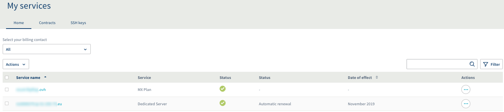
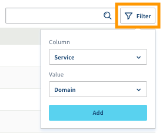
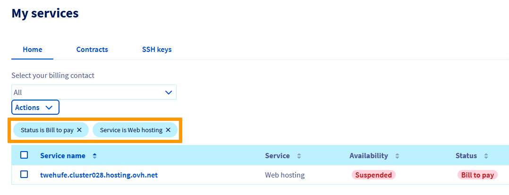
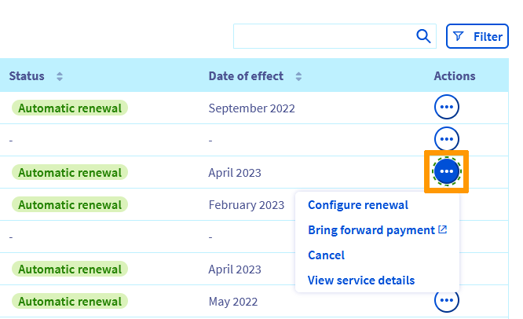
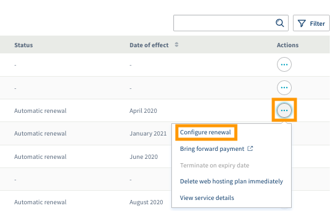
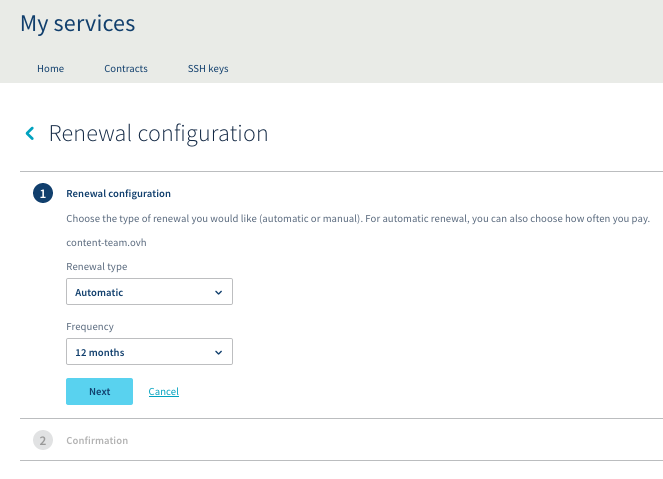
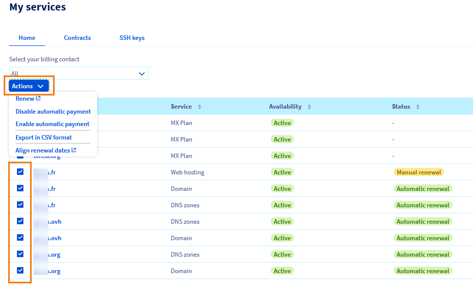

**Letzte Aktualisierung am 06.05.2020**

## Ziel

Sie können die Verlängerung und die Kündigung Ihrer Dienste in Ihrem OVHcloud Kundencenter verwalten.

**Diese Anleitung erklärt, wie Sie im OVHcloud Kundencenter die automatische Verlängerung Ihrer Dienste verwalten.**

> [!primary]
>
> In Abhängigkeit von ihrem Wohnsitz und der dort geltenden Rechtsordnung sowie den betreffenden Produkten können einige Details von den hier angeführten Informationen abweichen und/oder Teile dieser Anleitung nicht auf Ihre Situation zutreffen. Im Zweifel beachten Sie bitte die für Sie geltenden OVHcloud Verträge, die Sie jederzeit in Ihrem [Kundencenter](https://www.ovh.com/auth/?action=gotomanager) im Bereich „Meine Dienste“ unter `Verträge`{.action} einsehen können.
>

## Voraussetzungen

- Sie haben Zugriff auf Ihr [OVHcloud Kundencenter](https://www.ovh.com/auth/?action=gotomanager).
- Sie haben aktive OVHcloud Dienstleistungen.
- Sie sind der Rechnungskontakt Ihrer OVHcloud Dienstleistungen.

## In der praktischen Anwendung

Dienste, die auf die automatische Verlängerung eingestellt sind, werden jeweils zu ihrem Ablaufdatum verlängert; hierzu wird das im Kundencenter hinterlegte Standardzahlungsmittel belastet. Sie können Ihre Dienstleistungen aber jederzeit in Ihrem Kundencenter kündigen, damit sie nicht nach ihrem Ablaufdatum weiter verlängert werden.

Bestimmte Dienste (Domainnamen, Webhostings, VPS, Dedicated Server) können auf manuelle Verlängerung eingestellt werden, falls Sie keine automatische Zahlung wünschen.

Sie können entsprechend der gewünschten Aktion direkt zu den passenden Hilfen gelangen:

- [Verlängerungsstatus Ihrer Dienste anzeigen](./#verlangerungsstatus-ihrer-dienste-anzeigen): In diesem Abschnitt wird erläutert, wie Sie die Übersicht Ihrer Dienste aufrufen. Sie können überprüfen, welche Dienste automatisch verlängert werden und Details zu deren Status einsehen.

- [Die Verlängerung Ihrer Dienstleistungen verwalten](./#die-verlangerung-bei-ovhcloud): Dieser Abschnitt hilft Ihnen dabei, die automatische Verlängerung zu aktivieren oder zu deaktivieren, das Zahlungsintervall einer Dienstleistung zu ändern und Verlängerungszahlungen vor Ablauf zu leisten.

- [Ihre Zahlungsarten verwalten](../zahlungsarten-verwalten/): Folgen Sie dieser Anleitung, um sich zu vergewissern, dass Sie über ein valides Zahlungsmittel für die künftigen Dienstverlängerungen verfügen. Sie können in diesem Zusammenhang auch Zahlungsarten hinzufügen oder löschen.

### Übersicht "Meine Dienste" aufrufen

Wenn Sie in Ihrem [OVHcloud Kundencenter](https://www.ovh.com/auth/?action=gotomanager) angemeldet sind, klicken Sie oben rechts auf den zu Ihrer Kundenkennung gehörigen Namen und wählen Sie dann `Produkte und Dienstleistungen`{.action} aus.

{.thumbnail}

### Verlängerungsstatus Ihrer Dienste anzeigen

Die Seite „Meine Dienste“ enthält eine Tabelle zur Verwaltung Ihrer Dienstleistungen bei OVHcloud. Sie können deren Bezeichnungen, die Dienstleistungsart, die Verfügbarkeit der Dienste (aktiv oder abgelaufen), deren Status (Verlängerungsart, durchzuführende Aktion, etc.) sowie die Ablaufdaten einsehen.

{.thumbnail}

Sie können die Spalten auf- oder absteigend sortieren, das Suchfeld benutzen oder auch einen Filter anwenden, um nur bestimmte Dienstleistungen gezielt auszuwählen.

{.thumbnail}

Ihre Filterkriterien werden dann über der Tabelle angezeigt. Hier sehen Sie ein Beispiel eines Filters, der nur Domainnamen anzeigt, für die eine zu begleichende Rechnung aussteht.

{.thumbnail}

### Die Verlängerung bei OVHcloud

#### **Automatische Verlängerung**

Standardmäßig ist für Ihre Dienstleistungen die **automatische Verlängerung** aktiviert. Dieser Modus ermöglicht Ihnen, sicherzugehen, dass Ihre Dienstleistungen bei Ablauf nicht deaktiviert werden. Darüber hinaus werden, sofern Sie in Ihrem Kundenkonto eine gültige Zahlungsart eingetragen haben, Ihre Rechnungen automatisch mit dieser beglichen.

Wenn Sie keine Zahlungsart hinterlegt haben, wird Ihnen eine Rechnung per E-Mail gesendet. Sie können die Rechnung dann über das Online-Formular bezahlen. 

Für Dienstleistungen, die eine automatische Verlängerungsfrequenz von mehr als einem Monat haben (3 Monate, 6 Monate, 12 Monate), wird Ihnen im vorherigen Monat eine Erinnerung per E-Mail gesendet. Sie enthält alle demnächst zu verlängernden Dienste. 

Wenn Sie eine dieser Dienstleistungen nicht verlängern möchten, genügt es, diese in Ihrem Kundencenter zu kündigen.

#### **Manuelle Verlängerung**

Sie können auch für manche OVHcloud Dienste (Domainnamen, Webhostings, VPS, Dedicated Server) den Status **manuelle Verlängerung** aktivieren. Dieser Verlängerungsmodus ist nützlich, wenn Sie nicht sicher sind, ob die Dienstleistung nach Ablauf beibehalten werden soll oder wenn Sie nicht wünschen, dass Ihre Zahlungen automatisch vom Standardzahlungsmittel eingezogen werden. 

Wenn Sie diesen Modus wählen, erhalten Sie vor Ablauf mehrere Erinnerungen per E-Mail; jede enthält einen Link zur direkten Verlängerung des Dienstes. Sie können diese Zahlung aber auch einfach von Ihrem Kundencenter aus durchführen.

> [!warning]
>
>Wenn Sie keine Zahlung für eine Dienstleistung mit manueller Erneuerung durchführen, wird diese am Ablaufdatum automatisch deaktiviert und nach ein paar Tagen permanent gelöscht.
>
>Es ist in diesem Fall also nicht notwendig, die Dienstleistung explizit zu kündigen.
>

### Verlängerung verwalten

Auf der rechten Seite jeder Dienstleistung klicken Sie auf den Button `...`{.action} in der Spalte „Aktionen“, um die Verlängerungseinstellungen vorzunehmen. 

{.thumbnail}

> [!primary]
>
>Manche der unten beschriebenen Aktionen können nicht verfügbar sein, abhängig von der Art der Dienstleistung. 
>
 
#### **Die Verlängerung konfigurieren**

{.thumbnail}

Je nach ausgewählter Dienstleistung können Sie die manuelle Verlängerung aktivieren oder das Intervall der automatischen Verlängerung auswählen. Im der Beispielansicht können Sie die Verlängerungsart wählen und auch deren Zeitraum.

{.thumbnail}

Entsprechend der Auswahl werden die künftigen Daten für Zahlungen, die verwendete Zahlungsart und das Ablaufdatum angezeigt.

#### **Dienst verlängern**

Diese Aktion wird nur für Dienste vorgeschlagen, die auf manuelle Verlängerung eingestellt sind; hier werden Sie dann zum Online-Formular für Zahlungen weitergeleitet. Sie können diese Dienstleistungen jederzeit vor ihrem Ablauf bezahlen und auch die Dauer ihrer Verlängerung wählen.

#### **Vorauszahlen**

Diese Aktion wird nur für Dienste vorgeschlagen, die auf automatische Verlängerung eingestellt sind; hier werden Sie dann zum Online-Formular für Zahlungen weitergeleitet. Sie können diese Dienstleistungen jederzeit vor ihrem Ablauf bezahlen und auch die Dauer ihrer Verlängerung wählen. In diesem Fall wird die gewählte Laufzeit der bestehenden Dienstlaufzeit hinzugefügt. Ihnen entsteht also kein Nachteil.

#### **Am Ablaufdatum kündigen**

Diese Aktion wird nur für Dienste vorgeschlagen, die auf automatische Verlängerung eingestellt sind. Wenn Sie diese Aktion wählen, werden die automatische Verlängerung und die automatische Zahlung deaktiviert.

#### **Meine Rechnung begleichen**

Wenn Sie Dienstleistungen mit automatischer Verlängerung beziehen, jedoch keine Zahlungsart zur Begleichung Ihrer Rechnungen eingetragen haben, wird eine Meldung „Ausstehende Rechnung“ angezeigt, jeweils für den Dienst, der auf Zahlung wartet. Klicken Sie auf `Meine Rechnung begleichen`{.action}, um zum Online-Formular für Zahlungen weitergeleitet zu werden.

#### **Gruppierte Aktionen**

Sie können Aktionen für mehrere Dienste zugleich durchführen, indem Sie die gewünschten Dienste in der Tabelle auswählen und dann auf den Button `Aktionen`{.action} klicken.

{.thumbnail}

Die folgende Tabelle erläutert die hier verfügbaren Aktionen.

|  Mögliche Aktion  |  Beschreibung  |
|  :-----          |  :-----          |
|  Verlängern |  Mehrere Dienstleistungen gleichzeitig verlängern. Sie werden auf eine Seite weitergeleitet, die es ermöglicht, die Dauer der gewünschten Verlängerung auszuwählen und die Zahlung durchzuführen. |
|  Automatische Zahlung deaktivieren |  Die automatische Zahlung für mehrere Dienstleistungen gleichzeitig deaktivieren. Wenn eine oder mehrere Dienstleistungen mit der manuellen Verlängerung nicht kompatibel sind, wird dies während der Bestätigung angezeigt.  |
|  Automatische Zahlung aktivieren |  Die automatische Zahlung für mehrere Dienstleistungen gleichzeitig aktivieren. Nur die tatsächlich infrage kommenden Dienstleistungen werden aktualisiert. |
|  Als CSV Datei exportieren |  Erzeugen einer Datei im Format *.csv.* |
|  Die Ablaufdaten aneinander angleichen |  Erlaubt, das Ablaufdatum Ihrer Dienstleistungen auf einen Kalendertag zu vereinheitlichen. Nur die tatsächlich infrage kommenden Dienstleistungen werden aktualisiert. |

## Weiterführende Informationen

Für den Austausch mit unserer User Community gehen Sie auf <https://community.ovh.com/en/>.