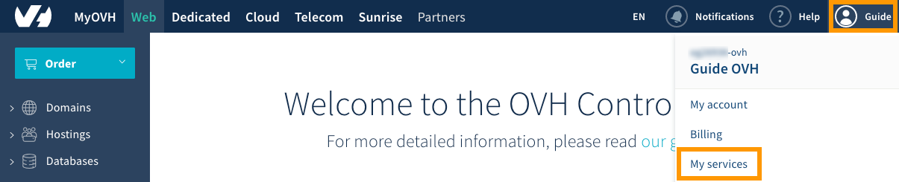
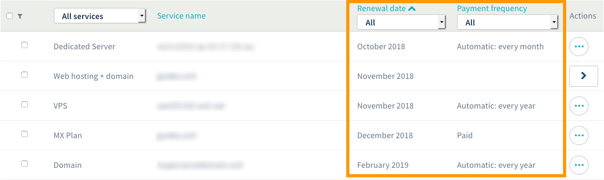
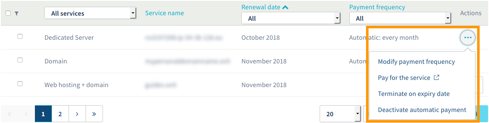
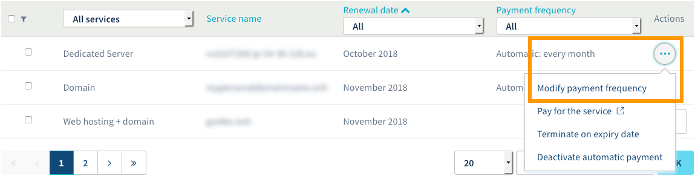
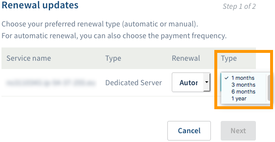
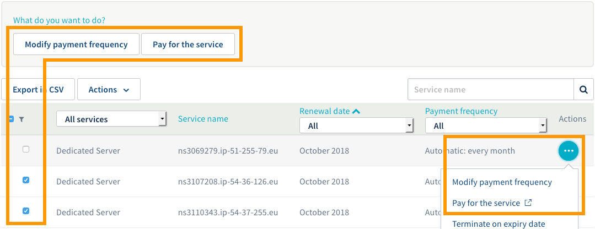
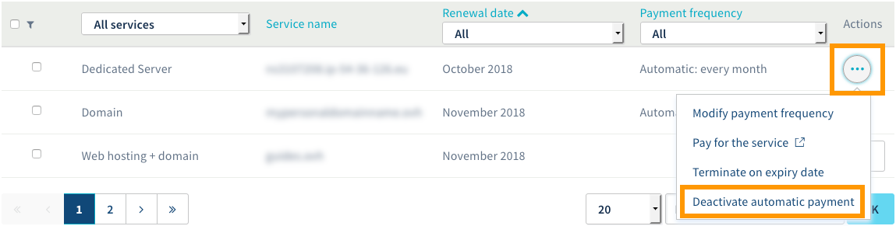
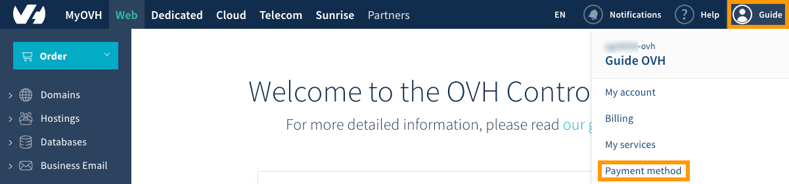

**Last updated 15th January 2019**

## Objective

If you have active OVH services, you can manage their renewal via the OVH Control Panel. 

**Find out how to manage automatic renewal for your OVH services via the OVH Control Panel.**

> [!primary]
>
> Depending on your place of residence and its local legislations, as well as the products concerned, some details may vary from the information provided in this guide, and some information may not apply to your situation. If you have any doubts, please refer to your OVH contracts, which you can access via the [OVH Control Panel](https://www.ovh.com/auth/?action=gotomanager){.external} by going to `My services`{.action} then `My contracts`{.action}.
>

## Requirements

- access to the [OVH Control Panel](https://www.ovh.com/auth/?action=gotomanager){.external}
- active OVH services

## Instructions

There are several ways you can manage renewal for your services, and in some instances you can pick from a variety of methods. We recommend reading these guides, and focusing on the operations you wish to carry out. 

- [View the renewal statuses for your services.](https://docs.ovh.com/gb/en/billing/how-to-use-automatic-renewal-at-ovh/#view-the-renewal-statuses-for-your-services){.external} Helps you check whether your services renew automatically, and gives you the renewal or expiry dates for your services.

- [Manage renewal for your services.](https://docs.ovh.com/gb/en/billing/how-to-use-automatic-renewal-at-ovh/#manage-renewal-for-your-services){.external} Helps you activate or deactivate automatic renewal, change a service’s payment frequency, and pay for renewals before the renewal date.

- [Manage your payment methods.](https://docs.ovh.com/gb/en/billing/how-to-use-automatic-renewal-at-ovh/#manage-your-payment-methods_1){.external} Helps you ensure that you have a saved payment method for future renewals. You can also add and delete payment methods, as required.

### View the renewal statuses for your services.

Log in to the [OVH Control Panel](https://www.ovh.com/auth/?action=gotomanager){.external}, click on the name linked to your NIC handle (Customer ID) in the menu bar in the top right-hand corner, then click `My services`{.action}.

{.thumbnail}

The page that appears will contain a table for managing your OVH solutions. In this table, you can view each service’s expiry date and its renewal frequency.

To do this, go to the ‘Renewal date’ and ‘Payment frequency’ columns in the table. Use the filter options to filter and sort the way your services are displayed.

{.thumbnail}

### Manage renewal for your services.

Log in to the [OVH Control Panel](https://www.ovh.com/auth/?action=gotomanager){.external}, click on the name linked to your NIC handle (Customer ID) in the menu bar in the top right-hand corner, then click `My services`{.action}.

{.thumbnail}

The page that appears will contain a table for managing your OVH solutions. If applicable for the service, you can:

|Possible actions|Description|
|---|---|
|Modify payment frequency|Modify the frequency with which you pay for a service. For some services, you may find that you cannot change the frequency, or that some frequencies may not be available.|
|Pay for the service|Pay for a service before its automatic renewal date.|
|Activate/deactivate automatic payment|Activate or deactivate automatic payment for a service.|

{.thumbnail}

#### Modify the payment frequency.

This action modifies the payment frequency for a service with automatic renewal. There are four frequencies: monthly, every three months, every six months, and every year. For some OVH services, you may find that you cannot change the frequency, or some frequencies may not be available.

Click on the three dots to the right of the service concerned, then `Modify payment frequency`{.action}.

{.thumbnail} 

In the window that opens, select a new payment frequency from the ‘Type’ dropdown menu, then click `Next`{.action} and `Confirm`{.action}. The new payment frequency will then be applied on your service’s next automatic renewal date.

{.thumbnail} 

#### Schedule service renewal.

Pay for a service before its automatic renewal date. For some OVH services, this option may not be available.

Click on the three dots to the right of the service concerned, then `Pay for the service`{.action}. If you would like to do this for multiple services, select them by ticking their respective boxes on the left-hand side of the table, then click `Pay for the service`{.action} underneath the table.

{.thumbnail} 

You will then be redirected to the renewal interface. If you are not redirected automatically, you can also use this link: <https://www.ovh.co.uk/cgi-bin/order/renew.cgi>. Follow the steps indicated until you complete the renewal process for your services. 

#### Activate or deactivate automatic renewal.

You can activate or deactivate automatic payment for a service. To do so, click on the three dots to the right of the service concerned, then `Activate automatic payment`{.action} or `Activate automatic payment`{.action}. 

Next, read the information that appears, and click `Confirm`{.action} to confirm your action.

Please note that disabling automatic renewal is not the same as cancelling your service. The service will remain active until its expiry date, giving you the choice of either cancelling it on its expiry date or renewing it before its expiry. However, if you would like to cancel a service  permanently on its expiry date, please refer to our guide to [Managing your services via the “Manage my services” interface](https://docs.ovh.com/gb/en/billing/manage-ovh-services/#cancel-a-service-on-its-expiry-date){.external} to find out more.

{.thumbnail} 

### Manage your payment methods.

Log in to the [OVH Control Panel](https://www.ovh.com/auth/?action=gotomanager){.external}, click on the name linked to your NIC handle (Customer ID) in the menu bar in the top right-hand corner, then click `Payment method`{.action}.

{.thumbnail}

The page that appears will contain a table listing your payment methods for OVH solutions. In this table, you can manage the payment methods you have already added, and add new ones.

For each payment method, you will also see:

- its type (depending on which one you have decided to add)
- a description, to help you distinguish it from other payment methods
- whether it is currently saved as a default payment method
- its status (may vary depending on the type of payment method and its activation status)

{.thumbnail}

To add a new payment method, click `Add a payment method`{.action}, then select the type of payment you want to add. Follow the steps indicated and confirm your payment method.

{.thumbnail}

To delete a payment method via the customer panel, you have to have at least one other valid mean of payment.

If you want to delete all your payment methods, please use the API and follow these steps :
- First GET the ID of the payment list: https://api.ovh.com/console/#/me/payment/method#GET
- Then DELETE the payment method using the ID you got from the previous step:
  https://api.ovh.com/console/#/me/payment/method/%7BpaymentMethodId%7D#DELETE

## Go further

Join our community of users on <https://community.ovh.com/en/>.
