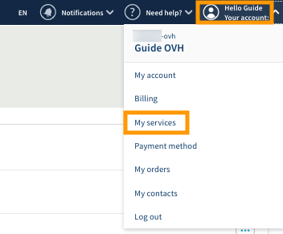

**Dernière mise à jour le 21/11/2019**

## Objectif

Vous avez la possibilité d'administrer le renouvellement et la résiliation de vos services dans l'espace client.

**Découvrez comment gérer le renouvellement automatique de vos services via l'espace client OVHcloud.**

> [!primary]
>
> Selon votre lieu de résidence, la législation locale, ainsi que les solutions concernées, certains détails de ce guide peuvent varier ou ne pas s'appliquer à votre situation. Si vous avez des doutes, veuillez consulter vos contrats OVHcloud. Ceux-ci sont disponibles depuis votre [espace client](https://www.ovh.com/auth/?action=gotomanager){.external}, en accédant à `Mes services`{.action} puis à `Mes contrats`{.action}.
>

## Prérequis

- Avoir accès à votre [espace client OVHcloud](https://www.ovh.com/auth/?action=gotomanager){.external}.
- Posséder des services OVH actifs.
- Être contact facturation de vos services OVHcloud

## En pratique

À l'achat, vos services sont paramétrés pour être automatiquement renouvelés à échéance, par prélèvement sur votre moyen de paiement enregistré dans votre espace client. Vous pouvez résilier ces services dès que vous le souhaitez dans votre espace client, afin qu'il ne soient pas reconduits une fois leur période de validité terminée.

Mais il est également possible de paramétrer certains produits (Domaines, Hébergements, VPS, Serveurs dédiés) en renouvellement « manuel», si vous ne souhaitez pas de renouvellements et de prélèvements automatiques.

Nous vous recommandons de lire les guides suivants, ainsi que de vous concentrer sur les opérations que vous souhaitez effectuer. 

- [ Afficher les statuts de renouvellement de vos services. ](https://docs.ovh.com/fr/billing/renouvellement-automatique-ovh/#afficher-les-statuts-de-renouvellement-de-vos-services){.external} Ce guide vous aide à vérifier si vos services sont renouvelés automatiquement. Il vous permet également d'obtenir leur date de renouvellement ou d'expiration.

- [Gérer le renouvellement de vos services.](https://docs.ovh.com/fr/billing/renouvellement-automatique-ovh/#le-renouvellement-chez-ovhcloud){.external} Ce guide vous aide à activer ou désactiver le renouvellement automatique, à modifier la fréquence de paiement d'un service, ainsi qu'à payer les renouvellements avant leur échéance.

- [Gérer vos moyens de paiement.](https://docs.ovh.com/fr/billing/manage-payment-methods){.external} Ce guide vous permet de vous assurer que vous disposez d'un moyen de paiement enregistré pour les futurs renouvellements. Vous pouvez également ajouter et supprimer des moyens de paiement, si nécessaire.

### Accéder au paramétrage de vos services

Connectez-vous à votre [espace client](https://www.ovh.com/auth/?action=gotomanager){.external}. Cliquez sur le nom associé à votre identifiant client dans la barre de menus située dans le coin supérieur droit, puis choisissez `Mes services`{.action}.

{.thumbnail}

### Afficher les statuts de renouvellement de vos services

La page « Mes services » contient un tableau de gestion de vos services OVHcloud. Vous pouvez y retrouver leurs noms, le type de service, la disponibilité du service (s'il est, par exemple, suspendu), son statut (type de renouvellement, action à réaliser, etc...), et la date d'effet de l'action à réaliser.

{.thumbnail}

Vous avez la possibilité de trier les colonnes par ordre croissant ou décroissant, d'utiliser le champ de recherche, ou également d'appliquer un filtre pour n'afficher que certains de vos services selon les critères de votre choix.

{.thumbnail}

Vos critères de filtrage seront alors affichés au dessus du tableau. Voici un exemple de filtre permettant d'afficher les noms de domaines pour lesquels une facture est en attente de réglement.

{.thumbnail}

### Le renouvellement chez OVHcloud

#### **Le renouvellement automatique**

Par défaut, à la souscription, vos services sont paramétrés en **renouvellement automatique**. Ce mode vous permet de vous assurer que vos services soient systématiquement reconduits à échéance. De plus, si vous avez enregistré un moyen de paiement sur votre compte client, vos factures seront automatiquement prélevées sur celui-ci.

Si vous n'avez enregistré aucun moyen de paiement, une facture vous sera adressée par e-mail. Il vous suffira alors de la régler en ligne.

Pour les services ayant une fréquence de renouvellement automatique supérieure à 1 mois (3 mois, 6 mois, 12 mois), un rappel vous est également envoyé par e-mail le mois précédent, récapitulant les services allant être renouvelés prochainement.

Si vous ne souhaitez pas prolonger l'un de ces services, il vous suffit alors de le résilier dans votre espace client.

#### **Le renouvellement manuel**

Vous avez également la possibilité, pour certains produits OVH (domaines, hébergements, VPS, serveurs dédiés), de les passer en **renouvellement manuel**. Ce mode de renouvellement est utile si vous n'êtes pas certain de vouloir conserver le service à échéance, ou si vous ne souhaitez pas que vos factures soient prélevées automatiquement sur votre moyen de paiement. 

Si vous choisissez ce mode, vous recevrez plusieurs relances par e-mail avant échéance, chacune contenant un lien permettant de renouveler en ligne les services arrivant à expiration. Vous pourrez aussi simplement effectuer le règlement depuis votre espace client.

> [!warning]
>
>Si vous n'effectuez pas de paiement pour un service en renouvellement manuel, celui-ci sera suspendu à sa date d'expiration puis supprimé au bout de quelques jours.
>
>En revanche, si vous ne souhaitez pas conserver ce service, il n'est pas nécessaire d'en demander la résiliation.
>

### Gérer le renouvellement de vos services

À la droite de chaque service, cliquez sur le bouton `...`{.action} dans la colonne « Actions » pour paramétrer le renouvellement de vos services.

{.thumbnail}

> [!primary]
>
>Selon le service, s'il est éligible ou non au renouvellement manuel, certaines actions ne sont pas disponibles.
>
 
#### **Configurer le renouvellement**

{.thumbnail}

Selon le service choisi, vous pouvez le paramétrer en renouvellement manuel, ou choisir la fréquence de renouvellement automatique. Le cas échéant, vous pourrez donc choisir le type de renouvellement, ainsi que la fréquence de celui-ci.

{.thumbnail}

En fonction du choix effectué, vous seront précisés les futures dates de prélèvement, le moyen de paiement qui sera utilisé, ainsi que la date d'expiration du service.

#### **Renouveler le service**

Cette action est uniquement proposée pour les services paramétrés en renouvellement manuel, et vous redirige vers une interface de paiement en ligne. Vous pouvez renouveler ces services à tout moment avant leur expiration, ainsi que choisir la durée de leur renouvellement.

#### **Anticiper le paiement**

Cette action est proposée pour les services paramétrés en renouvellement automatique, et vous redirige vers une interface de paiement en ligne. Vous pouvez renouveler ces services à tout moment avant leur expiration, ainsi que choisir la durée de leur renouvellement. Dans ce cas, la durée de validité souscrite sera rajoutée au temps de validité en cours. Vous ne perdrez pas le temps de validité restant.

#### **Résilier à expiration**

Cette action est proposée pour les services paramétrés en renouvellement automatique. En choisissant cette action, le renouvellement et le prélèvement automatiques sont désactivés pour le service que vous avez sélectionné.

#### **Régler ma facture**

Si vous possédez des services en renouvellement automatique, mais n'avez pas enregistré de moyen de paiement permettant d'effectuer un prélèvement pour le règlement de vos facture, une mention « Facture à payer » s'affiche lorsqu'une facture est en attente de règlement. Il vous suffit alors de choisir l'action `Régler ma facture`{.action}, qui vous redirigera vers une plateforme de paiement en ligne.

#### **Actions groupées**

Vous avez la possibilité d'effectuer des actions groupées, en sélectionnant plusieurs services dans le tableau, puis en cliquant sur le bouton `Actions`{.action}.

{.thumbnail}

Le tableau ci-dessous détaille les actions groupées possibles.

|  Actions possibles  |  Description  |
|  :-----          |  :-----          |
|  Renouveler |  Renouvelez plusieurs services en une seule fois. Vous serez redirigé vers une page permettant de choisir la durée de renouvellement souhaitée, et pourrez réaliser un paiement en ligne. |
|  Désactiver le paiement automatique |  Désactivez le renouvellement automatique sur plusieurs services en une seule fois. Si l'un ou plusieurs de vos services ne sont pas compatibles avec le renouvellement manuel, cela vous sera indiqué lors de la validation. |
|  Activer le paiement automatique |  Réactivez le renouvellement automatique sur plusieurs services en une seule fois. Seuls les services éligibles seront mis à jour. |
|  Exporter en CSV |  Exportez dans un fichier csv l'ensemble de vos services et leurs dates d'expiration. |
|  Aligner les dates de renouvellement |  Permet d'aligner la date d'expiration de vos services à un jour calendaire. Seuls les services éligibles pourront être mis à jour. |

## Aller plus loin

Échangez avec notre communauté d'utilisateurs sur <https://community.ovh.com/>.
