## In het algemeen
Kies een betalingsmethode via het [Control Panel](https://www.ovh.com/manager/web/). In de tab "Betalen", klikt u op "Mijn instellingen", klik vervolgens op de icon "Mijn bankgegevens" om een ​​betaalmethode toe te voegen. 

Let op, indien er geen betaalmethode is geactiveerd en u selecteert een van onze automatische verlengingsdiensten, dan zal uw rekening worden gedebiteerd en u zult dit onmiddellijk in orde moeten maken, om een onderbreking in de dienst te voorkomen.

Het activeren van de automatische incasso kan via de tab "Keuze van diensten".

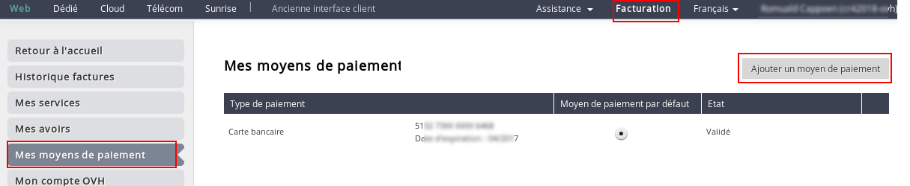{.thumbnail}

## Een creditcard registreren
Hiervoor kiest u 'creditcard' en vervolgens klikt u op 'Toevoegen'. 

- Let op, u moet pop-ups toestaan zodat de bestelbon kan worden weergegeven.

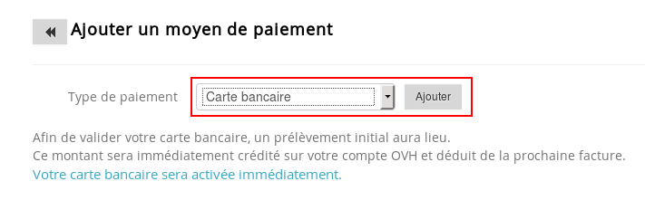{.thumbnail}
Om uw creditcard te valideren zullen er initiële kosten van € 3,- excl. btw in rekening worden gebracht.
Dit bedrag zal direct worden gecrediteerd van uw OVH account en verminderd worden van de volgende factuur.
De creditcard zal direct geactiveerd worden.

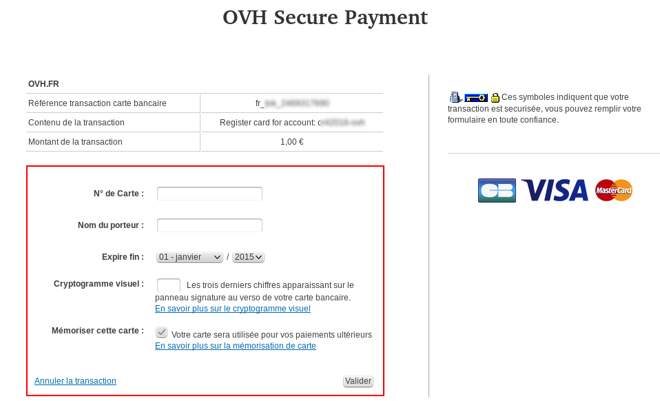{.thumbnail}

## Registratie van een bankrekeningnummer
Allereerst, vul de gevraagde informatie in. Klik op "Toevoegen"[/ blue] om de bewerking voort te zetten.

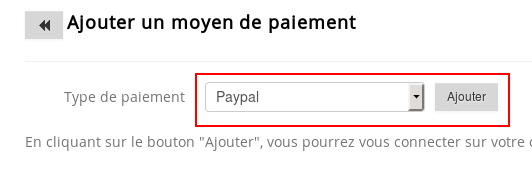{.thumbnail}
Wanneer u klikt op 'Toevoegen' dan zal er een document worden gedownload. 

- Let op, u zult pop-ups moeten toestaan zodat de bestelling weergegeven kan worden.

Volg aub de stappen van de procedure in het document om de betaalmethode te valideren. Uw bankrekening zal worden goedgekeurd binnen 24-48 uur na ontvangst van uw incassomachtiging.

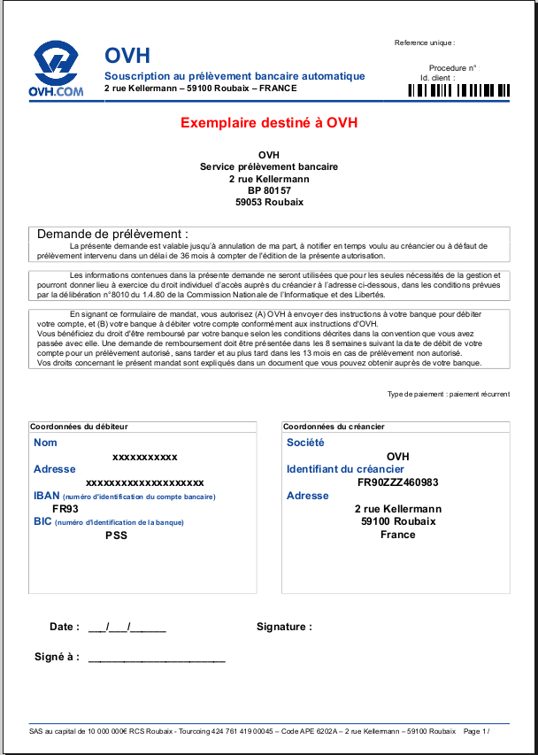{.thumbnail}

## Registratie van een PayPal account
U kunt een PayPal account toevoegen, door op "Toevoegen" te klikken. Er zal een nieuw scherm openen.

{.thumbnail}
Voer uw betalingsgegevens op deze nieuwe pagina in.

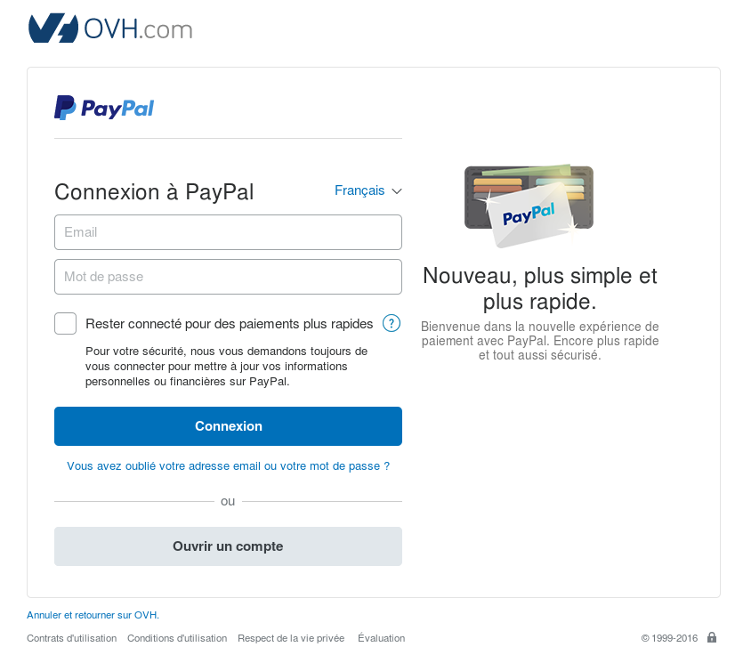{.thumbnail}

## Type verlenging toegepast op uw dienst.
Ga eerst naar 'Mijn diensten' om de diensten die automatisch vernieuwd moeten worden te selecteren.

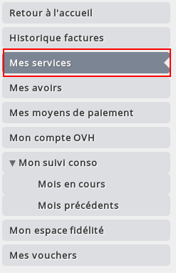{.thumbnail}
U zult de volgende elementen in de tabel vinden: 

- Automatische verlengdatum: Hier selecteert u de datum waarop u wilt dat OVH de betaling uitvoert middels uw betaalmethode. 

- Login: Deze kolom betreft de naam van de dienst. 

- Verlenging: Met deze kolom kunt u het huidige type verlenging van uw dienst bevestigen. 

- 1. Alle diensten: U kunt de tabel filteren zodat er alleen weergave is van de diensten die vervallen 'binnen een week', 'binnen een maand' of die al 'vervallen' zijn. 

- 2. Verlenging: Hier kunt u de tabel filteren zodat u enkel de diensten ziet die in 'jaarlijkse automatische verlenging', 'maandelijkse automatische verlenging' of 'handmatige verlening' modus staan.

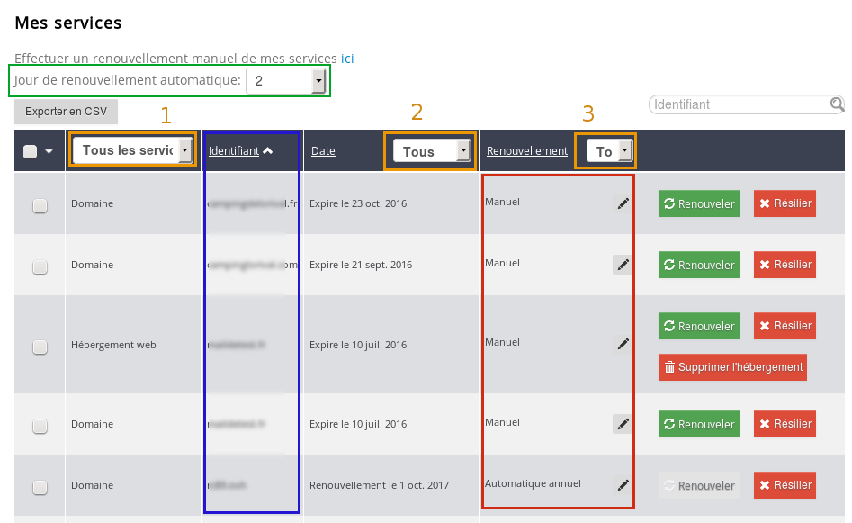{.thumbnail}
Door op 'Annuleren' te klikken wordt automatische verlenging uitgeschakeld en zal uw dienst verwijderd worden op de vervaldatum.

## Keuze van automatische verlenging
U kunt het type verlenging wijzigen door de klikken op het 'pen'-icoon in de 'verlenging'-kolom rechts van de dienst. 

- Verlenging: Hier kunt u 'Automatisch' selecteren om te bevestigen dat u automatische verlenging wilt inschakelen. 

- Frequentie: U kunt kiezen hoe vaak u betaalt, afhankelijk van het type dienst dat u gekozen heeft. 

Als u 'twee maanden' als frequentie kiest dan zal er elke twee maanden een bedrag dat gelijk is aan twee maanden dienstgebruik worden afgeschreven.

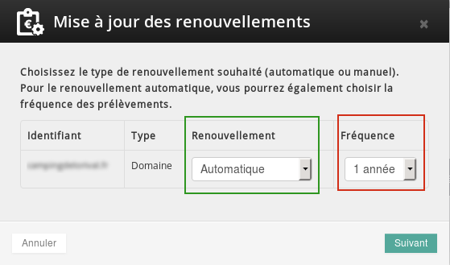{.thumbnail}

## Automatische verlenging op verschillende diensten inschakelen
U kunt het type verlenging voor verschillende diensten veranderen door het vakje naast de betreffende diensten in de linkerkolom aan te vinken en vervolgens te klikken op 'Wijzig de verlengingen'.

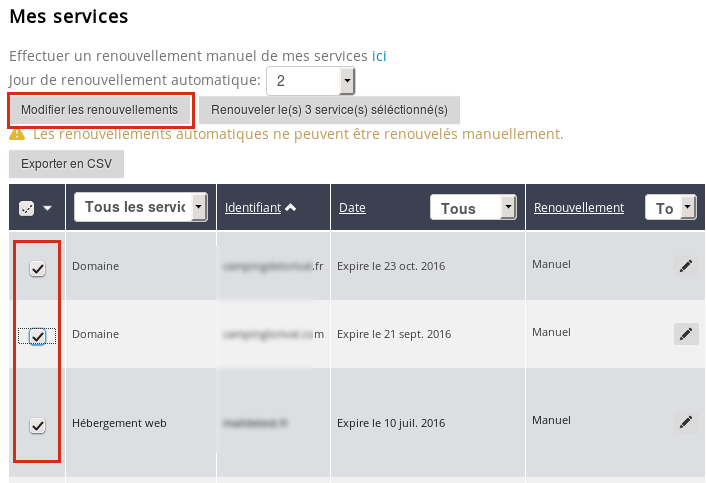{.thumbnail}

## Het functioneren
Op 2 februari 2014 heb ik de automatische verlenging ingesteld op de 12e, voor een periode van 1 jaar voor elke dienst.

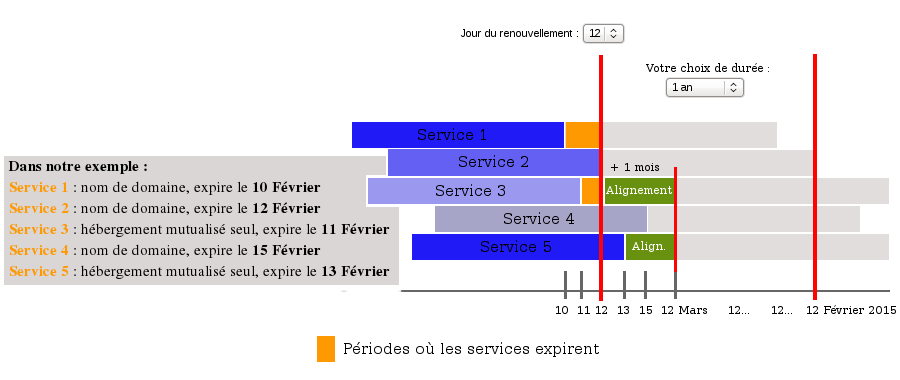{.thumbnail}
Let op: de verlenging zal niet uitgevoerd worden op 2 februari 2014, maar op de door u gekozen datum, de 12e!

De eerste verlenging bij het activeren van een automatische verlengingsdienst zal na een maand plaatsvinden. Misschien moet u later de duur van uw verlengingen veranderen, dit is waarom de eerste verlenging maandelijks geschiedt.
U kunt alleen OVH diensten verlengen (zoals hosting, Private SQL, opties, etc ).

/!\ De domeinnamen moeten voor minstens 1 jaar worden verlengd. Vandaar het belang van het zorgvuldig uitkiezen van de algemene verlengingsdatum.

Wat u dient te weten:
Ongeacht de verlengingsperiode die u koos, controleert onze robot elke maand welke diensten zullen vervallen tussen deze datum (inclusief) en dezelfde datum een maand later, om de gevonden diensten te verlengen voor de periode die u heeft ingesteld.

Indien een bestelbon wordt gepubliceerd op bijvoorbeeld 12 februari 2014, ziet het er als volgt uit:

- Dienst 3: voor 1 maand + 1 dag (van 11 Februari tot 12 maart 2014)
- Dienst 5: voor 27 dagen (van 13 februari tot 12 Maart 2014);

daarbij worden hun respectievelijke vervaldata gezet op 12 Maart 2014.

Op 12 maart 2014, worden de Diensten 3 & 5 verlengd voor 1 jaar (gekozen periode).

Let op, de Dienst 3 die vervalt op 11 februari 2014, zal worden gedeactiveerd tot 12 februari 2014!

De Dienst 2 vervalt op 12 februari 2014, deze zal automatisch worden verlengd voor 1 jaar (gekozen periode).

Inzake de Dienst 4 die vervalt op 15 februari 2014, zullen wij ontdekken dat het vervalt tussen 12 februari 2014 en 12 maart 2014. Het zal worden verlengd voor 1 jaar en dit jaar zal worden gecrediteerd op de beëindigingsdatum van de dienst.

Dus op 12 februari 2014 zal mijn Dienst 4 worden verlengd voor 1 jaar extra en haar nieuwe verlengingsdatum zal 15 februari 2015 zijn.

De Dienst 1 zal ondertussen niet beschikbaar zijn van 10 tot 12 februari 2014 maar zal worden verlengd door de robot voor 1 jaar (gekozen periode) op 12 februari 2014.

Samenvattend, de bestelbon van 12 februari 2014 bevat:
Verlenging:

- Dienst 3: voor 1 maand + 1 dag (van 11 februari tot en met 12 maart 2014)
- Dienst 5: voor 27 dagen (van 13 februari tot 12 maart 2014)

Verlengingen:

- Dienst 1: voor 1 jaar (van 10 februari 2014 tot  10 februari 2015)
- Dienst 2: voor 1 jaar (van 12 februari 2014 tot  12 februari 2015)
- Dienst 4: voor 1 jaar (van 15 februari 2014 tot 15 februari 2015)

De bestelbon van 12 Maart 2014 bevat:

Verlengingen:

- Dienst 3: voor 1 jaar (van 12 maart 2014 tot 12 maart 2015)
- Dienst 5: voor 1 jaar (van 12 maart 2014 tot 12 maart 2015)

Opmerking: Een automatische verlenging aangevraagd op 29, 30 of 31 wordt automatisch gedateerd op de 1e van de volgende maand, afhankelijk van het aantal dagen van de maand (bijvoorbeeld februari).

## De levenscyclus van een domeinnaam
Diagram (informatie is in het Frans)

{.thumbnail}

