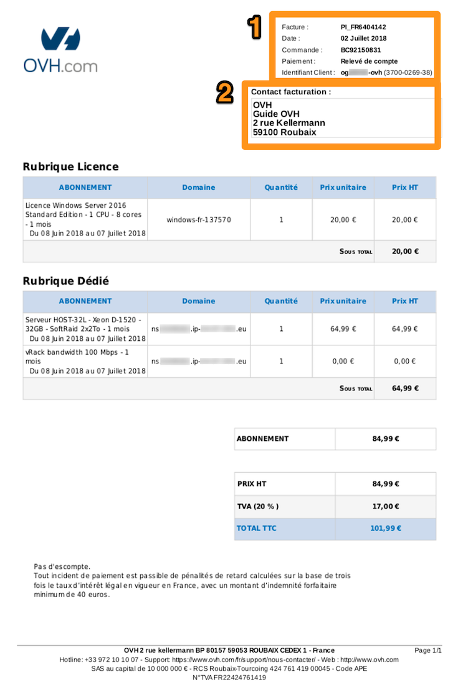
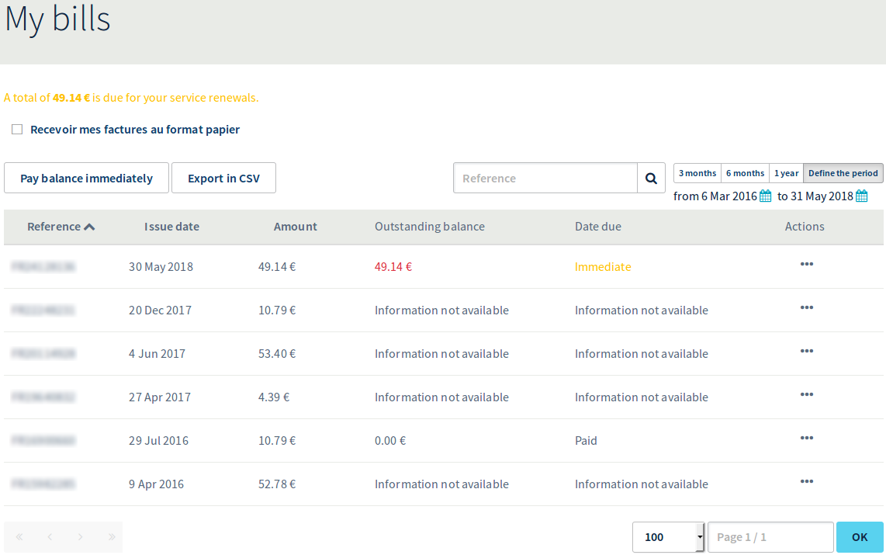
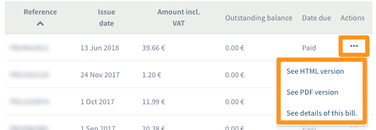
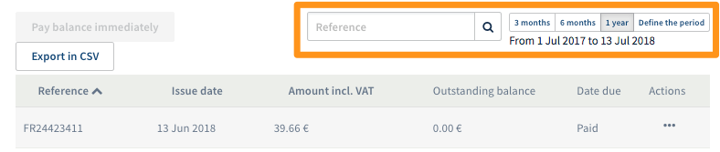
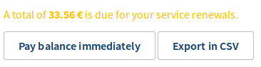

**Last updated 2nd November 2018**

## Objective

OVH provides you with a space where you can view, manage and pay your various bills, without experiencing any service interruptions.

**This guide will show you how to carry out the actions offered in this menu.**

> [!primary]
>
> Depending on your place of residence and its local legislation, as well as the products concerned, some details may vary from the information provided in this guide, and some information may not apply to your situation. If you have any doubts, please refer to your OVH contracts, which you can access from the [OVH Control Panel](https://www.ovh.com/auth/?action=gotomanager){.external} by going to `My services`{.action} then `My contracts`{.action}.
>

## Requirements

- access to the [OVH Control Panel](https://www.ovh.com/auth/?action=gotomanager){.external}
- access as a billing contact for your service (you can read more about the different contact types in our guide to [Managing contacts for your services](https://docs.ovh.com/gb/en/customer/managing-contacts/){.external})

## Instructions

### Understanding your bill.

You are sent a bill when you pay for your order, and when your service is automatically renewed. It provides a summary of the products you have paid for (or that are awaiting payment), their renewal periods, and the total charged for the services. A bill reference always starts with two letters.

{.thumbnail}

|Number|Description|
|---|---|
|1|Information regarding the bill, including its reference ID, its issue date, the purchase order it is linked to, the payment method and the NIC handle (customer ID).|
|2|An information summary of the billing contact.|

Below, you will see details of the services you have been billed for:

- Subscription. A description of the service, and the period billed for.
- Domain. The reference of the billed service.
- Quantity. The number of units of the service billed for. 
- Unit price and Price ex. VAT. The price of the services.

VAT is added at the bottom of the bill in the overall total, marked as “Total incl. VAT”.

> [!primary]
>
> If “Account statement” appears as the payment method used, this means that the service has been renewed automatically. The payment method used will be the default payment method saved in the [OVH Control Panel](https://www.ovh.com/auth/?action=gotomanager){.external}.
>

### Explore the billing section.

#### View and manage bills.

To view your bills, go to the [OVH Control Panel](https://www.ovh.com/auth/?action=gotomanager){.external}, and open the `Billing`{.action} section by clicking on your first name in the top right-hand corner. You will then land on a page summarising your bills: 

{.thumbnail}

On this page, you will see the following information:

- the bill reference
- the bill issue date
- the bill total
- the amount to pay
- the date on which the payment is due 
- `...`{.action} (i.e. other actions)

> [!primary]
>
> If the total amount appears in red, then this means that the bill is pending payment. The date on which the bill is due will show whether the payment needs to be made immediately.
>

If ‘Information not available’ appears, this means that the bill is not linked to an automatic renewal. You can view this information by clicking `...`{.action}. Three options will appear:

{.thumbnail}

- `See HTML version`{.action}. The bill will open in a new tab in your web browser.
- `See PDF version`{.action}. A PDF file will be generated, which you can then download.
- `See details of this bill`{.action}. You can view a log of the operations performed on this bill.

To make this document easier to read, there are several filters:

{.thumbnail}

To search for a specific bill, you can enter a reference ID, or check bills from a set time period: three months, six months, or a period that you can set manually.

With the `Export as CSV`{.action} button, you can download an Excel file in .csv format, in which your selected bills will be listed. This file will show the amount, the reference ID and the issue date of these bills.

#### Pay a bill.

To pay bills that are pending payment, click `Pay balance immediately`{.action}.

{.thumbnail}

A [purchase order](https://docs.ovh.com/gb/en/billing/managing-ovh-orders/#purchase-order){.external} for the settlement will then be created. Once the payment has been made, your account will no longer be in debit.

### Track payments.

You can track all of the payments you have made in the `Billing` section, in `Payment Tracking`{.action}. This way, you can see which payments and bills are linked to one another. The reference ID for a payment receipt always begins with the letters ‘PA_’.

{.thumbnail}

In this section, you can also export your payment receipts in .csv format. As is the case for managing bills, you can filter the periods that will be shown.

> [!primary]
>
> If you notice a discrepancy between a payment and the total amount listed on a bill, this means that something automatically reduced the amount debited.
>

## Go further

Join our community of users on <https://community.ovh.com/en/>.