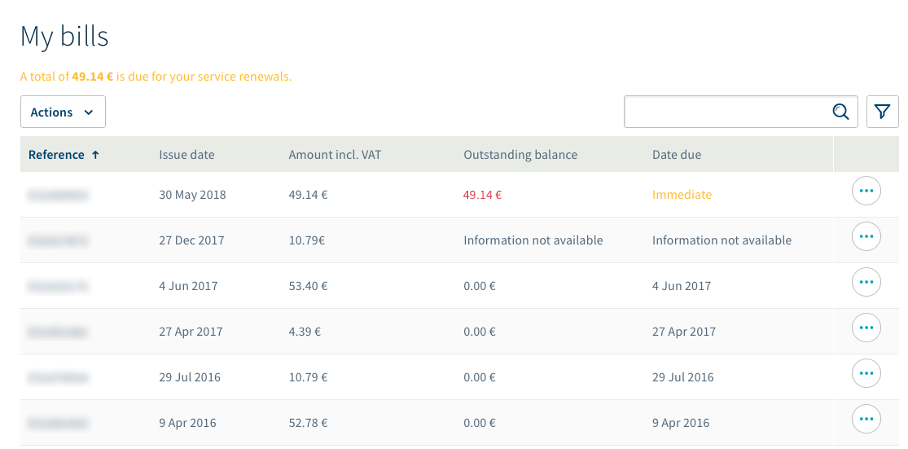
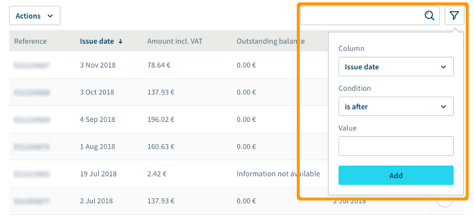
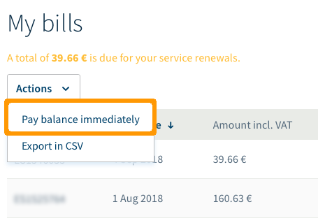

**Última actualización: 15/04/2020**

## Objetivo

Desde el área de cliente puede consultar, administrar y abonar sus facturas en cualquier momento.

**Esta guía explica cómo realizar todas estas acciones relativas a la facturación.**

> [!primary]
>
> Tenga en cuenta que, en función de su lugar de residencia y de la legislación vigente, así como del producto o servicio en cuestión, es posible que algunos apartados de esta guía sean diferentes para usted o no se apliquen a su caso particular. En caso de duda, consulte los contratos de OVHcloud aplicables, que encontrará en el [área de cliente](https://www.ovh.com/auth/?action=gotomanager){.external}. Para ello, haga clic en su nombre en la esquina superior derecha y seleccione `Productos y servicios`{.action}. En la página de administración de sus servicios, haga clic en `Contratos`{.action}.
>

## Requisitos

- Estar conectado al [área de cliente de OVHcloud](https://www.ovh.com/auth/?action=gotomanager){.external} como contacto de facturación del servicio (para más información sobre los distintos tipos de contactos, consulte la guía [Gestionar los contactos de los servicios](https://docs.ovh.com/es/customer/gestion-de-los-contactos/){.external}).

## Procedimiento

### Partes de una factura de OVHcloud

La factura es el documento que se genera al abonar un pedido o cuando se realiza una renovación automática un servicio. Dicho documento recoge los productos pagados o pendientes de pago, junto con el período de renovación y el importe correspondientes. La referencia de las facturas de OVHcloud emitidas por la filial española de OVH siempre empieza por «ES».

{.thumbnail}

|Número|Descripción|
|---|---|
|1|Información relativa a la propia factura: referencia, fecha de emisión, orden de pedido correspondiente y forma de pago.|
|2|Resumen de los datos del contacto de facturación.|

A continuación se desglosan los servicios facturados:

- **Suscripción**: Descripción del servicio y período facturado (para los servicios bajo suscripción periódica).
- **Consumo**: Descripción del servicio (para los servicios con pago por consumo).
- **Dominio**: Referencia del servicio facturado.
- **Cantidad**: Número de unidades del servicio facturado. 
- **Precio unitario** y **Precio IVA no incl.**: Precio del servicio facturado.

El precio total del servicio con el IVA incluido se indica al final de la tabla, en el **TOTAL IVA incl**.

> [!primary]
>
> Si, en la esquina superior derecha, aparece «Número de cuenta» como forma de pago, significa que se trata de una renovación automática. En ese caso, se utilizará la forma de pago que haya configurado en el [área de cliente de OVHcloud](https://www.ovh.com/auth/?action=gotomanager){.external}.
>

### Sección de facturación

#### Consultar y gestionar las facturas de OVHcloud

Para consultar sus facturas, conéctese al [área de cliente de OVHcloud](https://www.ovh.com/auth/?action=gotomanager){.external}, haga clic en su nombre en la esquina superior derecha y seleccione `Facturas`{.action}. 

{.thumbnail}

Se abrirá una página en la que podrá ver todas sus facturas.

{.thumbnail}

Para cada factura, se muestran los siguientes datos:

- referencia de la factura (p. ej.: ES1234567)
- fecha de emisión de la factura
- importe IVA incl.
- saldo a pagar
- fecha de vencimiento
- botón `···`{.action} para realizar distintas acciones

> [!primary]
>
> Si el saldo a pagar aparece en rojo, significa que la factura está pendiente de pago. La fecha de vencimiento de la factura le permitirá saber si debe realizar algún pago de forma inmediata.
>

Cuando la factura no corresponde a una renovación automática, el saldo a pagar y la fecha de vencimiento no figuran en la tabla, y en su lugar aparece la indicación **Información no disponible**. No obstante, puede ver esos datos haciendo clic en el botón `···`{.action}, que permite realizar las siguientes acciones:

{.thumbnail}

- **Ver la versión HTML**: La factura se abrirá en una nueva pestaña de su navegador.
- **Ver la versión PDF**: Se generará un archivo en formato PDF que podrá descargar en su ordenador.
- **Ver los detalles**: Puede consultar el historial de operaciones realizadas en la factura (en las facturas no relativas a renovaciones automáticas).

Para localizar fácilmente una o más facturas, puede utilizar los filtros situados sobre la tabla.

{.thumbnail}

Puede buscar una factura concreta introduciendo su referencia o filtrar las facturas cuya fecha de emisión sea igual, anterior o posterior a una fecha determinada.

Para descargar un archivo Excel en formato CSV con las facturas seleccionadas, haga clic en el botón `Acciones`{.action}, situado sobre la tabla en el lado izquierdo, y seleccione `Exportar en CSV`{.action}.

{.thumbnail}

#### Abonar el importe pendiente

Existen dos formas de abonar las facturas pendientes de pago: desde el botón `Acciones`{.action} o desde las acciones relativas a una factura concreta.

En el primer caso, haga clic en el botón `Acciones`{.action}, situado sobre la tabla en el lado izquierdo, y seleccione `Abonar el importe pendiente ahora`{.action}.

{.thumbnail}

Alternativamente, haga clic en el botón `···`{.action} situado al final de la línea correspondiente a la factura y seleccione `Abonar el importe pendiente ahora`{.action}.

En cualquiera de los casos, confirme haciendo clic en el botón `Abonar el importe pendiente`{.action}. Se generará una [orden de pedido](https://docs.ovh.com/es/billing/administrar-los-pedidos-de-ovh/#la-orden-de-pedido){.external}. Abone el importe pendiente para estar al corriente de pago.

### Consultar los pagos

Puede realizar un seguimiento de los pagos en la sección de facturación del [área de cliente de OVHcloud](https://www.ovh.com/auth/?action=gotomanager){.external}, en la pestaña `Seguimiento de los pagos`{.action}. La página muestra los pagos de facturas realizados con la forma de pago configurada en el área de cliente. La referencia de los justificantes de pago siempre empieza por «PA_ES».

{.thumbnail}

Al igual que las facturas, puede exportar los justificantes de pago en formato CSV, así como filtrar el contenido de la tabla, en este caso por fecha de pago, importe total o forma de pago.

> [!primary]
>
> Las diferencias que puede haber entre un pago y el importe de la factura correspondiente se deben a que el saldo previo de su cuenta se ha deducido previamente del importe total, por lo que la cantidad final abonada es menor.
>

## Más información

Interactúe con nuestra comunidad de usuarios en [https://community.ovh.com/en/](https://community.ovh.com/en/){.external}.