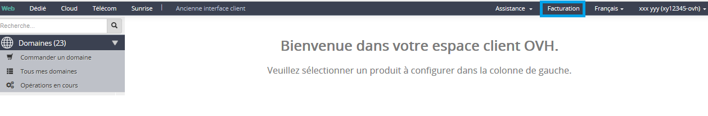
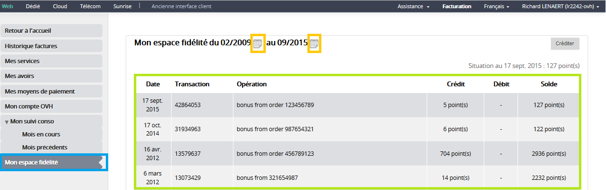
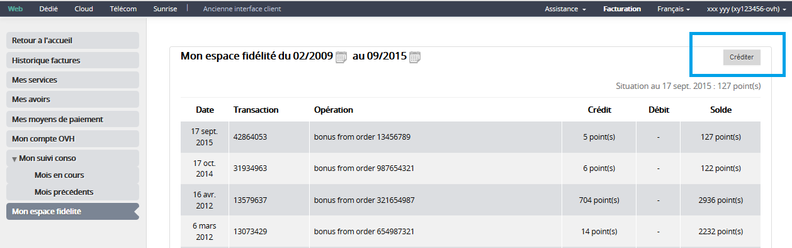
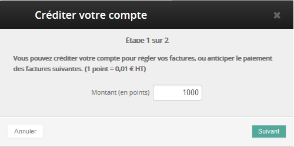
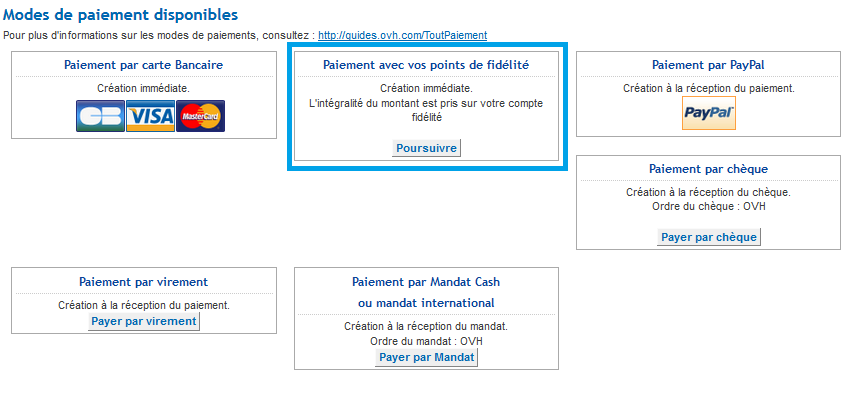
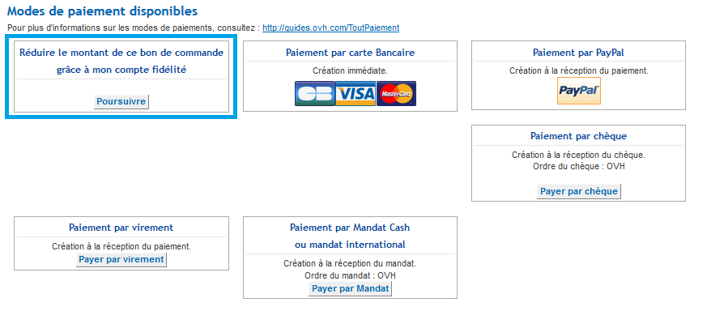

## Visualizar la cuenta
Acceda al área de cliente desde [aquí](https://www.ovh.com/manager/web/login/). En la parte superior derecha, seleccione «Facturación».

{.thumbnail}
Acceda al «Área de fidelidad», desde donde podrá ver el historial de todas sus operaciones y el número de puntos acumulados. Puede seleccionar el periodo que se muestra haciendo clic en el icono con forma de calendario.

{.thumbnail}

## Recargar la cuenta
Puede recargar la cuenta para no tener que introducir su forma de pago cada vez que realice un pedido. Para ello, haga clic en el botón «Recargar» que aparece en la esquina superior derecha.

{.thumbnail}
Aparecerá una pestaña en la que se le solicitará el importe (en puntos) que desea recargar. Al aceptar, se generará una orden de pedido. Tan solo deberá abonar el importe para empezar a disfrutar de sus puntos (deberá esperar unos 30 minutos tras el pago).

{.thumbnail}

## Utilizar la cuenta
Al realizar un pedido, podrá elegir entre distintas formas de pago: 

Pagar con sus puntos de fidelidad, si tiene suficientes puntos.

{.thumbnail}
Reducir el importe del pedido gracias a su cuenta de fidelidad, en caso de que no tenga suficientes puntos de fidelidad.

{.thumbnail}
En ambos casos, deberá introducir su ID de cliente y contraseña para validar la opción.

