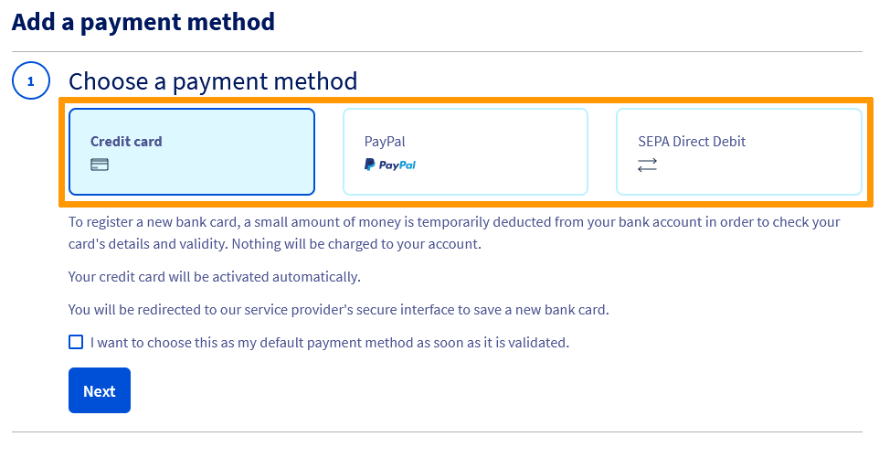
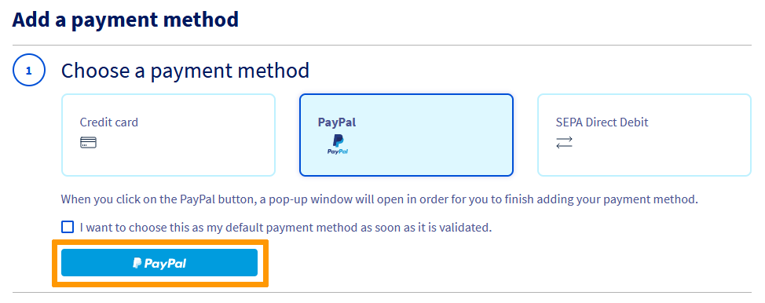

> [!primary]
> Diese Übersetzung wurde durch unseren Partner SYSTRAN automatisch erstellt. In manchen Fällen können ungenaue Formulierungen verwendet worden sein, z.B. bei der Beschriftung von Schaltflächen oder technischen Details. Bitte ziehen Sie beim geringsten Zweifel die englische oder französische Fassung der Anleitung zu Rate. Möchten Sie mithelfen, diese Übersetzung zu verbessern? Dann nutzen Sie dazu bitte den Button «Mitmachen» auf dieser Seite.
>

**Letzte Aktualisierung am 09.05.2022**

## Ziel

Ihr OVHcloud Kunden-Account ermöglicht Ihnen, verschiedene Zahlungsarten zu hinterlegen und zu verwalten.

## Voraussetzungen

- Sie haben Zugriff auf Ihr [OVHcloud Kundencenter](https://www.ovh.com/auth/?action=gotomanager&from=https://www.ovh.de/&ovhSubsidiary=de).
- Sie verfügen über eine gültige Zahlungsart.

## In der praktischen Anwendung 

Klicken Sie in Ihrem [OVHcloud Kundencenter](https://www.ovh.com/auth/?action=gotomanager&from=https://www.ovh.de/&ovhSubsidiary=de) oben rechts auf Ihren Namen und wählen Sie `Zahlungsmittel`{.action} aus.

{.thumbnail}

Die angezeigte Seite enthält eine Tabelle mit den in Ihrem Kundenkonto hinterlegten Zahlungsarten. Sie können dort:

- Eine Zahlungsart hinzufügen.
- Ihre Standardzahlungsart ändern.
- Beschreibung Ihrer Zahlungsart ändern.
- Eine Zahlungsart löschen.

### Eine Zahlungsart hinzufügen

Bei Ihrer ersten Bestellung werden Sie aufgefordert, ein Zahlungsmittel zu hinterlegen, um die Verlängerung Ihrer Dienstleistung per automatischer Lastschrift sicherzustellen.

Dieses Zahlungsmittel wird standardmäßig für alle Ihre Verlängerungen verwendet und Ihnen wird angeboten, neue Bestellungen zu begleichen.

Sie haben die Möglichkeit, andere Zahlungsarten zu hinterlegen, damit diese bei Neubestellungen angeboten werden oder standardmäßig für zukünftige Lastschriften verwendet werden.

Es können drei Zahlungsarten eingetragen werden:

- Kreditkarte
- Bankkonto
- PayPal® Konto

Klicken Sie hierfür auf den Knopf `Zahlungsart hinzufügen`{.action}.

{.thumbnail}

Wählen Sie die Zahlungsmethode aus, die Sie verwenden möchten: 

{.thumbnail}

Folgen Sie den Schritten für die Eintragung der Zahlungsart. Im ersten Schritt werden Sie aufgefordert, die Option `Zahlungsmittel nach Validierung als Standardzahlungsmittel verwenden`{.action} anzuhaken, damit es für zukünftige Bestellungen oder automatische Lastschriften verwendet werden kann.

#### Kreditkarte

{.thumbnail}

Um eine neue Kreditkarte zu hinterlegen, werden Sie zum gesicherten Interface unseres Zahlungsdienstleisters weitergeleitet. Es wird eine Testabbuchung bei Ihrem Bankinstitut vorgenommen, um Nummer und Gültigkeit der Karte zu überprüfen. 
Es wird kein Betrag abgebucht und Ihre Kreditkarte wird nach einigen Minuten aktiviert.

#### Bankkonto

{.thumbnail}

> [!warning]
>
> Die Verwendung der SEPA-Lastschrift ist nur für französische und deutsche Kunden-Accounts möglich.
>

Im Falle der Registrierung eines Bankkontos erhalten Sie eine E-Mail von unserem Partner Yousign®, mit der Sie Ihre Lastschriftanweisung elektronisch unterzeichnen können.

{.thumbnail}

> [!primary]
>
> Solange diese Berechtigung nicht von Ihnen unterzeichnet und validiert wurde, wird neben Ihrem Bankkonto der Vermerk `Warten auf Validierung` eingefügt, da dieses dann nicht für Ihre Zahlungen berücksichtigt werden kann.
>

Nach Eingang Ihrer SEPA-Einzugsermächtigung wird Ihr Bankkonto innerhalb von etwa 48 Stunden als Zahlungsmittel auf Ihrem Kunden-Account bestätigt.

#### PayPal® Account

{.thumbnail}

Klicken Sie auf den Button `PayPal`{.action}. Es öffnet sich ein neues Fenster, um sich mit Ihrem PayPal® Account zu verbinden und diesen als autorisiertes Zahlungsmittel bei OVHcloud zu hinterlegen.

Ihr PayPal® Account wird in wenigen Minuten aktiviert.

### Ihre Standardzahlungsart ändern

Die Rechnungen für die Verlängerung Ihrer Dienstleistungen werden automatisch mit Ihrer Standardzahlungsart beglichen. Wenn Sie diese ändern möchten, müssen Sie zuerst in Ihrem OVHcloud Kundencenter eine neue Zahlungsart hinzufügen.

Klicken Sie dafür auf `...`{.action} rechts neben der Zahlungsart und dann auf `Dieses Zahlungsmittel als Standardzahlungsmittel festlegen`{.action}.

{.thumbnail}

> **Ich möchte mein Standardzahlungsmittel durch ein anderes ersetzen, wie kann ich das tun?**
>
> - Schritt 1: Die neue Zahlungsart hinzufügen.
> - Schritt 2: Legen Sie das neue Zahlungsmittel als Standardzahlungsmittel fest.
> - Schritt 3: Die alte Zahlungsart löschen.
>

### Eine Zahlungsart löschen

Wenn Sie eine Ihrer Zahlungsarten nicht mehr verwenden möchten, dann können Sie sie löschen, indem Sie auf `...`{.action} rechts neben der Zahlungsart und dann auf `Dieses Zahlungsmittel löschen`{.action} klicken.

{.thumbnail}

Wenn Sie alle Ihre Zahlungsarten löschen möchten, müssen alle Ihre Dienstleistungen [auf manuelle Verlängerung](https://docs.ovh.com/de/billing/anleitung_zur_nutzung_der_automatischen_verlangerung_bei_ovh/) umgestellt werden.

#### Löschen einer Zahlungsart über die OVHCloud API

Die Löschung einer Zahlungsart kann über die API erfolgen. Verbinden Sie sich hierzu über [https://eu.api.ovh.com/](https://eu.api.ovh.com/).

Fordern Sie zuerst die ID der Zahlungsart an:

> [!api]
>
> @api {GET} /me/payment/method
>

Löschen Sie anschließend die Zahlungsart mithilfe der im vorigen Schritt erhaltenen ID:

> [!api]
>
> @api {DELETE} /me/payment/method/{paymentMethodId}
>

> [!primary]
>
> Mehr Informationen finden Sie in der Einführung zur [Verwendung der OVHcloud API](https://docs.ovh.com/de/api/first-steps-with-ovh-api/).
>
> Falls Sie Schwierigkeiten haben, Ihre Zahlungsarten über die OVHcloud API zu identifizieren, verwenden Sie die Funktion `Beschreibung ändern`{.action} im [Kundencenter](https://www.ovh.com/auth/?action=gotomanager&from=https://www.ovh.de/&ovhSubsidiary=de). Klicken Sie auf dazu `...`{.action} rechts neben der Zahlungsart im Bereich [Meine Zahlungsarten](#payment_methods).
>

### Der Prepaid-Account

#### Was ist der Prepaid-Account?

Der Prepaid-Account ist in Ihrem [OVHcloud Kundencenter](https://www.ovh.com/auth/?action=gotomanager&from=https://www.ovh.de/&ovhSubsidiary=de) verfügbar. Damit können Sie in Ihrem Kunden-Account im Voraus Guthaben aufladen und es für die Bezahlung Ihrer Bestellungen und Verlängerungsrechnungen verwenden.

Wenn Sie Ihren Account regelmäßig aufladen, stellen Sie damit sicher, dass die [automatische Verlängerung](https://docs.ovh.com/de/billing/anleitung_zur_nutzung_der_automatischen_verlangerung_bei_ovh/) Ihrer Dienstleistungen nie wegen Zahlungsausfalls unterbrochen wird.

Gehen Sie dazu in den Bereich `Zahlungsarten` Ihres Kundencenters:

- Klicken Sie oben rechts auf Ihren Namen und dann im rechten Menü auf `Zahlungsmittel`{.action}.
- Wählen Sie den Tab `Mein Prepaid-Account`{.action}.

{.thumbnail}

#### Wie funktioniert der Prepaid-Account?

Wenn Sie über Dienstleistungen verfügen, die auf *automatische Verlängerung* eingestellt sind, wird Ihre Rechnung zuerst von Ihrem Prepaid-Account eingezogen.

Wenn kein ausreichender Betrag zur Verfügung steht, wird der Kontostand entsprechend der ausstehenden Zahlung einen Minusbetrag aufweisen.

Wenn Sie über ein gültiges Zahlungsmittel in Ihrem Kundenkonto verfügen, wird dieser Betrag automatisch innerhalb von 24 Stunden abgebucht und Ihr Guthaben wieder auf Null gesetzt. Dies hat keine Auswirkungen auf den Zustand Ihrer Dienstleistungen.

Wenn Sie jedoch kein Zahlungsmittel hinterlegt haben, müssen Sie diesen Betrag innerhalb von 7 Tagen über Ihr Kundencenter begleichen, um eine Unterbrechung des Dienstes zu vermeiden.

Wenn Sie kein Zahlungsmittel hinterlegt haben, empfehlen wir Ihnen deshalb, einen **Alarm** einzurichten, um sicherzustellen, dass Sie über genügend Mittel für Ihre nächsten Rechnungen verfügen:

{.thumbnail}

Wenn das für Ihren Prepaid-Account verfügbare Guthaben unter den festgelegten Grenzwert fällt, wird Ihnen eine Benachrichtigung per E-Mail gesendet.

#### Wie kann ich den Prepaid-Account aufladen?

Klicken Sie im Tab `Mein Prepaid-Account`{.action} auf den Button `Aufladen`{.action}.

{.thumbnail}

Geben Sie im neuen Fenster den aufzuladenden Betrag ein, klicken Sie auf `Weiter`{.action} und dann auf `Bestellen`{.action}.

{.thumbnail}

Wählen Sie im angezeigten Bestellschein die Zahlungsart Ihrer Wahl aus und führen Sie die Zahlung aus.

## Weiterführende Informationen

Für den Austausch mit unserer User Community gehen Sie auf <https://community.ovh.com/en/>.
