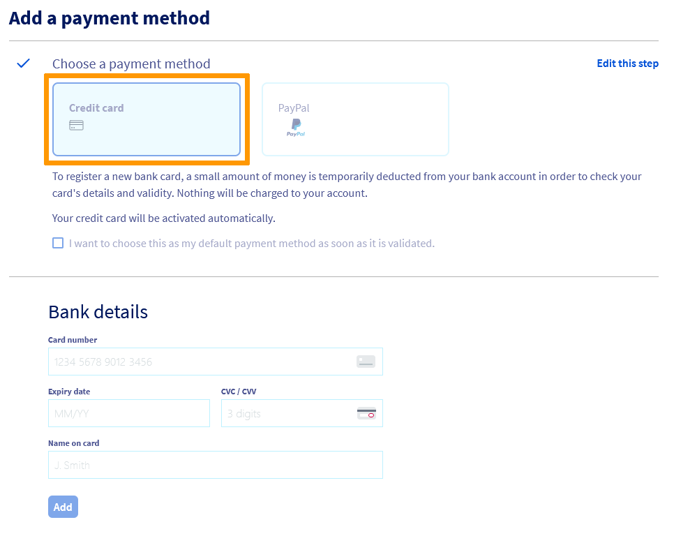
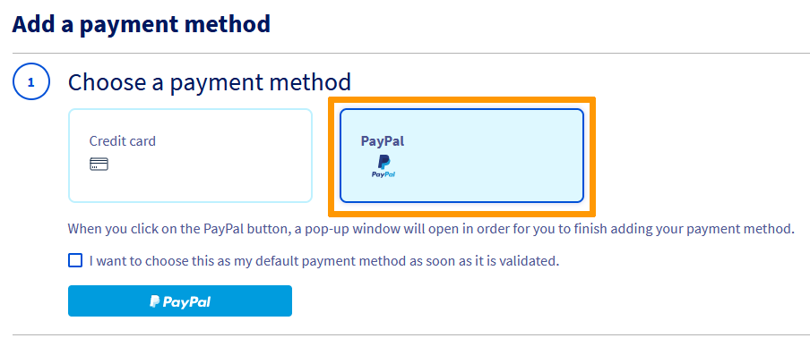
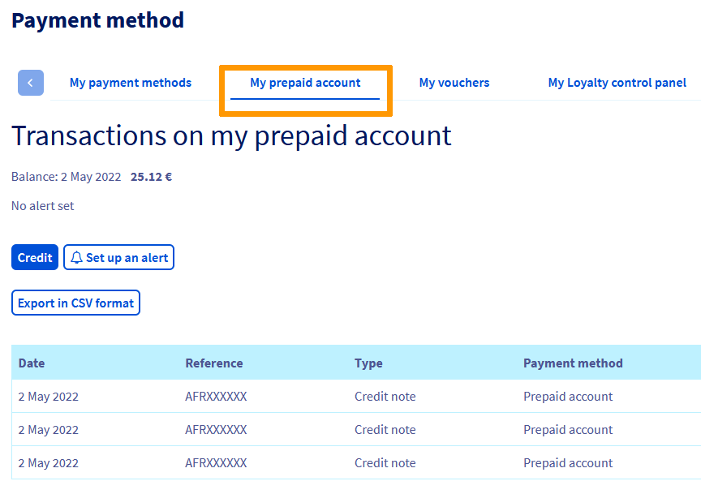
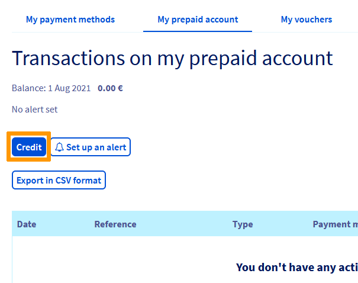
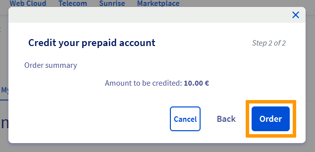

**Last updated 18th May 2022**

## Objective

In the OVHcloud Control Panel, you can save and manage different payment methods.

## Requirements

- Access to the [OVHcloud Control Panel](https://ca.ovh.com/auth/?action=gotomanager&from=https://www.ovh.com/asia/&ovhSubsidiary=asia)
- A valid payment method

## Instructions 

In the [OVHcloud Control Panel](https://ca.ovh.com/auth/?action=gotomanager&from=https://www.ovh.com/asia/&ovhSubsidiary=asia), click on your name in the top right-hand corner, then select `Payment method`{.action}.

{.thumbnail}

The page that opens contains a table listing the payment methods saved to your customer account. You can:

- Add a payment method.
- Change your default payment method.
- Modify your payment method description.
- Delete a payment method.

### Register a payment method

When you place your first order, you are asked to save a payment method to ensure that your service can be renewed via automatic payments.

This payment method is then used by default for all of your renewals and is offered to pay for new orders.

You can save other payment methods so that they are suggested when you place new orders and used by default for future payments.

You can save two different payment method types:

- Credit card
- PayPal® account

To do this, simply click `Add a payment method`{.action}.

{.thumbnail}

Choose the payment method you want to use:

{.thumbnail}

Follow the the steps for saving a payment method. In the first step, you are asked to check the option `I want to choose this as my default payment method as soon as it is validated`{.action}, so that it is used for future orders and automatic payments.

#### Credit card

{.thumbnail}

To register a new bank card, you will be redirected to our payment provider's secure interface. A small amount of money is deducted from your bank account to check your card details and their validity. 
No amount will be charged and your credit card will be activated in a few minutes.

#### Paypal account

{.thumbnail}

Select `PayPal`{.action} as your payment method, then click on the button `PayPal`{.action}. A popup window will then open to log in to your PayPal® account and register it as an authorized payment method with OVHcloud.

Your PayPal® account will be activated within a few minutes.

### Change your default payment method

Payments for your services’ renewal bills are always taken via your default payment method. If you would like to change it, you will need to add a new payment method in the OVHcloud Control Panel.

To do this, click on the `...`{.action} to the right of the new payment method, then `Make this the default payment method`{.action}.

{.thumbnail}

> **How do I replace my default payment method with another one?**
>
> - Step 1: add the new payment method
> - Step 2: set the new payment method as the default payment method
> - Step 3: delete the old payment method
>

### Delete a payment method

If you no longer want to use one of your payment methods, you can delete it by clicking on the `...`{.action} button to the right of it. Then click `Delete this payment method`{.action}.

{.thumbnail}

If you would like to delete all of your payment methods, all of your services must be set to [manual renewal](https://docs.ovh.com/asia/en/billing/how-to-use-automatic-renewal-at-ovh/#manual-renewal).

#### Delete a payment method via the OVHcloud API

You can delete a payment method via the API by connecting to [https://eu.api.ovh.com/](https://eu.api.ovh.com/).

Start by getting the payment method’s ID:

> [!api]
>
> @api {GET} /me/payment/method
>

Then delete the payment method using the ID you obtained in the previous step:

> [!api]
>
> @api {DELETE} /me/payment/method/{paymentMethodId}
>

> [!primary]
>
> For more information, please refer to our guide [Getting started with the OVHcloud API](https://docs.ovh.com/asia/en/api/first-steps-with-ovh-api/).
>
> If you experience any difficulties finding your payment methods via the OVHcloud API, use the `Edit description`{.action} function by clicking on the button `...`{.action} next to your payment method in the [Payment method](#payment_methods) section of the [OVHcloud Control Panel](https://ca.ovh.com/auth/?action=gotomanager&from=https://www.ovh.com/asia/&ovhSubsidiary=asia).
>

### Prepaid account

#### What is the prepaid account?

The *prepaid account* is added to your [OVHcloud Control Panel](https://ca.ovh.com/auth/?action=gotomanager&from=https://www.ovh.com/asia/&ovhSubsidiary=asia) as soon as it is created. It allows you to credit your customer account in advance and use these funds to pay for your orders and renewal invoices.

By crediting your account regularly, you will ensure that your services will never be interrupted for default on their [automatic renewal](https://docs.ovh.com/asia/en/billing/how-to-use-automatic-renewal-at-ovh/#automatic-renewal).

To do this, simply go to the `Payment methods` section in your Control Panel:

- Click on your name in the top right-hand corner, then on `Payment method`{.action} in the menu on the right-hand side.
- Select the `My Prepaid Account`{.action} tab.

{.thumbnail}

#### How does it work?

When you have services set to *automatic renewal*, your bill will be deducted from your prepaid account as soon as possible.

If you do not have enough funds, your account balance will be negative and will remain pending payment.

If you have a valid payment method saved in your customer account, this amount will be automatically deducted within 24 hours and your balance reset. This will not affect the status of your services.

However, if you have not saved a payment method, you will need to pay the balance within 7 days from your Control Panel to avoid any service interruptions.

If you do not have a registered payment method, we recommend setting an **alert threshold**, to ensure that you have sufficient funds for your next bills:

{.thumbnail}

If the credit available on your prepaid account falls below the defined limit, you will be sent a notification email immediately.

#### How do I credit my prepaid account?

In the `My prepaid account`{.action} tab, click on the `Credit`{.action} button.

{.thumbnail}

In the window that pops up, enter the amount you want to credit, click on `Next`{.action}, then `Order`{.action}.

{.thumbnail}

On the purchase order that appears, select the payment method of your choice and pay for your order.

## Go further

Join our community of users on <https://community.ovh.com/en/>.
