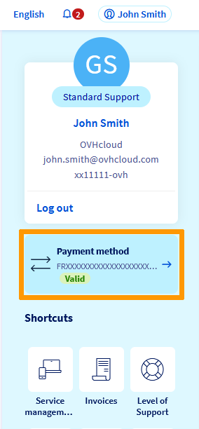

**Dernière mise à jour le 15/04/2020**

## Objectif
L'espace client OVHcloud vous permet d'enregistrer et gérer différents moyens de paiement.

## Prérequis
- Être connecté à [l'espace client OVHcloud](https://www.ovh.com/auth/?action=gotomanager){.external}.
- Disposer d'un moyen de paiement valide.

## En pratique

Dans votre [espace client OVHcloud](https://www.ovh.com/auth/?action=gotomanager){.external}, cliquez sur votre nom en haut à droite, puis sélectionnez `Moyen de paiement`{.action}.

{.thumbnail}

La page qui s’affiche contient un tableau répertoriant les moyens de paiement enregistrés sur votre espace client, notamment ceux utilisés lors de vos commandes. Vous pourrez y :

- Ajouter un moyen de paiement
- Modifier votre moyen de paiement par défaut
- Supprimer un moyen de paiement

### Ajouter un moyen de paiement

Lors de votre toute première commande d'un produit OVH, il vous est demandé d'enregistrer un moyen de paiement, afin d'assurer le renouvellement de votre service par prélèvement automatique.

Ce moyen de paiement est alors utilisé par défaut pour tous vos renouvellements, et proposé lors de nouveaux achats.

Vous avez bien sûr la possibilité d'enregistrer de nouveaux moyens de paiement, afin qu'ils vous soient proposés lors de vos nouvelles commandes, ou pour vos futurs prélèvements.

Il est possible d'enregistrer 3 types de moyens de paiement :

- Carte bancaire
- Compte bancaire
- Compte PayPal

Pour cela, cliquez simplement sur le bouton `Ajouter un moyen de paiement`{.action}.

{.thumbnail}

Suivez les étapes successives d'enregistrement du moyen de paiement. A la première étape, il vous sera proposé de définir ce nouveau moyen de paiement comme « moyen de paiement par défaut », afin qu'il soit utilisé pour vos futurs achats ou prélèvements automatiques.

En cas d'enregistrement d'un compte bancaire, il vous faudra retourner une autorisation de prélèvement par voie postale. Pour télécharger ce document, cliquez sur le bouton `...`{.action} à droite de votre compte bancaire puis sur `Télécharger la procédure à retourner par voie postale`{.action}.

{.thumbnail}

> [!primary]
>
Tant que cette autorisation n'est pas reçue par nos services, la mention « En attente de réception » sera indiquée à côté de votre compte bancaire, celui-ci ne pouvant alors être pris en compte pour vos paiements.
>

### Modifier votre moyen de paiement par défaut

Les factures de renouvellement de vos services sont toujours prélevées sur votre moyen de paiement par défaut. Si vous souhaitez modifier celui-ci, il vous faut d'abord ajouter un nouveau moyen de paiement dans votre espace client.

Cliquez alors sur le bouton `...`{.action} à droite du nouveau moyen de paiement, puis sur `Définir ce moyen de paiement par défaut`{.action}.

{.thumbnail}

### Supprimer un moyen de paiement

Si vous ne souhaitez plus utiliser l'un de vos moyens de paiement, vous pouvez le supprimer en cliquant sur le bouton `...`{.action} à droite de celui-ci. Cliquez alors sur `Supprimer ce moyen de paiement`{.action}.

{.thumbnail}

> [!warning]
>
Le moyen de paiement par défaut ne peut être supprimé. Si vous souhaitez le supprimer, vous devez d'abord définir un autre moyen de paiement par défaut.
>

### Supprimer un moyen de paiement via les API OVHcloud

La suppression d'un moyen de paiement peut être effectuée via les API en vous connectant sur [https://eu.api.ovh.com/](https://eu.api.ovh.com/){.external}.

Commencez par obtenir l'ID du moyen de paiement : 

> [!api]
>
> @api {GET} /me/payment/method 
>

Supprimez ensuite le moyen de paiement en utilisant l’ID que vous avez obtenu à l’étape précédente :

> [!api]
>
> @api {DELETE} /me/payment/method/{paymentMethodId}
>

## Aller plus loin

Échangez avec notre communauté d'utilisateurs sur <https://community.ovh.com>
