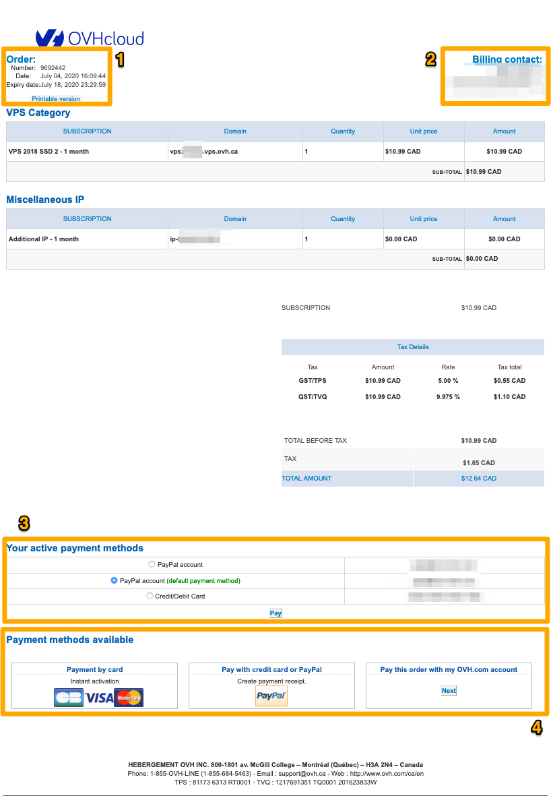
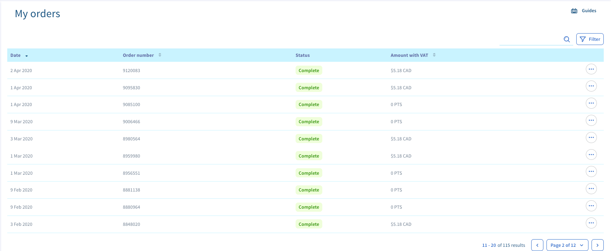

**Last updated 2020/07/04**

## Objective

There are various stages in the OVH order process, and you can track them in the [OVHcloud Control Panel](https://ca.ovh.com/auth/?action=gotomanager){.external}.

**This guide will provide you with more information on your purchase order, and its various statuses.**

> [!primary]
>
> Depending on your place of residence and its local legislation, as well as the products concerned, some details may vary from the information provided in this guide, and some information may not be applicable to your situation. If you have any doubts, please refer to your OVHcloud contracts, which you can access from the [OVHcloud Control Panel](https://ca.ovh.com/auth/?action=gotomanager){.external} by going to `My services`{.action}, then `My contracts`{.action}.
>

## Requirements

- access to the [OVHcloud Control Panel](https://ca.ovh.com/auth/?action=gotomanager){.external}
- at least one OVHcloud product order

##  Instructions

### Purchase order

A purchase order is generated when you place an order. It lists the products ordered, their price, and any reductions or promo offers that have been applied.

{.thumbnail}

|Number|Description|
|---|---|
|1|All of the information related to the purchase order is listed here: its number, its creation date and its expiry date. Please note that expired purchase orders will no longer appear in the OVHcloud Control Panel.|
|2|If you are logged into the Control Panel when you place the order, the billing contact will appear here. For further information on the different contact types, please read  [this guide](../customer/managing-contacts/){.external}.|
|3|If you have set a default payment method, it will be offered here. If your product is renewed automatically, a default payment method is required.|
|4|Here, you will find the available payment methods. We can only offer the payment methods authorised in the account’s country of origin, or those linked to the account type.|

As a reminder, you can view your purchase order at any time in the [OVHcloud Control Panel](https://ca.ovh.com/auth/?action=gotomanager){.external}.

### Access purchase orders via the OVHcloud Control Panel.

To access the area for managing orders, simply click on your first name in the top right-hand corner of the [OVHcloud Control Panel](https://ca.ovh.com/auth/?action=gotomanager){.external}, then `My orders`{.action}.

{.thumbnail}

You will then land on a summary page listing all of the non-expired orders placed via your OVH account.

{.thumbnail}

On this page, you will see the following information:

- the date on which the order was placed
- the order number
- the order status
- the purchase order amount, including VAT

The various order statuses are listed below:

|Status|Definition|
|---|---|
|Unpaid|This status means that the payment has not been received for the purchase order. Payment is not obligatory. The order will not be finalised, and will disappear on its expiry date.|
|Confirmation|Your order is in the process of being verified manually by our internal services (working days only). The validation will be complete once this step is finalised. If the operation cannot be finalised, you will be sent an email request to provide supporting documents.|
|Delivery in progress|Your order is in the process of being delivered — please wait. Depending on the service you have ordered, this step may last a few minutes or a few hours.|
|Complete|You have received your order, and your access details have been sent to you by email (if access details are required).|

If you have a purchase order that is in the process of being delivered or awaiting payment, you can view it. To do this, click `...`{.action}, then `View order in HTML format`{.action}.

{.thumbnail}

### Apply the right of withdrawal.

Our [General Terms and Conditions of Services](https://www.ovh.com/ca/en/support/termsofservice/General_Terms_of_Service_CA.pdf){.action} detail the conditions required for withdrawal from a contract.

If the eligibility criteria are met, you can withdraw from a service directly in the [OVH Control Panel](https://ca.ovh.com/auth/?action=gotomanager){.external}. To do this, proceed as though you would like to view the purchase order, but instead of selecting `View order in HTML format`{.action}, select `Cancel the order`{.action}.

{.thumbnail}

At this stage, you simply need to confirm the order cancellation by clicking the `Yes, I want to cancel this order`{.action} box, and confirming.

{.thumbnail}

## Go further

Join our community of users on <https://community.ovh.com/en/>.
