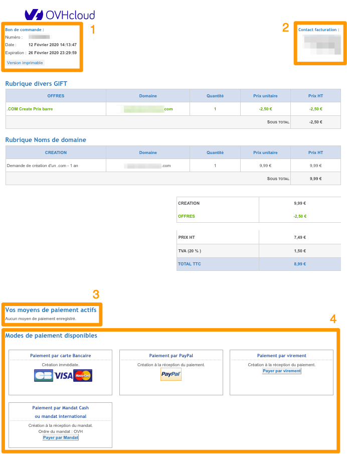
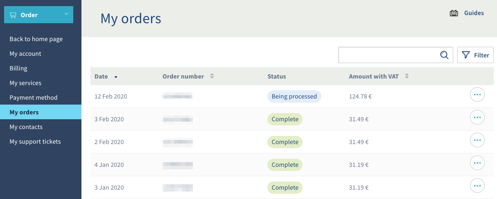

**Ostatnia aktualizacja z dnia 20-05-2020**

## Wprowadzenie

Zamówienie w OVHcloud przechodzi przez kilka etapów, które możesz śledzić w Twoim [Panelu klienta](https://www.ovh.com/auth/?action=gotomanager){.external}.

**Niniejszy przewodnik wyjaśnia, jak interpretować poszczególne etapy realizacji zamówienia.**

> [!primary]
>
> Możliwe jest, że niektóre części niniejszego przewodnika nie mają zastosowania do Twojej sytuacji, która może być różna w zależności od tego, gdzie znajduje się siedziba Twojej firmy i pod jakie podlega ustawodawstwo. Jeśli masz wątpliwości, sprawdź zapisy w umowach OVHcloud dostępnych w [Panelu klienta](https://www.ovh.com/auth/?action=gotomanager){.external}, sekcja`Produkty i usługi`{.action} > `Regulaminy`{.action}.
>

## Wymagania początkowe

- Dostęp do [Panelu klienta](https://www.ovh.com/auth/?action=gotomanager){.external}
- Złożenie co najmniej jednego zamówienia w OVHcloud

## W praktyce

### Zamówienie

Formularz zamówienia tworzony jest na ostatnim etapie składania zamówienia. Wyszczególnione są na nim zamówione produkty, ich cena i ewentualne naliczone rabaty.

{.thumbnail}

|Numer|Opis |
|---|---|
|1|Wszystkie informacje związane z zamówieniem znajdują się tutaj: numer, data utworzenia oraz data wygaśnięcia. Pamiętaj, że wszystkie nieopłacone zamówienia, których ważność wygasła nie będą się wyświetlały w Twoim Panelu klienta.|
|2|Jeśli jesteś zalogowany do Panelu klienta podczas składania zamówienia, w tym miejscu pojawi się kontakt księgowy. Jeśli chcesz dowiedzieć się więcej o poszczególnych kontaktach, zapoznaj się z [tą dokumentacją](../../customer/zarzadzanie_kontaktami/){.external}.|
|3|Jeśli zarejestrowałeś domyślną metodę płatności, zostanie Ci ona zaproponowana w tym miejscu. W przypadku automatycznego odnawiania usług zarejestrowanie domyślnej metody płatności jest konieczne.|
|4|Tutaj znajdziesz dostępne metody płatności. Zostaną Ci zaproponowane jedynie metody płatności akceptowane w kraju, w którym zostało zarejestrowane konto lub metody związane z typem zarejestrowanego konta.|

Możesz w każdym momencie odnaleźć Twoje zamówienie w [Panelu klienta](https://www.ovh.com/auth/?action=gotomanager){.external} w sposób, w jaki zostało to opisane w dalszej części tej dokumentacji.

### Dostęp do zamówień w Panelu klienta

Aby uzyskać dostęp do panelu zarządzania zamówieniami, kliknij `Dashboard` w lewym górnym rogu w aplecie [Panelu klienta](https://www.ovh.com/auth/?action=gotomanager){.external}, a następnie kliknij `Wyświetl moje zamówienia`{.action}.

{.thumbnail}

Wyświetli się strona z listą złożonych w ramach Twojego konta zamówień, których ważność nie wygasła.

{.thumbnail}

W podsumowaniu znajdziesz następujące informacje:

- data utworzenia zamówienia;
- numer zamówienia;
- status zamówienia;
- kwota zamówienia powiększona o należne podatki.

Możliwe statusy zamówienia: 

|Status|Wyjaśnienie|
|---|---|
|Brak płatności|Status ten odpowiada zamówieniu, które nie zostało opłacone. Uregulowanie należności nie jest obowiązkowe, zamówienie nie zostanie sfinalizowane i zniknie z systemu w dniu, kiedy utraci ważność.|
|Zatwierdzenie|Twoje zamówienie jest sprawdzane przez nasze zespoły (tylko w dni robocze). Realizacja zamówienia nastąpi po zakończeniu tego etapu. W przypadku braku możliwości zakończenia tej operacji, zostanie do Ciebie wysłany e-mail z prośbą o dostarczenie dodatkowych dokumentów.|
|Dostarczanie w trakcie|Dostawa Twojej usługi jest w trakcie realizacji. W zależności od usługi dostawa może trwać kilka minut lub kilka godzin.|
|Zakończone|Usługa dostała dostarczona, otrzymałeś dane do logowania w wiadomości e-mail (jeśli wymagane jest logowanie).|

Możesz wyświetlić zamówienie, które ma status „dostarczanie w trakcie” lub „brak płatności”. W tym celu kliknij `...`{.action}, a następnie `Wyświetl zamówienie w formacie HTML`{.action}.

{.thumbnail}

### Śledzenie zamówienia

Po wygenerowaniu formularza zamówienia możesz je śledzić z poziomu [Panelu klienta OVHcloud](https://www.ovh.com/auth/?action=gotomanager){.external}. Kliknij na `Dashboard`{.action}, a następnie na `Wyświetl moje zamówienia`{action} i wreszcie na `...`{.action} obok Twojego zamówienia. Wybierz `Informacje o zamówieniu`{.action}. Aby śledzić zamówienie, możesz też kliknąć jego stan w kolumnie „Status”.

{.thumbnail}

Pojawi się poniższe okienko umożliwiające śledzenie zamówienia w 4 krokach. 

{.thumbnail}

### Korzystanie z prawa do odstąpienia od umowy

Artykuł 5 punkt 8 [Regulaminów OVHcloud](https://www.ovh.pl/pomoc/regulaminy/){.external} stanowi, że *Użytkownik, będący konsumentem może odstąpić od umowy bez podania przyczyny, składając stosowne oświadczenie na piśmie w ciągu 10 dni od dnia zawarcia umowy świadczenia usługi. Do zachowania tego terminu wystarczy przesłanie oświadczenia w tym terminie.*

Opcję skorzystania z prawa do odstąpienia od umowy znajdziesz w dalszym ciągu tego artykułu.

**Poniższa opcja nie jest dostępna dla klientów polskich:**

Jeśli warunki dotyczące terminu odstąpienia od umowy są spełnione, możesz skorzystać z prawa odstąpienia od umowy bezpośrednio w [Panelu klienta](https://www.ovh.com/auth/?action=gotomanager){.external}. W tym celu wykonaj takie same czynności, jak w przypadku wyświetlenia zamówienia, jednak zamiast wybrać `Informacje o zamówieniu`{.action}, wybierz `Anuluj zamówienie`{.action}.

{.thumbnail}

Zaznacz kratkę `Tak, chcę anulować to zamówienie`{.action}, po czym zatwierdź tę operację.

{.thumbnail}

> [!primary]
>
> W ciągu 30 dni od dnia odstąpienia od umowy zwrócimy Ci pierwotnie wpłaconą kwotę po uprzednim potrąceniu należności za dni, w których skorzystałeś z usług OVHcloud. 
>

## Sprawdź również

Przyłącz się do społeczności naszych użytkowników na stronie <https://community.ovh.com/en/>.