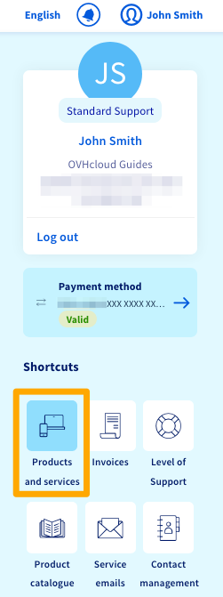

**Last updated 5th May 2020**

## Objective

In the OVHcloud Control Panel, you can manage all of your services.

**This guide explains how to view and manage your OVHcloud solutions via the “My services” section of your Control Panel.**

> [!primary]
>
> Depending on your place of residence and its local legislations, as well as the products concerned, some details may vary from the information provided in this guide, and some information may not apply to your situation. If you have any doubts, please refer to your OVHcloud contracts, which you can access via the [OVHcloud Control Panel](https://www.ovh.com/auth/?action=gotomanager){.external} by navigating to `My services`{.action} and `Contracts`{.action}.
>

## Requirements

- access to the [OVHcloud Control Panel](https://www.ovh.com/auth/?action=gotomanager)
- active OVHcloud services

## Instructions

Please note that in the “My services” interface, you can view all of your OVHcloud solutions. You can also manage them all here, with the exception of the following services:

- telecom services (e.g. xDSL, VoIP, etc.)
- Microsoft Office 365 and SharePoint subscriptions
- the MX plan email service

### View your services via the “My services” interface.

Log in to the [OVHcloud Control Panel](https://www.ovh.com/auth/?action=gotomanager). Click on the name associated with your NIC handle (Customer ID) in the menu bar in the top right-hand corner, then select `Products and services`{.action}.

{.thumbnail}

The page that appears will contain a table for managing your OVHcloud services. In this table, you will see:

- the service’s name
- its name at OVHcloud (may look like a reference ID)
- its renewal or expiry date
- its renewal frequency

{.thumbnail}

If you have several solutions, the table may be more than one page long. You can use filters to:

- show a particular service by entering its name in the search field above the table, in the right-hand corner
- sort your services by several criteria, using the filters located at the top of the table 
- change the number of services displayed per page, by selecting a number from the drop-down menu below the table

{.thumbnail}

### Manage your services via the “My services” interface.

Log in to the [OVHcloud Control Panel](https://www.ovh.com/auth/?action=gotomanager). Click on the name associated with your NIC handle (Customer ID) in the menu bar in the top right-hand corner, then select `Products and services`{.action}.

{.thumbnail}

The page that appears will contain a table for managing your OVHcloud solutions. If applicable for the service in question, you can:

- cancel a service on its expiry date
- delete a service immediately
- perform other actions related to payment for the service. For these options, please refer to the instructions explained in [our renewal guide](../how-to-use-automatic-renewal-at-ovh/).

As a reminder, some solutions cannot be managed via the “My services” interface.

#### Cancel a service on its expiry date.

This action disables automatic renewal for the service concerned. The service will be cancelled automatically on its expiry date. **Please note that all of the data associated with this service will be permanently deleted.** 

To cancel a service, click on the three dots to the right of it. Then click `Terminate on expiry date`{.action}, read the information that appears, and confirm your request.

You can undo this action up to 24 hours before the expiry date by clicking again on the three dots, then `Undo termination`{.action}.

{.thumbnail}

#### Delete a service immediately.

This action is only available for [Web Hosting plans](https://www.ovh.co.uk/web-hosting/). It will trigger the deletion process for the service, meaning the service will be deleted before its expiry date, without waiting for the contract duration to end.

**Since this action is immediate, all of the data associated with this service is permenantly deleted, and the action cannot be undone.** Also, no refund is issued for the time between the service’s deletion and its expiry date.

To delete a service immediately, click on the three dots to the right of it, and click `Delete web hosting plan immediately`{.action}. Read the information that appears, then launch your request by pressing `confirm`{.action}. Follow the instructions you receive via email to complete the action.

{.thumbnail}

## Go further

Join our community of users on <https://community.ovh.com/en/>.
