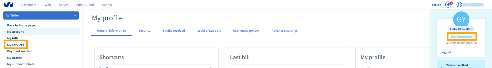
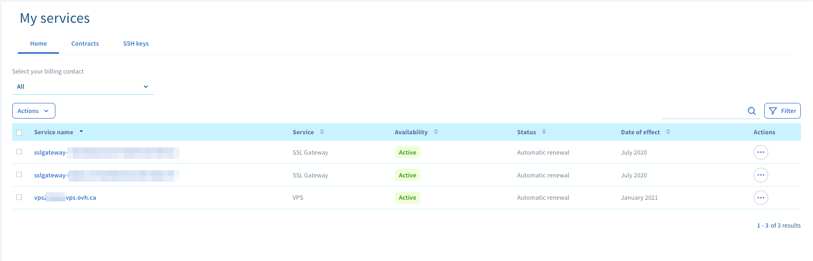
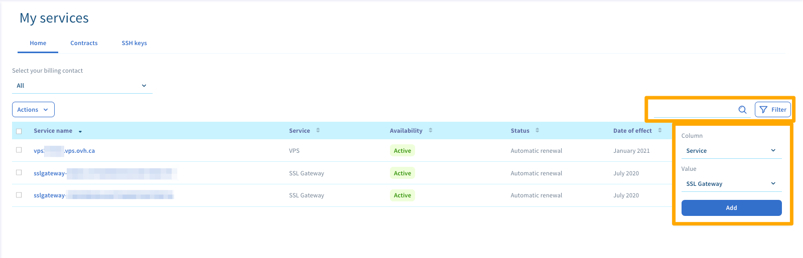
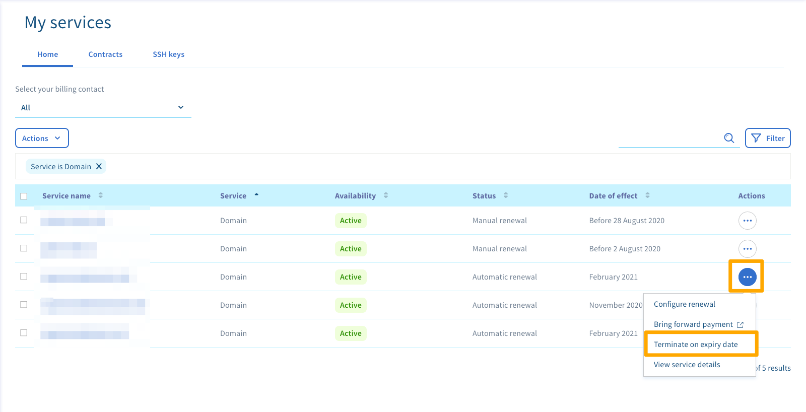
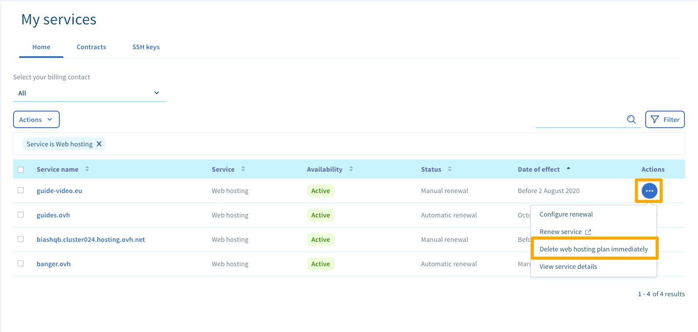

**Dernière mise à jour le 04/07/2020**

## Objectif

L'espace client vous offre une gestion administrative complète de tous vos services OVHcloud. 

**Apprenez à visualiser et administrer vos solutions depuis l'interface « Gérer mes services » dans votre espace client.**

> [!primary]
>
> En fonction de votre lieu de résidence et de sa législation en vigueur, ainsi que du ou des produits concernés, il est possible que certaines parties de ce guide varient et/ou ne s’appliquent pas à votre situation. Si vous avez le moindre doute, référez-vous à vos contrats OVHcloud disponibles dans votre [espace client](https://ca.ovh.com/auth/?action=gotomanager){.external}, rubrique `Mes services`{.action} puis `Mes contrats`{.action}.
>

## Prérequis

- Être connecté à l'[espace client OVHcloud](https://ca.ovh.com/auth/?action=gotomanager){.external}.
- Posséder des services OVHcloud actifs.

## En pratique

Avant de débuter, notez que l'interface « Gérer mes services » vous permet de visualiser l'intégralité de vos solutions OVHcloud. Vous pouvez également les administrer depuis cet espace, à l'exception :

- des services télécoms (comme une solution xDSL, de VoIP, etc.- pas disponible pour CA) ;
- [des services Microsoft](https://ca.ovh.com/fr/solutions-collaboratives-microsoft/){.external} (comme les solutions Exchange, Office 365 et SharePoint) ;
- du service e-mail MX Plan.

Poursuivez la lecture de cette documentation selon la manipulation que vous souhaitez réaliser.

- [Visualiser vos services depuis l'interface « Gérer mes services »](../gerer-ses-services-ovh/#visualiser-vos-services-depuis-linterface-gerer-mes-services){.external}.
- [Gérer vos services depuis l'interface « Gérer mes services »](../gerer-ses-services-ovh/#gerer-vos-services-depuis-linterface-gerer-mes-services){.external}.

### Visualiser vos services depuis l'interface « Gérer mes services »

Connectez-vous à votre [espace client OVHcloud](https://ca.ovh.com/auth/?action=gotomanager){.external}, cliquez sur le nom rattaché à votre identifiant client dans la barre de menu en haut à droite, puis cliquez sur `Mes services`{.action}.

{.thumbnail}

La page qui apparaît affiche le tableau de gestion de vos solutions OVHcloud. Depuis ce dernier, vous pouvez retrouver pour chaque service :

- le nom dudit service ;
- son nom associé chez OVHcloud (qui peut par exemple ressembler à une référence) ;
- sa date de renouvellement ou d'expiration ;
- sa fréquence de renouvellement.

Certains services peuvent être rattachés (comme un hébergement web et un nom de domaine). Si tel est le cas, cliquer sur le bouton en forme de flèche vous permettra de les dissocier dans le tableau.

{.thumbnail}

Si vous possédez de nombreuses solutions, le tableau peut alors comporter plusieurs pages. Utilisez les possibilités de filtrage pour :

- afficher un service en particulier, en renseignant son nom dans la zone de recherche située au-dessus du tableau à droite ;
- trier l'affichage de vos services selon plusieurs critères, en utilisant les filtres situés en haut du tableau ; 

{.thumbnail}

### Gérer vos services depuis l'interface « Gérer mes services »

Connectez-vous à votre [espace client OVHcloud](http://ca.ovh.com/auth/?action=gotomanager){.external}, cliquez sur le nom rattaché à votre identifiant client dans la barre de menu en haut à droite, puis cliquez sur `Mes services`{.action}.

{.thumbnail}

La page qui apparaît affiche le tableau de gestion de vos solutions OVHcloud. Dès lors, si le service le permet, vous avez la possibilité de :

- résilier un service à sa date d'expiration ;
- supprimer immédiatement un service ;
- réaliser d'autres actions liées au paiement du service. Pour ces sujets, reportez-vous aux instructions décrites dans notre documentation « [Gérer le renouvellement de mes services](../renouvellement-automatique-ovh/){.external} ».

Pour rappel, certaines solutions ne peuvent pas être administrées depuis l'interface « Gérer mes services ».

#### Résilier un service à sa date d'expiration

Cette action désactive le renouvellement automatique du service concerné. Celui-ci sera résilié automatiquement à sa date d'expiration. **Notez que les données liées à ce service seront alors supprimées de manière irréversible.** 

Pour effectuer cette manipulation, cliquez sur le bouton représentant trois points à droite du service concerné. Cliquez sur `Résilier à date d'échéance`{.action}, lisez les informations qui s'affichent, puis confirmez la demande.

Sachez que vous pouvez revenir sur cette décision jusqu'à 24 heures avant l'échéance, en cliquant de nouveau sur le bouton représentant trois points puis sur `Annuler la résiliation`{.action}.

{.thumbnail}

#### Supprimer immédiatement un service

Cette action, uniquement valable pour les [hébergements web](https://www.ovh.com/ca/fr/hebergement-web/){.external}, supprime immédiatement le service sélectionné. C'est-à-dire avant sa date d'expiration, sans attendre le terme du contrat.

**Du fait de la suppression immédiate, les données liées à ce service seront supprimées de manière irréversible. De plus, aucun remboursement du temps restant jusqu'à l'échéance ne sera effectué.** 

Pour réaliser cette manipulation, cliquez sur le bouton représentant trois points à droite du service que vous souhaitez supprimer immédiatement, puis cliquez sur `Supprimer immédiatement l'hébergement`{.action}. Lisez alors les informations qui s'affichent, puis lancez la demande en la validant. Poursuivez alors grâce aux indications transmises par e-mail jusqu'à finalisation de votre demande.

{.thumbnail}

## Aller plus loin

Échangez avec notre communauté d'utilisateurs sur <https://community.ovh.com>.
