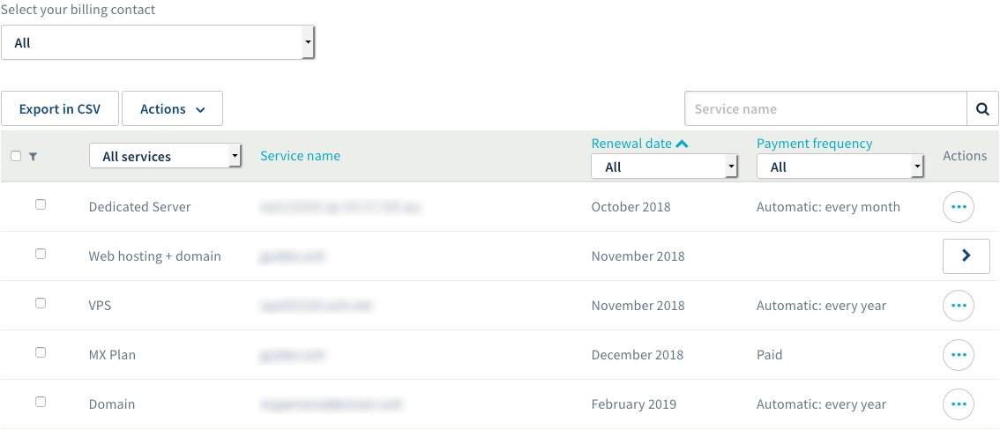
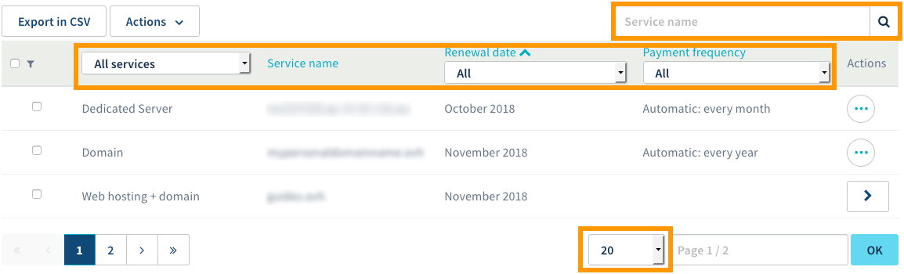
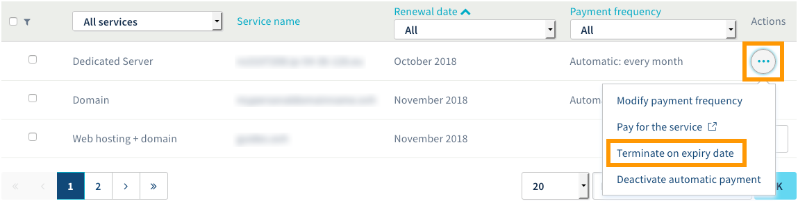
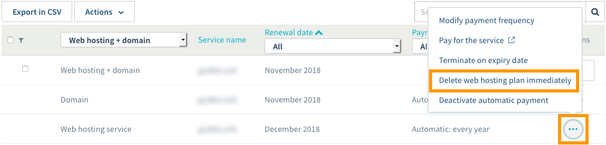

**Ostatnia aktualizacja z dnia 23-11-2018**

## Wprowadzenie

Panel klienta daje Ci możliwość pełnego zarządzania wszystkimi Twoimi usługami OVH.

**Dowiedz się, jak wyświetlać rozwiązania i zarządzać nimi w interfejsie „Zarządzanie usługami” w Panelu klienta.**

> [!primary]
>
> Możliwe jest, że niektóre części niniejszego przewodnika nie mają zastosowania do Twojej sytuacji, która może być różna w zależności od tego, gdzie znajduje się siedziba Twojej firmy i pod jakie podlega ustawodawstwo. Jeśli masz wątpliwości, sprawdź zapisy w umowach OVH dostępnych w [Panelu klienta](https://www.ovh.com/auth/?action=gotomanager){.external}, sekcja `Moje usługi`{.action} > `Regulaminy`{.action}.
>

## Wymagania początkowe

- Dostęp do [Panelu klienta](https://www.ovh.com/auth/?action=gotomanager){.external}
- Posiadanie aktywnych usług OVH

## W praktyce

Pamiętaj, że interfejs „Zarządzanie usługami” umożliwia Ci wyświetlanie wszystkich Twoich usług wykupionych w OVH. Interfejs ten służy również do zarządzania Twoimi usługami, z wyjątkiem:

- usług telekomunikacyjnych (takich, jak np. rozwiązanie xDSL, VoIP, etc.);
- [usług Microsoft](https://www.ovh.pl/office-365/){.external} (takich jak np. Exchange, Office 365 i SharePoint);
- usługi e-mail MX Plan.

Przejdź do opisu operacji, którą chcesz przeprowadzić.

- [Wyświetl Twoje usługi w interfejsie „Zarządzanie usługami”](https://docs.ovh.com/pl/billing/zarzadzanie-uslugami-ovh/#wyswietl-twoje-uslugi-w-interfejsie-zarzadzanie-uslugami){.external}.
- [Wykonuj operacje w interfejsie „Zarządzanie usługami”](https://docs.ovh.com/pl/billing/zarzadzanie-uslugami-ovh/#wykonuj-operacje-w-interfejsie-zarzadzanie-uslugami){.external}.

### Wyświetl Twoje usługi w interfejsie „Zarządzanie usługami”

Zaloguj się do [Panelu klienta](https://www.ovh.com/auth/?action=gotomanager){.external}, kliknij nazwisko powiązane z Twoim identyfikatorem klienta na pasku menu w górnym prawym rogu, następnie kliknij `Moje usługi`{.action}.

{.thumbnail}

Wyświetli się strona z tabelą wyszczególniającą Twoje usługi OVH. W tabeli możesz odnaleźć:

- nazwę usługi;
- specyficzną nazwę nadaną usłudze przez OVH (która może mieć na przykład formę numeru referencyjnego);
- datę odnowienia lub wygaśnięcia usługi;
- częstotliwość odnawiania usługi.

Niektóre usługi mogą być ze sobą powiązane (jak np. hosting i domena). W takim przypadku kliknięcie przycisku w formie strzałki pozwoli Ci je rozdzielić w tabeli.

{.thumbnail}

Jeśli korzystasz z wielu rozwiązań tabela może wyświetlać się na kilku stronach. Zastosuj filtry, aby:

- wyświetlić określoną usługę po wpisaniu jej nazwy w okno wyszukiwania znajdujące się powyżej tabeli po prawej stronie;
- posortować usługi według kilku kryteriów (filtry nad tabelą); 
- zmienić liczbę usług, które wyświetlają się na stronie (do zdefiniowania w rozwijanym menu na dole tabeli).

{.thumbnail}

### Wykonuj operacje w interfejsie „Zarządzanie usługami”

Zaloguj się do [Panelu klienta](https://www.ovhtelecom.fr/manager/auth/?action=gotomanager){.external}, kliknij nazwę powiązaną z Twoim identyfikatorem klienta na pasku menu w górnym prawym rogu, następnie kliknij `Moje usługi`{.action}.

{.thumbnail}

Wyświetli się strona z tabelą wyszczególniającą Twoje usługi OVH. Teraz, jeśli dana usługa na to pozwala, masz możliwość:

- zrezygnować z usługi w dniu jej wygaśnięcia;
- usunąć natychmiast usługę;
- przeprowadzić inne działania związane z płatnością za usługę. Aby dowiedzieć się więcej o tych zagadnieniach, zapoznaj się z instrukcjami w naszej dokumentacji [Zarządzanie odnawianiem usług](https://docs.ovh.com/pl/billing/przewodnik_dotyczacy_opcji_automatycznego_odnawiania_uslug_w_ovh/){.external}.

Pamiętaj, że niektórymi rozwiązaniami nie możesz zarządzać w interfejsie „Zarządzanie usługami”.

#### Rezygnacja z usługi w dniu jej wygaśnięcia

Czynność ta wyłącza automatyczne odnawianie danej usługi. Usługa zostanie automatycznie anulowana w dniu jej wygaśnięcia. **Pamiętaj, że dane powiązane z tą usługą zostaną usunięte w sposób nieodwracalny.** 

Aby przeprowadzić tę operację, kliknij trzy kropki po prawej stronie wybranej usługi. Kliknij `Rezygnacja z usługi w dniu wygaśnięcia`{.action}, przeczytaj informacje, które się wyświetlą, po czym potwierdź.

Pamiętaj, że możesz cofnąć tę decyzję przed upływem 24 godzin, klikając ponownie trzy kropki, a następnie `Anuluj rezygnację`{.action}.

{.thumbnail}

#### Natychmiastowe usuwanie usługi

Operacja ta, aktywna tylko dla [hostingu](https://www.ovh.pl/hosting/){.external}, powoduje natychmiastowe usunięcie wybranej usługi, czyli przed datą jej wygaśnięcia. 

**W wyniku natychmiastowego usunięcia usługi dane z nią powiązane zostaną usunięte w nieodwracalny sposób. Ponadto, nie zostanie dokonany zwrot kwoty za czas pozostały od momentu rezygnacji z usługi do dnia jej wygaśnięcia zgodnie z umową.**

Aby przeprowadzić tę operację, kliknij trzy kropki po prawej stronie nazwy usługi, którą chcesz usunąć, po czym kliknij `Usuń natychmiast hosting`{.action}. Przeczytaj informacje, które się wyświetlą i potwierdź operację. Następnie postępuj zgodnie ze wskazówkami przesłanymi w wiadomości e-mail, aż do zakończenia operacji.

{.thumbnail}

## Sprawdź również

Przyłącz się do społeczności naszych użytkowników na stronie <https://community.ovh.com/en/>.
