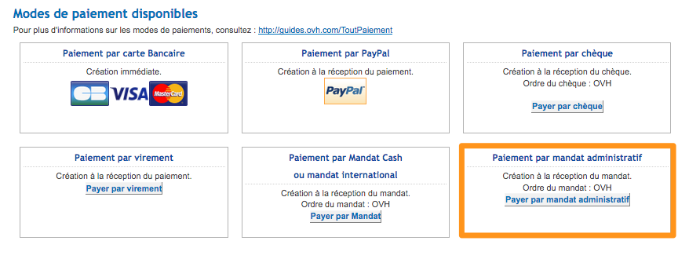

**Dernière mise à jour le 31/05/2018**

## Objectif

Depuis le 1er janvier 2018, la procédure de paiement pour les administrations a été modifiée avec un passage rendu obligatoire par l'outil [Chorus Pro](https://chorus-pro.gouv.fr/cpp/utilisateur?execution=e1s1&lang=fr_FR){.external} (conformément à l’ordonnance n° 2014-697 du 26 juin 2014 relative au développement de la facturation électronique).

Le but de cet outil est de simplifier les démarches en ligne en limitant les envois de courriers et de documents au format papier. De plus, sa facilité d'utilisation vous aide en simplifiant vos démarches administratives. 

**Ce guide vous explique le fonctionnement de la procédure avec Chorus Pro.**

## Prérequis

- Avoir créé son compte sur [Chorus Pro](https://chorus-pro.gouv.fr/cpp/utilisateur?execution=e1s1&lang=fr_FR){.external}.
- Être une administration publique et l'avoir déclaré comme tel dans l'[espace client OVH](https://www.ovh.com/auth/?action=gotomanager){.external}.

## En pratique

### Mettre en place le délai de paiement

#### Première souscription d'un service (nouvelle commande) ou renouvellement manuel

Dans le cadre de la souscription d'un nouveau produit, la procédure reste relativement similaire à ce qu'elle était avant l'arrivée de Chorus Pro.

À la fin de votre commande, lors de la validation du moyen de paiement, il vous suffit de choisir `Payer par mandat administratif`{.action} :

{.thumbnail}

Les étapes suivantes seront :

1. La réception d'un e-mail : au moment de la sélection du paiement par mandat administratif, vous recevrez un e-mail avec les informations nécessaires.
2. Le [document](https://www.ovh.com/fr/documents/paiement_administration_publique_pour_ovh.pdf){.external} devra être complété et nous être retourné signé.
3. Une fois la validation effectuée côté OVH, votre facture sera générée.

#### Renouvellement automatique

Vous n'avez aucune action particulière à effectuer dans le cadre d'un renouvellement automatique. L'intégralité du processus se déroule sur la plateforme Chorus Pro (plus d'informations dans les étapes suivantes).

### Valider les factures sur Chorus Pro

Il n'est plus nécessaire d'effectuer le paiement par mandat administratif. OVH se charge d'envoyer la facture directement sur l'interface Chorus Pro sous quelques jours.
 
À votre niveau, il sera ensuite nécessaire de valider la mise en paiement de cette facture sur la plateforme. Suite à votre validation, le Trésor public devra effectuer le paiement.

### Cas des conventions tripartites

Pour mettre en place une convention tripartite avec OVH, nous vous invitons à contacter notre [service commercial](https://www.ovh.com/fr/support/nous-contacter/){.external}.

## Aller plus loin

[La communauté Chorus Pro](https://communaute.chorus-pro.gouv.fr/){.external}

Échangez avec notre communauté d'utilisateurs sur <https://community.ovh.com>.
