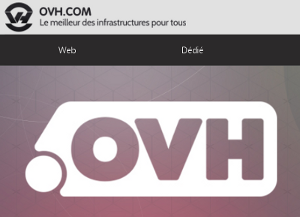

## Étape 1 : réalisation de votre bon de commande
Tout d'abord vous devez simplement réaliser votre bon de commande depuis notre [site](https://www.ovh.com/fr/index.xml). 

Vous trouverez dans  des informations sur le renouvellement de vos services.

Une fois votre bon de commande généré, gardez de côté le numéro de commande qui apparaît dans l'encart en haut à gauche.

{.thumbnail}

- Le contact de facturation renseigné doit être obligatoirement l'administration.

## Étape 2 : envoi de la preuve de paiement par mandat administratif
Une fois votre bon de commande généré, il vous est possible de demander une facture pro forma auprès de nos services.

Actuellement, pour vous procurer la facture pro forma, vous devez impérativement contacter notre service commercial par e-mail ou par téléphone.

Une fois la facture pro forma générée, vous devez envoyer la preuve de paiement par mandat administratif à nos services, à l'adresse e-mail : preuve.paiement@ovh.net ou par fax : 03 20 20 09 58.

Vous pouvez ainsi faire valider votre bon de commande en avance, et cela vous laisse un délai de 30 à 45 jours pour régulariser le paiement pour votre administration.

- Le but de ce document ?

Faire attester les responsables des administrations (trésorier, comptable...) du futur paiement. Reprenez toutes les informations du mandat administratif et indiquez-les dans le document, ainsi que le numéro du bon de commande et le délai approximatif de l'arrivée du mandat.

Il vous est possible de récupérer le document PDF pour le mandat administratif à [cette adresse]({attach}http://ovh.to/B8a5UZ). 

Dans certains cas la facture pro forma est insuffisante ; s'il vous est nécessaire d’obtenir une vraie facture, contactez notre service commercial à ce sujet.

{.thumbnail}

- Le service facturation vous laissera donc un délai de 30 à 45 jours pour nous faire parvenir votre paiement (selon le délai annoncé dans la preuve de paiement retournée). Si aucun paiement n'est reçu passé ce délai, vous serez relancé pour régulariser votre service au plus vite. Faute de paiement, le service sera suspendu automatiquement pour "impayé".

- Les paiements par mandat administratif étant plus longs que les paiements habituels, il est conseillé de procéder au renouvellement dès réception de la première relance. De même, si vous commandez un nom de domaine mais tardez à envoyer le mandat, vous courez le risque qu’une personne dépose le même nom de domaine et paye par CB. Son paiement étant validé plus rapidement, le domaine lui serait attribué.

## Étape 3 : réalisation du virement
Pour finaliser le bon de commande, effectuez le virement bancaire correspondant à votre commande en entrant les informations ci-dessous :

Domiciliation bancaire :
Banque : HSBC FR LILLE CBC
Titulaire du compte : OVH SAS
IBAN : FR76 3005 6005 0305 0300 0004 147
Code BIC : CCFRFRPP

{.thumbnail}

- Attention : Indiquez obligatoirement le numéro de bon de commande généré dans le libellé de l'opération bancaire. Si cette information ne figure pas lors de votre virement, votre argent sera bien reçu sur notre compte mais votre virement ne pourra pas être associé à votre bon de commande. Vous risquez donc une coupure de service.

