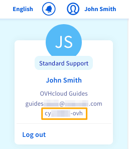
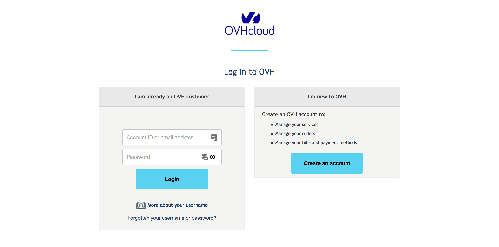
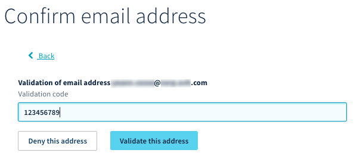

**Letzte Aktualisierung am 20.05.2020**

## Ziel

Mit einer Kundenkennung können Sie:

- Online-Bestellungen ausführen
- alle Ihre Dienste ganz einfach über Ihr Kundencenter verwalten
- sich beim OVHcloud Kundendienst identifizieren und so die Bearbeitung Ihrer Anfragen vereinfachen

Sie besteht in der Regel aus zwei Buchstaben gefolgt von Ziffern: **xx11111-ovh**.

Sie wird auch als NIC-Handle oder Benutzername bezeichnet. 

**Diese Anleitung erläutert, wie Sie Ihre Kundenkennung erstellen, sich in Ihrem Account anmelden und Ihre persönlichen Daten sowie Zugriffe auf Ihren Account verwalten.**

## Wie erstelle ich eine Kundenkennung?

Wenn Sie noch keine Kundenkennung haben, legen Sie zunächst eine auf der [OVHcloud Login-Seite](https://www.ovh.com/auth/?action=gotomanager&from=https://www.ovh.com/de/&ovhSubsidiary=de) an. 

Tragen Sie Ihre Angaben ins Online-Formular ein und geben Sie eine **gültige E-Mail-Adresse** an.

> [!primary]
>
> Wir empfehlen Ihnen, eine E-Mail-Adresse, die nicht mit Ihrer Domain verbunden ist, sowie eine Backup-E-Mail-Adresse anzugeben. Es ist wichtig, dass diese sich von der Hauptadresse unterscheidet. 
> 

Wenn Sie das Formular bestätigt haben, erhalten Sie eine E-Mail zur Erstellung Ihres Accounts. Bewahren Sie Ihre Kundenkennung und vor allem Ihr Passwort sicher auf, am besten in einem Passswort Manager. 

Um die Sicherheit Ihres Accounts zu erhöhen, empfehlen wir Ihnen:

- die [Anleitung zur Erstellung und Verwaltung Ihres Account-Passworts](../Passwort-verwalten/) zu lesen
- den Zugang zu Ihrem Kunden-Account zu sichern, indem Sie eine Zwei-Faktor-Authentifizierung einrichten. Um diese einzurichten, folgen Sie der [zugehörigen Anleitung](../Account-mit-2FA-absichern/).

## Wo finde ich meine Kundenkennung?

Wenn Sie sich in Ihrem Account einloggen oder den OVHcloud Kundendienst kontaktieren, werden Sie immer nach Ihrer Kundenkennung gefragt. Sie haben mehrere Möglichkeiten, um diese einzusehen.

### In von OVHcloud versendeten E-Mails

Ihre Kundenkennung steht in der E-Mail zur Account-Erstellung, in den E-Mails zur Bestell- oder Verlängerungsbestätigung sowie in den Login-Benachrichtigungen Ihres Accounts.

### In Ihren Rechnungen

Ihre Kundenkennung steht oben rechts auf allen Ihren Rechnungen.

{.thumbnail}

### In Ihrem Kundencenter

Um Ihre Kundenkennung im Kundencenter einzusehen, klicken Sie oben rechts auf Ihren Namen.

{.thumbnail}

## Wie kann ich mich in meinem Kundencenter einloggen?

Gehen Sie auf die [OVHcloud Authentifizierungsseite](https://www.ovh.com/auth/?action=gotomanager) und geben Sie Ihre Kundenkennung und Ihr Passwort ein.

{.thumbnail}

Falls die [Zwei-Faktor-Authentifizierung](../Account-mit-2FA-absichern/) bereits aktiviert wurde, muss diese nun ebenfalls durchgeführt werden. Diese zusätzliche Sicherung Ihres Kunden-Accounts ergänzt den Login mit Kennung und Passwort und wird von einem Ihrer Geräte generiert: Smartphone, Tablet oder USB-Token.

> [!primary]
> Wenn Sie Ihren Account nicht mit der Zwei-Faktor-Authentifizierung gesichert haben, kann es vorkommen, dass Sie nach einem Bestätigungscode gefragt werden. Dieser wird Ihnen per E-Mail **an die Hauptadresse** des Accounts versendet.  
>
> Wenn Sie diesen Code nicht finden können, sehen Sie im Spam- oder Junk-Ordner Ihrer E-Mail-Adresse nach.
>

### Bei Verlust des Passworts

Wenn Sie das Passwort verloren oder vergessen haben, lesen Sie [die Anleitung zur Passwortänderung](../Passwort-verwalten/#wenn-sie-ihr-aktuelles-passwort-nicht-kennen).

### Bei Nichtverfügbarkeit der E-Mail-Adresse

Wenn Sie eine Backup-E-Mail-Adresse angegeben haben, können Sie [den OVHcloud Kundendienst kontaktieren](https://help.ovhcloud.com/de/), um diese sekundäre Adresse zur Hauptadresse umzustellen. Denken Sie daran, nach Abschluss dieser Aktion eine neue Backup-Adresse anzugeben.

Wenn Sie keine Backup-Adresse angegeben haben oder diese ebenfalls nicht verfügbar ist, befolgen Sie den hier angegebenen [Prozess](https://www.ovh.de/cgi-bin/de/procedure/procedureChangeEmail.cgi). Wenn wir die so erstellte Anfrage erhalten haben und alle erforderlichen Dokumente gültig sind, können wir Ihre Kontakt-E-Mail-Adresse ändern.

## Wie bearbeite ich meine persönlichen Daten?

### Persönliche Daten ändern

Sie können Ihre Account-Daten im Kundencenter ändern. Klicken Sie hierzu rechts oben in Ihrem Kundencenter auf Ihren Namen und dann auf Ihre Initialen.

{.thumbnail}

Klicken Sie dann im Bereich „Mein Profil“ auf `...`{.action} und anschließend auf `Profil bearbeiten`{.action}.

{.thumbnail}

Ändern Sie Ihre Angaben und klicken sie danach auf den Button `Bestätigen`{.action}.

> [!warning]
>
> Es ist wichtig, dass Ihre persönlichen Daten **aktuell** und **korrekt** sind. Nach diesen werden Sie gefragt, wenn Sie sich an den OVHcloud Kundendienst wenden, und Sie können gegebenenfalls auch aufgefordert werden, Ihre Angaben nachzuweisen (Beispiel: wenn Sie Ihre E-Mail-Adresse ändern, kann der Kundendienst einen Beleg dafür fordern, dass Ihre Adresse und die im Kundencenter hinterlegte Adresse identisch sind).
>

### Haupt-E-Mail-Adresse ändern

Wenn Sie eine neue Haupt-Kontaktadresse eingeben möchten, wird Ihnen ein Code an Ihre aktuelle Haupt-E-Mail-Adresse gesendet, um die neue Adresse zu bestätigen. Wenn Sie diesen Code erhalten haben, klicken Sie auf „Ich habe meinen Validierungscode erhalten“.

{.thumbnail}

Geben Sie dann den Code im Bereich „Validierungscode“ ein und bestätigen Sie diesen.

{.thumbnail}

### Rechte für Ihre personenbezogenen Daten ausüben

In Übereinstimmung mit der Datenschutz-Grundverordnung (DSGVO) können Sie [dieses Formular](https://www.ovh.de/schutz-personenbezogener-daten/rechte-ausueben) nutzen, um Ihre Rechte in Bezug auf den Schutz Ihrer personenbezogenen Daten auszuüben.

### Kundenkennung löschen

Sie können anfordern, dass Ihre Kundenkennung und alle zugehörigen Daten gelöscht werden, indem Sie das [Formular zur Ausübung Ihrer Rechte gemäß der DSGVO](https://www.ovh.de/schutz-personenbezogener-daten/rechte-ausueben) ausfüllen und dort „Recht auf Löschung“ auswählen.

> [!warning]
>
Zur Löschung Ihrer Kundenkennung müssen die folgenden Bedingungen erfüllt sein:
>
> - Ihr Account beinhaltet keinerlei Dienste
>
> - Ihr Account enthält keine offenen Rechnungen oder unbezahlten Bestellungen
>
>

## Zugriff auf Ihren Account verwalten

Die Login-Daten Ihres Accounts sollten nie mit anderen Personen geteilt oder in irgendeiner Weise weitergegeben werden.

Es kann jedoch vorkommen, dass Sie den Zugriff auf Ihre OVHcloud Dienste mit Dritten teilen möchten. Es könnte sich dabei etwa um Mitglieder Ihres Unternehmens (zum Beispiel ein Webmaster oder eine stellvertretende Person) oder um externe Partner (zum Beispiel eine Buchhaltungsfirma oder IT-Entwickler) handeln.

In diesem Fall ermöglicht es Ihnen OVHcloud, weiteren Parteien Zugriff auf Ihren Account zu gewähren und gleichzeitig Ihre Login-Daten (Passwort und Zwei-Faktor-Authentifizierung) zu schützen.

### Benutzer erstellen

Ein Benutzer kann Lese- und Schreibrechte für Ihren Account und alle Ihre Dienste erhalten. Sie können diese Benutzer über Ihr Kundencenter erstellen, verwalten und löschen. Um mehr zu erfahren, lesen Sie die [Anleitung zur Benutzerverwaltung](../benutzer-verwalten/).

### Kontakte verwalten

Sie können die administrative **oder** technische Verwaltung **oder** die Rechnungsverwaltung eines oder mehrerer Dienste Ihres Accounts an eine andere Kundenkennung übertragen. Um mehr zu erfahren, lesen Sie die [Anleitung zur Verwaltung der Kontakte](../verwaltung-der-kontakte/).

## Was sollte ich bei Verdacht auf Identitätsbetrug tun?

Wenn Sie per E-Mail über eine unbekannte Verbindung mit Ihrem Kundencenter informiert werden, empfehlen wir Ihnen, sofort [Ihr Passwort zu ändern](../Passwort-verwalten/#passwort-andern) und Ihren Account zusätzlich [mit Zwei-Faktor-Authentifizierung zu schützen](../Account-mit-2FA-absichern/).

Wenn Sie eine verdächtige Aktivität in Ihrem Account feststellen, wenden Sie sich an den OVHcloud Kundendienst, indem Sie eine [Support-Anfrage](https://www.ovh.com/manager/dedicated/#/support/tickets/new) im OVHcloud Kundencenter erstellen.

## Weiterführende Informationen

Für den Austausch mit unserer User Community gehen Sie auf <https://community.ovh.com/en/>.