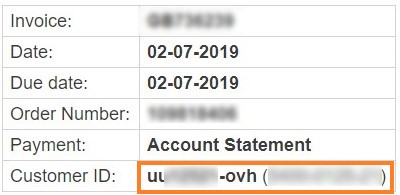
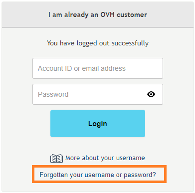
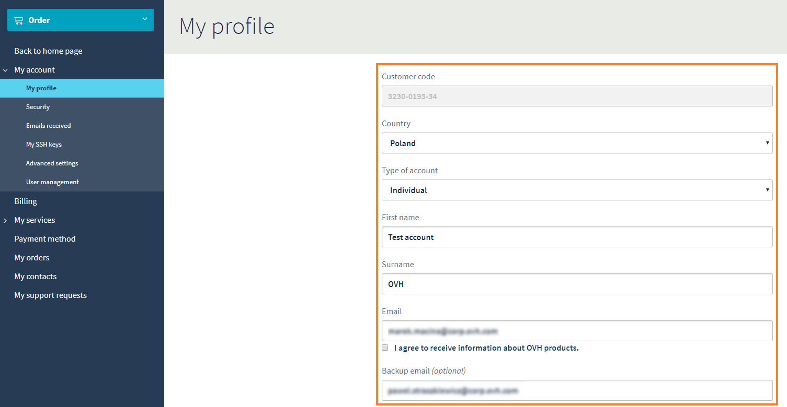
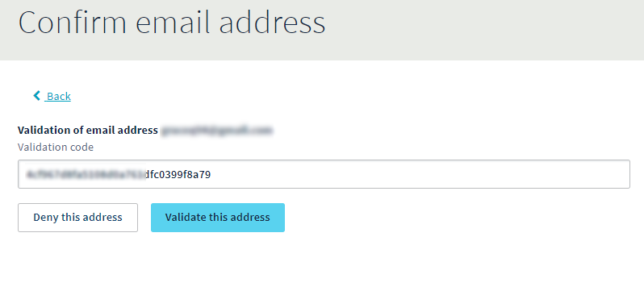

## What is it used for?
Your username lets you:

- order online.
- identify yourself quickly to customer services so that they can deal with your questions.
- manage all of your services easily with your control panel.

Your username will look something like this: **dm429850-OVH**

It is also called a nichandle.

## How do I create a username?
If you do not already have a username, you just have to go to [this page](https://www.ovh.com/auth/?action=gotomanager&from=https://www.ovh.co.uk/&ovhSubsidiary=GB){.external}. You will find an online form. Enter your details, paying special attention to provide a valid email address.

> [!success]
>
> We suggest that you provide an email address that does not use your domain name
> as well as an emergency email address.
> 

When you have filled out the form you will get an email to confirm that it has been created. Keep your username (nichandle) and password safe.

## Where can I find my username again?

### In the email which confirms that you have created it
Your username is provided in the confirmation email when you create your account, in emails confirming orders or renewals and when you are notified of connections to your account.

### On your invoices
Your username is provided on all of your invoices, in the top right, with all the useful information.

{.thumbnail}

### In your control panel
When you are logged in to your control panel, you will see your username in the top right, next to your name.

{.thumbnail}

## How do I retrieve my password?
You can retrieve your password by clicking on  **forgotten password**  on the login page of your [control panel](https://www.ovhtelecom.fr/espaceclient/login/){.external}.

A confirmation email will be sent to the contact email address. If you can no longer access this address, you can fill in this [procedure](https://www.ovh.co.uk/cgi-bin/procedure/procedureChangeEmail.cgi){.external}

{.thumbnail}

## Personal information

### Modify information
You can modify your account information in your control panel. You just have to:

- Click on your username in the top right of your control panel.
- Then click on My account .

{.thumbnail}

- Here you can modify data of your account by changing the values.

{.thumbnail}

-After modification click the Confirm button.

{.thumbnail}

### Useful information
If you want to change you main contact email address, you will have to confirm this using a code which will be sent to your main contact email address. Once you have got this code, just click "I have received my validation code".

{.thumbnail}

Once you have the code, enter it in the "Validation code" section and then confirm.

{.thumbnail}

## Managing contacts
Please follow this [guide]({legacy}1858){.ref} if you need more information on managing contacts.
