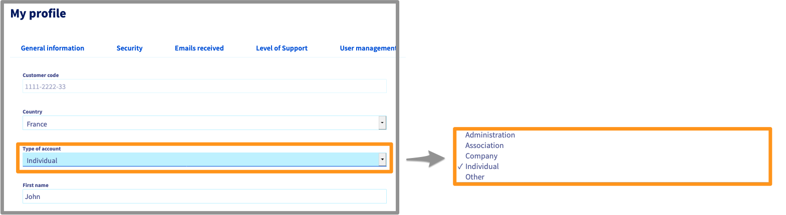

**Last updated 1st July 2021**

## Objective

Your data and services are mainly managed via the OVHcloud Control Panel.
It is therefore essential to adopt best practices for managing your account in order to secure and maintain access to it.

You can also use the OVHcloud Control Panel to manage your personal data, and delegate access to your services to other users.

**Find out about best practices for managing your account and personal data.**

## Requirements

- an [OVHcloud account](https://docs.ovh.com/us/en/customer/create-ovhcloud-account/)
- access to the [OVHcloud Control Panel](https://ca.ovh.com/auth/?action=gotomanager&from=https://www.ovh.com/world/&ovhSubsidiary=we)

> [!primary]
> If you experience any difficulties logging in to your account, please read the “[What do I do if I can't log in?](https://docs.ovh.com/us/en/customer/log-in-to-ovhcloud-control-panel#login-failure)” section of our guide on [Logging in to the OVHcloud Control Panel](https://docs.ovh.com/us/en/customer/log-in-to-ovhcloud-control-panel).

## Instructions

This guide details:

- [OVHcloud account security and management best practices](#best-practices)
- [How to manage and update your personal data](#personal-information)
- [How to securely delegate access to your OVHcloud account](#delegation)

### OVHcloud account management best practices 

The best practices listed below should be applied as soon as you create your OVHcloud account, to optimise security for your services and data.

### Creating a strong, unique password

The security of your services and data depends on the efficiency of your password. It must be **complex, unique and regularly renewed**.

You can find all of our password recommendations in our guide on [Setting and managing an account password](https://docs.ovh.com/us/en/customer/manage-password/).

#### Saving your password

If you have not already done so, save your password in a [password manager](https://docs.ovh.com/us/en/customer/manage-password/#use-a-password-manager) .

> [!primary]
> The **Keepass** and **Bitwarden** software are free and open-source password managers.
>

#### Adding a backup email address 

If you experience any issues accessing your primary email address, a backup email address will help you retain access to your account, and manage your services as a result.
 This second address **must be different** from the first, in particular to facilitate your procedures in case of password recovery.

To enter this backup email address, click on your name in the top right-hand corner of your account, then click on your initials.

Then, in the `My profile` box, click the `...`{.action} button, then `Edit my profile`{.action}.

{.thumbnail}

> [!warning]
> As a reminder, it is **essential** that the backup email address is **different** from the account’s main email address.
>
> Avoid using email addresses linked to a domain name that you manage from your Control Panel. If your domain is blocked, you will no longer receive our notifications.
>

#### Enabling two-factor authentication

Two-factor authentication increases security for your OVHcloud account.

You can find all the details to enable it in our guide on [Securing your OVHcloud account with two-factor authentication](https://docs.ovh.com/us/en/customer/secure-account-with-2FA/).

> [!primary]
> Enabling two-factor authentication on your OVHcloud account is a mandatory requirement for compliance with the [HDS certification](https://www.ovhcloud.com/en/enterprise/certification-conformity/hds/).

### How to manage your personal details 

### Changing your personal details

You can change your account information via the Control Panel. To do this, click on your name in the top right-hand corner of the [OVHcloud Control Panel](https://ca.ovh.com/auth/?action=gotomanager&from=https://www.ovh.com/world/&ovhSubsidiary=we), then click on your initials.

{.thumbnail}

Next, click `...`{.action} in the “My profile” section, then `Edit my profile`{.action}.

{.thumbnail}

Edit your details, then click `Confirm`{.action} .

> [!warning]
>
> It is highly important to keep your details **up-to-date** and **accurate**. You will be asked to provide your details when you get in touch with the OVHcloud support team, and there may be instances where you are required to provide proof that your details are accurate (such as proof that your address is identical to the address detailed on the account. This may be requested when you follow the email address change procedure).
>

### Changing your primary email address

If you would like to change your primary contact email address, you will need to validate it using a code sent to your current primary contact email address. Once you have received the code, click the `I have received my validation code`{.action} button.

{.thumbnail}

Next, enter the code into the `Validation code` section, and click `Confirm`{.action}.

{.thumbnail}

#### Changing the account type

Click on the `Type of account` button when you edit your profile. A drop-down menu allows you to define the type of account corresponding to your situation.

{.thumbnail}

Once you have entered this information, click the `Confirm`{.action} button.

#### Exercising your personal data rights

In compliance with the General Data Protection Regulation (GDPR), you can request to exercise the rights associated with personal data concerning you by using [this form](https://www.ovh.co.uk/personal-data-protection/exercising-your-rights).

#### Deleting your NIC handle

You can request for your NIC handle and all of the data associated with it to be deleted by filling in the [form for exercising GDPR rights](https://www.ovh.co.uk/personal-data-protection/exercising-your-rights) and selecting “Right of deletion”.

> [!warning]
>
To delete your NIC handle, you will need to meet the following conditions:
>
> - Your account must no longer contain any services.
>
> - Your account must not have any outstanding bills or unpaid orders.
>

### Managing access to your account 

We advise to never share your account details.

However, you may find that you need to delegate third-party access to your OVHcloud services. The third parties could be members of your company (for example a webmaster or a proxy), or independent entities (for example an accounting firm or IT developers).

In this scenario, OVHcloud enables you to grant access to your account while protecting your credentials (password and two-factor authentication).

#### Creating users

A user can have read or write access to your account, or all of your services. You can create, manage and delete these users via the OVHcloud Control Panel. To find out more, please refer to our [guide on user management](https://docs.ovh.com/us/en/customer/managing-users/).

## What to do in the event of identity theft

If you receive an email notifying you of an unknown connection to your OVHcloud account, we advise [changing your account password immediately](https://docs.ovh.com/us/en/customer/manage-password/#change-your-password) and [securing it with two-factor authentication](https://docs.ovh.com/us/en/customer/secure-account-with-2FA/).

If you observe any suspicious activity on your account, please inform our support team by creating a support request in your [OVHcloud Control Panel](https://ca.ovh.com/manager/#/dedicated/support/tickets/new).

## Go further

[Setting and managing an account password](https://docs.ovh.com/us/en/customer/manage-password/)

[Securing your OVHcloud account with two-factor authentication](https://docs.ovh.com/us/en/customer/secure-account-with-2FA/)

[Logging in to the OVHcloud Control Panel](https://docs.ovh.com/us/en/customer/log-in-to-ovhcloud-control-panel)

[What do I do if I can't log in?](https://docs.ovh.com/us/en/customer/log-in-to-ovhcloud-control-panel/#login-failure)

Join our community of users on <https://community.ovh.com/en/>.
