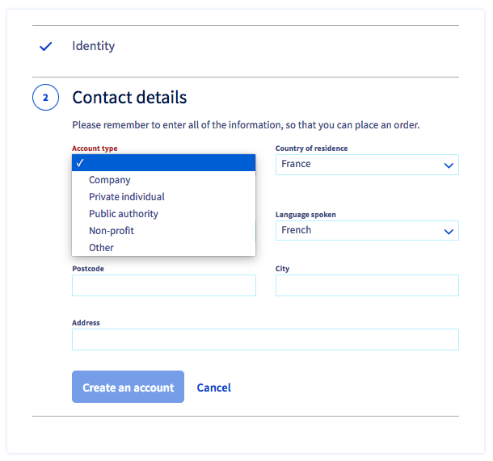

**Dernière mise à jour le 30/06/2021**

## Objectif

Pour utiliser les services OVHcloud, vous devez d'abord créer votre compte.
Chaque compte client OVHcloud est associé à un identifiant unique, aussi appelé NIC-handle.

Il est le plus souvent composé de deux lettres suivies de chiffres. Par exemple : **xx11111-ovh**.

Cet identifiant client vous permet :

- de réaliser des commandes en ligne ;
- de vous connecter à votre espace client pour gérer l'ensemble de vos services ;
- de vous identifier lors de votre prise de contact avec le support d'OVHcloud et ainsi faciliter le traitement de vos questions.

**Apprenez à créer votre compte OVHcloud, à vous authentifier sur celui-ci, mais aussi à gérer vos informations personnelles et les accès à votre compte.**

<iframe width="560" height="315" src="https://www.youtube-nocookie.com/embed/odO58c4gJfc" frameborder="0" allow="accelerometer; autoplay; clipboard-write; encrypted-media; gyroscope; picture-in-picture" allowfullscreen></iframe>

## En pratique

### Comment créer un compte OVHcloud ?

Pour créer un compte OVHcloud, il suffit de vous rendre sur [cette page](https://www.ovh.com/auth/?action=gotomanager&from=https://www.ovh.com/fr/&ovhSubsidiary=fr){.external} et de compléter le formulaire en ligne.

{.thumbnail}

|Informations|Description|
|---|---|
|Prénom - Nom|Renseignez **impérativement** ici un prénom et un nom usuels.|
|Adresse e-mail|Renseignez une adresse e-mail **valide et à laquelle vous avez actuellement accès**.  Elle doit être extérieure à votre nom de domaine si vous en avez un.|
|Mot de passe|Votre mot de passe doit être unique (créé et utilisé uniquement pour votre compte OVHcloud) et suffisamment complexe.  Consultez les conseils de [notre guide sur la gestion du mot de passe](https://docs.ovh.com/fr/customer/gerer-son-mot-de-passe/#en-pratique) pour créer un mot de passe efficace.|

Une fois ce premier formulaire complété, un code à usage unique vous sera envoyé à l'adresse e-mail que vous avez renseignée. Ce code permettra de valider votre adresse e-mail. Renseignez-le dans les cases prévues à cet effet.

{.thumbnail}

> [!primary]
> Si vous n'avez pas reçu l'e-mail contenant le code, vérifiez les dossiers « spam » / « courrier indésirable » de votre adresse e-mail.
>
> Vous pouvez déclencher l'envoi d'un nouveau code en cliquant sur le lien prévu à cet effet en bas de cette page.
>
> Si l'adresse e-mail que vous avez renseignée n'est pas valide ou disponible, cliquez sur le bouton `Modifier l'adresse e-mail`{.action}.
>

Une fois le code saisi et validé, complétez la suite du formulaire. Veillez notamment à bien définir le **type de compte** parmi les choix proposés.

{.thumbnail}

Votre compte créé, vous serez automatiquement connecté sur la page d'accueil, appelé « Tableau de bord », de votre compte.

Votre identifiant client est affiché en haut à droite sous votre nom et votre adresse e-mail.
 Prenez-en bien note car vous en aurez besoin pour chaque connexion à votre compte.

{.thumbnail}

### Une fois mon compte OVHcloud créé, que dois-je faire ?

#### Sauvegarder mon mot de passe

Si vous ne l'avez pas encore fait, sauvegardez votre mot de passe dans un [gestionnaire de mots de passe](https://docs.ovh.com/fr/customer/gerer-son-mot-de-passe/#utiliser-un-gestionnaire-de-mots-de-passe).

> [!primary]
> Les logiciels **Keepass** et **Bitwarden** sont des gestionnaires de mots de passe gratuits et libres de droits.
>

#### Ajouter une adresse e-mail de secours 

En cas de difficulté d'accès à votre adresse e-mail principale, une adresse e-mail de secours permet de conserver l'accès à votre compte et donc à la gestion de vos services.

Pour renseigner une adresse e-mail de secours, cliquez sur votre nom en haut à droite de votre compte puis cliquez sur vos initiales.

Cliquez alors, dans le cadre `Mon profil` sur le bouton `...`{.action} puis sur `Éditer mon profil`{.action}.

{.thumbnail}

> [!warning]
> Il est impératif que l'adresse e-mail de secours soit **différente** de l'adresse e-mail principale du compte.
>
> Il est préférable que les adresses e-mail (principale et de secours) de contact de votre compte ne soient pas liées à vos noms de domaines.
>  En effet, si pour la moindre raison (par exemple un oubli de renouvellement) votre nom de domaine est suspendu, les adresses e-mails liées à celui-ci seront également suspendues.

#### Activer la double authentification

La double authentification permet de renforcer la sécurité de votre compte OVHcloud.

Vous trouverez tous les détails pour l'activer sur notre guide « [Sécuriser son compte OVHcloud avec la double authentification](https://docs.ovh.com/fr/customer/securiser-son-compte-avec-une-2FA/) ».

#### Renseigner un moyen de paiement

Enregistrer un moyen de paiement valide dans votre compte OVHcloud permet de garantir le bon renouvellement de vos services.

Pour plus de détails sur les moyens de paiement, consultez notre guide « [Gérer mes moyens de paiement](https://docs.ovh.com/fr/billing/manage-payment-methods/) ».

### Comment retrouver mon identifiant client ?

L'identifiant client vous sera invariablement demandé lorsque vous vous connecterez à votre compte ou que vous contacterez l'assistance technique d'OVHcloud. Vous pouvez le retrouver de différentes manières.

#### Dans les e-mails envoyés par OVHcloud

Votre identifiant client est renseigné sur l'e-mail de confirmation de création du compte, les messages de confirmation de commande ou de renouvellement, ainsi que dans les notifications de connexion à votre compte.

#### Sur mes factures

Votre identifiant client est renseigné en haut à droite sur toutes vos factures.

{.thumbnail}

#### Sur mon espace client

Vous pouvez retrouver votre identifiant dans votre espace client, en cliquant sur votre nom en haut à droite.
 Il est affiché sous votre adresse e-mail.

{.thumbnail}

### Comment me connecter à mon espace client ?

Rendez-vous sur [la page d'authentification OVHcloud](https://www.ovh.com/auth/?action=gotomanager&from=https://www.ovh.com/fr/&ovhSubsidiary=fr){.external}, renseignez votre identifiant et votre mot de passe.

{.thumbnail}

Si vous activé la [double authentification](https://docs.ovh.com/fr/customer/securiser-son-compte-avec-une-2FA/), vous devrez ensuite renseigner le code unique de connexion généré par votre périphérique (téléphone, tablette ou clé U2F).

> [!primary]
> Si vous n'avez pas activé la double authentification sur votre compte, un code de vérification peut vous être demandé afin de valider votre identification. Celui-ci vous est envoyé par e-mail **sur l'adresse principale** du compte.
>
> Si vous ne retrouvez pas ce code, pensez à vérifier les dossiers « spam » / « courrier indésirable » de votre adresse e-mail.
>

#### J'ai perdu mon mot de passe

En cas de perte ou d'oubli de votre mot de passe, consultez [ce guide détaillant la marche à suivre pour le modifier](https://docs.ovh.com/fr/customer/gerer-son-mot-de-passe/#si-vous-ne-connaissez-plus-votre-mot-de-passe-actuel).

#### J'ai perdu mon mot de passe et mon adresse e-mail principale n'est plus valide

Dans ce cas de figure, la procédure de réinitialisation du mot de passe ne peut être effectuée.

**Si vous avez renseigné une adresse e-mail de secours**, vous pouvez contacter le support OVHcloud au 1007 (composez le 0033 9 72 10 10 07 depuis une ligne en dehors de la France) afin que cette adresse de secours devienne l'adresse e-mail principale.
 Une fois cette action effectuée, il est essentiel de [renseigner une nouvelle adresse e-mail de secours](#backup-email).

**Si vous n'avez pas renseigné d'adresse e-mail de secours ou que celle-ci est également invalide**, vous pouvez suivre cette [procédure](http://www.ovh.com/fr/cgi-bin/fr/procedure/procedureChangeEmail.cgi){.external} à nous adresser par courrier postal.
 Une fois le courrier reçu par nos services, nous procéderons alors au remplacement de votre adresse e-mail de contact si tous les justificatifs réclamés sont conformes.

### Comment gérer mes informations personnelles ?

#### Modifier mes informations personnelles

Vous pouvez modifier les informations de votre compte depuis votre espace client. Pour cela, cliquez sur votre nom en haut à droite dans votre espace client, puis sur vos initiales.

Cliquez alors sur le bouton `...`{.action} dans le cadre `Mon profil`, puis sur `Éditer mon profil`{.action}.

{.thumbnail}

Modifiez vos informations, puis cliquez sur le bouton `Valider`{.action} .

> [!warning]
>
> Il est important que vos informations personnelles soient **à jour** et **exactes**. Elles vous seront demandées lors de vos contacts avec le support d'OVHcloud et vous devez être en capacité d'en justifier l'exactitude le cas échéant (exemple : un justificatif de domicile identique à l'adresse renseignée sur votre compte, peut vous être demandé lors d'une procédure de changement d'adresse e-mail).
>

#### Modifier l'adresse e-mail principale

Si vous désirez renseigner une nouvelle adresse e-mail principale de contact, vous devrez valider celle-ci à l'aide d'un code envoyé à votre adresse de contact principale actuelle. Une fois ce code reçu, cliquez sur le bouton « J'ai reçu mon code de validation ».

{.thumbnail}

Renseignez alors le code dans le champ intitulé « Code de validation », puis validez.

{.thumbnail}

#### Modifier le type de compte

Cliquez sur la mention `type de compte` lorsque vous éditez votre profil. Un menu déroulant vous permet de définir le type de compte correspondant à votre situation.

{.thumbnail}

Une fois vos informations complétées, cliquez sur le bouton `Valider`{.action}.

#### Exercer mes droits sur mes données personnelles

Conformément au Réglement général sur la protection des données (RGPD), vous pouvez demander à exercer les droits relatifs à la protection de vos données à caractère personnel en complétant [ce formulaire](https://www.ovh.com/fr/protection-donnees-personnelles/exercer-vos-droits/){.external}.

#### Supprimer mon compte OVHcloud

Vous pouvez demander à supprimer votre compte OVHcloud et les données liées en complétant [le formulaire d'exercice des droits RGPD](https://www.ovh.com/fr/protection-donnees-personnelles/exercer-vos-droits/){.external} et en y choisissant le « Droit d'effacement ».

> [!warning]
>
La suppression de votre compte OVHcloud nécessite que les conditions suivantes soient remplies  :
>
> - votre compte ne doit plus contenir aucun service ;
>
> - votre compte doit être exempt de toute facture ou commande impayée.
>

### Gérer les accès à mon compte

Les informations d'identification de votre compte n'ont pas vocation à être partagées et/ou divulguées.

Vous pouvez cependant éprouver le besoin de déléguer l'accès à vos services OVHcloud à des tiers, qu'il s'agisse de membres de votre entreprise (le webmaster de votre entreprise par exemple) ou d'entités indépendantes (par exemple, un cabinet comptable).

Dans ces cas de figure, OVHcloud vous permet de donner des accès à votre compte tout en protégeant vos informations d'identification (mot de passe, double authentification).

#### Créer des utilisateurs

Un utilisateur pourra détenir des droits en lecture ou en écriture sur votre compte et l'ensemble de vos services. Vous pourrez créer, administrer et supprimer ces utilisateurs depuis votre espace client.

Ainsi, non seulement votre propre accès au compte restera sécurisé par la double authentification, mais chaque utilisateur bénéficiera de :
- son propre identifiant;
- son propre mot de passe;
- sa propre double-authentification.

En tant qu'utilisateur principal du compte, vous restez gestionnaire des utilisateurs et de leurs droits.

Pour en savoir davantage, consultez le [le guide sur la gestion des utilisateurs](https://docs.ovh.com/fr/customer/gestion-utilisateurs/).

#### Gérer les contacts

Vous pouvez déléguer la gestion administrative **ou** technique **ou** de facturation d'un ou plusieurs services de votre compte à un autre identifiant client. Consultez le guide sur [la gestion des contacts](https://docs.ovh.com/fr/customer/gestion-des-contacts/) pour en savoir plus.

### Que faire en cas de suspicion d'usurpation d'identité ?

Si vous recevez un e-mail vous indiquant une connexion inconnue à votre espace client, nous vous conseillons de [modifier immédiatement le mot de passe de votre compte](https://docs.ovh.com/fr/customer/gerer-son-mot-de-passe/#modifier-votre-mot-de-passe) et de [sécuriser celui-ci via une double authentification](https://docs.ovh.com/fr/customer/securiser-son-compte-avec-une-2FA/).

Si vous constatez une activité suspecte sur votre compte, [contactez le support OVHcloud](https://www.ovh.com/fr/support/nous-contacter/) afin que nos équipes vous assistent dans les démarches à entreprendre.

## Aller plus loin

[Définir et gérer le mot de passe de votre compte](https://docs.ovh.com/fr/customer/gerer-son-mot-de-passe/)

[Sécuriser son compte OVHcloud avec la double authentification](https://docs.ovh.com/fr/customer/securiser-son-compte-avec-une-2FA/)

Échangez avec notre communauté d'utilisateurs sur <https://community.ovh.com>.
