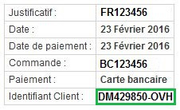
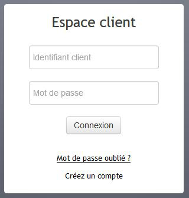
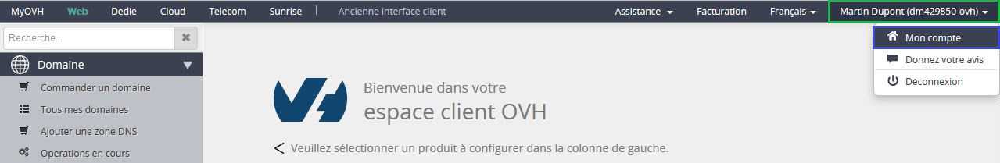
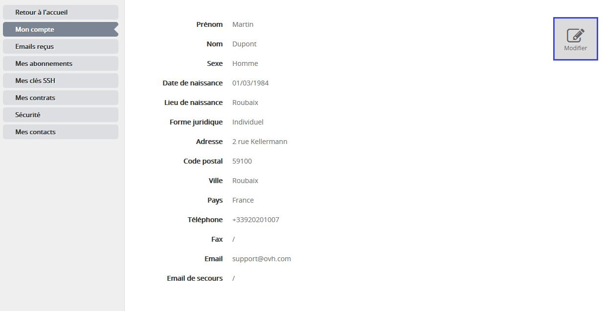
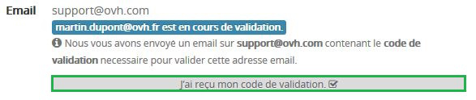
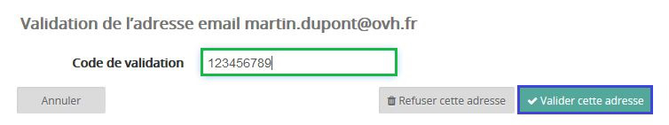

## 
Met uw gebruikersnaam kunt u: 

- online bestellen
- uzelf snel identificeren bij klantenservice/tech support zodat ze u snel met uw vragen kunnen helpen.
- al uw services makkelijk beheren met uw control panel. 

Uw gebruikersnaam zal er ongeveer zo uitzien: 
dm429850-OVH

Het wordt ook wel een NIC handle genoemd.

## 
Als u nog geen gebruikersnaam hebt hoeft u alleen maar naar [deze pagina](https://www.ovh.com/auth/?action=gotomanager&from=https://www.ovh.nl/&ovhSubsidiary=nl) te gaan. 
U vindt er een online formulier. Voer aub uw gegevens in en ga dubbel na of u een geldig e-mailadres hebt ingevoerd.

## Tip:
Voer een e-mailadres dat niet is gekoppeld aan uw domeinnaam, en ook een back-up e-mailadres.
Wanneer u het formulier hebt ingevuld krijgt u een e-mail ter bevestiging dat het is aangemaakt. Houd uw gebruikersnaam (NIC handle) en wachtwoord veilig.

## In de e-mail die bevestigt dat u het heeft aangemaakt.
Uw gebruikersnaam is gegeven in de bevestigende e-mail toen u uw account creëerde, in e-mails die bestellingen of verlengingen bevestigen en e-mails ter notificatie verbindingen met uw account.

## Op uw facturen
Uw gebruikersnaam staat rechtsboven op al uw facturen met alle handige informatie.

{.thumbnail}

## In uw control panel
Wanneer u op uw control panel bent ingelogd zult uw gebruikersnaam rechtsbovenaan zien staan, naast uw naam.

{.thumbnail}

## 
U kunt uw wachtwoord achterhalen door te klikken op wachtwoord vergeten op de inlogpagina van uw [control panel](https://https://ssl0.ovh.net/).

Er zal een bevestigende e-mail verzonden worden aan het contact e-mailadres. 
Als u geen toegang meer heeft tot dit adres kunt u het volgende formulier invullen:  
[procedure](https://http://www.ovh.nl/cgi-bin/procedure/procedureChangeEmail.cgi)

{.thumbnail}

## Wijzig gegevens
U kunt uw accountinformatie wijzigen in uw control panel. Het enige dat u hiervoor hoeft te doen: 

- Klik op uw gebruikersnaam rechtsboven in uw control panel. 
- Klik vervolgens op Mijn account.

{.thumbnail}

- Klik Wijzigen.

{.thumbnail}

- Wijzig uw gegevens en klik op Bevestigen.

{.thumbnail}

## Handige informatie.
Als u uw voornaamste contact e-mailadres wilt wijzigen dan moet u dit bevestigen met een code die naar uw voornaamste contact e-mailadres wordt verzonden. Zodra u deze code heeft hoeft u alleen maar te klikken op 'Ik heb mijn code ontvangen'.

{.thumbnail}
Zodra u de code heeft kunt u het invoeren in het 'Validatiecode' onderdeel en dan klikt u op bevestigen.

{.thumbnail}
Als u niet binnen 24 uur op deze e-mail hebt gereageerd dat zal de wijziging automatisch geaccepteerd worden.

## 
Volg aub deze [handleiding](https://www.ovh.co.uk/g1858.management_of_contacts_and_personal_information) als u meer informatie wilt over contactbeheer.

