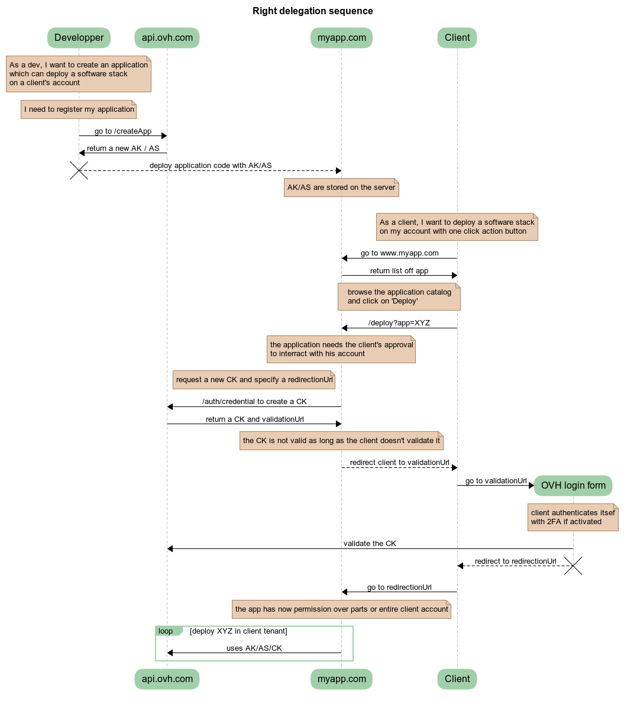

**Last updated 8th February 2020**

## Objective

In this guide, you'll learn how to use the OVH API to manage services and ressources of someone else account.

As an example, let's assume that you want to create a marketplace where, you as a service provider, can install and configure ressources of other OVH clients.

## Requirements

- an OVH account

## Application registration

The first part, as the application developper, is to register your application on OVH.

To do so, go to https://api.ovh.com/createApp/

You'll need to log in and set an application name and description.


After submittion, you'll get your `Application Key` and `Application Secret`, later refered as `AK` and `AS`.


The `AK` is identifying your application. It can be publicly shared.

The `AS` is a key used to sign the API requests which will be made later by your application. It **must** be kept secret.

## Deploy your application

To illustrate that part, let's assume that you've deployed your application code on a server.

Your application can access the value of `AK` and `AS` and displays a list of software stack or services available for installation by customers.

## Right delegation

Let's assume that a client browsing your marketplace selects a service to deploy on its OVH account. So far, you don't have any right on the client's API. You have to ask the client the permission to manage its ressources.


### Create a permission request

The first step is for your application to request permissions on the client's API.

To do so, your application will request credential by calling https://api.ovh.com/console/#/auth/credential#POST and passing as argument a list of endpoints the application needs access to.

<!--
Application Name: maketplace
Application Description: my little marketplace
Application Key: F7gzxgxN5eqwuAsK
Application Secret: UsNmaE8iqvAV6qT0VieCNVrSys9a5hkr
 -->

<!-- https://webhook.site/586c652e-061e-453f-bd71-51912e33419d -->

Example with curl with a access request to `GET /me`.

```bash
export AK=F7gzxgxN5eqwuAsK
export REDIRECT_URL=https://webhook.site/586c652e-061e-453f-bd71-51912e33419d # usefull for debug

curl -vv -XPOST -H "Content-type: application/json" -H "X-Ovh-Application: $AK" -d '{"redirection": "$REDIRECT_URL", "accessRules": [{"method": "GET", "path": "/me"}]}' https://eu.api.ovh.com/1.0/auth/credential
```

The result of that call will be a JSON dictionary

```json
{
  "state":"pendingValidation",
  "consumerKey":"5DU984kYxyoAe4lRaevZCGnmt9FVnKT2",
  "validationUrl":"https://eu.api.ovh.com/auth/?credentialToken=RAXoRq9FvUQFI1S6hE0HmkySyVp8aDWwIqBA3fYrOr0vVSMdpjqxFqp3IjyjGAfu"
}
```

As the developper, you have to store the `consumerKey`, later refered as `CK`. This key will be used to sign the OVH API requests on behalf of your client.

The request has been made and you need your client to accept it by redirecting him to `validationUrl`

### Client login form

After redirecting the client to `validationUrl`, he'll be asked to confirm the right delegation.


On sucess, the client will be redirected to the url previously specified by `REDIRECT_URL` in the curl command.

### Access client's API

At that point, you should have three tokens:

- the application key `AK`
- the application secret `AS`
- the consumer key `CK`

From there, depending of the requested permissions, you can start managing your customers ressources.

## Summary



_created with https://www.websequencediagrams.com_

Happy development !
