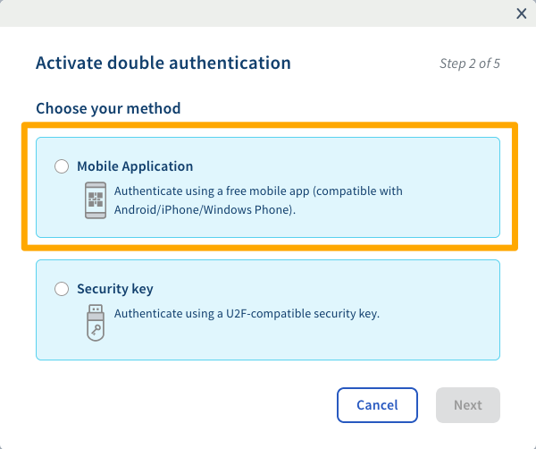

**Last updated 24th June 2020**

## Objective

Two-factor authentication authentication with a one-time password (OTP) mobile application is one of the methods offered by OVHcloud to help you access your account securely. 

**This guide will help you enable two-factor authentication via OTP application, and understand how to use it in future when you log in to the OVHcloud Control Panel.**

## Requirements

- knowledge of the [two-factor authentication methods offered by OVHcloud](https://docs.ovh.com/us/en/customer/secure-account-with-2FA/)
- access to the [OVHcloud Control Panel](https://ca.ovh.com/auth/?action=gotomanager){.external}
- an OTP mobile application installed on your Android or iOS smartphone or tablet

> [!primary]
>**OTP mobile applications**
>
> You can choose from a number of OTP applications. Here are two examples that are free to use.
> 
> - For Android: Free OTP
> - For iOS: OTP Auth
> 

## Instructions

### Step 1: Enable two-factor authentication.

Log in to the [OVHcloud Control Panel](https://ca.ovh.com/auth/?action=gotomanager){.external}. Click on your name in the top right-hand corner (first step on the image below), then click your initials (second step). Next, click `Security`{.action} (third step), and `Enable two-factor authentication`{.action} (fourth step).

{.thumbnail}

### Step 2: Select the method on the mobile application.

Select the method via the mobile application, then confirm.

{.thumbnail}

### Step 3: Confirm two-factor authentication.

Scan the QR code via your OTP application. In the field to the right of the QR code, enter the code given by the application. You can also add a description of this authentication method. This may be useful if you want to identify the people able to use this method on your account.

{.thumbnail}

### Step 4: Save the emergency security codes.

When you first add a two-factor authentication security method, you will be sent emergency codes, which need to be stored in a safe place. We recommend saving them in a password manager.

{.thumbnail}

You can delete or regenerate them via the OVHcloud Control Panel:

{.thumbnail}

> [!warning]
>
> As a reminder, please note that it is important to save these emergency codes and ensure that they are valid. If one of the security methods you have selected becomes unavailable (theft or loss of your mobile phone or security key), access to your account may be blocked.
> 
> 

### Step 5: Log in to the OVHcloud Control Panel via two-factor authentication.

Once you have enabled two-factor authentication, the login screen will offer you one of your security methods. If you would like to use another method, click `Try another method`{.action}.

{.thumbnail}

All of the choices you have enabled will then appear:

{.thumbnail}

## Go further

Join our community of users on <https://community.ovh.com/en>.
