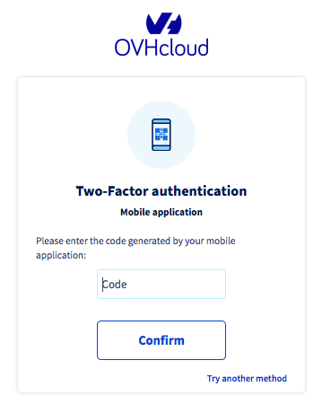

**Dernière mise à jour le 16/04/2020**

## Objectif

La double authentification avec le système *one-time password* (OTP) disponible via une application mobile est l'une des méthodes proposées par OVHcloud pour vous permettre de sécuriser l'accès à votre espace client. 

**Ce guide vous permettra d'activer la double authentification par application OTP et de comprendre comment l'utiliser pour vos prochaines connexions à votre espace client.**

## Prérequis

- Avoir pris connaissance des [différentes méthodes de double authentification proposées par OVHcloud](https://docs.ovh.com/ca/fr/customer/securiser-son-compte-avec-une-2FA/).
- Être connecté à l'[espace client OVHcloud](https://ca.ovh.com/auth/?action=gotomanager){.external}.
- Avoir installé une application OTP sur un smartphone ou une tablette Android ou iOS.

> [!primary]
>**Les applications mobiles OTP**
>
> De nombreuses applications OTP existent. En voici deux, gratuites :
> 
> - sur Android : Free OTP ;
> - sur iOS : OTP Auth.
> 

## En pratique

### Étape 1 : activer la double authentification

Connectez-vous à votre [espace client OVHcloud](https://ca.ovh.com/auth/?action=gotomanager){.external}. Cliquez sur votre nom en haut à droite (1), puis sur vos initiales (2). Cliquez ensuite sur `Sécurité`{.action} (3) et enfin sur `Activer la double authentification`{.action} (4).

{.thumbnail}

### Étape 2 : choisir la méthode par application mobile

Choisissez la méthode par application mobile et validez.

{.thumbnail}

### Étape 3 : valider la double authentification

Scannez le QR code via votre application OTP. Dans le champ dédié à droite de ce QR code, renseignez alors le code donné par l'application. Vous pouvez également ajouter une description à cette méthode d'authentification. Celle-ci peut être utile pour identifier les personnes susceptibles d'utiliser cette méthode sur votre compte.

{.thumbnail}

### Étape 4 : sauvegarder les codes de sécurité

Au premier ajout d'une méthode de sécurité par double authentification, des codes de secours vous seront communiqués et sont à conserver précieusement. Nous vous conseillons de les sauvegarder dans un gestionnaire de mots de passe.

{.thumbnail}

Vous pourrez les supprimer ou les regénérer dans votre espace client :

{.thumbnail}

> [!warning]
>
> Nous vous rappelons qu’il est indispensable de sauvegarder ces codes de secours et de vous assurer qu’ils sont valides. En cas d’indisponibilité de votre ou vos méthodes de sécurité sélectionnées (vol ou perte de votre téléphone ou de votre clé de sécurité), l’accès à votre espace client pourrait être bloqué.
> 
> 

### Étape 5 : se connecter à l'espace client avec la double authentification

Une fois l'authentification à double facteur activée, l'écran d'identification vous présentera l'une de vos méthodes de sécurité. Si vous souhaitez en utiliser une autre, cliquez sur le bouton `Essayer une autre méthode`{.action}.

{.thumbnail}

Tous les choix que vous avez activés apparaîtront alors :

{.thumbnail}

## Aller plus loin

Échangez avec notre communauté d'utilisateurs sur <https://community.ovh.com>
