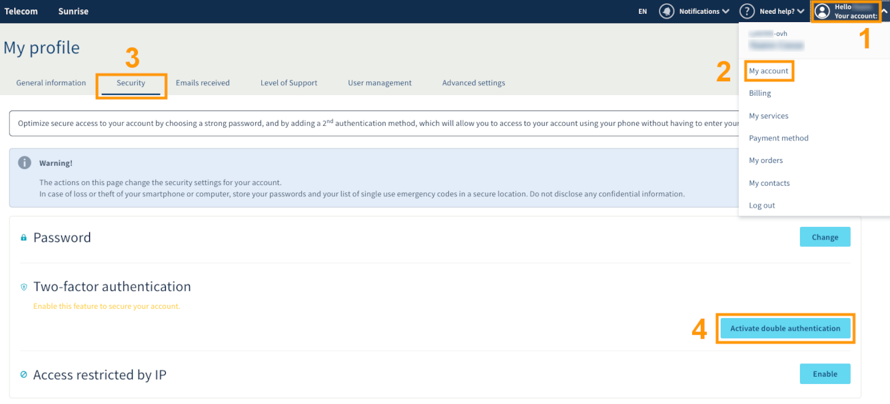

**Última atualização: 15/11/2019**

## Objetivo

A autenticação dupla com o sistema de *password única* (OTP) disponível através de uma aplicação móvel é um dos métodos propostos pela OVHcloud para lhe permitir proteger o acesso à sua área de cliente. 

**Este guia permitirá ativar a autenticação dupla com aplicação OTP e entender como utilizá-la para os seus próximos acessos à sua área de cliente.**

## Requisitos

- Estar familiarizado com os [diferentes métodos de autenticação dupla oferecidos pela OVHcloud](https://docs.ovh.com/pt/customer/proteger-a-sua-conta-com-uma-2FA/).
- Ter acesso à [Área de Cliente OVHcloud](https://www.ovh.com/auth/?action=gotomanager){.external}.
- Ter instalado uma aplicação OTP num smartphone ou num tablet Android ou iOS.

> [!primary]
>**As aplicações móveis OTP**
>
> Existem várias aplicações OTP. Eis duas gratuitas:
> 
> - no Android: Free OTP;
> - no IOS: OTP Auth.
> 

## Instruções

### Etapa 1: ativar a dupla autenticação

Aceda à [Área de Cliente OVHcloud](https://www.ovh.com/auth/?action=gotomanager){.external}. Clique no seu nome no canto superior direito (etapa 1 na imagem abaixo), depois em `A minha Conta`{.action} (etapa 2). Depois clique em `Segurança`{.action} (etapa 3) e em `Ativar a dupla autenticação`{.action} (etapa 4).

{.thumbnail}

### Etapa 2: escolher o método por aplicação móvel

Escolha o método por aplicação móvel e valide.

{.thumbnail}

### Etapa 3: validar a dupla autenticação

Efetue um scan do código QR através da sua aplicação OTP. No campo dedicado à direita desse código QR, introduza o código dado pela aplicação. Também pode adicionar uma descrição a este método de autenticação. Isto pode ser útil na identificação de pessoas que possam usar este método na sua conta.

{.thumbnail}

### Etapa 4: guarde os códigos de segurança

A primeira vez que adicionar um método de segurança de autenticação dupla, os códigos de segurança ser-lhe-ão comunicados e devem ser guardados preciosamente. Aconselhamo-lo a guardá-los num gestor de palavras-passe.

{.thumbnail}

Poderá eliminá-los ou gerá-los novamente na sua área de cliente:

{.thumbnail}

> [!warning]
>
> Lembramos que é essencial guardar esses códigos de segurança e garantir que eles sejam válidos. Se o(s) método(s) de segurança selecionado(s) não estiver(em) disponível(eis) (furto ou perda do seu telefone ou da chave de segurança), o acesso à sua área de cliente pode ser bloqueado
> 

### Etapa 5: aceder à área de cliente com a dupla autenticação

Quando a autenticação com dois fatores estiver ativada, o ecrã de acesso apresentará um dos seus métodos de segurança.
Se deseja utilizar outro método, clique no botão `Experimentar outro método`{.action}.

{.thumbnail}

Todas as escolhas que ativou aparecerão então:

{.thumbnail}

## Quer saber mais?

Fale com a nossa comunidade de utilizadores: [https://community.ovh.com/en/](https://community.ovh.com/en/)