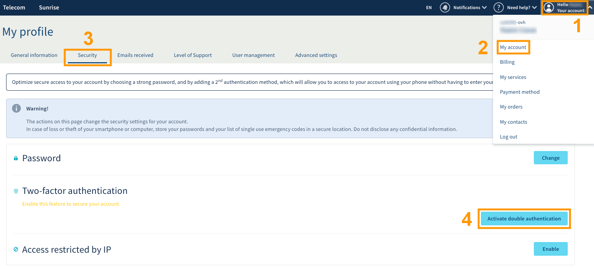
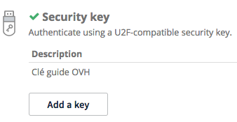
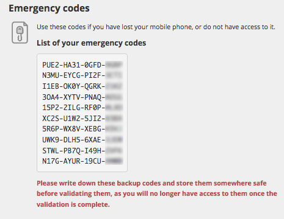

**Letzte Aktualisierung am 15.11.2019**

## Ziel

Neben weiteren Methoden stellt Ihnen OVHcloud die Zwei-Faktor-Authentifizierung per Sicherheitsschlüssel „Universal Second Factor (U2F)“ zur Verfügung, um den Zugang zu Ihrem Account abzusichern. Diese Schutztechnik per USB-Stick wird von der FIDO Alliance gehostet und wird zunehmend in vielen Bereichen für die Zwei-Faktor-Authentifizierung genutzt.

**Diese Anleitung hilft Ihnen, die Zwei-Faktor-Authentifizierung per U2F-Sicherheitsschlüssel zu aktivieren, und für Ihre nächsten Verbindungen zu Ihrem Kundencenter zu nutzen.**

## Voraussetzungen

- Sie haben sich über die [verschiedenen Methoden der Zwei-Faktor-Authentifizierung bei OVHcloud](https://docs.ovh.com/de/customer/Account-mit-2FA-absichern) informiert.
- Sie haben Zugriff auf Ihr [OVHcloud Kundencenter](https://www.ovh.com/auth/?action=gotomanager).
- Sie besitzen einen U2F-Sicherheitsschlüssel.
- Sie haben einen freien USB-Anschluss an Ihrem Computer.

## In der praktischen Anwendung

### Schritt 1: Die Zwei-Faktor-Authentifizierung aktivieren

Loggen Sie sich in Ihrem [OVHcloud Kundencenter](https://www.ovh.com/auth/?action=gotomanager&from=https://www.ovh.de/&ovhSubsidiary=de) ein, klicken Sie auf Ihren Namen oben rechts (1) und wählen Sie dann `Mein Account`{.action} (2). Klicken Sie nun auf `Sicherheit`{.action} (3) und schließlich auf `Die Zwei-Faktor-Authentifizierung aktivieren`{.action} (4).

{.thumbnail}

### Schritt 2: Die Methode per Sicherheitsschlüssel wählen

Wählen Sie die Methode per Sicherheitsschlüssel und bestätigen Sie Ihre Wahl.

{.thumbnail}

### Schritt 3: Die Zwei-Faktor-Authentifizierung bestätigen

Wenn Sie dazu aufgefordert werden, stecken Sie Ihren Sicherheitsschlüssel ein. Wenn er zusätzlich einen Knopf hat, drücken Sie diesen. 

{.thumbnail}

Sobald der Schlüssel erkannt wurde, können Sie auch eine Beschreibung hinzufügen. Dies kann hilfreich sein, um jene Personen zu identifizieren, die wahrscheinlich diese Authentifizierungsmethode für Ihr Konto nutzen. 

{.thumbnail}

### Schritt 4: Speichern der Sicherheitscodes

Beim ersten Hinzufügen einer Sicherheitsmethode mit Zwei-Faktor-Authentifizierung werden Ihnen die Notfall-Codes mitgeteilt. Bitte bewahren Sie sie gut auf. Wir empfehlen Ihnen, sie in einem Passwort-Manager zu speichern.

{.thumbnail}

Sie können sie in ihrem Kundencenter löschen oder erneut erstellen.

{.thumbnail}

> [!warning]
>
> Wir möchten Sie daran erinnern, dass die Notfall-Codes unbedingt gespeichert und gültig sein müssen. Sollte(n) die von Ihnen gewählte(n) Sicherheitsmethode(n) nicht verfügbar sein (Diebstahl oder Verlust Ihres Telefons oder Ihres Sicherheitsschlüssels), kann der Zugang zu Ihrem Kundencenter gesperrt werden.
> 
> 

### Schritt 5: Verbinden Sie sich mit der Zwei-Faktor-Authentifizierung mit dem Kundencenter

Sobald die Zwei-Faktor-Authentifizierung aktiviert ist, zeigt Ihnen das Anmeldefenster eine Ihrer Sicherheitsmethoden. Falls Sie eine andere Methode verwenden möchten, klicken Sie auf `Eine andere Methode wählen`{.action}.

{.thumbnail}

Nun erscheint alles, was Sie ausgewählt und aktiviert haben.

{.thumbnail}

## Weiterführende Informationen

Die offizielle Homepage der [FIDO Alliance](https://fidoalliance.org/){.external}.

Für den Austausch mit unserer User Community gehen Sie auf <https://community.ovh.com>.