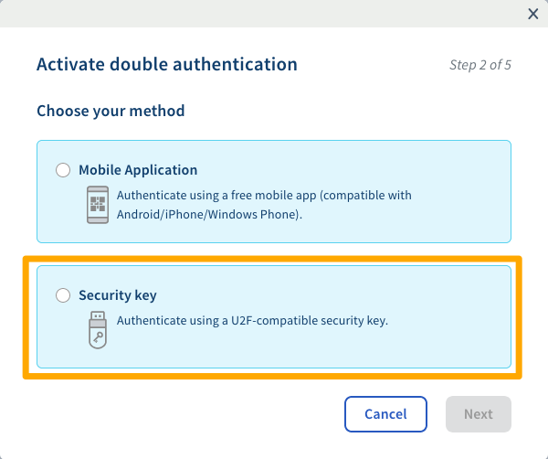

**Última actualización: 23/06/2020**

## Objetivo

La doble autenticación por llave de seguridad U2F (Universal Second Factor) es uno de los métodos que propone OVHcloud para que proteja el acceso a su cuenta. Esta técnica de protección mediante una memoria USB —de FIDO Alliance— se utiliza cada vez más para la doble autenticación en numerosos dominios.

**Esta guía explica cómo activar la doble autenticación por llave de seguridad U2F y cómo utilizarla cada vez que inicie sesión en su área de cliente.**

## Requisitos

- Haber consultado los [diferentes métodos de doble autenticación que ofrece OVHcloud](https://docs.ovh.com/us/es/customer/proteger-su-cuenta-con-una-2FA/).
- Haber iniciado sesión en el [área de cliente de OVHcloud](https://ca.ovh.com/auth/?action=gotomanager){.external}.
- Disponer de una llave de seguridad U2F.
- Disponer de un puerto USB libre en su ordenador.

## Procedimiento

### Etapa 1: activar la doble autenticación

Inicie sesión en el [área de cliente de OVHcloud](https://ca.ovh.com/auth/?action=gotomanager){.external}, haga clic en su nombre en la esquina superior derecha (1) y, a continuación, haga clic en sus iniciales (2). Luego, haga clic en `«Seguridad»`{.action}(3) y, por último, en`«Activar la doble autenticación»`{.action}(4).

{.thumbnail}

### Etapa 2: elegir el método por llave de seguridad

Elija el método por llave de seguridad y valide.

{.thumbnail

### Etapa 3: aceptar la doble autenticación

Conecte su llave de seguridad cuando el sistema se lo pida. Si la llave cuenta con un botón, púlselo. 

{.thumbnail}

Una vez reconocida la llave, puede añadir, si así lo desea, una descripción. Dicha descripción puede ser muy útil para identificar las personas susceptibles de utilizar este método de autenticación en su cuenta.

{.thumbnail}

### Etapa 4: guardar los códigos de seguridad

Al agregar por primera vez un método de seguridad por doble autenticación, se le comunicarán los códigos de seguridad, que deberá guardar cuidadosamente. En consecuencia, le aconsejamos guardarlos en un gestor de contraseñas. 

{.thumbnail}

Podrá eliminarlos o regenerarlos en su área de cliente.

{.thumbnail}

> [!warning]
>
> Le recordamos que es indispensable guardar estos códigos de seguridad y asegurarse de que sean válidos. En caso de indisponibilidad de su/s método/s de seguridad seleccionado/s (debido al robo o pérdida de su teléfono o de su llave de seguridad), el acceso a su área de cliente podría quedar bloqueado.
> 

### Etapa 5: iniciar sesión en el área de cliente con la doble autenticación

Tras activar la autenticación de doble factor, la pantalla de identificación le mostrará uno de sus métodos de seguridad. Si desea utilizar otro, haga clic en el botón `«Intentarlo con otro método»`{.action}.

{.thumbnail}

Entonces aparecerán todas las opciones que activó.

{.thumbnail}

## Más información

El sitio web oficial de la [FIDO Alliance](https://fidoalliance.org/){.external}.

Interactúe con nuestra comunidad de usuarios en <https://community.ovh.com/en/>.
