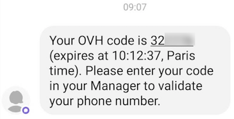

**Ultimo aggiornamento: 15/11/2019**

## Obiettivo

La doppia autenticazione via SMS è uno dei metodi proposti da OVHcloud per rendere sicuro l’accesso al tuo account.

**Questa guida ti mostra come attivare la doppia autenticazione via SMS e come utilizzarla per accedere al tuo Spazio Cliente.**

## Prerequisiti

- Conoscere i [ diversi metodi di doppia autenticazione proposti da OVHcloud](https://docs.ovh.com/it/customer/proteggi_il_tuo_account_con_2FA/)
- Avere accesso allo [Spazio Cliente OVH](https://www.ovh.com/auth/?action=gotomanager){.external}
- Disporre di un cellulare in grado di ricevere SMS

## Procedura

### Step 1: attiva la doppia autenticazione

Accedi allo [Spazio Cliente](https://www.ovh.com/auth/?action=gotomanager){.external}, clicca sul tuo nome in alto a destra (1) e seleziona `Il tuo account`{.action}.(2). Clicca su `Sicurezza`{.action} (3) e infine su`Attiva la doppia autenticazione`{.action} (4).

{.thumbnail}

### Step 2: scegli il metodo SMS

Scegli il metodo SMS e conferma l’operazione.

{.thumbnail}

Inserisci il tuo numero di cellulare in formato internazionale (ad esempio: +3933312345678) e conferma l’operazione.

{.thumbnail}

### Step 3: disattiva la doppia autenticazione

Un codice di conferma viene inviato via SMS al numero indicato.

{.thumbnail}

Quindi inserisci il codice nel campo previsto. È inoltre possibile aggiungere una descrizione  in modo da identificare gli utenti che potrebbero utilizzare questo metodo di autenticazione sul tuo account.

{.thumbnail}

La doppia autenticazione via SMS è ormai attiva ed è possibile aggiungere altri numeri.

{.thumbnail}

### Step 4: salva i codici di sicurezza

Quando aggiungi per la prima volta un metodo di autenticazione a due fattori, ti vengono forniti codici di riserva da conservare con cura. Ti consigliamo di salvarli su un gestore di password.

{.thumbnail}

Potrai eliminarli o rigenerarli dal tuo Spazio Cliente.

{.thumbnail}

> [!warning]
>
> Ti ricordiamo che è fondamentale salvare i codici di riserva e assicurarsi che siano validi. Se uno o più metodi di sicurezza da te selezionati non sono disponibili (per furto o perdita del telefono o della chiave di sicurezza), l’accesso al tuo Spazio Cliente potrebbe essere bloccato.
> 

### Step 5: accedi allo Spazio Cliente con la doppia autenticazione

Una volta attivata la doppia autenticazione, la schermata di login ti mostrerà uno dei tuoi metodi di sicurezza. Se vuoi utilizzarne un altro, clicca sul pulsante ` Prova un altro metodo`{.action}.

{.thumbnail}

A questo punto, appariranno tutte le opzioni da te attivate.

{.thumbnail}

## Per saperne di più

Contatta la nostra Community di utenti all’indirizzo [https://community.ovh.com](https://community.ovh.com).
