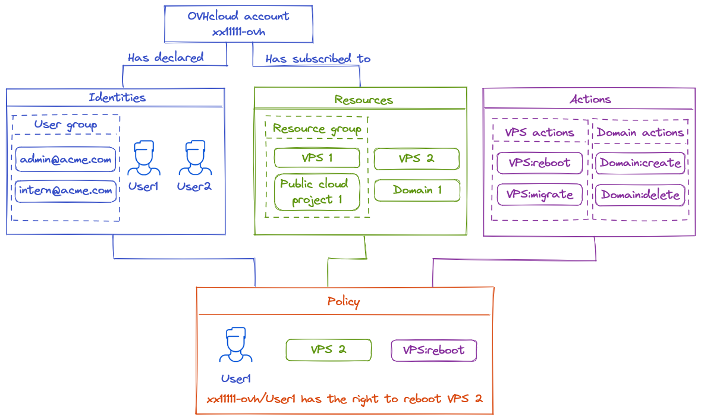

> [!warning]
>
> Cette fonctionnalité est actuellement en version bêta. Retrouvez plus d'informations sur <https://labs.ovhcloud.com/en/>.
>

## Objectif

Ce guide explique comment fournir des droits d'accès spécifiques aux utilisateurs d'un compte OVHcloud.

La gestion des accès d'OVHcloud est basée sur un système de gestion de « politiques ». Il est possible d'écrire différentes politiques qui donnent aux utilisateurs l'accès à des fonctionnalités spécifiques sur les produits liés à un compte OVHcloud.

Dans le détail, une politique contient :

- Une ou plusieurs **identités** ciblées par cette politique. 
    - Il peut s'agir d'identifiants de compte, d'utilisateurs ou de groupes d'utilisateurs (comme ceux utilisés avec la [fédération d'identité](/products/customer-connect-saml-sso)). 
- Une ou plusieurs **ressources** concernées par cette politique. 
    - Une ressource est un produit OVHcloud qui sera concerné par cette politique (un nom de domaine, un serveur Nutanix, un Load Balancer, etc.)
- Une ou plusieurs **actions** autorisées ou exclues par cette politique. 
    - Les actions sont les droits spécifiques affectés par cette politique (redémarrer le serveur, créer un compte email, résilier un produit, etc).

Par exemple, nous pouvons créer une politique pour donner à un utilisateur appelé John, pour un VPS, l'accès à l'action « reboot ».

**Découvrez en détail comment ces politiques peuvent être déclarées en utilisant l'API OVHcloud, comment lister les identités, ressources et actions disponibles pour ces politiques.**

{.thumbnail}

## Prérequis

Pour mettre en place une politique, vous aurez besoin des éléments suivants :

- Un [compte client OVHcloud](/pages/account/customer/ovhcloud-account-creation)
- Savoir [gérer des comptes utilisateurs](/pages/account/customer/ovhcloud-users-management)
- Disposer de produits liés à votre compte OVHcloud (Load Balancer, nom de domaine, VPS, etc.)

## En pratique

### Les politiques

Cette première partie décrit comment créer et mettre à jour des politiques.

Les ressources, les groupes de ressources et les actions nécessaires à la création d'une politique seront décrits dans les sections suivantes.

#### Définition de l'API

<https://api.ovh.com/console-preview/?section=%2Fiam&branch=v2#get-/iam/policy>

|**Méthode**|**Chemin**|**Description**|
| :-: | :-: | :-: |
|GET|/iam/policy|Récupérer toutes les politiques|
|POST|/iam/policy|Créer une nouvelle politique|
|GET|/iam/policy/{policyId}|Récupérer une politique spécifique|
|PUT|/iam/policy/{policyId}|Mettre à jour une politique existante|
|DELETE|/iam/policy/{policyId}|Supprimer une politique spécifique|

#### Récupérer toutes les politiques

L'exemple suivant montre comment une politique est construite.

Récupérez toutes les politiques, y compris celles pré-générées par OVHcloud, en appelant le endpoint API suivant : **/iam/policy**

*Exemple de sortie :*

**/iam/policy**

```json
[
    {
        "id": "69470db1-5372-4e32-acf1-edc2afd84c12",
        "owner": "xx1111-ovh",
        "name": "ovh-default",
        "readOnly": true,
        "identities": [
            "urn:v1:eu:identity:account:xx1111-ovh"
        ],
        "resources": [
            {
                "urn": "urn:v1:eu:resourceGroup:aa0713ab-ed13-4f1a-89a5-32aa0cb936d8"
            }
        ],
        "permissions": {
            "allow": [
                {
                    "action": "*"
                }
            ]
        },
        "createdAt": "2023-01-27T11:29:22.197537Z",
        "updatedAt": "2023-01-27T11:29:22.197537Z"
    }
]
```

Dans cet exemple, le compte "*urn:v1:eu:identity:account:xx1111-ovh*" peut faire toutes les actions (*"action":"\*"*) pour le groupe de ressources "*urn:v1:eu:resourceGroup:aa0713ab-ed13-4f1a-89a5-32aa0cb936d8*". Cette politique est détenue par l'identifiant client OVHcloud "*xx1111-ovh*" (il correspond au rôle d'administrateur, il est créé par OVHcloud et ne peut pas être modifié).

Les éléments des politiques sont définis par des URNs. Ces URNs sont définies par le modèle suivant :

||**URN**|**:**|**version**|**:**|**plaque**|**:**|**type**|**:**|**sous-type**|**:**|**id**|
| :-: | :-: | :-: | :-: | :-: | :-: | :-: | :-: | :-: | :-: | :-: | :-: |
|**Description**|préfixe immuable|:|version du système IAM|:|Plaque où se trouve l'URN|:|Type de l'URN actuelle|:|(optionnel) Sous-type pour les types **identity** ou **resource** |:|Identifiant unique associé à l'URN|
|**Possible values**|urn|:|v1|:|eu, ca, us|:|identité, ressource, resourceGroup|:|<p>Pour le type **identity** : account, user, group</p><p>Pour le type **resource** : tous les types de ressources</p>|:|Valeur alphanumérique|
|**Account ID Example**|urn|:|v1|:|eu|:|identity|:|account|:|xx1111-ovh|
|**User group Example**|urn|:|v1|:|eu|:|identity|:|group|:|xx1111-ovh/admin@mycompany.com|
|**VPS Example**|urn|:|v1|:|ca|:|resource|:|vps|:|vps-5b48d78b.vps.ovh.net|
|**Resource Group Example**|urn|:|v1|:|us|:|resourceGroup|||:|aa0713ab-ed13-4f1a-89a5-32aa0cb936d8|

L'URN peut débuter ou finir par un caractère *wildcard* `*`.

#### Attributs d'une politique

- **id**: Identifiant unique de la politique. Il suit le format UUID.
- **owner**: Le compte qui a créé cette politique.
- **name**: Le nom de la politique. Il est possible d'utiliser ce nom pour organiser les politiques. Il n'y a pas de format à suivre (mis à part le préfixe « ovh- » qui est réservé aux politiques OVHcloud).
- **readOnly**: S'il est en « true », il indique que la politique ne peut pas être modifiée. Il représente souvent les politiques gérées par OVHcloud.
- **identities**: Les identités concernées par la politique. Elles sont spécifiées par un URN. **account**: **account-id** pour le compte client OVHcloud, **user**: **account-id**/**username** pour le compte utilisateur, **group**: **account-id**/**username** pour un groupe utilisateur.
- **resources**: Les ressources concernées par la politique. Elles sont spécifiées par un URN, **resource** pour une ressource, **resourceGroup** pour un groupe de ressources.
- **permissions**: 
    - **allow**: Ensemble des actions autorisées pour les identités concernant les ressources. Toutes les actions sont refusées par défaut.
    - **except**: Extension du paramètre d'autorisation **allow**. Ensemble d'actions à ne pas autoriser même si elles sont incluses dans les actions **allow**. Par exemple, ceci est utile lorsqu'il y a une action autorisée par un wildcard mais qu'il est nécessaire d'exclure une action spécifique qui serait autrement incluse dans le wildcard.
- **createdAt**: Date de création de la politique.
- **updateAt**: Dernière mise à jour de la politique.

#### Créer une politique

Créez une nouvelle politique en utilisant cet appel API :

|**Méthode**|**Chemin**|**Description**|
| :-: | :-: | :-: |
|POST|/iam/policy|Créer une nouvelle politique|

Par exemple, créez une politique autorisant l'utilisateur nommé "*user1*" à faire des actions sur un VPS :

**Exemple de création de politique**

```json
{
    "description": "VPS - reboot and create snapshot",
    "identities": [
        "urn:v1:eu:identity:user:xx1111-ovh/user1"
    ],
    "name": "vps-reboot-snapshot",
    "permissions": {
        "allow": [
            {
                "action": "vps:apiovh:reboot"
            },
            {
                "action": "vps:apiovh:createSnapshot"
            }
        ]
    },
    "resources": [
        {
            "urn": "urn:v1:eu:resource:vps:vps-5b48d78b.vps.ovh.net"
        }
    ]
}
```

Cette politique ne concerne pas un compte mais un utilisateur. L'URN de l'identité correspond donc au format suivant : "*urn:v1:eu:identity:**user**:**account-id**/**username***".

Avec ce JSON comme body pour l'appel `POST /iam/policy`, la politique sera créée.

Vérifiez cela avec `GET /iam/policy`:

**GET /iam/policies**

```json
[
    {
        "id": "69470db1-5372-4e32-acf1-edc2afd84c12",
        "owner": "xx1111-ovh",
        "name": "ovh-default",
        "readOnly": true,
        "identities": [
            "urn:v1:eu:identity:account:xx1111-ovh"
        ],
        "resources": [
            {
                "urn": "urn:v1:eu:resourceGroup:aa0713ab-ed13-4f1a-89a5-32aa0cb936d8"
            }
        ],
        "permissions": {
            "allow": [
                {
                    "action": "*"
                }
            ]
        },
        "createdAt": "2023-01-27T11:29:22.197537Z",
        "updatedAt": "2023-01-27T11:29:22.197537Z"
    },
    {
        "id": "9dfe6a03-1937-4287-8ab7-866224d333b1",
        "owner": "xx1111-ovh",
        "name": "vps-reboot-snapshot",
        "readOnly": false,
        "description": "VPS - reboot and create snapshot",
        "identities": [
            "urn:v1:eu:identity:user:xx1111-ovh/user1"
        ],
        "resources": [
            {
                "urn": "urn:v1:eu:resource:vps:vps-5b48d78b.vps.ovh.net"
            }
        ],
        "permissions": {
            "allow": [
                {
                    "action": "vps:apiovh:reboot"
                },
                {
                    "action": "vps:apiovh:createSnapshot"
                }
            ]
        },
        "createdAt": "2023-02-07T15:24:57.680037Z"
    }
]
```

La politique a été créée avec succès. Maintenant, "***user1***" peut **effectuer des redémarrages et créer des sauvegardes (snapshots))** sur le VPS "***urn:v1:eu:resource:vps:vps-5b48d78b.vps.ovh.net***".

### Identités

Les politiques s'appliquent aux utilisateurs, qui peuvent être des comptes, des utilisateurs ou des groupes d'utilisateurs.

Cette section décrit comment récupérer ou créer un utilisateur pour la politique.

#### Définition de l'API

<https://api.ovh.com/console-preview/?section=%2Fme&branch=v1#overview>

|**Méthode**|**Chemin**|**Description**|
| :-: | :-: | :-: |
|GET|/me/identity/user|Récupérer tous les utilisateurs de ce compte|
|POST|/me/identity/user|Créer un nouvel utilisateur|
|GET|/me/identity/user/{user}|Obtenir les détails de cet utilisateur spécifique|
|PUT|/me/identity/user/{user}|Modifier un utilisateur|
|DELETE|/me/identity/user/{user}|Supprimer un utilisateur|
|GET|/me/identity/group|Récupérer tous les groupes de ce compte|
|POST|/me/identity/group|Créer un nouveau groupe|
|GET|/me/identity/group/{group}|Obtenir les détails de ce groupe spécifique|
|PUT|/me/identity/group/{group}|Modifier un groupe|
|DELETE|/me/identity/group/{group}|Supprimer un groupe|

#### Créer des utilisateurs

Listez tous les utilisateurs actuels liés au compte en appelant :

**/me/identity/user**

```json
[
  "user1",
  "user2"
]
```

Ces utilisateurs peuvent être utilisés sur des politiques avec le format URN: urn:v1:eu:identity:user:**xx1111-ovh**/**user1**

Pour créer un nouvel utilisateur, appelez l'API avec le body suivant :

**post /me/identity/user**

```json
{
  "description": "string",
  "email": "string",
  "group": "string",
  "login": "string",
  "password": ""
}
```

#### Créer un groupe d'utilisateurs

Listez tous les groupes actuels liés au compte en appelant :

**/me/identity/group**

```json
[
  "ADMIN",
  "DEFAULT",
  "UNPRIVILEGED",
  "admin@mycompany.com"
]
```

Ces groupes d'utilisateurs peuvent être utilisés sur des politiques avec le format URN : urn:v1:eu:identity:group:**xx1111-ovh**/**admin@mycompany.com**

Pour créer un nouveau groupe d'utilisateurs, appelez l'API avec le body suivant:

**post /me/identity/group**

```json
{
  "description": "string",
  "name": "string",
  "role": "REGULAR"
}
```

Pour plus d'informations, consultez notre [documentation sur la gestion des utilisateurs](/pages/account/customer/ovhcloud-users-management).

#### Avec une connexion SSO active

Si la fédération d'identité est activée via la [connexion SSO](/products/customer-connect-saml-sso), les politiques s'appliquent uniquement aux groupes d'utilisateurs, comme décrit dans la section précédente.

### Ressources

Les politiques font référence à des **ressources.** Les ressources correspondent à tous les produits OVHcloud souscrits par le compte OVHcloud et pouvant être contrôlés par ce compte.

Cette section décrit comment récupérer les informations sur les ressources pour les utiliser dans une politique.

#### Définition de l'API

<https://api.ovh.com/console-preview/?section=%2Fiam&branch=v2#get-/iam/resource>

|**Méthode**|**Chemin**|**Description**|
| :-: | :-: | :-: |
|GET|/iam/resource|List all resources|
|GET|/iam/resource/{resourceId}|Retrieve a resource|

#### Exemple

Visualisez toutes les ressources liées au compte OVHcloud en appelant :

**/iam/resource**

```json
[
  {
    "id": "b96ffed4-3467-4129-b8be-39a3eb3a0a93",
    "urn": "urn:v1:eu:resource:vps:vps-5b48d78b.vps.ovh.net",
    "name": "vps-5b48d78b.vps.ovh.net",
    "displayName": "vps-5b48d78b.vps.ovh.net",
    "type": "vps",
    "owner": "xx1111-ovh"
  },
  {
    "id": "c24ace5e-6c9c-436b-9a73-515db8df6250",
    "urn": "urn:v1:eu:resource:emailDomain:acme.com",
    "name": "acme.com",
    "displayName": "acme.com",
    "type": "emailDomain",
    "owner": "xx1111-ovh"
  },
  {
    "id": "8d70a49b-7a8b-4ec0-ad4b-756da802d994",
    "urn": "urn:v1:eu:resource:cdn:cdn-46.105.198.89-12969",
    "name": "cdn-46.105.198.89-12969",
    "displayName": "cdn-46.105.198.89-12969",
    "type": "cdn",
    "owner": "xx1111-ovh"
  }
]
```

Dans cet exemple, le compte a trois ressources disponibles (un VPS, un domaine pour sa messagerie et un CDN). Chacune de ces ressources possède un ensemble d'attributs permettant de les identifier sur les politiques.

#### Attributs d'une ressource


- **id**: Identifiant unique de la ressource. Il suit le format UUID.
- **urn**: Ressource URN.
- **name**: Le nom de la ressource.
- **displayName**: Le nom de la ressource tel qu'il est affiché dans l'interface utilisateur.
- **type**: Le type de la ressource (vps, publicCloudProject, dnsZone, domain, emailDomain, etc.)
- **owner**: Le détenteur de la ressource (Account ID)

### Groupes de ressources

Pour faciliter la gestion des politiques pour un grand nombre de ressources, il est possible de mettre en place un groupe de ressources qui regroupe plusieurs ressources sous un URN unique.

#### Définition de l'API

<https://api.ovh.com/console-preview/?section=%2Fiam&branch=v2#get-/iam/resourceGroup>

|**Méthode**|**Chemin**|**Description**|
| :-: | :-: | :-: |
|GET|/iam/resourceGroup|Récupérer tous les groupes de ressources|
|POST|/iam/resourceGroup|Créer un nouveau groupe de ressources|
|GET|/iam/resourceGroup/{groupId}|Récupérer un groupe de ressources spécifique|
|PUT|/iam/resourceGroup/{groupId}|Mettre à jour un groupe de ressources existant|
|DELETE|/iam/resourceGroup/{groupId}|Supprimer un groupe de ressources spécifique|

#### Récupérer un groupe de ressources

Listez tous les groupes de ressources en appelant **/iam/resourceGroup**.

Cette API peut être appelée avec un paramètre query-string « details » pour développer les résultats avec tous les attributs des ressources retournées.

*Exemple de sortie:*

**/iam/resourceGroup**

```json
[
    {
        "id": "aa0713ab-ed13-4f1a-89a5-32aa0cb936d8",
        "urn": "urn:v1:eu:resourceGroup:aa0713ab-ed13-4f1a-89a5-32aa0cb936d8",
        "readOnly": true,
        "name": "myVPS",
        "owner": "xx1111-ovh",
        "resources": [
            {
                "id": "b96ffed4-3467-4129-b8be-39a3eb3a0a93"
            },
            {
                "id": "7a19dbca-7da5-460f-a59b-69d56e57bf9d"
            },
            {
                "id": "50423397-8984-4d44-8505-fdd489c2c9fb"
            }
        ],
        "updatedAt": "2023-01-27T11:29:22.197537Z",
        "createdAt": "2023-01-27T11:29:22.197537Z"
    }
]
```

Dans cet exemple, nous pouvons voir que ce groupe de ressources "*urn:v1:eu:resourceGroup:aa0713ab-ed13-4f1a-89a5-32aa0cb936d8*" a 3 ressources. Cela signifie qu'une politique appliquée à ce groupe de ressources sera appliquée sur ces 3 ressources.

#### Attributs d'un groupe de ressources

- **id**: Identifiant unique du groupe de ressources. Il suit le format UUID.
- **urn**: URN du groupe de ressources à utiliser dans la politique.
- **readOnly**: Ne peut pas être modifié si `true`. Les groupes de ressources par défaut sont en lecture seule.
- **name**: Nom du groupe de ressources.
- **owner**: Détenteur du groupe de ressources (Account ID).
- **resources**: 
    - Si details = **false** : Ensemble des UUID des ressources.
    - Si details = **true** : Les ressources seront développées avec leurs attributs (comme le résultat que nous obtenons via l'API des ressources).
- **createdAt**: Date de création du groupe de ressources.
- **updateAt**: Date de la dernière mise à jour du groupe de ressources.

#### Créer un groupe de ressources

Créez un groupe de ressources avec l'API suivante :

|**Méthode**|**Chemin**|**Description**|
| :-: | :-: | :-: |
|POST|/iam/resourceGroup|Créer un nouveau groupe de ressources|

L'exemple suivant crée un groupe de ressources "*Test\_Envrionment*" contenant 2 ressources:

```json
{
  "name": "Test_environment",
  "resources": [
    {
      "id": "b10611a9-7cc1-40b7-8475-18aabcdffc62"
    },
    {
      "id": "53f815b1-c020-4e5d-8239-fbbcaaca1742"
    }
  ]
}

```

### Action

Les politiques contiennent une liste des **Actions** qui seront autorisées ou refusées aux utilisateurs.

Ces actions sont spécifiques à chaque produit, comme le redémarrage d'un serveur de base de données, la commande d'une mise à niveau, la restauration d'un snapshot, etc.

#### Définition de l'API

<https://api.ovh.com/console-preview/?section=%2Fiam&branch=v2#get-/iam/reference/action>

|**Méthode**|**Chemin**|**Description**|
| :-: | :-: | :-: |
|GET|/iam/reference/action|Récupérer toutes les actions|

#### Exemple

Permet de lister toutes les actions disponibles pour les politiques avec l'API, par exemple :

**exemple d'action**

```json
{
    "action": "vps:apiovh:reboot",
    "description": "Request a reboot of the machine",
    "resourceType": "vps",
    "categories": [
        "OPERATE"
    ]
}
```

Cette action est "*vps:apiovh:reboot*", elle vise la capacité à redémarrer un VPS.

L'appel à **/iam/reference/action** liste **toutes les actions disponibles** (ATTENTION : cela représente une quantité énorme d'éléments).

Il est fortement recommandé de spécifier le **resourceType** comme paramètre query-string pour cet appel API (voir la section suivante).

#### Attributs d'une action

- **action**: L'action elle-même
- **description**: Description de l'action
- **resourceType**: Le type de ressource ciblé par l'action
- **categories**: Les catégories de cette action (CREATE, READ, EDIT, OPERATE, DELETE)

### Types de ressources

#### Définition de l'API

|**Méthode**|**Chemin**|**Description**|
| :-: | :-: | :-: |
|GET|/iam/reference/resource/type|Récupérer tous les types de ressources|

#### Exemple

Voici une partie du résultat:

**/iam/reference/resource/type**

```json
[
    "account",
    "packXdsl",
    "cloudDB",
    "loadbalancer",
    "mxplanAccount",
    "publicCloudProject",
    "voipSmsvn",
    "vps",
]
```

## Aller plus loin

Échangez avec notre communauté d'utilisateurs sur <https://community.ovh.com/>.
