> [!warning]
>
> This feature is currently in beta. To join the beta, subscribe here: <https://labs.ovhcloud.com/en/>
>

## Objective

This guide will explain how to provide specific access rights to users of an OVHcloud account.

The access management of OVHcloud is based on a policy management system. It is possible to write different policies that give users access to specific features on the products linked to an OVHcloud account.

In detail, a policy contains:

- One or more **identities** targeted by this policy. 
    - It can be account IDs, users or user groups (like the ones used in [Federation](/pages/account/customer/ovhcloud-account-connect-saml-adfs) - other SSO guides are available). 
- One or more **resources** impacted by this policy. 
    - A resource is an OVHcloud product that will be impacted by this policy (a domain name, a Nutanix server, a Load Balancer, etc.).
- One or more **actions** allowed or excepted by this policy.
    - Actions are the specific rights affected by this policy (reboot a server, create an email account, cancel a subscription, etc.)
 
For example, we can create a policy to give to a user called John, for a VPS, access to the action "reboot".

**This guide explains in detail how these policies can be declared using the OVHcloud API, and how to list the identities, resources and actions available for them.**

{.thumbnail}

## Requirements

- An [OVHcloud account](/pages/account/customer/ovhcloud-account-creation)
- Knowing [how to manage account users](/pages/account/customer/ovhcloud-users-management)
- One or more OVHcloud products linked to this OVHcloud account (Load Balancer, domain name, VPS, etc.)

## Instructions

### Accessing the IAM menu

Click your account name in the top-right corner, then on your name again in the sidebar.

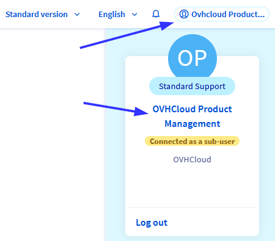{.thumbnail}

You can access the IAM menu via the dedicated entry in your customer account management.

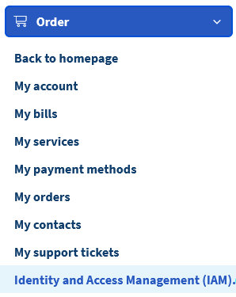{.thumbnail}

The menu will give you the list of all the current policies created on your account.

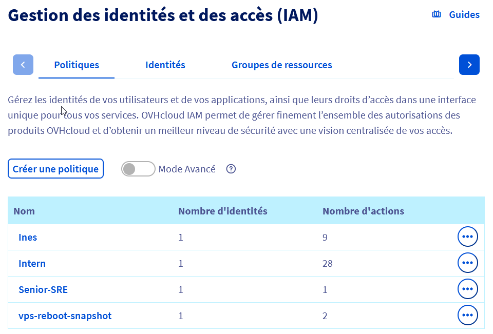{.thumbnail}

Each policy is displayed with its name, the number of identities linked to it, and the number of actions it contains.

> [!primary]
>
> Clicking the "Advanced mode" button shows the list of all the OVHcloud Managed policies. These policies are automatically created by OVHcloud to convert the preexisting `NIC Tech` and `NIC Admin` delegation on the new IAM feature. 
>
> Customers are not allowed to edit or delete these policies.

### Managing policies

#### Creating a policy

Click the `Create a policy`{.action} button.

The following form will be displayed:

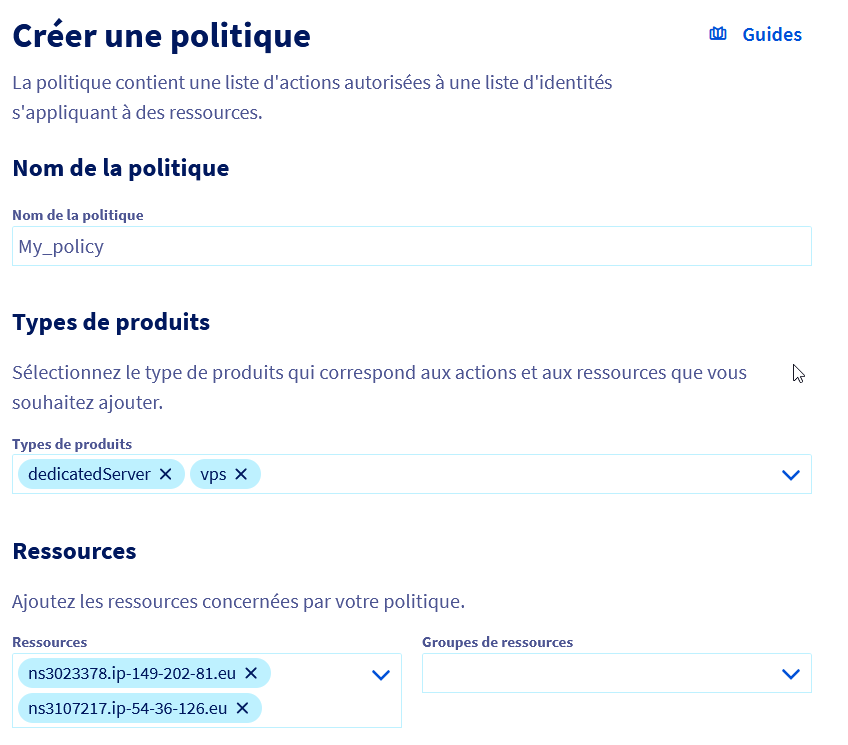{.thumbnail}

- **Name of the policy** (mandatory): This is the name that will appear in the interfaces. The name should be unique and must not contain any spaces.
- **Product type**: Select the types of product to define the scope of the policy. One or more product types can be included in the same policy.
- **Resources**: Add resources or resource groups to be covered by the policy. The resources available are filtered by the product type selected beforehand.
- **Actions**.

There are 3 different ways to add actions:

- Activating the `Enable all the actions`{.action} option

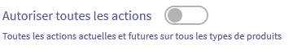{.thumbnail}

When activating this option, you allow all actions related to the selected products. This includes all existing actions as well as actions added in the future for these products categories.

- Adding actions manually

If you know the action name, you can add it manually.

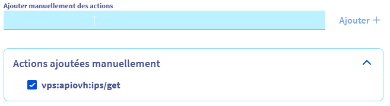{.thumbnail}

You can use a wildcard at the beginning or at the end of the action name with `*`.

For example, adding `vps:apiovh:ips/*` will grant the following rights:

vps:apiovh:ips/edit  
vps:apiovh:ips/delete  
vps:apiovh:ips/get  

- Selecting actions from the list

Finally, you can select actions from the list.

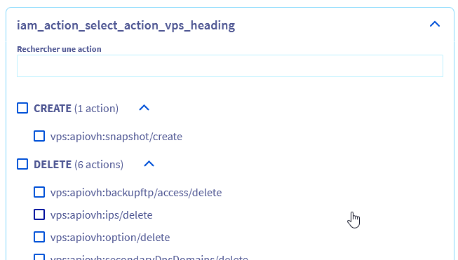{.thumbnail}

The available actions depend on the resource type and belong to one of five categories:

- **Read**: List products and show information about a product. (*ex.: list a VPS IP*)
- **Create**: Action that allows to create something on a product. (*ex.: Create a support ticket*)
- **Delete**: Action that allows to delete something on a product. (*ex.: Delete a Public Cloud instance*)
- **Edit**: Action to change something existing on a product. (*ex.: edit TCP route of a Load Balancer*)
- **Operate**: Apply changes to the infrastructure related to the product. (*ex.: Reboot a dedicated server*)

A search field is available to help identify a specific action on the list.

#### Editing a policy

To edit an existing policy, click the `...`{.action} button to the right of the policy and click `Edit the policy`{.action}.

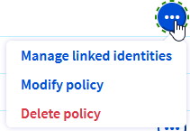{.thumbnail}

Then you can change the scope of the policy.

#### Deleting a policy

To delete an existing policy, click the `...`{.action} button to the right of the policy and click `Delete the policy`{.action}.

A popup window will ask you to confirm the deletion.

### Linking an identity to a policy

To link an identity to a policy, click the `...`{.action} button to the right of the policy and click `Manage the identities`{.action}.

{.thumbnail}

This will allow you to add and delete the users or the groups to whom the policy should apply.

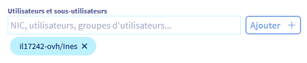{.thumbnail}

### Managing identities

The identities available for policies are managed via the `User management`{.action} tab, in the `My account`{.action} menu.

The `Identities`{.action} tab on the IAM menu will redirect you the this menu.

Details about user management are available in the [dedicated documentation](/pages/account/customer/ovhcloud-users-management).

### Managing resource groups

Policies can target resource groups instead of resources. These resource groups can assemble resources from different products, for example to set up a test environment.

#### Creating a resource group

To create a resource group, access the dedicated tab of the IAM menu:

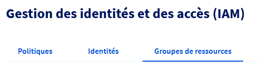{.thumbnail}

Click on `Create a resource group`{.action}.

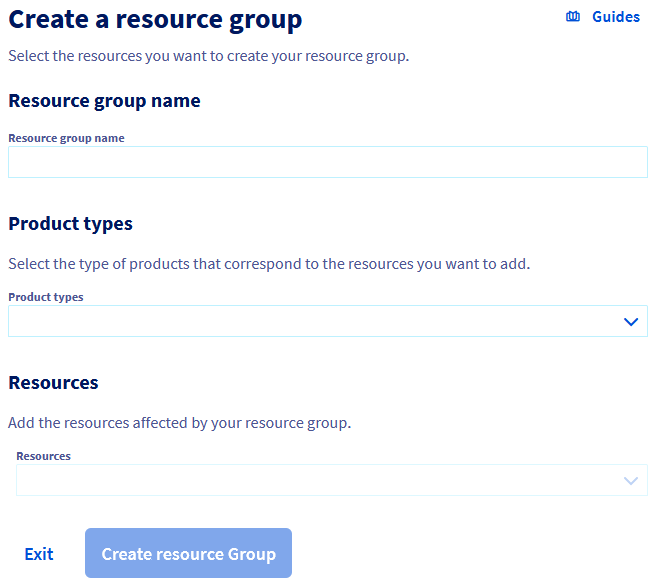{.thumbnail}

- **Name of the resource group**: This is the name that will appear in the interfaces. The name should be unique and must not contain any spaces.
- **Product type**: The list of product types concerned by this resource group.
- **Resources**: The list of resources the group will contain.

#### Editing a resource group

To edit a resource group, click on its name in the list.

#### Deleting a resource group

To delete an existing resource group, click the `...`{.action} button to the right of the group and click `Delete the resource group`{.action}.

A popup window will ask you to confirm the deletion.

## Go further

Join our community of users on <https://community.ovh.com/en/>.
