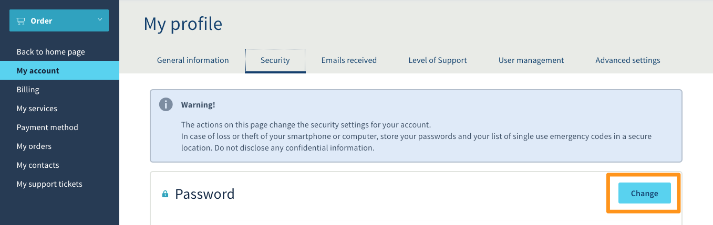
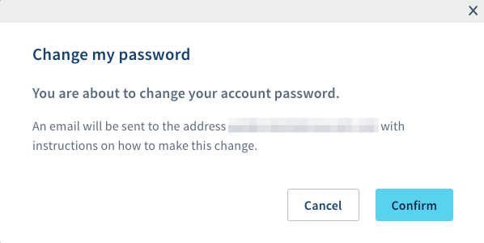
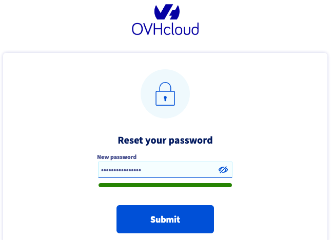
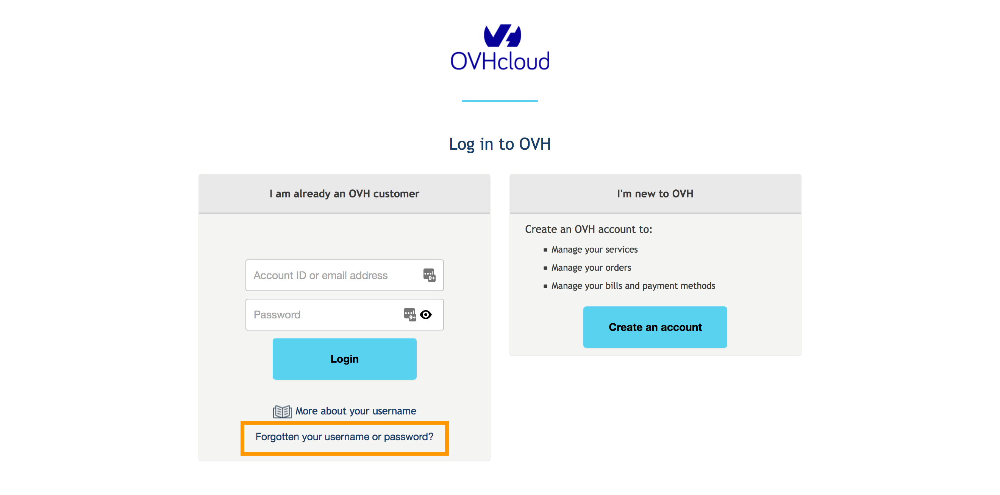
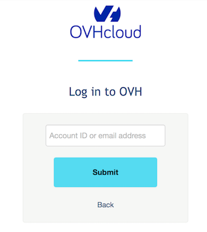
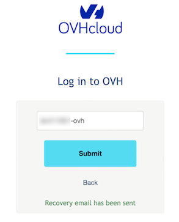

**Ultimo aggiornamento: 4/12/2019**

## Obiettivo

La password associata allo Spazio Cliente è la chiave di accesso a tutti i servizi OVHcloud e alle relative informazioni. Per garantirne la sicurezza è necessario che sia sufficientemente complessa e che venga modificata regolarmente.

**Questa guida ti mostra come impostare e gestire la tua password.**

## Prerequisiti
- Disporre di un account OVHcloud attivo
- Conoscere l’identificativo cliente e l’indirizzo email associato all’account

## Procedura

### Genera una password efficace

Il livello di sicurezza dei servizi è legato alla complessità della password di accesso allo Spazio Cliente OVHcloud che, per una protezione ottimale dei dati, deve possedere requisiti specifici:

- contenere almeno 12 caratteri

- contenere almeno una lettera maiuscola, minuscola e 1 cifra

- contenere caratteri speciali (ad esempio %, #, :, $, \*)

- non essere tratta dal dizionario

- non contenere informazioni personali (nome, cognome o data di nascita)

- essere salvata in un <i>password manager</i>

- essere cambiata ogni 3 mesi

- essere diversa dalle password precedenti

Esistono diversi modi efficaci per creare una password, come il **metodo fonetico** e il **metodo delle prime lettere**, che consiste nell’abbreviare un’intera frase utilizzando esclusivamente le prime lettere di ogni parola ed eventuali numeri.

In rete sono inoltre disponibili numerosi strumenti gratuiti che permettono di generare password del tutto sicure, difficili da decifrare e semplici da ricordare.

Per maggiori informazioni sulla sicurezza delle password, consulta la sezione [Per saperne di più](https://docs.ovh.com/it/customer/gestire-la-password/#per-saperne-di-piu_2){.external} di questa guida.

### Utilizza un software per la gestione di password 

Per proteggere e rendere sicure le password esistono numerosi programmi specifici.

**KeePass**, ad esempio, è un software libero e gratuito che funziona secondo un semplice principio: una password principale – sufficientemente complessa, ma che è necessario memorizzare – permette di accedere a un database che raggruppa tutti gli identificativi e le relative password. Utilizzare questo sistema consente di scegliere password anche molto complesse: essendo memorizzate sul software non è necessario ricordarle a memoria.

KeePass permette inoltre di generare password casuali complesse che memorizzerà per ogni sito o applicazione.

### Best practice per la gestione delle password

- **Verificare l’affidabilità.** Assicurati che la password utilizzata non sia stata trasmessa a malintenzionati. Questo tipo di verifica è possibile, ad esempio, eseguendo un test sul sito [haveibeenpwned.com](https://haveibeenpwned.com/){.external}, che consente di scoprire se questo dato è stato violato in seguito a episodi di <i>data breach</i>.
Nel caso in cui la password risulti compromessa, consigliamo di [modificarla immediatamente](./#modifica-la-password).

- **Utilizzare password diverse per ogni servizio.** È importante non utilizzare la password di accesso all’account OVHcloud anche su altri siti e applicazioni. Consigliamo di applicare questa regola a tutte le soluzioni attive: creare password differenti per ogni servizio permette di evitare eventuali vulnerabilità in caso di furto.

- **Non memorizzare le password nel browser.** Nonostante l’aspetto pratico, mantenere le proprie password memorizzate nel browser presenta rischi di sicurezza non trascurabili, soprattutto nel caso in cui un malintenzionato riesca a impossessarsi del computer. In questa eventualità, infatti, per potersi connettere ai diversi account è sufficiente recuperare il file che contiene le password memorizzate.

- **Modificare regolarmente le password utilizzate.** Cambiare periodicamente password aumenta la sicurezza del proprio account. In caso di sospetto anche minimo di violazione, consigliamo di sostituire immediatamente la password. Durante la propagazione della modifica tutte le sessioni attive sull’account OVHcloud verranno chiuse automaticamente. La nuova password deve differire dalle precedenti utilizzate.

- **Non divulgare la password.** Una password deve restare segreta: non deve essere scritta, condivisa tra più utenti né comunicata a terzi. I team OVHcloud non chiederanno mai la password, in particolare tramite email.

### Modifica la password

#### Dallo Spazio Cliente

- Accedi allo [Spazio Cliente](https://www.ovh.com/auth/?action=gotomanager){.external}, clicca sul tuo nome in alto a destra e cliccare sulle vostre iniziali.

{.thumbnail}

- Clicca sulla scheda `Sicurezza`{.action} e poi sul pulsante `Modifica`{.action} in corrispondenza della voce “Password”.

{.thumbnail}

- Conferma l’operazione.

{.thumbnail}

- All’indirizzo di contatto associato all’account viene inviata un’email per la conferma della modifica apportata. Leggi attentamente le istruzioni e clicca sul link contenuto nell’email, che reindirizza verso la pagina per la modifica della password. Nella nuova pagina, completa i tre campi con le informazioni richieste: identificativo e nuova password.

{.thumbnail}

- A questo punto compare un messaggio che conferma che l’operazione eseguita è andata a buon fine. Clicca su `Continua`{.action} per essere reindirizzato alla pagina di login. Inserisci l’identificativo e la nuova password.

#### Se non ricordi più la password

- Nella pagina di accesso allo Spazio Cliente clicca su `Non ricordi identificativo o password?`{.action}.

{.thumbnail}

- Inserisci l’identificativo cliente o l’indirizzo email principale associato all’account OVHcloud e clicca su `Invia`{.action}.

{.thumbnail}

- Compare un messaggio che conferma l’invio delle informazioni.

{.thumbnail}

- All’indirizzo di contatto associato all’account viene inviata un’email per la conferma della modifica apportata. Leggi attentamente le istruzioni e clicca sul link contenuto nell’email, che reindirizza verso la pagina per la modifica della password. Nella nuova pagina, completa i tre campi con le informazioni richieste: identificativo e nuova password.

{.thumbnail}

- A questo punto compare un messaggio che conferma che l’operazione eseguita è andata a buon fine. Clicca su `Continua`{.action} per essere reindirizzato alla pagina di login. Inserisci l’identificativo e la nuova password.

> [!primary]
> 
> Durante la propagazione della modifica tutte le sessioni attive sull’account OVHcloud verranno chiuse automaticamente.
> 

## Per saperne di più

[Raccomandazioni della Polizia Postale per scegliere password efficaci](https://www.commissariatodips.it/notizie/articolo/scegli-password-efficaci/index.html){.external}

[“Pillole di Sicurezza” di Clusit, l’Associazione Italiana per la Sicurezza Informatica](https://clusit.it/pubblicazioni/){.external}

[Gestionale di password KeePass](https://keepass.info/){.external}

Contatta la nostra Community di utenti all’indirizzo <https://www.ovh.it/community/>.