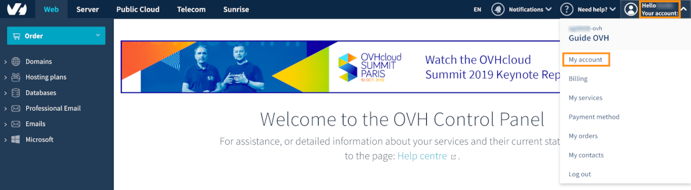
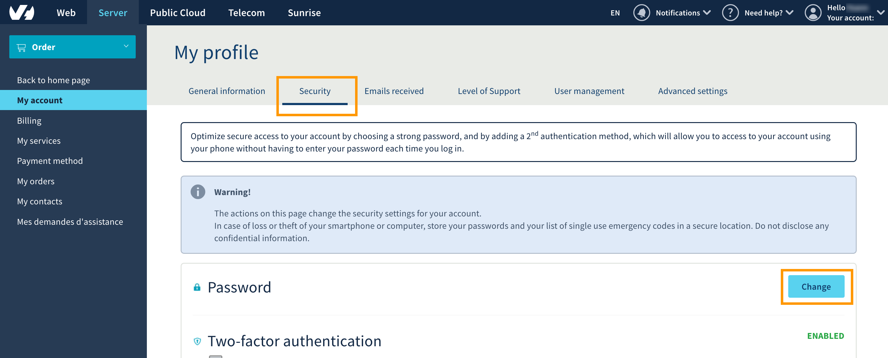

## Sumário

A palavra-passe da sua Área de Cliente OVHcloud é a chave de acesso a todos os seus serviços e informações. Deve ser suficientemente complexa e regularmente alterada para garantir a segurança.

**Saiba como definir, alterar e gerir a sua palavra-passe.**

## Requisitos
- Ter uma conta OVHcloud ativa.
- Conhecer a sua ID de cliente e/ou o seu endereço de e-mail.

## Instruções

### Gerar uma boa palavra-passe.

A segurança das suas soluções depende da eficácia da palavra-passe de acesso à sua Área de Cliente OVHcloud. Para proteger ao máximo os seus dados, deve respeitar algumas recomendações:

- conter, pelo menos, 12 carateres;

- conter, pelo menos, 1 letra maiúscula, 1 letra minúscula e 1 número;

- conter carateres especiais (por exemplo: %, #, :, $, \*);

- não existir no dicionário;

- não conter informações pessoais (o seu nome, sobrenome ou data de nascimento);

- estar armazenada num cofre-forte de palavras-passe;

- ser alterada a cada 3 meses;

- ser diferente das palavras-passe usadas anteriormente.

Há vários métodos eficazes para criar palavras-passe. Recomendamos-lhe, nomeadamente, o **método das primeiras letras** e o **método fonético**.

Para ficar a saber mais, consulte a secção [Quer saber mais?](https://docs.ovh.com/pt/customer/gerir-a-palavra-passe/#quer-saber-mais_2){.external} na parte de baixo deste guia.

### Utilizar um gestor de palavras-passe 

Programas específicos permitem guardar e proteger a sua palavra-passe de acesso à conta OVHcloud.

Pode, por exemplo, utilizar o gestor de palavras-passe **Keepass**. Trata-se de um programa livre e gratuito.

O princípio é simples: uma palavra-passe principal – que deve ser suficientemente complexa, mas que tem de memorizar – permite aceder a uma base de dados que reúne todas as suas ID de utilizador e palavras-passe. Estas podem ser muito complexas porque o programa consegue lembrar-se delas.

Este programa permite também gerar palavras-passe complexas aleatórias que irá memorizar para cada um dos seus sites ou aplicações.

### Boas práticas para a gestão da sua palavra-passe

- **Verificar a fiabilidade.** Garanta que a sua palavra-passe atual não foi transmitida a pessoas mal-intencionadas. Pode realizar um teste no site haveibeenpwned previsto para tal para verificar que ele não foi comprometido devido a violações de dados.
Se a sua palavra-passe estiver comprometida, recomendamos vivamente que a [altere imediatamente](./#alterar-a-sua-palavra-passe).

- **Uma palavra-passe única para cada serviço.** A palavra-passe de acesso à sua conta OVHcloud não deve ser novamente utilizada noutros sites ou aplicações. Aliás, recomendamos que aplique esta regra para todos os seus serviços web. Uma palavra-passe diferente para cada site permite evitar vulnerabilidades em caso de roubo de uma única palavra-passe.

- **Não memorize a sua palavra-passe no seu navegador.** Apesar de isso ser muito prático, não recomendamos que autorize a memorização da palavra-passe no seu navegador com um visto na caixa "Lembrar palavra-passe".  Esta manipulação coloca vários problemas em termos de segurança, nomeadamente quando uma pessoa mal-intencionada assume o controlo do seu computador. Basta-lhe recuperar o ficheiro que contém a lista das palavras-passe memorizadas para se poder ligar às suas várias contas.

- **Altere regularmente a sua palavra-passe:** alterar regularmente a sua palavra-passe permite aumentar a segurança da sua conta. À mínima dúvida, altere-a imediatamente. A adoção da nova palavra-passe leva automaticamente ao encerramento de todas as sessões ativas na sua conta OVHcloud. Acima de tudo, a nova palavra-passe deve ser diferente das anteriores palavras-passe utilizadas.

- **Mantenha-a secreta.** Uma palavra-passe deve manter-se escondida. Não deve, por isso, ser escrita, partilhada entre vários utilizadores nem comunicada a um terceiro. As equipas OVHcloud nunca lhe pedem a sua palavra-passe, por exemplo, por e-mail.

### Alterar a sua palavra-passe

#### A partir da sua Área de Cliente OVHcloud

- Ligue-se à sua [Área de Cliente OVHcloud](https://www.ovh.com/auth/?action=gotomanager){.external}, clique no seu nome (canto superior direito) e selecione `A minha Conta`{.action}.

{.thumbnail}

- Clique então em `Segurança`{.action} e em `Alterar`{.action} à direita de "Palavra-passe".

{.thumbnail}

- Confirmar a alteração da palavra-passe.

{.thumbnail}

- Um e-mail é, então, enviado para o endereço de contacto da conta, para confirmar a alteração de palavra-passe. Leia atentamente as instruções e clique na ligação que nele está incluída. Esta ligação encaminha para a página de alteração da palavra-passe. Introduza a sua ID de utilizador no primeiro campo, a nova palavra-passe no segundo campo e confirme esta nova palavra-passe no terceiro campo.

{.thumbnail}

- Surge então uma mensagem que lhe indica o êxito da operação. Clique no botão `Continuar`{.action} na zona inferior desta mensagem para ser encaminhado para a página de identificação. Introduza então a sua ID de utilizador e a sua nova palavra-passe.

#### Se não se lembrar da sua palavra-passe atual

- Clique em `ID de utilizador ou palavra-passe esquecida?`{.action} ao aceder à janela de identificação da sua Área de Cliente OVHcloud.

{.thumbnail}

- Introduza a sua ID de utilizador ou o endereço de e-mail principal associado à sua conta OVHcloud, e clique em `Enviar`{.action}.

{.thumbnail}

- É então apresentada uma mensagem que informa sobre o envio das informações.

{.thumbnail}

- Um e-mail é, então, enviado para o endereço de contacto da conta, para confirmar a alteração de palavra-passe. Leia atentamente as instruções e clique na ligação que nele está incluída. Esta ligação encaminha para a página de alteração da palavra-passe. Introduza a sua ID de utilizador no primeiro campo, a nova palavra-passe no segundo campo e confirme esta nova palavra-passe no terceiro campo.

{.thumbnail}

- Surge então uma mensagem que lhe indica o êxito da operação. Clique no botão `Continuar`{.action} na zona inferior desta mensagem para ser encaminhado para a página de identificação. Introduza então a sua ID de utilizador e a sua nova palavra-passe.

> [!primary]
> 
> O reconhecimento da alteração da palavra-passe leva automaticamente ao encerramento de todas as sessões ativas na sua conta OVHcloud.
> 

## Quer saber mais?

[Normas CNCS para criar e gerir palavras-passe](https://www.cncs.gov.pt/content/files/bp_p.pdf){.external}

[O gestor de palavras-passe Keepass](https://keepass.info/){.external}

Fale com a nossa comunidade de utilizadores em https://community.ovh.com/en/

