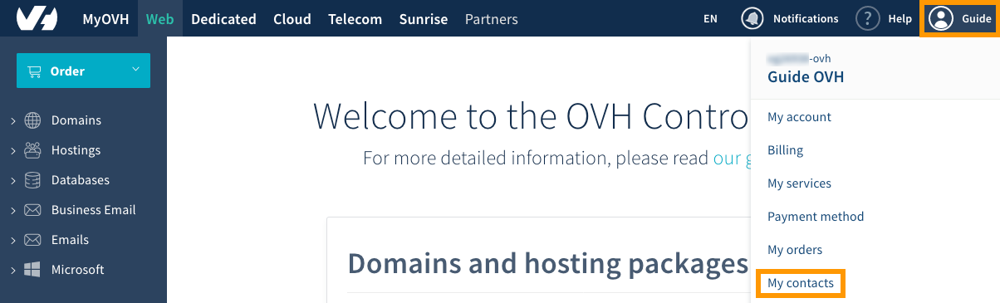
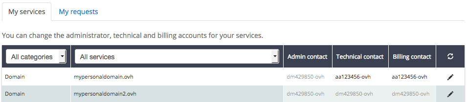
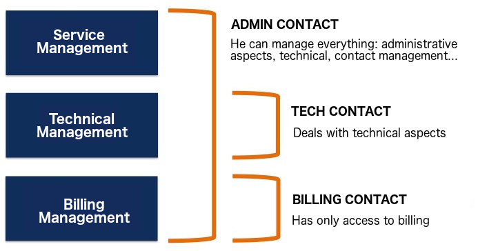
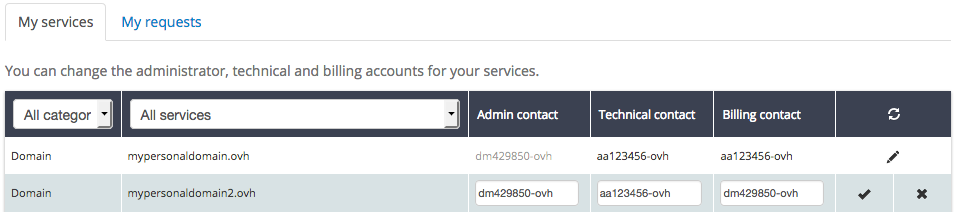
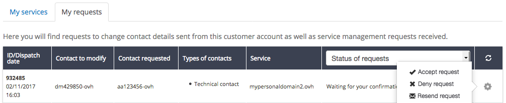
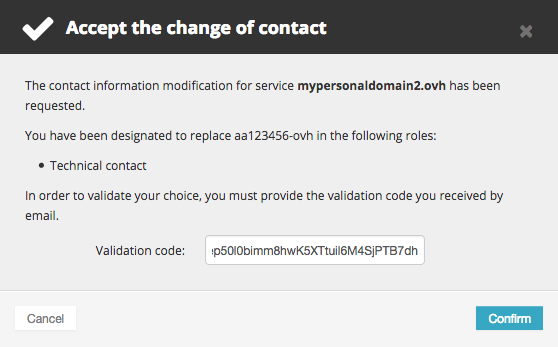
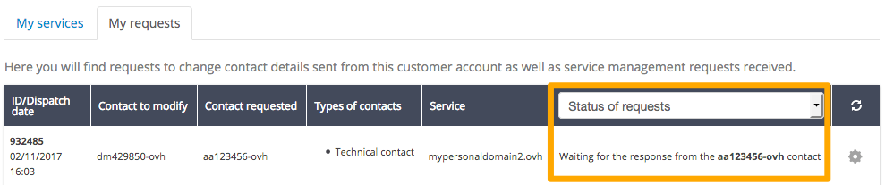

**Last updated 3rd January 2019** 

## Objective

OVH services are generally linked to several contacts. These contacts manage your service, depending on the various rights they have.

**Learn how to manage contacts for your OVH services.**

## Requirements

- You must be logged in to your [OVH Control Panel](https://www.ovh.com/auth/?action=gotomanager){.external}.
- You must have access to the email address linked to your profile.
- You must have the correct rights for the service concerned.
- You must have the new contact’s NIC handle (the contact you want to add).
- The new contact must have access to the email address linked to their profile.
- The old and new billing contacts must be up-to-date with their payments.

## Instructions

### Accessing contact management

Log in to the [OVH Control Panel](https://www.ovh.com/auth/?action=gotomanager){.external}, click on the name linked to your NIC handle (Customer ID) in the menu bar in the top right-hand corner, then click `My contacts`{.action}.

{.thumbnail}

The table that appears will show all of the services your NIC handle is registered with as a contact.

{.thumbnail}

Below, you will see some explanations on the contacts that are available:

- **the administrative contact** manages a service’s administrative and technical aspects. They have rights to modify all contacts, and can make changes to information belonging to the owner of a service, such as domain names, for example.
- **the technical contact** only manages the technical aspects of a service.
- **the billing contact** only manages the billing aspects of a service. Notably, this contact receives renewal notifications for services.

The NIC handle is a personal username that you receive via email when you create your Control Panel with OVH. It is made up of two letters and several numbers, then ends with -ovh (e.g.: aa123456-ovh). When you order solutions, this NIC handle is used as a contact for the services you have chosen.

{.thumbnail}

### Changing the contacts for a service

Once you are on the contact management page, click on the pencil icon. Enter the new contact(s) you want to add, then confirm your request.

{.thumbnail}

If you have successfully edited your contacts, a message will appear in a green box, confirming that your change request has been processed. It will also confirm that an email has been sent to the contacts you have added.

**Important**: depending on your current role, you may not be able to modify the other contacts.

#### I am an administrative contact

As an administrator, you can make several changes to contacts for a service:

- naming a new technical and/or billing contact. Validation is required from both you and the new contact. The previous contact will receive an email informing them of this change, if it is successful.
- managing technical and/or billing aspects. You must validate this request. The previous contact will receive an email informing them of this change.
- naming a new administrative contact to replace you. Validation is required from both you and the new contact.

**Important**: in certain cases, the administrative contact can change information belonging to the owner of a service, such as domain names. We advise that you exercise caution when you make changes.

#### I am a technical contact

You can only add another technical contact to replace you. Validation is required from both you and the new contact.

#### I am a billing contact

You can only add another billing contact to replace you. Validation is required from both you and the new contact.

**Important**: The old and new billing contacts must be up-to-date with payments for their services.

### Validating, declining or tracking a contact change

To track and manage ongoing requests, click on the `My requests`{.action} tab. Here, you can accept or decline a request.

{.thumbnail}

To do this, you must have a validation code (also called a token) contained in the email to validate or decline the request.

**Important**: this code is personal, can only be used once, and it will be different for the other two contacts.

The email you receive will also contain a link directing you to the page where you can validate or decline the request. If you click the link in the email, the validation code (token) will be inserted automatically.

If one of the contacts has not received this email, the contact email address linked to the profile may not be up-to-date. You can check this in your profile, change it if required, and request for the email to be sent again by clicking `Resend request`{.action}.

{.thumbnail}

If only one contact has validated the change, a message will appear confirming that the request is still pending validation from the other contact. If one of the contacts has just validated the request, it may take a few minutes for the information to be updated and appear correctly in the [OVH Control Panel](https://www.ovh.com/auth/?action=gotomanager){.external}.

{.thumbnail}

Once both contacts have validated the request, the change will be successful. The two contacts will receive an email confirming that the request has been successfully processed.

## Go further

Join our user community on <https://community.ovh.com/en/>.