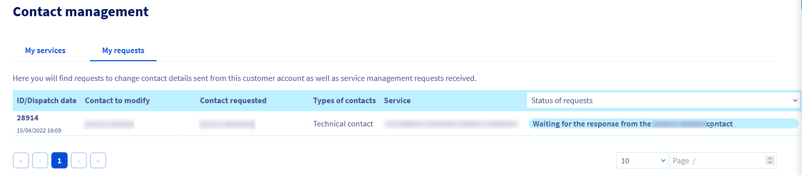

**Última actualización: 13/12/2020** 

## Objetivo

La mayoría de servicios creados en OVHcloud los gestionan varios contactos. Cada uno de esos contactos está asociado a un identificador de cliente. 

**Esta guía explica cómo gestionar los contactos de los servicios de OVHcloud.**

> [!warning]
>
> La configuración, la gestión y la responsabilidad de los servicios que OVHcloud pone a su disposición recaen sobre usted. Por lo tanto, usted deberá asegurarse de que estos funcionen correctamente.
>
> Esta guía le ayudará a realizar las operaciones más habituales. No obstante, si tiene alguna duda le recomendamos que contacte con un proveedor de servicios especializado o con el editor del servicio. Nosotros no podremos asistirle al respecto. Para más información, consulte el apartado [Más información](#gofurther) de esta guía.
>

## Definición

Existen tres tipos de contactos:

- **El contacto administrador** se encarga de los aspectos administrativos y técnicos del servicio. Tiene permisos para modificar el resto de contactos y puede realizar cambios en los datos del propietario de servicios como, por ejemplo, los dominios.
- **El contacto técnico** solo se encarga de los aspectos técnicos del servicio.
- **El contacto de facturación** solo se encarga de los aspectos relativos a la facturación del servicio. En concreto, es el que recibe las notificaciones referentes a las renovaciones. 

El identificador de cliente es un identificador personal que se envía por correo electrónico al crear su cuenta de cliente de OVHcloud. Suele componerse de dos letras seguidas de números. Por ejemplo, **xx11111-ovh**. Cuando contrata servicios, se les asocia este identificador como contacto.

{.thumbnail}

## Requisitos

- Estar conectado a su [área de cliente de OVHcloud](https://www.ovh.com/auth/?action=gotomanager&from=https://www.ovh.es/&ovhSubsidiary=es){.external}.
- Tener acceso a la dirección de correo electrónico que se indica en el perfil de su cuenta.
- Tener los permisos necesarios sobre el servicio correspondiente.
- Conocer el ID de cliente del nuevo contacto (para poder modificarlo).
- El nuevo contacto debe tener acceso a la dirección de correo electrónico que se indica en el perfil de su cuenta.
- El antiguo y el nuevo contacto de facturación deben estar al corriente de pago.

## Procedimiento

### Acceder a la gestión de los contactos 

Conéctese a su [área de cliente de OVHcloud](https://www.ovh.com/auth/?action=gotomanager&from=https://www.ovh.es/&ovhSubsidiary=es){.external}, haga clic en el nombre asociado a su identificador en la esquina superior derecha y seleccione `Gestión de contactos`{.action}.

{.thumbnail}

Se mostrará una tabla con todos los servicios en los que su identificador de cliente aparece como contacto.

{.thumbnail}

> [!warning]
>
> No se autorizará ningún cambio de contacto si la antigua o la nueva cuenta de cliente de que se trate tienen una o varias facturas impagadas.
>

### Cambiar los contactos de un servicio

Una vez haya accedido a la página de gestión de los contactos, haga clic en `...`{.action} a la derecha del servidor que quiere modificar, y a continuación haga clic en `Modificar los contactos`{.action}. Introduzca el o los nuevos contactos y haga clic en `Confirmar`{.action} su solicitud.

{.thumbnail}

{.thumbnail}

Los contactos implicados en el proceso de modificación recibirán un mensaje de correo electrónico.

#### Soy contacto administrador 

Como administrador, puede realizar distintas modificaciones en los contactos de un servicio:

- Indicar un nuevo contacto técnico y/o de facturación. Para ello, es necesario que tanto usted como los nuevos contactos validen el cambio. Una vez validado, el antiguo contacto recibirá un mensaje de correo electrónico informándole del cambio.
- Ponerse a sí mismo como contacto técnico y/o de facturación. Usted deberá validar la solicitud. El antiguo contacto recibirá un mensaje de correo electrónico informándole del cambio de contacto. 
- Indicar un nuevo contacto administrador en su lugar. Para ello, es necesario que tanto usted como el nuevo contacto administrador validen el cambio. 

#### Soy contacto técnico 

Como contacto técnico, solo puede designar a otro contacto técnico que ocupe su lugar. Para ello, es necesario que tanto usted como el nuevo contacto técnico validen el cambio.

#### Soy contacto de facturación

Como contacto de facturación, solo puede designar a otro contacto de facturación que ocupe su lugar. Para ello, es necesario que tanto usted como el nuevo contacto de facturación validen el cambio.

### Validar, rechazar o realizar el seguimiento de un cambio de contacto

Para gestionar y realizar el seguimiento de las solicitudes en curso, haga clic en `Gestión de contactos`{.action} > `Mis solicitudes`{.action}. Ahí es donde puede aceptar o rechazar una solicitud.

{.thumbnail}

Para ello, recibirá por correo electrónico un código de verificación (también llamado «token») que deberá introducir para aceptar o denegar la solicitud de cambio.

> [!primary]
> Este código es personal, de un solo uso y diferente para los dos contactos que lo reciben.

En el mensaje de correo electrónico anterior también encontrará un enlace con el que podrá acceder directamente a la página en la que podrá aceptar o denegar la solicitud de cambio. Si utiliza dicho enlace, el código de verificación (token) se completará de forma automática.

En caso de que uno de los contactos no haya recibido el mensaje de correo electrónico, deberá comprobar que la dirección del contacto que se indica en el perfil de su cuenta esté actualizada. Si no lo está, actualícela y vuelva a solicitar el envío del email haciendo clic en `Volver a enviar la solicitud`{.action}.

{.thumbnail}

Si solo uno de los contactos valida la solicitud de cambio, aparecerá un mensaje informándole de que la solicitud está pendiente de validación por parte del otro contacto. Si el contacto acaba de validar la solicitud de cambio, es posible que la información que se muestra en el [área de cliente de OVHcloud](https://www.ovh.com/auth/?action=gotomanager&from=https://www.ovh.es/&ovhSubsidiary=es){.external} tarde unos minutos en actualizarse.

{.thumbnail}

El cambio de contacto será efectivo unos minutos después de que los dos contactos hayan validado la solicitud. Recibirán un mensaje de correo electrónico informándoles de que la solicitud se ha tramitado correctamente.

### Ejemplo: dar la gestión técnica de su sitio web a su webmaster

Acaba de contratar una suscripción de OVHcloud que le permitirá crear su propia [tienda online](https://www.ovhcloud.com/es-es/web-hosting/ecommerce-website/). Para empezar a crear su sitio web, usted ha contactado con uno de nuestros [partners](https://partner.ovhcloud.com/es-es/directory/) y le solicita los permisos de acceso a sus servicios de OVHcloud.

> [!warning]
>
> No se recomienda proporcionar a ningún tercero las claves de acceso al [área de cliente de OVHcloud](https://www.ovh.com/auth/?action=gotomanager&from=https://www.ovh.es/&ovhSubsidiary=es).
>

En ese caso, conceda a su proveedor el derecho de "[contacto técnico](#gestion_des_contacts)" en su alojamiento de OVHcloud. Este acceso le permitirá realizar las manipulaciones necesarias para la puesta en línea de su sitio web (adición de un dominio o subdominio en el multisitio, instalación de un módulo en 1 clic, modificación de la contraseña FTP o de la base de datos, creación de un certificado SSL, etc.).

Si su dominio no está asociado a su alojamiento y quiere transferir las operaciones necesarias a su webmaster, dígale también el permiso de "[contacto técnico](#gestion_des_contacts)" en la [zona DNS](https://docs.ovh.com/es/domains/web_hosting_como_editar_mi_zona_dns/) de su dominio.

El derecho "[contacto técnico](#gestion_des_contacts)" no permite modificar los contactos administrador o la facturación de un servicio. No dará a su webmaster el acceso a sus facturas o pedidos, a la renovación de sus servicios o a sus formas de pago. Tampoco le permitirá realizar la [transferencia de la gestión de su dominio](https://docs.ovh.com/es/domains/transferencia_saliente_de_un_dominio_generico_o_geografico/) a otro proveedor de alojamiento o [cambiar su propietario](https://docs.ovh.com/es/domains/cambio-propietario-dominio/).

En cualquier momento, como [contacto administrador](#administrateur), podrá obtener el "[contacto técnico](#technique)" de su servicio.

### Caso particular de un propietario de dominio

Al contratar un servicio de OVHcloud, ha establecido un propietario para este. Si el propietario no tiene acceso a la(s) cuenta(s) de OVHcloud asociadas al servicio que quiere recuperar, podrá ceder la propiedad de un dominio a un tercero o recuperar la administración del dominio mediante los siguientes procedimientos:

[Cambiar el propietario de un servicio](https://www.ovh.com/cgi-bin/es/procedure/procedureChangeOwner.cgi)

[Cambiar los contactos administrativo, de facturación y técnico de un dominio](https://www.ovh.com/fr/cgi-bin/es/procedure/procedureChangeContacts.cgi)

El seguimiento de cada procedimiento se efectúa por e-mail y será necesaria una verificación de identidad. A lo largo de cada procedimiento recibirá instrucciones detalladas.

## Más información

Para servicios especializados (posicionamiento, desarrollo, etc.), contacte con [partners de OVHcloud](https://partner.ovhcloud.com/es-es/directory/).

Si quiere disfrutar de ayuda para utilizar y configurar sus soluciones de OVHcloud, consulte nuestros distintos [servicios de soporte](https://www.ovhcloud.com/es-es/support-levels/).

Interactúe con nuestra comunidad de usuarios en <https://community.ovh.com/en/>.
