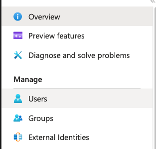
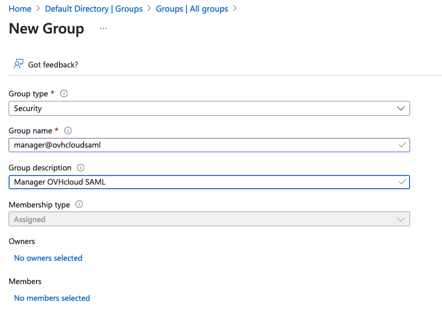
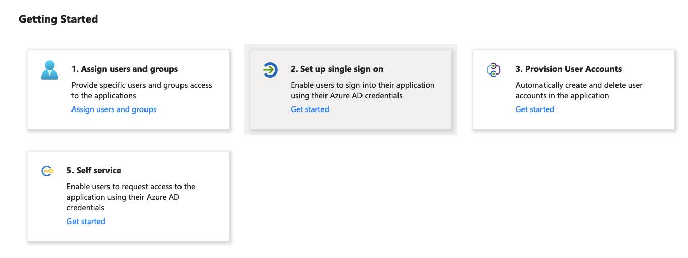
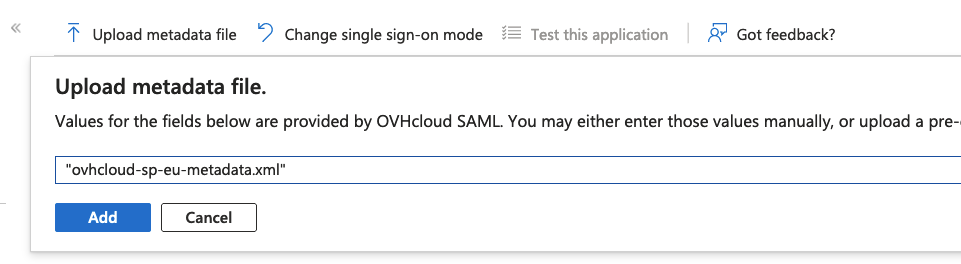
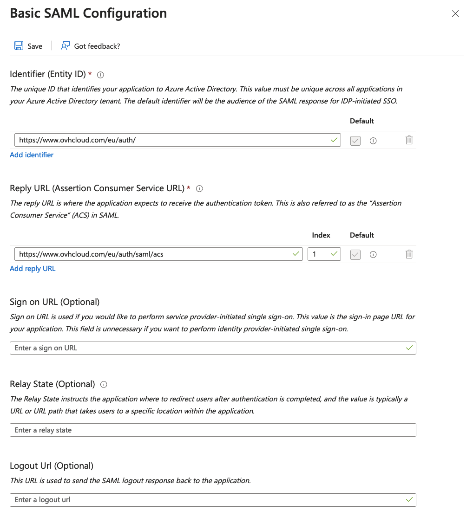
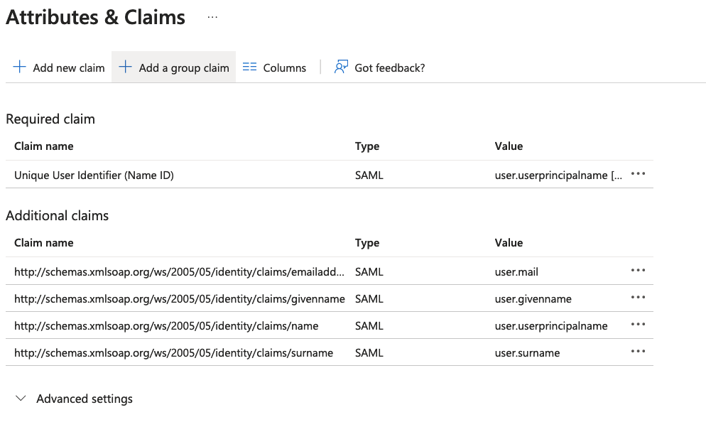
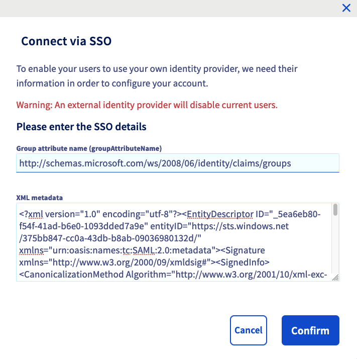
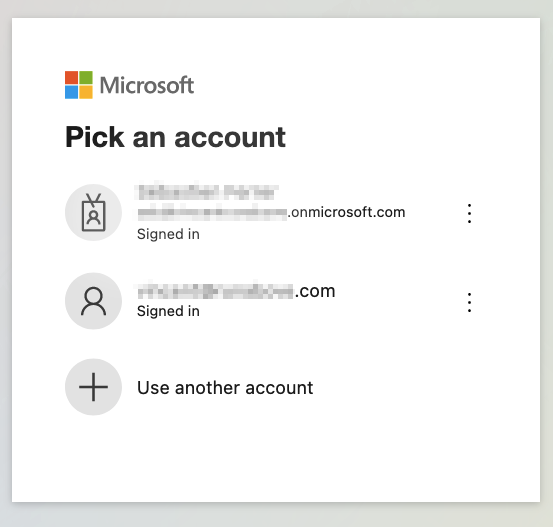
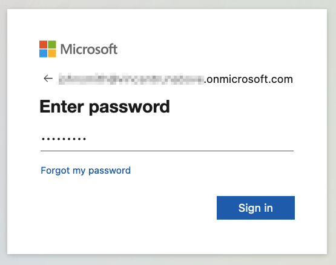
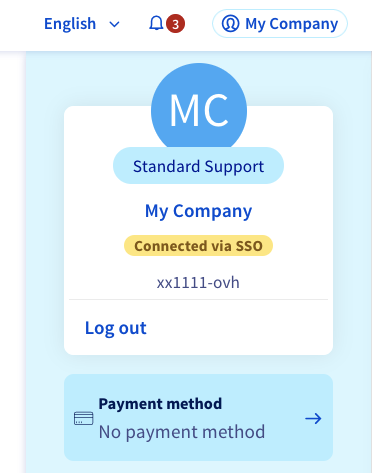

**Dernière mise à jour le 05/04/2023**

## Objectif

Vous pouvez utiliser l'authentification **SSO** (*Single Sign-On*) pour vous connecter à votre compte OVHcloud. Pour activer ces connexions, votre compte et votre Azure AD (Active Directory) doivent être configurés à l'aide de SAML (*Security Assertion Markup Language*).

**Découvrez comment associer votre compte OVHcloud à un Azure AD externe.**

## Prérequis

- Avoir accès aux rôles **Administrateur d'applications** et **Administrateur d'utilisateurs** d'un service Azure AD
- Disposer d'un [compte OVHcloud]https://docs.ovh.com/ca/fr/customer/creer-compte-ovhcloud/)
- Être connecté à votre [espace client OVHcloud](https://ca.ovh.com/auth/?action=gotomanager&from=https://www.ovh.com/ca/fr/&ovhSubsidiary=qc)

## En pratique

> [!primary]
>
> Afin qu’un fournisseur de services (par exemple, votre compte OVHcloud) établisse une connexion SSO avec un fournisseur d’identité (par exemple, votre Azure AD), vous devez établir une relation de confiance mutuelle en enregistrant la connexion SSO dans les deux services.
>

### Utilisateurs et groupes Azure AD

Votre Azure AD agit en tant que fournisseur d'identité. Les demandes d'authentification de votre compte OVHcloud ne seront acceptées que si vous l'avez d'abord déclaré comme tiers de confiance.

Concentrons-nous un instant sur les identités du côté du fournisseur d'identité.

#### Utilisateurs Azure AD

Pour commencer, accédez à votre tableau de bord Azure AD.

{.thumbnail}

Cliquez ensuite sur `Users`{.action} dans le menu de gauche.

{.thumbnail}

Créez autant d'utilisateurs que vous le souhaitez et/ou vérifiez vos utilisateurs en cliquant dessus.

Pour cet exemple, l'utilisateur **John Smith** sera utilisé.

{.thumbnail}

Lorsqu'une authentification SSO est effectuée, l'identité de **John Smith** est fournie par Azure AD au compte OVHcloud. Cependant, il est nécessaire que cette identité contienne au moins un groupe. Si aucun groupe n'existe, retrouvez ci-dessous comment en créer un pour y ajouter **John Smith**.

#### Groupes Azure AD

Cliquez sur `Groups`{.action} dans le menu de gauche.

{.thumbnail}

Cliquez sur `New group`{.action} dans le menu du haut et complétez toutes les informations nécessaires.

Pour cet exemple, le groupe **manager@ovhcloudsaml** sera utilisé.

{.thumbnail}

Cliquez sur le bouton `Create`{.action} pour afficher toutes les informations sur ce groupe.

{.thumbnail}

Maintenant, les utilisateurs qui seront utilisés pour l'authentification SSO doivent être ajoutés à un groupe.

Dans cet exemple, associons l'utilisateur **John Smith** au groupe **manager@ovhcloudsaml**.

Dans l’interface du groupe sélectionné, cliquez sur `Members`{.action} dans le menu de gauche, puis cliquez sur `Add members`{.action} dans le menu du haut.

{.thumbnail}

Sélectionnez l'utilisateur à ajouter dans ce groupe, puis cliquez sur le bouton `Select`{.action}.

{.thumbnail}

Maintenant, l'utilisateur est assigné au groupe.

Pour effectuer des authentifications SSO, une application Azure AD doit être créée.

L'authentification unique doit être configurée sur cette application.

### Applications Azure AD

Tout d’abord, créez une application si elle n’existe pas encore.

#### Créer une application Azure AD

Cliquez sur `Enterprise applications`{.action} dans le menu de gauche.

{.thumbnail}

Cliquez sur `New application`{.action} dans le menu du haut.

{.thumbnail}

Cliquez sur `Create your own application`{.action} dans le menu du haut.

{.thumbnail}

Sélectionnez `Non-gallery`{.action} dans le menu de gauche et cliquez sur le bouton `Create`{.action}.

{.thumbnail}

Les détails de l'application seront alors affichés.

{.thumbnail}

L'application Azure AD est maintenant créée. Les utilisateurs souhaitant effectuer des authentifications SSO via cette application doivent à présent y être ajoutés.

#### Application Azure AD - Affectation d'utilisateurs

> [!primary]
>
> Pour qu'un utilisateur effectue une authentification SSO à partir d'une application Azure AD, il doit être ajouté à cette application. Retrouvez ci-dessous comment ajouter un utilisateur à une application Azure AD.
>
> Cependant, il est préférable d'ajouter un groupe d'utilisateurs plutôt que des utilisateurs si vous disposez d'**Azure AD Premium**.
>

Cliquez sur `Users and groups`{.action} dans le menu de gauche, puis cliquez sur `Add user/group`{.action} dans le menu du haut.

Cliquez ensuite sur la section `Users`{.action}, sélectionnez l'utilisateur à ajouter à l'application puis cliquez sur le bouton `Select`{.action}.

{.thumbnail}

{.thumbnail}

L’application est créée, l'utilisateur est assigné, il ne vous reste plus qu’à mettre en place le SSO via SAML.

#### Azure AD application SSO

Revenez à la vue d'ensemble via le bouton `Overview`{.action} dans le menu de gauche, puis cliquez sur la section `Set up single sign on`{.action}.

{.thumbnail}

Cliquez sur la section `SAML`{.action} .

{.thumbnail}

Cliquez sur `Upload metadata file`{.action} dans le menu du haut.

{.thumbnail}

Cliquez sur l'icône du bouton `Select a file`{.action} , sélectionnez le fichier de métadonnées OVH Service Provider et cliquez sur le bouton `Add`{.action} .

Vous pouvez obtenir le fichier de métadonnées approprié via les liens suivants :

- [Métadonnées de région UE](https://www.ovh.com/auth/sso/saml/sp/metadata.xml)
- [Métadonnées de région CA](https://ca.ovh.com/auth/sso/saml/sp/metadata.xml)

Téléchargez le fichier de métadonnées, vous en aurez besoin plus tard.

{.thumbnail}

La configuration SAML s'affiche.

{.thumbnail}

Dans la section `Attributes & Claims`{.action}, cliquez sur le bouton `Modifier`{.action}.

{.thumbnail}

Cliquez sur `Add a group claim`{.action} dans le menu du haut.

{.thumbnail}

Sélectionnez `Security groups`{.action} et **Group ID** dans `Source attribute`{.action} puis cliquez sur le bouton `Save`{.action}.

{.thumbnail}

La revendication de **groups** doit maintenant apparaître dans la liste.

Copiez et enregistrez la valeur du **Claim name** quelque part (un bloc-notes par exemple), vous en aurez besoin ultérieurement.

{.thumbnail}

Dans la section `SAML certificates`{.action}, copiez la valeur du champ `App Federation Metadata Url`{.action}.

Utilisez ce lien pour télécharger le fichier de métadonnées de l'application Azure AD afin de l'utiliser ultérieurement dans le compte OVHcloud.

{.thumbnail}

### Établir la confiance d'un compte OVHcloud et configurer la connexion

L'ajout de votre application Azure AD en tant que fournisseur d'identité approuvé s'effectue dans [l'espace client OVHcloud](https://ca.ovh.com/auth/?action=gotomanager&from=https://www.ovh.com/ca/fr/&ovhSubsidiary=qc) où vous pouvez fournir les métadonnées du fournisseur d'identité.

#### Établir la confiance OVHcloud

[Connectez-vous sur votre espace client](https://ca.ovh.com/auth/?action=gotomanager&from=https://www.ovh.com/ca/fr/&ovhSubsidiary=qc) et cliquez sur votre profil en haut à droite.

{.thumbnail}

Cliquez sur votre nom pour accéder à la page de gestion de votre profil.

{.thumbnail}

Ouvrez l'onglet `Gestion des utilisateurs`{.action}.

{.thumbnail}

Cliquez alors sur le bouton `Connexion SSO`{.action}.

{.thumbnail}

Complétez le champ **Group Attribute Name** avec la valeur de **Claim name** des groupes d'applications Azure AD enregistrée précédemment.

Remplissez les métadonnées XML de votre application Azure AD à partir du fichier enregistré précédemment.

Cliquez sur le bouton `Valider`{.action}.

{.thumbnail}

L'ajout de votre application Azure AD en tant que fournisseur d'identité est donc établie mais vous devez quand même ajouter des groupes à votre compte OVHcloud.

> [!warning]
> Si vous essayez à ce stade de vous connecter via SSO, un message d'erreur «`Not in valid groups`» s'affichera probablement.
>
> En effet, votre compte OVHcloud vérifie si l'utilisateur authentifié appartient à un groupe existant sur le compte.
>

Pour résoudre cette situation, vérifiez l'attribut «Group» retourné par votre application Azure AD : le champ **Object Id**.

#### Déclaration des groupes OVHcloud

{.thumbnail}

Ajoutez-le en cliquant sur le bouton `Declarer un groupe`{.action}.

{.thumbnail}

Complétez les champs, puis cliquez sur le bouton `Valider`{.action}.

{.thumbnail}

Le groupe créé doit apparaître sur la liste.

{.thumbnail}

### Connexion via SSO

Sur [la page de connexion OVHcloud](https://ca.ovh.com/auth/?action=gotomanager&from=https://www.ovh.com/ca/fr/&ovhSubsidiary=qc), renseignez votre [identifiant]https://docs.ovh.com/ca/fr/customer/creer-compte-ovhcloud/#quel-est-mon-identifiant-client) client suivi de **/idp** sans mot de passe puis cliquez sur le bouton `Login`{.action} .

{.thumbnail}

Vous êtes ensuite redirigé vers la page de connexion à votre application Azure AD. Sélectionnez `Use another account`{.action}.

{.thumbnail}

Entrez l'e-mail de l'utilisateur de l'application Azure AD puis cliquez sur le bouton `Next`{.action}.

{.thumbnail}

Entrez le mot de passe de l'utilisateur de l'application Azure AD puis cliquez sur le bouton `Sign In`{.action}.

{.thumbnail}

Vous êtes maintenant connecté avec le même [nichandle]https://docs.ovh.com/ca/fr/customer/creer-compte-ovhcloud/#quel-est-mon-identifiant-client), mais via votre utilisateur Active Directory et en utilisant votre SSO d'application Azure AD.

{.thumbnail}

## Aller plus loin

Échangez avec notre communauté d'utilisateurs sur <https://community.ovh.com/>.
