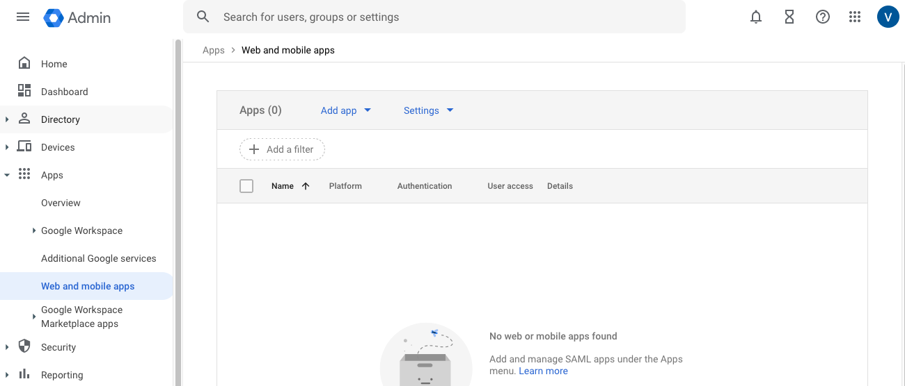
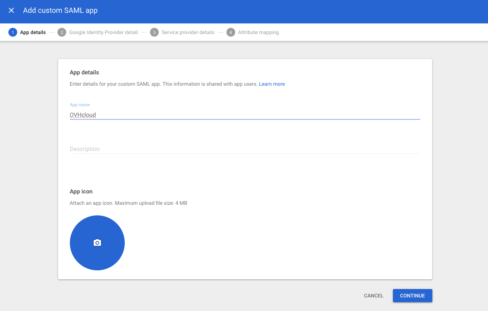
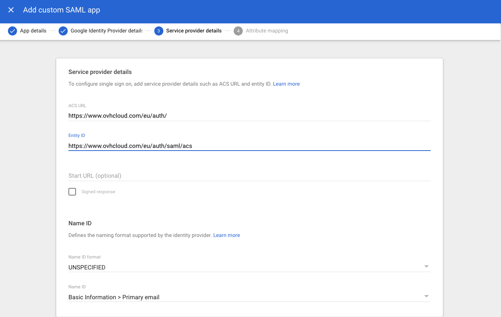
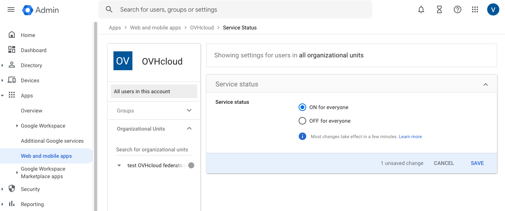
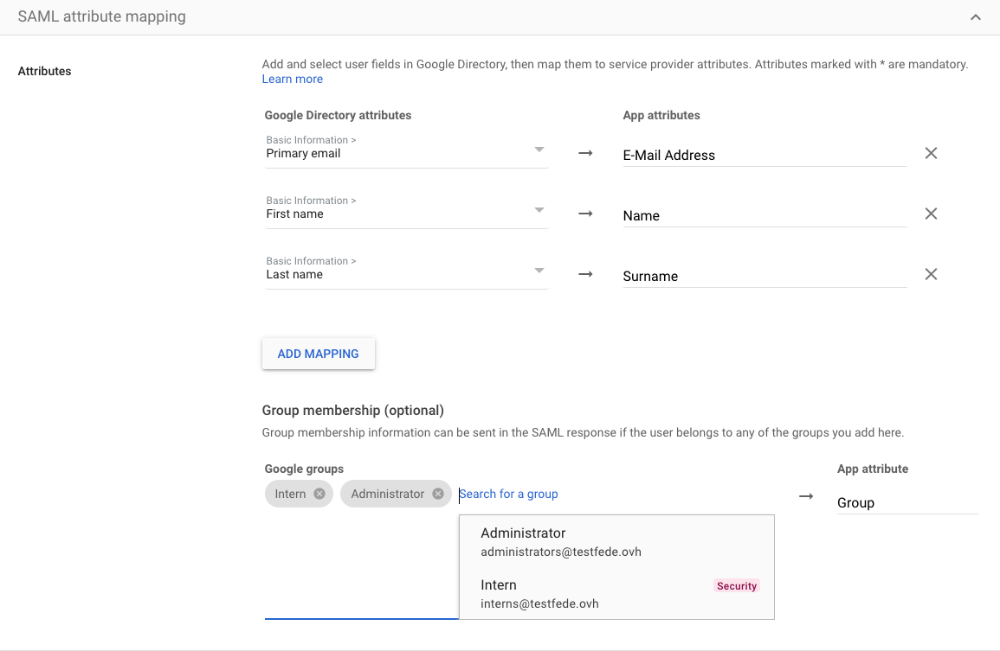

**Last updated 1st June 2023**

## Objective

You can use **Single Sign-On** (SSO) to sign in to your OVHcloud account. To enable these connections, your account and Google Workspace accounts have to be using SAML (*Security Assertion Markup Language*) authentication.

**This guide explains how to associate your OVHcloud account with an external Google Workspace service.**

## Requirements

- Being an administrator of a Google Workspace service
- An [OVHcloud account](https://docs.ovh.com/us/en/customer/create-ovhcloud-account/)
- Access to the [OVHcloud Control Panel](https://ca.ovh.com/auth/?action=gotomanager&from=https://www.ovh.com/world/&ovhSubsidiary=we)

## Instructions

> [!primary]
>
> In order for a service provider (i.e. your OVHcloud account) to establish an SSO connection with an identity provider (i.e. your Google Workspace service), the key is to establish a mutual trust relationship by registering the SSO connection in both services.
>

### Registering OVHcloud into Google Workspace

Your Google Workspace acts as an identity provider. Requests to authenticate your OVHcloud account will only be accepted if you have first declared it as a trusted third party.

This means that it must be added as `Web and mobile apps`.

Log in to the [Google Workspace](https://admin.google.com) administration interface with your administrator account.

Go to `Apps`{.action} then `Web and mobile apps`{.action}.

{.thumbnail}

Click `Add app`{.action} then `Add custom SAML app`{.action}.

In the "App details" step, add a name for this interconnection, **OVHcloud** for example. Click `Continue`{.action}.

{.thumbnail}

In the step "Google Identity Provider details", download the metadata file by clicking `Download metadata`{.action} then click `Continue`{.action}.

{.thumbnail}

In the step "Service provider details", complete the `ACS URL` and `Entity ID` fields with the values for your region: 

- EU region: **ACS URL**: `https://www.ovhcloud.com/eu/auth/saml/acs` and **Entity ID**: `https://www.ovhcloud.com/eu/auth/`
- CA region: **ACS URL**: `https://www.ovhcloud.com/ca/auth/saml/acs` and **Entity ID**: `https://www.ovhcloud.com/ca/auth/`

Click `Continue`{.action}.

{.thumbnail}

In the "Attribute mapping" step, add the following mapping:

- **First Name**: Name
- **Last Name**: Surname
- **Primary email**: E-mail Address

Click `Finish`{.action}.

{.thumbnail}

Enable access to this application by clicking `OFF for everyone`{.action} in the "User access" section. Click `ON for everyone`{.action} then the `SAVE`{.action} button.

{.thumbnail}

{.thumbnail}

> [!primary]
>
> Adding application access to users can take several hours to take effect.
>

Your Google Workspace service now trusts OVHcloud as a service provider. The next step is to ensure that the OVHcloud account trusts your Google Workspace as an identity provider.

### Registering Google Workspace into the OVHcloud account and configuring the connection

To add Google workspace as a trusted identity provider, you need to provide the identity provider metadata in the [OVHcloud Control Panel](https://ca.ovh.com/auth/?action=gotomanager&from=https://www.ovh.com/world/&ovhSubsidiary=we).

Once logged in, click your profile at the top right.

{.thumbnail}

Click on your name to access your profile management page.

{.thumbnail}

Open the `User Management`{.action} tab.

{.thumbnail}

Click the `SSO connection`{.action} button.

{.thumbnail}

Fill in the XML metadata of your Google Workspace service. Enter `Group` as the "Group Attribute Name". Click `Confirm`{.action}.

{.thumbnail}

Now you need to retrieve your Google Workspace as identity provider, as well as default groups.

{.thumbnail}

For more information, click on the link under “SSO Service URL”.

{.thumbnail}

The `...`{.action} button allows you to update or delete the SSO, and view its details.

{.thumbnail}

Your Google Workspace is now considered a trusted identity provider. However, you still need to add groups to your OVHcloud account.

> [!warning]
> If you try to connect via SSO at this point, you will probably receive a `Not in valid groups` error message.
>
> That is because your OVHcloud account checks whether the authenticating user belongs to an existing group on the account.
>

To resolve this, authorise the groups that will be transmitted from Google Workspace to OVHcloud. These groups are the same as those used to categorise your users.

To do this, log on to the [Google Workspace](https://admin.google.com) administration interface with your administrator account.

Go to `Apps`{.action} then `Web and mobile apps`{.action}.

{.thumbnail}

Click on the line for the application you added in the previous step.

{.thumbnail}

Click `SAML attribute mapping`{.action} to edit the mapping of information shared between Google Workspace and OVHcloud.

{.thumbnail}

In the "Group membership (optional)" section, add any groups that you want to allow to connect to OVHcloud. In the "App attribute" field, enter `Group`.

You must then assign **roles** to these user groups at OVHcloud. Otherwise, your OVHcloud account does not know what the user is allowed to do and, by default, no rights are assigned.

{.thumbnail}

From the OVHcloud Control Panel, add a group by clicking the `Declare a group`{.action} button and filling in the fields:

- **Group name**: Group name within Google Workspace
- **Role**: Level of rights granted to this group

{.thumbnail}

{.thumbnail}

You can then verify that the group is added to your OVHcloud account in the "Groups" section:

{.thumbnail}

When you later log in with a user from the **Intern** group, your OVHcloud account will recognise that the user has the role "UNPRIVILEGED" specified by his group.

You will then be able to log out of your account and log back in with your Google Workspace as an identity provider.

### Connecting via SSO

On [the OVHcloud login page](https://ca.ovh.com/auth/?action=gotomanager&from=https://www.ovh.com/world/&ovhSubsidiary=we), enter your [login](https://docs.ovh.com/us/en/customer/create-ovhcloud-account/#what-is-my-nic-handle) followed by **/idp** without a password and click the `Login`{.action} button.

{.thumbnail}

You are then redirected to your Google Workspace login page. Enter the login and password for a user of your Google Workspace, then click the `Sign in`{.action} button.

{.thumbnail}

You are now logged in with the same customer ID, but through your Google Workspace user.

{.thumbnail}

## Go further

[Creating an OVHcloud account](https://docs.ovh.com/us/en/customer/create-ovhcloud-account/)

[Securing my OVHcloud account and managing my personal information](https://docs.ovh.com/us/en/customer/all-about-your-username/)

[Setting and managing your account password](https://docs.ovh.com/us/en/customer/manage-password/)

[Securing your OVHcloud account with two-factor authentication](https://docs.ovh.com/us/en/customer/secure-account-with-2FA/)

Join our community of users on <https://community.ovh.com/en/>.
