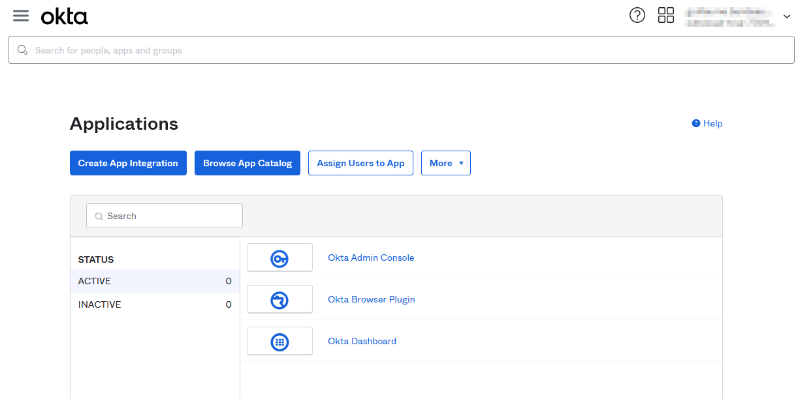
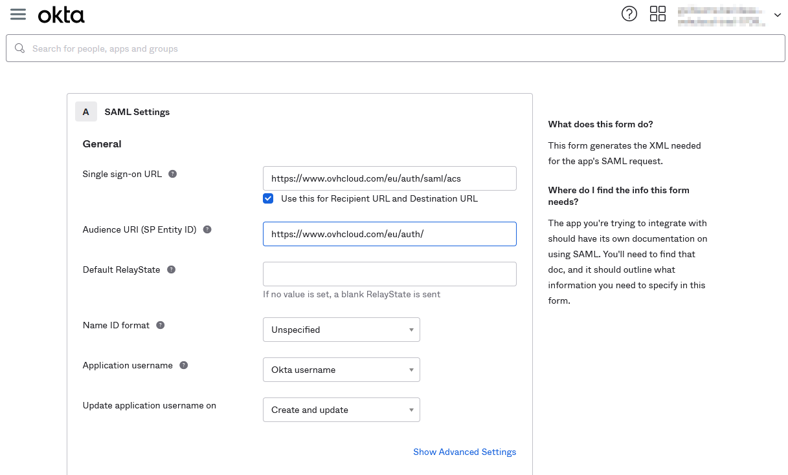
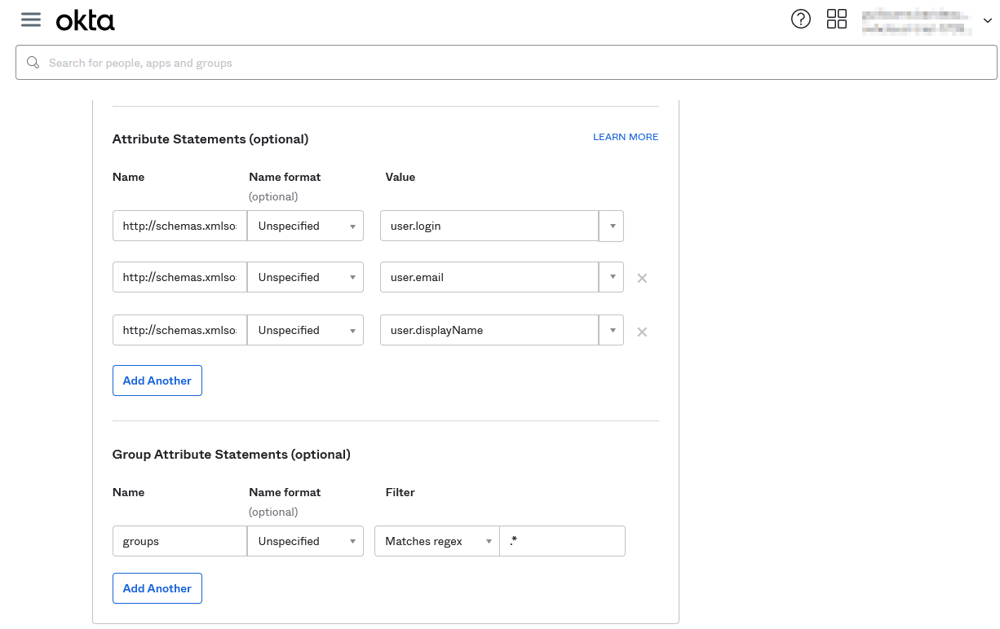
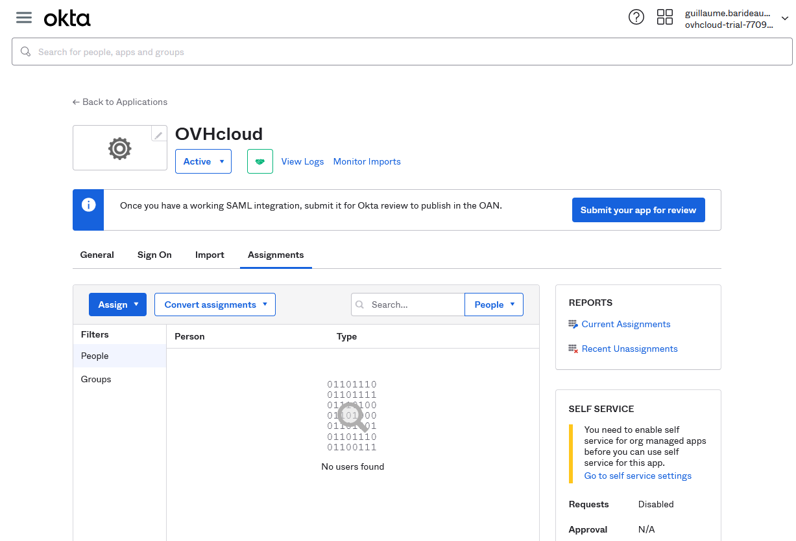
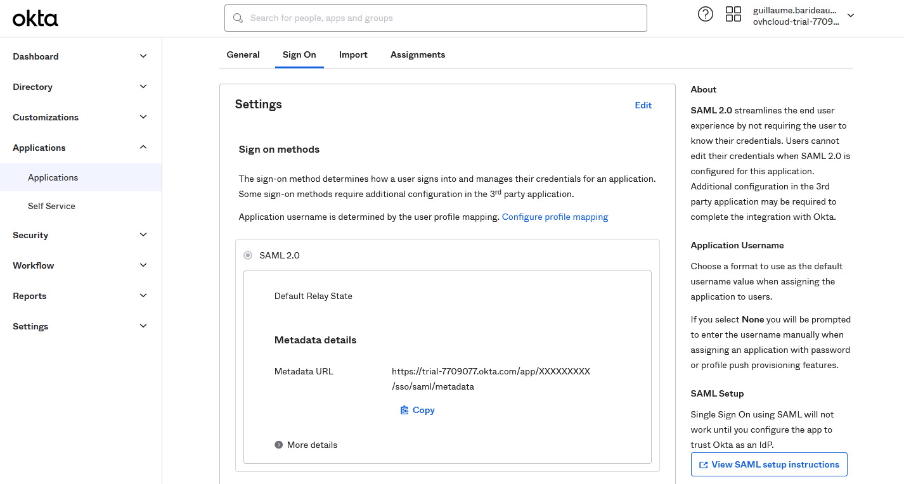
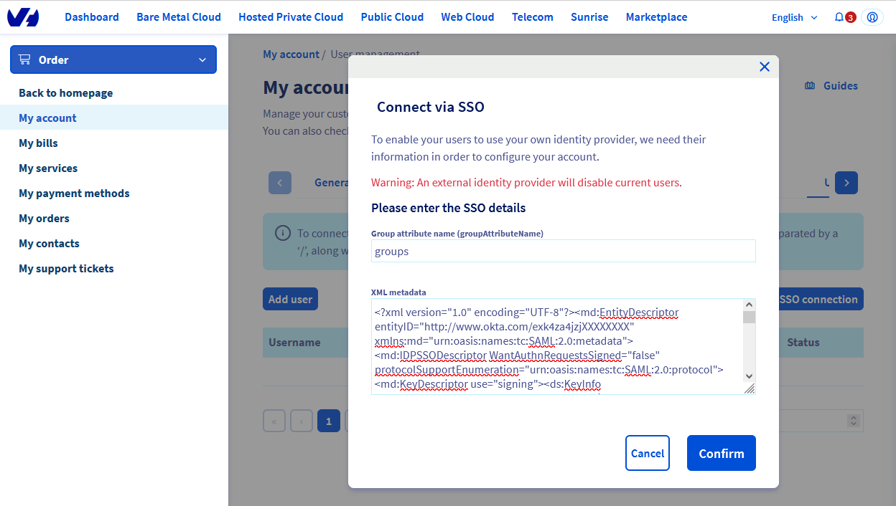
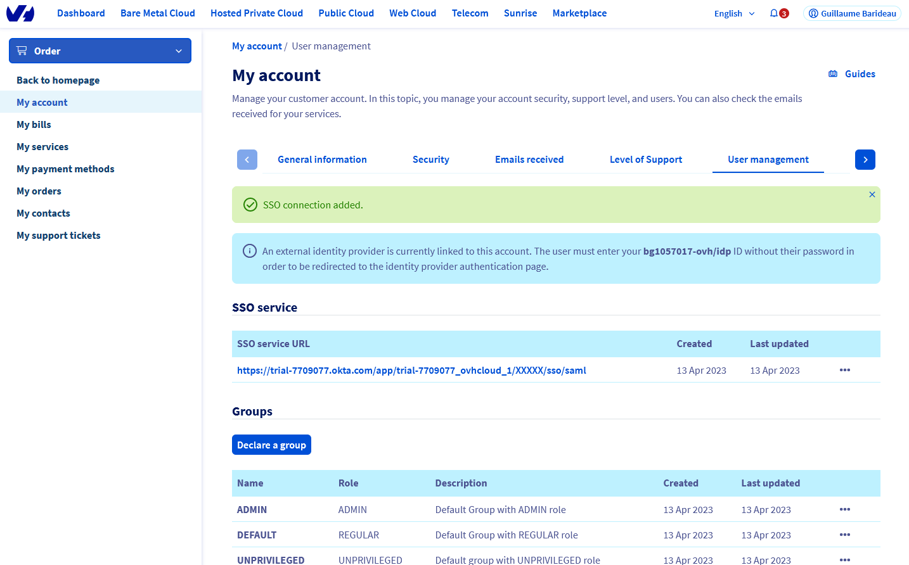
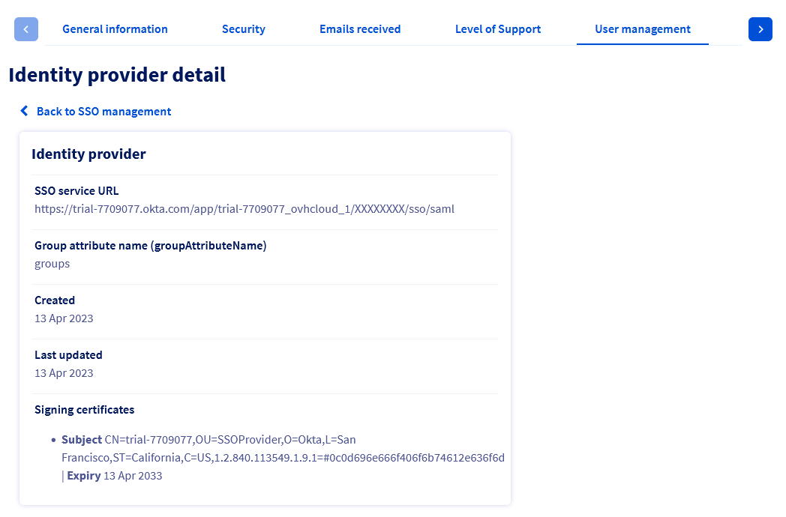
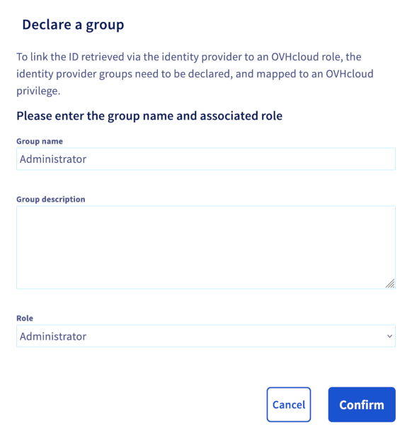

## Objective

You can use **Single Sign-On** (SSO) to connect to your OVHcloud account. To enable these connections, your account and your Okta accounts have to be configured using SAML (*Security Assertion Markup Language*) authentications.

**This guide explains how to associate your OVHcloud account with an external Okta service.**

## Requirements

- Being an administrator of an Okta service
- An [OVHcloud account](/pages/account/customer/ovhcloud-account-creation)
- Access to the [OVHcloud Control Panel](https://ca.ovh.com/auth/?action=gotomanager&from=https://www.ovh.com/sg/&ovhSubsidiary=sg)

## Instructions

> [!primary]
>
> In order for a service provider (i.e. your OVHcloud account) to establish an SSO connection with an identity provider (i.e. your Okta service), the key is to establish a mutual trust relationship by registering the SSO connection in both services.
>

### Registering OVHcloud into Okta

Your Okta service acts as an identity provider. Requests to authenticate your OVHcloud account will only be accepted if you have first declared it as a trusted third party.

This means that it must be added to `Applications`.

Log in to the Okta administration interface with your administrator account.

Go to `Applications`{.action} then again `Applications`{.action}.

{.thumbnail}

Click `Create App Integration`{.action} and select `SAML 2.0`{.action}.

{.thumbnail}

In the "General Settings" step, add a name for this application, **OVHcloud** for example, and a logo if you want. Click `Next`{.action}.

{.thumbnail}

In the step "Configure SAML", complete the `Single sign-on URL` and `Audience URI` fields with the values for your region: 

- EU region: **Single sign-on URL**: `https://www.ovhcloud.com/eu/auth/saml/acs` and **Audience URI**: `https://www.ovhcloud.com/eu/auth/`
- CA region: **Single sign-on URL**: `https://www.ovhcloud.com/ca/auth/saml/acs` and **Audience URI**: `https://www.ovhcloud.com/ca/auth/`

{.thumbnail}

Then set the following `Attribute Statements`:

- **Name**: `http://schemas.xmlsoap.org/ws/2005/05/identity/claims/upn` and **Value**: `user.login`
- **Name**: `http://schemas.xmlsoap.org/ws/2005/05/identity/claims/emailaddress` and **Value**: `user.email`
- **Name**: `http://schemas.xmlsoap.org/ws/2005/05/identity/claims/name` and **Value**: `user.displayName`

Set these `Group Attribute Statements`:

- **Name**: `groups` and **Filter**: `Matches regex:.*` (Adapt the filter if you want to be more specific)

Click `Next`{.action}.

{.thumbnail}

In the "Feedback" step, select the according option and click `Finish`{.action}.

Then open the application and go to the "Assignments" tab and assign users or groups to the application.

{.thumbnail}

Before going to the next section, go to the "Sign On" tab, and access to the **Metadata URL** and save the provided XML file.

{.thumbnail}

Your Okta service now trusts OVHcloud as a service provider. The next step is to ensure that the OVHcloud account trusts your Okta as an identity provider.

### Registering Okta into the OVHcloud account and configuring the connection

To add Okta as a trusted identity provider, you need to provide the identity provider metadata in the [OVHcloud Control Panel](https://ca.ovh.com/auth/?action=gotomanager&from=https://www.ovh.com/sg/&ovhSubsidiary=sg).

Once logged in, click your profile at the top right.

{.thumbnail}

Click on your name to access your profile management page.

{.thumbnail}

Open the `User Management`{.action} tab.

{.thumbnail}

Click the `SSO connection`{.action} button.

{.thumbnail}

Fill in the XML metadata of your Okta service. Enter `groups` as the "Group Attribute Name". Click `Confirm`{.action}.

{.thumbnail}

Now you need to retrieve your Okta as identity provider, as well as default groups.

{.thumbnail}

For more information, click on the link under “SSO Service URL”.

{.thumbnail}

The `...`{.action} button allows you to update or delete the SSO, and view its details.

{.thumbnail}

Your Okta service is now considered a trusted identity provider. However, you still need to add groups to your OVHcloud account.

> [!warning]
> If you try to connect via SSO at this point, you will probably receive a `Not in valid groups` error message.
>
> That is because your OVHcloud account checks whether the authenticating user belongs to an existing group on the account.
>

You must then assign **roles** to Okta user groups at OVHcloud. Otherwise, your OVHcloud account does not know what the user is allowed to do and, by default, no rights are assigned.

From the OVHcloud Control Panel, add a group by clicking the `Declare a group`{.action} button and filling in the fields:

- **Group name**: Group name within Okta
- **Role**: Level of rights granted to this group

{.thumbnail}

{.thumbnail}

You can then verify that the group is added to your OVHcloud account in the "Groups" section:

{.thumbnail}

When you later log in with a user from the **Intern** group, your OVHcloud account will recognise that the user has the role "UNPRIVILEGED" specified by his group.

You will then be able to log out of your account and log back in with your Okta as an identity provider.

### Connecting via SSO

On [the OVHcloud login page](https://ca.ovh.com/auth/?action=gotomanager&from=https://www.ovh.com/sg/&ovhSubsidiary=sg), enter your [login](/pages/account/customer/ovhcloud-account-creation#what-is-my-nic-handle) followed by **/idp** without a password and click the `Login`{.action} button.

{.thumbnail}

You are then redirected to your Okta login page. Enter the login and password for a user of your Okta, then click the `Sign in`{.action} button.

{.thumbnail}

You are now logged in with the same customer ID, but through your Okta user.

{.thumbnail}

## Go further

[Creating an OVHcloud account](/pages/account/customer/ovhcloud-account-creation)

[Securing my OVHcloud account and managing my personal information](/pages/account/customer/all_about_username)

[Setting and managing your account password](/pages/account/customer/manage-ovh-password)

[Securing your OVHcloud account with two-factor authentication](/pages/account/customer/secure-ovhcloud-account-with-2fa)

Join our community of users on <https://community.ovh.com/en/>.