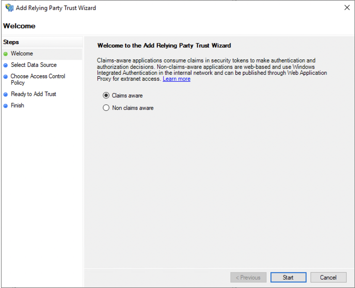
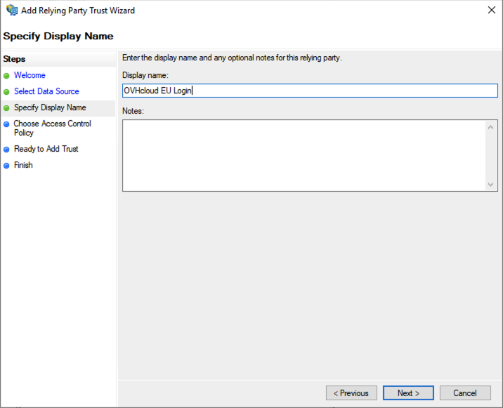
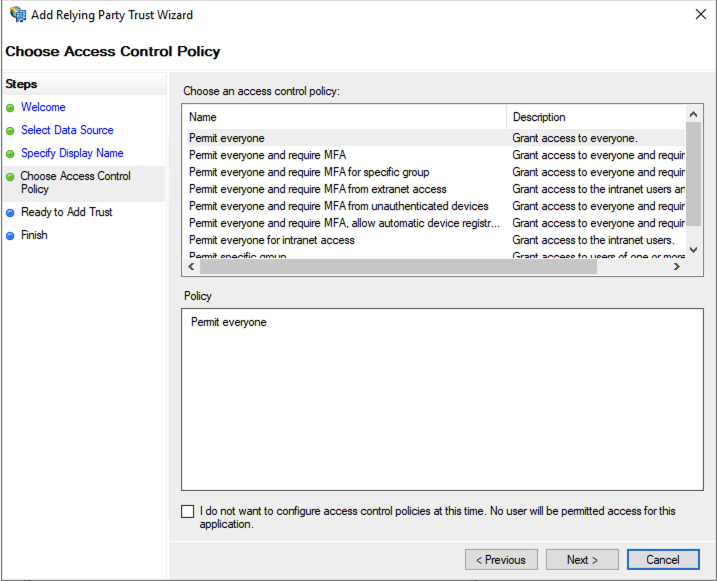
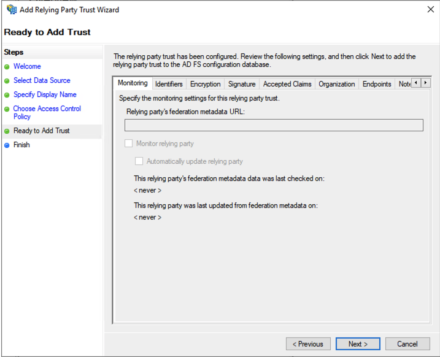
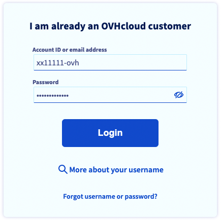
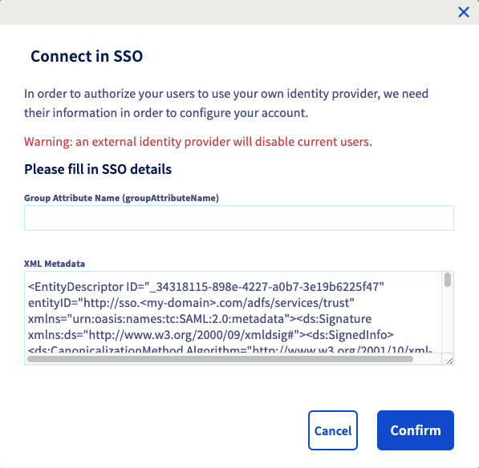
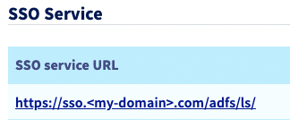
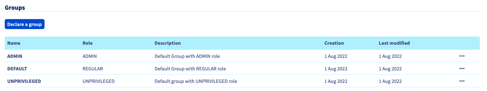
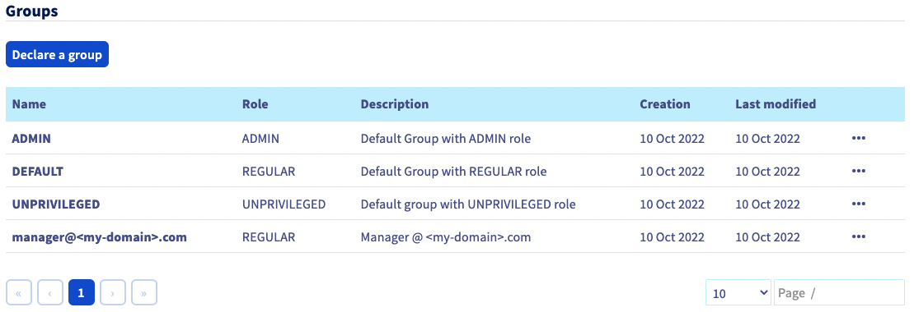

**Last updated 11th October 2022**

## Objective

To link your OVHcloud account to your own Active Directory, you must federate it in SAML.

**Find out how to federate your OVHcloud account to an external Active Directory.**

## Requirements

- An Active Directory Federation Services (ADFS) running
- An OVHcloud account

## Instructions

### AD FS trust establishing

> [!primary]
>
> In order for a service provider (as your OVHcloud account) to perform an SSO connection with an identity provider (as your ADFS), the essential part is to establish a mutual trust.
>

Let's start with the ADFS. Your ADFS is your identity provider, it must trust your OVHcloud account otherwise it will never accept any authentication request from it.

In the Active Directory world, that means adding a relying party trust.

From your Server Manager, go to `Tools`{.action} > `AD FS Management`{.action}.

{.thumbnail}

Click on `Relying Party Trusts`{.action}.

{.thumbnail}

Then click on `Add Relying Party Trust...`{.action}.

{.thumbnail}

Select `Claims aware`{.action}.

Click on the `Start`{.action} button.

{.thumbnail}

Here, you can you can either import the OVHCloud SP metadata, or enter data about the relying party manually.

Here's how to Import the OVHCloud SP metadata.

Select `Import data about the relying party from a file`{.action} then select the medatata file.

Here are the metedata files for the EU, CA and US regions:
- [EU metadata](https://www.ovh.com/auth/sso/saml/sp/metadata.xml)
- [CA metadata](https://ca.ovh.com/auth/sso/saml/sp/metadata.xml)
- [US metadata](https://us.ovhcloud.com/auth/sso/saml/sp/metadata.xml)

Then click to the `Next`{.action} button.

{.thumbnail}

Enter a name then click to the `Next`{.action} button.

{.thumbnail}

Click to the `Next`{.action} button.

{.thumbnail}

Click to the `Next`{.action} button.

{.thumbnail}

Then click to the `Close`{.action} button, you've added your relying party trust.

{.thumbnail}

> [!primary]
>
> Your relying party is now trusted, so you should now be able to log in via an SSO connection, but you won't be able to get any information about the identity of the user yet (in the SAML assertion in the case of SAML).
>

In order to do that, you have to set the mapping between the Active Directory LDAP fields and the attributes in the SAML assertion.

Click on your relying party trust

{.thumbnail}

Then click on `Edit Claim Issuance Policy...`{.action}.

{.thumbnail}

Click on the `Add Rule...`{.action} button.

{.thumbnail}

Click on the `Next`{.action} button.

Enter a rule name, then define your mapping.

Select "Active Directory" as "Attribute store"

> [!primary]
>
> Theoretically you're free to do whatever you want, but there're some standards if you want your Active Directory LDAP data being read correctly by most of the service providers. See the example below.
>

Then click on the `Finish`{.action} button.

{.thumbnail}

{.thumbnail}

Click to the `Apply`{.action} button then to the `OK button`{.action}.

{.thumbnail}

Your mapping is set up. So now your ADFS trusts OVHcloud as a service provider. So now we have to make sure that your OVHcloud account trusts your ADFS as identity provider.

### OVHcloud account trust establishing

Let's now add your ADFS as identity provider to your OVHcloud account.

In your OVHcloud account, your can add an identity provider, you just need to give the identity provider metadata.

Here's how to do it.

First, log in to your OVHcloud account.

{.thumbnail}

Then, click on your profile at the top-right corner.

{.thumbnail}

Click on your name to access to your profile management.

{.thumbnail}

Click on `User management`{.action}

{.thumbnail}

Click on the `Connect SSO`{.action} button.

{.thumbnail}

Fill in the XML metadata of your ADFS. For an ADFS, the group attribute name is optional.

{.thumbnail}

Now you should see your ADFS as identity provider, as well as the default groups.

{.thumbnail}

Click on the `SSO service URL`{.action} link to have more details about it.

{.thumbnail}

{.thumbnail}

Click on the `...`{.action} button to update or delete the SSO, or to see details.

{.thumbnail}

The trust of your ADFS as identity provider is established, but you now have to add groups to your OVHcloud account.

> [!warning]
> If you try to connect right now using your SSO, you will probably run into the "Not in valid groups" error.
>
> That's because your OVHcloud account checks if the user you are trying to authenticate with belongs to group that actually exists to the account.
>

The first thing to do is to watch what information is mapped to the "Group" attribute that your ADFS sends back to you.

Let's take the example of the user "John Doe" from your Active Directory:

{.thumbnail}

Then, let's take a look at the mapping:

{.thumbnail}

Here, the "Group" attribute sent back by the Active Directory for the user "John Doe" is "title", that corresponds to his "job title", so "manager@federation.ovh".

You can also check it in the SAML assertion:

```xml
<AttributeStatement>
    <Attribute Name="http://schemas.xmlsoap.org/claims/Group">
        <AttributeValue>manager@<my-domain>.com</AttributeValue>
    </Attribute>
    ...
</AttributeStatement>
```

So that means that you need to add the "manager@<my-domain>.com" group to your OVHcloud account attaching a role to it. Otherwise, your OVHcloud account wouldn't know what is the user allowed to do.

To do that, you need to add it from the `Declare group`{.action} button:

{.thumbnail}

{.thumbnail}

You can then check that the group is now added to your OVHcloud account:

{.thumbnail}

So now when you'll connect using the Active Directory "johndoe" user, your OVHcloud account will know that he has the "REGULAR" role thanks to his group.

You can now disconnect from your account and log if again with your ADFS as identity provider.

Enter your nichandle followed by **/idp** without entering any password, and click to the `Login`{.action} button.

{.thumbnail}

You are redirected to your ADFS log in page, so enter a login/password of a user of your LDAP Active Directory, then click on the `Sign in`{.action} button.

{.thumbnail}

You're now logged in the same nichandle, but via your Active Directory user using your ADFS SSO.

{.thumbnail}
